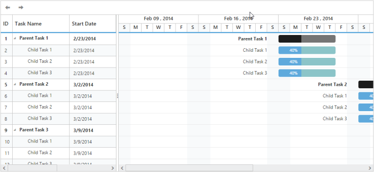

## Validating Schedule Dates

Validating schedule dates is used to change the schedule start date and end date dynamically. By this support, ScheduleStartDate and ScheduleEndDate can beautomatically updated from the data source. When you change the date of any task item to the date that is beyond ScheduleStartDate or ScheduleEndDate through cell editing, taskbar editing, dialog editing or toolbar operation, then the ScheduleStartDate and ScheduleEndDate can be dynamically updated based on that task item’s date.

PrevTimeSpan and NextTimeSpan toolbar items are used to create new time span based on the schedule mode.



@(Html.EJ().Gantt("gantt")

        // ...

        .ScheduleStartDate(“02/01/2014”)

        .ScheduleEndDate(“03/14/2016”)

        .ToolBarSettings(tbs=>tbs.showToolBar(true)

        .ToobarItems(new List<GanttToolbarItems>()

        { GanttToolbarItems.PrevTimeSpan,

          GanttToolbarItems.NextTimeSpan,

        }))

// ...

 .Render())



The following screenshot illustrates the output of the above code.

{  | markdownify }
{:.image }

