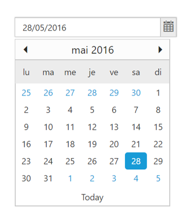

# Globalization

As per MSDN, “Globalization involves designing and developing a world-ready app that supports localized interfaces and regional data for users in the multiple cultures”.

The **ejGlobalize** plugin provides options parse numeric, currency, and date values by using culture file. The **assets/scripts/i18n** contains more than 350 cultures currently. You can load the particular culture into application by using the **preferredCulture** method.

To Internationalize any of our Syncfusion components/page into particular culture, please follow the below steps:

1. Add the reference ej.globalize.min.js script into your application.

   N> The **ej.globalize.min.js** library already avails in within **ej.web.all.min.js** file, therefore it is not necessary to externally refer it in your application if you have referred **ej.web.all.min.js** already. For version lower than 13.4.0.53 refer to the **jQuery.globalize.min.js** along with the **ej.web.all.min.js**.

2. Add the required culture file into the page which is located in **assets/scripts/i18n**.

   ~~~ cshtml
   
	@Scripts.Render("~/Scripts/ej/common/ej.globalize.js")
	@Scripts.Render("~/Scripts/ej/i18n/ej.culture.fr-FR.min.js")
		
   ~~~

3. Set the culture by using the **preferredCulture()** method. Here, French (fr-FR) culture is used as current culture.

   ~~~ cshtml
   
	

   ~~~
   
4. Use **format()** method to format the object like numbers, date, price, etc.

   ~~~ cshtml
   
	

   ~~~

## Dynamic Globalization

The steps to globalize the MVC application are as follows:

1. Specify the target culture in **web.config** file under `<system.web>` root.

   ~~~ xml
   
	<system.web>
	<globalization uiCulture="fr-FR" culture="fr-FR" enableClientBasedCulture="true"/>
	</system.web>

   ~~~

2. Load the culture file based on current culture that is specified in **web.config** as shown in the following.

   ~~~ cshtml
   
	@Scripts.Render("~/Scripts/ej/i18n/ej.culture." + System.Globalization.CultureInfo.CurrentCulture.Name.ToString() + ".min.js")
			
   ~~~

3. Access the current culture using System.Globalization.CultureInfo and set the culture to ej.globalize widget.

   ~~~ cshtml
   
	

   ~~~
   
Please refer the below DatePicker sample which uses globalization,
Follow the above steps 1 and 2 and then add the control in the view page


    

        @Html.EJ().DatePicker("DatePick").Value("28/05/2016").Width("100%")
        
        
    



The following screenshot exhibits the output of the above code,

