## Columns

Colums are a key feature in Grid to define schema in a control based on datasource. It is useful to map field to datasource values.

### Formatting

Formatting is used to convert data values to human readable formats using specific culture settings. In Grid, you have an option to format a particular column through the Format property. For more details about globalize.js, refer to the link ([https://github.com/jquery/globalize](https://github.com/jquery/globalize)). The following code example shows you how to use formatting in Grid.

[MVC]

[razor]

@(Html.EJ().Grid<object>("format")

// the datasource gets data

.Datasource((IEnumerable<object>)ViewBag.dataSource) 

.Columns(col =>

    {

             // the formatting columns

        col.Field("Number").HeaderText("Number").Format("{0:n2}").Add();

        col.Field("Currency").HeaderText("currency").Format("{0:C2}").Add();

        col.Field("Date").HeaderText("Date").Format("{0:MM/dd/yyyy}").Add();

    }

    )

)

[controller]

namespace MVCSampleBrowser.Controllers

{

public class GridController : Controller

    {

          public ActionResult ColumnFormatting()

        {

            List<ColumnFormattingData> data = new List<ColumnFormattingData>();

             for (var i = 1; i < 6; i++)

               {

                data.Add(new ColumnFormattingData()

                {

                    Number = 100/i,

                    Currency = 100/i,

                    Date = DateTime.Now

                });

            }

            ViewBag.dataSource = data;

            return View();

        }

    }

}

The following is the result of column formatting.

{ 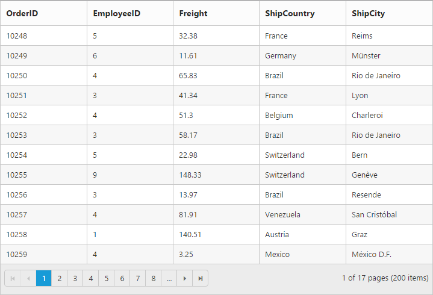 | markdownify }
{:.image }

### Template

A Template is used to render a specific template to a particular column using Template and TemplateID property. These columns are not bound to Grid.

[MVC]

[razor]

&lt;script type="text/x-jsrender" id="columnTemplate"&gt;  &lt;!--jsrender script--&gt;

    &lt;img style="width:130px;height:100px" src="http://js.syncfusion.com/demos/web/themes/images/Employees//{{:EmployeeID}}.png" alt="{{:EmployeeID}}" /&gt;

        &lt;/script&gt;

    @(Html.EJ().Grid<EmployeeView>("ColumnTemplate")

        .Datasource((IEnumerable<object>)ViewBag.datasource)

        .AllowPaging()

        .PageSettings (page => page.PageSize(4))

        .Columns(col =>

        {

            //to enable the Template and templateId loads own template

            col.HeaderText("Employee Photo").Template(true).TemplateID("#columnTemplate").TextAlign(TextAlign.Center).Width(25).Add();

            col.Field("EmployeeID").HeaderText("Employee ID").IsPrimaryKey(true).TextAlign(TextAlign.Right).Width(20).Add();

            col.Field("FirstName").HeaderText("First Name").Width(30).Add();

            col.Field("BirthDate").HeaderText("Birth Date").TextAlign(TextAlign.Right).Width(30).Format("{0:MM/dd/yyyy}").Add();      

        })

        )  

[controller]

namespace MVCSampleBrowser.Controllers

{

    public partial class GridController : Controller

    {

        // GET: /Template/

        public ActionResult ColumnTemplate()

        {

            // Data gets from DataContext

            var DataSource = new NorthwindDataContext().EmployeeViews.ToList();

            ViewBag.datasource = DataSource;

            return View();

        }

    }

}  

The following output is displayed as a result of the above code example.

{ 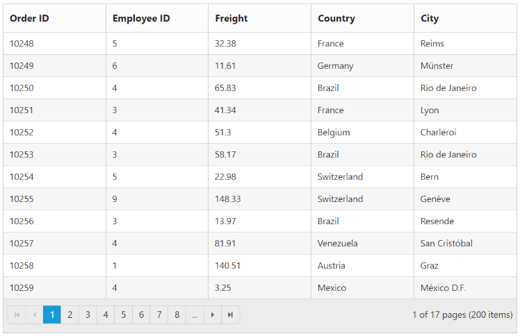 | markdownify }
{:.image }

### Custom Attribute

CustomAttributes are a powerful feature of Columns. This is used to modify the styles and appearance of a particular column.

[MVC]

 [razor]

&lt;style&gt;

        .e-rowcell[employeeid = "5"] {

            color: red;

        }	

    &lt;/style&gt;

  @(Html.EJ().Grid<OrdersView>("FlatGrid")

        .Datasource((IEnumerable<object>)ViewBag.datasource)

        .AllowPaging()

        .PageSettings (page => page.PageSize(7))

        .Columns(col =>

        {

            col.Field("OrderID").HeaderText("Order ID").TextAlign(TextAlign.Right).Width(75).Add();

            col.Field("CustomerID").HeaderText("Customer ID").Width(90).Add();

            col.Field("EmployeeID").HeaderText("Employee ID").TextAlign(TextAlign.Right).Width(90).CustomAttributes(cus => cus.AddAttribute("employeeid", "'{{:EmployeeID}}'")).Add();

            col.Field("Freight").HeaderText("Freight").TextAlign(TextAlign.Right).Width(90).Format("{0:C}").Add();

            col.Field("OrderDate").HeaderText("Order Date").TextAlign(TextAlign.Right).Width(100).Format("{0:MM/dd/yyyy}").Add();

            col.Field("ShipCountry").HeaderText("Ship City").Width(110).Add();

        })

        )

[controller]

namespace MVCSampleBrowser.Controllers

{

    public partial class GridController : Controller

    {

        // GET: /Custom Attributes/

        public ActionResult Default()

        {

            // Data gets from DataContext

            var DataSource = new NorthwindDataContext().OrdersViews.ToList();

            ViewBag.datasource = DataSource;

            return View();

        }

    }

}

The following output is displayed as a result of the above code example.

{ 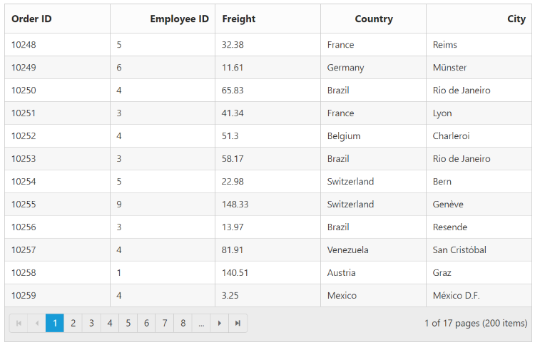 | markdownify }
{:.image }

### Read only

AllowEditing enables you to edit a column, but it prevents the fields from showing it as editable. If you want to make a column as read-only then set AllowEditing as False for that column. The following code example shows Essential JavaScript Grid column as read-only.

[MVC]

 [razor]

@(Html.EJ().Grid<OrdersView>("FlatGrid")

        .Datasource((IEnumerable<object>)ViewBag.datasource)

        .AllowPaging()

        .PageSettings (page => page.PageSize(5))

        .EditSettings(edit =>  edit.AllowEditing().AllowDeleting().AllowAdding())

        .Columns(col =>

           {

               col.Field("OrderID").HeaderText("Order ID").IsPrimaryKey (true).TextAlign(TextAlign.Right).Width(60).Add();

                // column read only at while editing

               col.Field("CustomerID").HeaderText("Customer Name").TextAlign(TextAlign.Left).Width(80).AllowEditing(false).Add();

               col.Field("EmployeeID").HeaderText("Employee ID").Width(60).TextAlign(TextAlign.Right).Add();        col.Field("Freight").HeaderText("Freight").TextAlign(TextAlign.Right).Width(60).Add()

           })

        )

[controller]

namespace MVCSampleBrowser.Controllers

{

    public partial class GridController : Controller

    {

        // GET: /Custom Attributes/

        public ActionResult Default()

        {

              // Data gets from DataContext

            var DataSource = new NorthwindDataContext().OrdersViews.ToList();

            ViewBag.datasource = DataSource;

            return View();

        }

    }

}

The following output is displayed as a result of the above code example.

{ 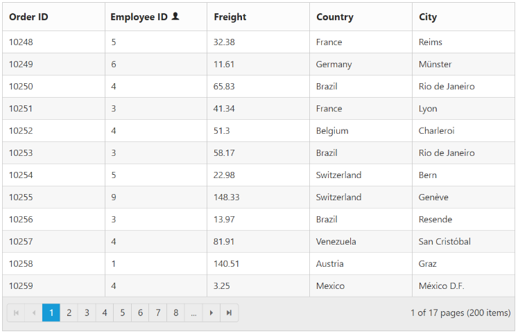 | markdownify }
{:.image }

### Controlling Grid actions

In Grid, you can control Grid actions through AllowSorting, AllowGrouping, AllowFiltering. The following code example shows you how to disable a particular column. The following example has controlled grouping action in CustomerID column, filtering in EmployeeID column and sorting in Freight column.

[MVC]

[razor]

@(Html.EJ().Grid<OrdersView>("FlatGrid")

// the datasource  gets data from controller

.Datasource((IEnumerable<object>)ViewBag.datasource)

.AllowPaging()

.PageSettings(page => page.PageSize(5))

.AllowFiltering()

.AllowGrouping()

.GroupSettings(group => group.GroupedColumns(col => col.Add("OrderID")))

.AllowSorting()

.Columns(col =>

   {

       col.Field("OrderID").HeaderText("Order ID").IsPrimaryKey (true).TextAlign(TextAlign.Right).Width(60).Add();

       col.Field("CustomerID").HeaderText("Customer Name").TextAlign(TextAlign.Left).Width(80).AllowGrouping(false).Add();

       col.Field("EmployeeID").HeaderText("Employee ID").TextAlign(TextAlign.Right).Width(60).AllowFiltering(false).Add();

       col.Field("Freight").HeaderText("Freight").TextAlign(TextAlign.Right).Width(60).AllowSorting(false).Add();

   })

 )

[controller]

namespace MVCSampleBrowser.Controllers

{

    public partial class GridController : Controller

    {

        //

        // GET: /Default/

        public ActionResult Default()

        {

            var DataSource = new NorthwindDataContext().OrdersViews.ToList();

            ViewBag.datasource = DataSource;

            return View();

        }

    }

}

The following output is displayed as a result of the above code example.

{ 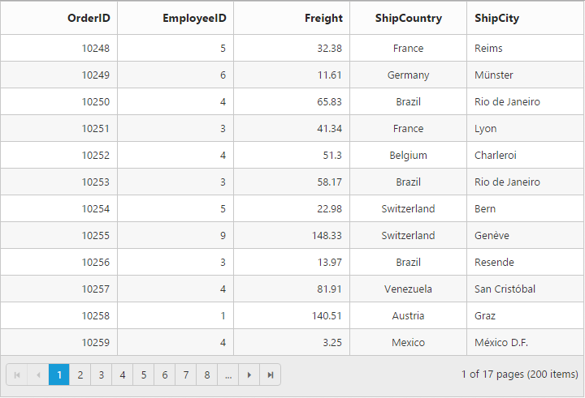 | markdownify }
{:.image }

### Auto-generate column

The columns are automatically generated from the datasource and you do not need specific column declarations. The following code example shows auto-generate column behavior with Grid.

[MVC]

[razor]

@(Html.EJ().Grid<OrdersView>("FlatGrid")

.Datasource((IEnumerable<EditableOrder>)ViewBag.datasource)

.AllowPaging()

.PageSettings(page => page.PageSize(5))

)

[controller]

namespace MVCSampleBrowser.Controllers

{

    public partial class GridController : Controller

    {

        // GET: /Default/

        public ActionResult Default()

        {

            var DataSource = OrderRepository.GetAllRecords().ToList();

            ViewBag.datasource = DataSource;

            return View();

        }

    }

}

The following output is displayed as a result of the above code example.

{ 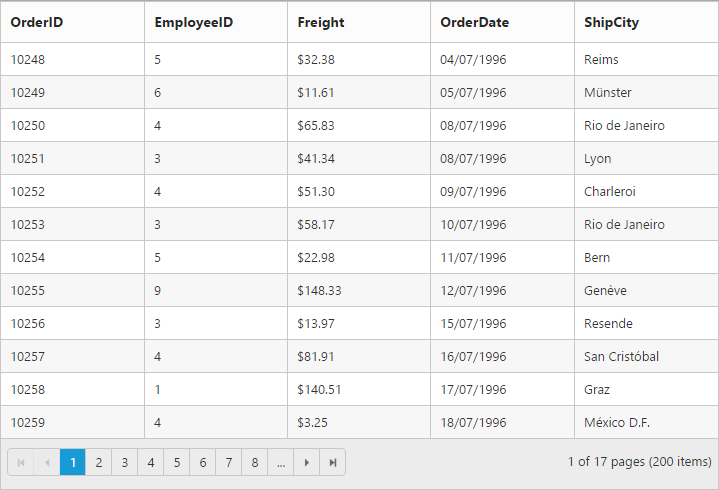 | markdownify }
{:.image }

### Foreign key columns

Foreign key is a field in relational table. It matches the specific key columns of another table. 

To enable the Foreing key field , use ForeignKeyField and ForeignKeyValue propertyof Grid as follows:

[MVC]

[razor]

 @(Html.EJ().Grid<OrdersView>("ForeignKey")

        .Datasource((IEnumerable<object>)ViewBag.dataSource1)

        .AllowPaging()

        .Columns(col =>

        {

            col.Field("OrderID").HeaderText("Order ID").IsPrimaryKey (true).TextAlign(TextAlign.Right).Width(80).Add();

            col.Field("EmployeeID").HeaderText("First Name").ForeignKeyField("EmployeeID")

               .ForeignKeyValue("FirstName").DataSource((IEnumerable<object>)ViewBag.dataSource2)

               .TextAlign(TextAlign.Left).Width(75).Add();

            col.Field("Freight").HeaderText("Freight").TextAlign(TextAlign.Right).Width(75).Format("{0:C}").Add();

            col.Field("ShipCity").HeaderText("Ship City").Width(75).Add();

        })

        )

[controller]

namespace MVCSampleBrowser.Controllers

{

    public partial class GridController : Controller

    {

        // GET: /ForeignKeyColumn/

        public ActionResult ForeignKeyColumn()

        {

            var DataSource1 = new NorthwindDataContext().OrdersViews.ToList();

            ViewBag.dataSource1 = DataSource1;

            var DataSource2 = new NorthwindDataContext().EmployeeViews.ToList();

            ViewBag.dataSource2 = DataSource2;

            return View();

        }

    }

}

The following output is displayed as a result of the above code example.

{ 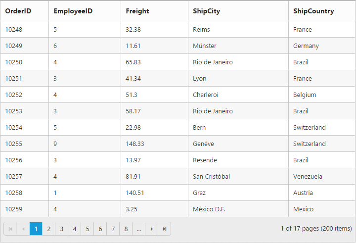 | markdownify }
{:.image }

### Cell Merging

Cell merging feature enables to merge cells based on your requirement. To enable cell merging , use AllowCellMerging property of Grid as follows.

[MVC]

[razor] 

@(Html.EJ().Grid<MVCCellMerging.Models.Order>("FlatGrid")

        	.Datasource((IEnumerable<object>)ViewBag.datasource)

        	.AllowScrolling()       

        	.AllowPaging() 

.AllowCellMerging ()       

        	.Columns(col =>

        	{

            	col.Field("OrderID").HeaderText("Order ID").TextAlign(TextAlign.Right).Width(90).Add();

            	col.Field("EmployeeID").HeaderText("Employee ID").TextAlign(TextAlign.Right).Width(100).Add();

col.Field("ShipCity").HeaderText("Ship City").Width(110).Add();

col.Field("ShipName").HeaderText("Ship Name").Width(80).Add();

            	col.Field("Freight").HeaderText("Freight").TextAlign(TextAlign.Right).Width(90).Add();

        	})

.ClientSideEvents(eve => { eve.MergeCellInfo("cellmerge"); }))

&lt;script type="text/javascript"&gt;

function cellmerge(args) {

                       if (args.column.field == "EmployeeID" && args.data.OrderID == 10001) {

                           args.rowMerge(3);

                       }

                       else if (args.column.field == "ShipCity" && args.data.OrderID == 10005) {

                           args.colMerge(3);

                       }

                       else if (args.column.field == "ShipCity" && args.data.OrderID == 10008) {

                           args.merge(0, 3);

                       }

    	}

&lt;/script&gt;

[controller]

namespace MVCSampleBrowser.Controllers

{

    public partial class GridController : Controller

    {

        public ActionResult CellMerging()

        {

            var DataSource = new NorthwindDataContext .Orders.ToList();

            ViewBag.datasource = DataSource;

            return View();

        }

    }

}

Execute the above code to render the following output.

{ 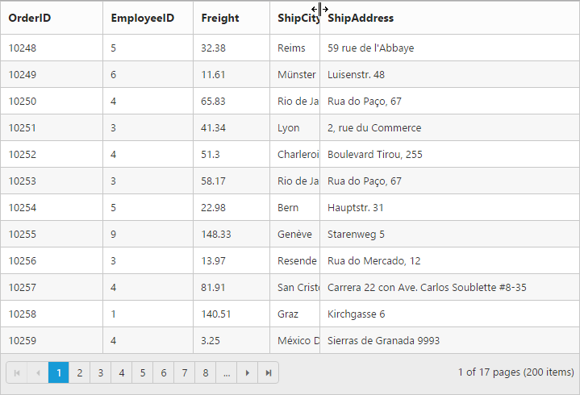 | markdownify }
{:.image }

_Figure_ _25__: Cell Merging_

### AutoWrap Column Cells

AllowTextWrap feature allows you to wrap cell content to next line when the content exceeds the boundary of the Column cells. Use the following code example for Auto wrap in column cells.

[MVC]

[razor]

@(Html.EJ().Grid<MVCAutowrap.Models.Order>("FlatGrid")

        	.Datasource((IEnumerable<object>)ViewBag.datasource)

        	.AllowScrolling()       

        	.AllowPaging() 

.AllowTextWrap()       

        	.Columns(col =>

        	{

            	col.Field("OrderID").HeaderText("Order ID").TextAlign(TextAlign.Right).Width(90).Add();

            	col.Field("EmployeeID").HeaderText("Employee ID").TextAlign(TextAlign.Right).Width(100).Add();

col.Field("ShipCity").HeaderText("Ship City").Width(110).Add();

col.Field("ShipName").HeaderText("Ship Name").Width(80).Add();

            	col.Field("Freight").HeaderText("Freight").TextAlign(TextAlign.Right).Width(90).Add();

        	}))

[controller]

namespace MVCSampleBrowser.Controllers

{

    public partial class GridController : Controller

    {

        public ActionResult TextWrap()

        {

            var DataSource = new NorthwindDataContext .Orders.ToList();

            ViewBag.datasource = DataSource;

            return View();

        }

    }

}

Execute the above code to render the following output.

{  | markdownify }
{:.image }

### Column Chooser

Column Chooser is used to view or hide particular column. To enable column chooser, use ShowColumnChooser property of Grid as follows.

[MVC]

[razor]

@(Html.EJ().Grid<OrdersView>("ColumnChooser")

        .Datasource((IEnumerable<object>)ViewBag.datasource)

.ShowColumnChooser()

        .Columns(col =>

        {

            col.Field("OrderID").HeaderText("Order ID").TextAlign(TextAlign.Right).Visible(false).Add();

            col.Field("CustomerID").HeaderText("Customer ID").Add();

            col.Field("EmployeeID").HeaderText("Employee ID").TextAlign(TextAlign.Right). Add();                  

            col.Field("Freight").TextAlign(TextAlign.Right). Add();

            col.Field("ShipName").Add();

            col.Field("ShipCountry").Add();

        }))

[controller]

namespace MVCSampleBrowser.Controllers

{

    public partial class GridController : Controller

    {

        public ActionResult ColumnChooser()

        {

            var DataSource = new NorthwindDataContext().OrdersViews.ToList();

            ViewBag.datasource = DataSource;

            return View();

        }

    }

}

Execute the above code to render the following output.

{ 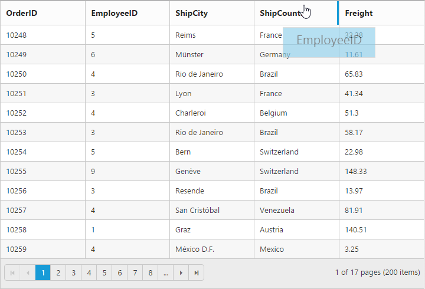 | markdownify }
{:.image }

_Figure_ _27__: Grid with Column chooser_

### DisableHtmlEncode

DisableHtmlEncode property helps you show the encoded HTML view of Grid content and header elements. 

The following code example shows you how to set disableHtmlEncode:

[MVC]

[razor]

  @(Html.EJ().Grid<object>("Grid")

  .Datasource((IEnumerable<object>)ViewBag.datasource)

  .AllowSorting()

  .AllowPaging()

  .Columns(col =>

  { 

   Col.Field(“OrderID”).HeaderText(“Order ID”).IsPrimaryKey(true). TextAlign(TextAlign.Right).Add()

    Col.Field(“CustomerID”).HeaderText(“
Customer        ID
”).disableHtmlEncode(true).Add()

    Col.Field(“EmployeeID”).HeaderText(“
Employee ID
”).disableHtmlEncode(true). TextAlign(TextAlign.Right).Add()

    Col.Field(“Freight”).HeaderText(“Freight”). TextAlign(TextAlign.Right).Add()

    Col.Field(“ShipCountry”).HeaderText(“Ship Country”).Add() 

[Controller]

namespace SyncfusionMvcApplication3.Controllers

{

    public class HomeController : Controller

    {

     public ActionResult HTMLEncode()

      {

       ViewBag.datasource = new NorthwindDataContext.Orders.ToList();

       return View();

      }         

    }	

}

The following output is displayed as a result of the above code example.

{ 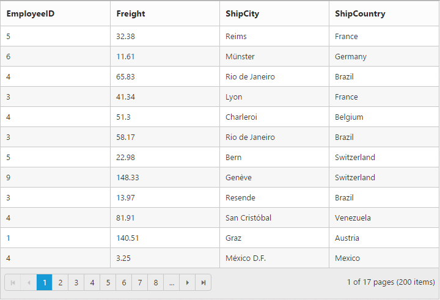 | markdownify }
{:.image }

### Stacked Header

The Stacked Header feature allows additional header rows that span across the grid columns. Columns can be grouped under such headers. You can effectively group extensive data with the help of multilevel Stacked Headers as well. Enable the Stacked Header by setting the ShowStackedHeader property to true and set the stacked header row by using the StakedHeaderRows property. The Stacked Header feature also supports all other grid features including Grouping, Sorting, Filtering, Reordering, etc. 

[MVC]

[razor]

@(Html.EJ().Grid<OrdersView>(“StackedHeaderGrid”)

        .Datasource((IEnumerable<object>)ViewBag.datasource)

.ShowStackedHeader()

.StackedHeaderRows(row =>

        {

            row.StackedHeaderColumns(column =>

            {

                column.StackedHeaderText(“OrderDetails”).Column(col =>

                {

                    col.Add(“OrderID”);

                    col.Add(“OrderDate”);

                    col.Add(“Freight”);

                }).Add();

                column.StackedHeaderText(“Ship Details”).Column(col =>

                {

                    col.Add(“ShipName”);

                    col.Add(“ShipCity”);

                    col.Add(“ShipCountry”);

                }).Add();

            }).Add();

        })

        .Columns(col =>

        {

            col.Field(“OrderID”).HeaderText(“Order ID”).TextAlign(TextAlign.Right). Add();

            col.Field(“OrderDate”).HeaderText(“Order Date”).Add();

            col.Field(“Freight”).HeaderText(“Freight”).TextAlign(TextAlign.Right). Add();

            col.Field(“ShipName”).HeaderText(“Ship Name”).TextAlign(TextAlign.Right).Add();

            col.Field(“ShipCity”).HeaderText(“Ship City”).Add();

            col.Field(“ShipCountry”).HeaderText(“Ship Country”).Add();

        }))

[Controller]

namespace MVCSampleBrowser.Controllers

{

    public partial class GridController : Controller

    {

        public ActionResult DetailTemplate()

        {

            var DataSource = new NorthwindDataContext().OrdersViews.ToList();

            ViewBag.datasource = DataSource;

            return View();        

        }

    }

}

{  | markdownify }
{:.image }

{ 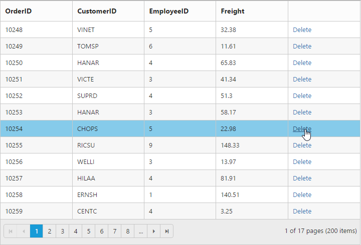 | markdownify }
{:.image }

