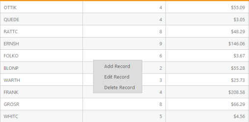
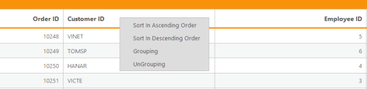
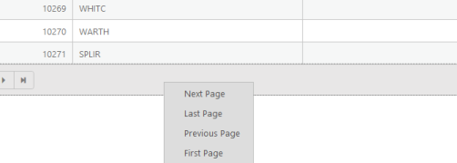

# Context Menu

Context Menu is one of the user interaction controls related with Grid. It is handy to use the Context Menu to trigger more actions. The default Context Menu items created for Grid are:

1. Header
1. Sort In Ascending Order
2. Sort In Descending Order
3. Grouping
4. UnGrouping
2. Content
1. Add Record
2. Edit Record
3. Delete Record                  
3. Footer 
1. Next Page     
2. Last Page
3. Previous Page
4. First Page

## Context Menu action

To enable Context Menu in Grid use EnableContextMenu property in ContextMenuSettings at Grid initialize. The following code example illustrates you on how to set Context Menu.





@(Html.EJ().Grid<object>("Grid")

.Datasource((IEnumerable<object>)ViewBag.datasource)

.AllowSorting()

.AllowPaging()

.AllowGrouping()

.EditSettings(edit => {

edit.AllowAdding().AllowEditing().AllowDeleting()

})

.ContextMenuSettings(contextMenu =>

{

contextMenu.EnableContextMenu();    

})

.Columns(col =>

{

	col.Field("OrderID").HeaderText("Order ID") TextAlign(TextAlign.Right).Add();

	col.Field("CustomerID").HeaderText("Employee ID").Add();

	col.Field("EmployeeID").HeaderText("Freight"). TextAlign(TextAlign.Right).Add();

	col.Field("ShipCity").HeaderText("Ship City").Add();

}))




namespace SyncfusionMvcApplication3.Controllers

{

    public class HomeController : Controller

    {

        public ActionResult ContextMenu()

        {

            ViewBag.datasource = new NorthwindDataContext.Orders.ToList();

            return View();

        }         

    }	

}




The following output is displayed as a result of the above code example.

Content

Context Menu in content
{:.caption}

Header

Context Menu in Header
{:.caption}

Footer

Context Menu in Footer
{:.caption}
