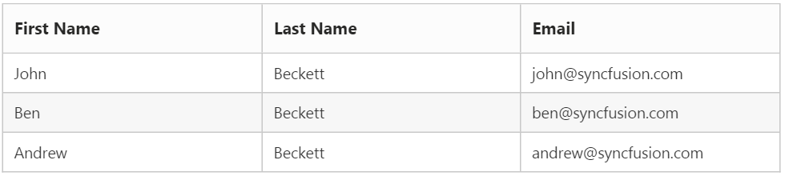
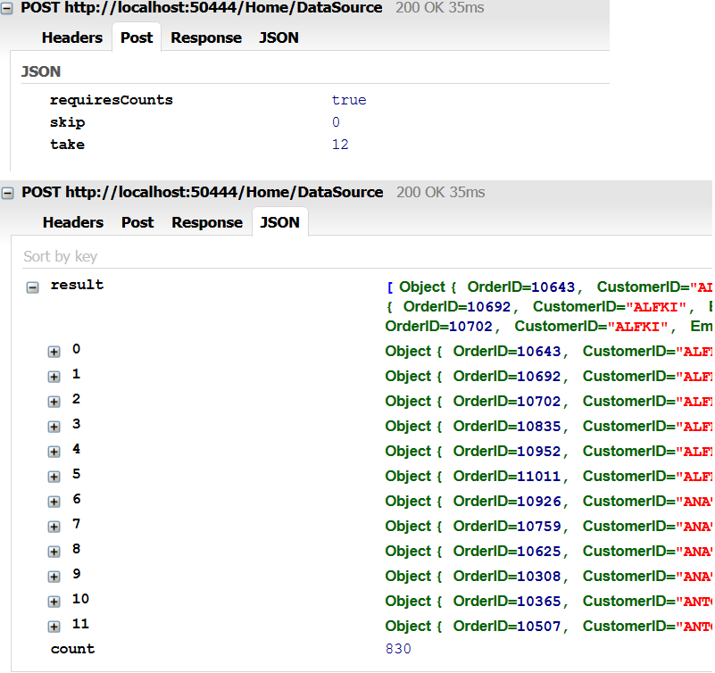
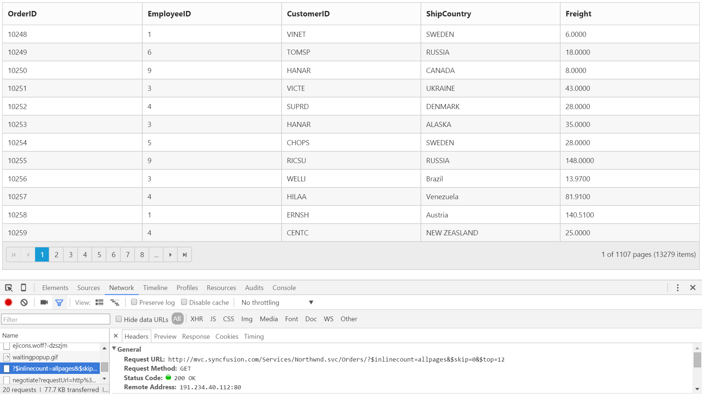
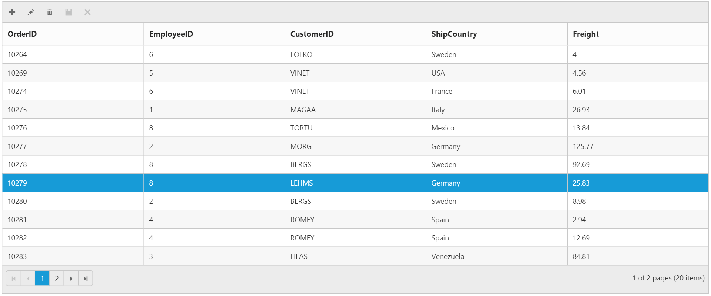
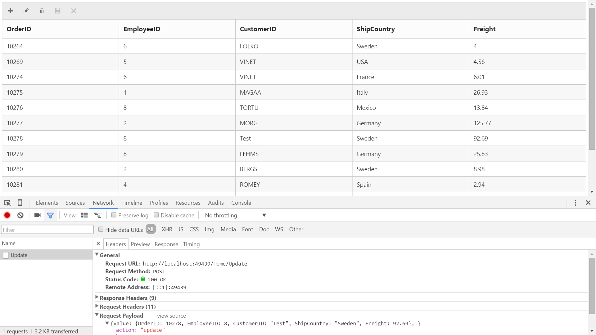

#  Data Adaptors

The Data Adaptor is a mechanism through which the `DataManager` interact with the remote service or local dataSource. The `DataManager` has several preconfigured Data Adaptors, refer to the [link](http://help.syncfusion.com/aspnetmvc/datamanager/data-Adaptors).
   
In Grid, the Adaptor can be specified using the `Adaptor` property of the `DataSource` builder.
 
 
N> For the `Adaptor` builder, you can assign Adaptor name either as `string` value (”JsonAdaptor”) or Enum value as `AdaptorType.JsonAdaptor`.
  
##  Json Adaptor

The Json Adaptor is used when the grid is bound with local datasource. It can be enabled in Grid using `Adaptor` property as `AdaptorType.JsonAdaptor`. The `JsonAdaptor` is the default Adaptor used by `DataManager` when bind with local dataSource such as IEnumerable, DataTable etc.  

 The following code example describes the above behavior.
 
  
 

          @(Html.EJ().Grid<Person>("Grid")
                .Datasource(ds => ds.Json((IEnumerable<Person>)ViewBag.datasource).Adaptor(AdaptorType.JsonAdaptor))
                .Columns(col =>
                {
                    col.Field(p => p.FirstName).HeaderText("First Name").TextAlign(TextAlign.Left).Add();
                    col.Field(p => p.LastName).HeaderText("Last Name").TextAlign(TextAlign.Left).Add();
                    col.Field(p => p.Email).HeaderText("Email").TextAlign(TextAlign.Left).Add();
                 })
              )


    
          namespace Grid.Controllers
           {    
           public class HomeController : Controller
            {        
          public ActionResult Index()
             {
               List<Person> Persons = new List<Person>();
               Persons.Add(new Person() { FirstName = "John", LastName = "Beckett", Email = "john@syncfusion.com" });
               Persons.Add(new Person() { FirstName = "Ben", LastName = "Beckett", Email = "ben@syncfusion.com" });
               Persons.Add(new Person() { FirstName = "Andrew", LastName = "Beckett", Email = "andrew@syncfusion.com" });
               ViewBag.datasource = Persons;
               return View();
              }
            }
          }

  

The following output is displayed as a result of the above code example.

 
   
##  Url Adaptor

The Url Adaptor is the base Adaptor that would interact with remote services. It can be enabled in Grid using `Adaptor` property of `DataSource` as `AdaptorType.UrlAdaptor`. For every operations, an AJAX post will be send to the specified data service. 
    
N> When using `UrlAdaptor`, grid actions such as `Paging, Filtering` and `Sorting` should be handled at the server side itself. We have `DataOperation` class to do these server side operations. Please refer to the Knowledge Base [link](https://www.syncfusion.com/kb/4300).

The following code example describes the above behavior.

  
 

         @(Html.EJ().Grid<OrdersView>("Grid")
                    .Datasource(ds => ds.URL(@Url.Action("DataSource"))                               
                    .Adaptor(AdaptorType.UrlAdaptor))
                    .AllowPaging()
                    .Columns(col =>
                     {
                            col.Field(p => p.OrderID).HeaderText("Order ID").Add();
                            col.Field(p => p.CustomerID).HeaderText("Customer ID").TextAlign(TextAlign.Left).Add();
                            col.Field(p => p.EmployeeID).HeaderText("Employee ID").Add();
                            col.Field(p => p.Freight).HeaderText("Freight").Format("{0:C2}").Add();
                  })
            )


        
     namespace Grid.Controllers
     {
       using Syncfusion.JavaScript;
       using Syncfusion.JavaScript.DataSources;    
       public class HomeController : Controller
        {
        public IEnumerable OrderData = new NorthwindDataContext().OrdersViews.ToList();
        public ActionResult Index()
        {
            return View();
        }
        public ActionResult DataSource(DataManager dm) 
        {
            IEnumerable data = OrderData;
            DataOperations operation = new DataOperations();
            if (dm.Sorted != null && dm.Sorted.Count > 0) //Sorting
            {
                data= operation.PerformSorting(data, dm.Sorted);
            }            
            if (dm.Where != null && dm.Where.Count > 0) //Filtering
            {
                data= operation.PerformWhereFilter(data, dm.Where, dm.Where[0].Operator);
            }            
            int count = data.Cast<OrdersView>().Count();
            if (dm.Skip != 0)
            {
                data= operation.PerformSkip(data, dm.Skip);
            }            
            if (dm.Take != 0)
            {
                data= operation.PerformTake(data, dm.Take);
            }
            return Json(new { result = data, count = count });
          }
        }
      }

 

 I> 1. The response from server should be wrapped in an object with properties named `result` to hold the data and `count` to hold the total records count.
 I> 2. The `count` must be returned along with response when paging is enabled in Grid.
 
 The following output is displayed as a result of the above code example.
 
 
 
 
##  OData Adaptor
 
OData Adaptor that is extended from `UrlAdaptor`, is used for consuming data through OData Service. 
  
We have an online OData Service http://js.syncfusion.com/demos/ejServices/Wcf/Northwind.svc/Orders created specifically for Syncfusion Controls

N> `ODataAdaptor` is the default Adaptor of `DataManager` and so no need to specify Adaptor when binding OData service

You can use the following code example to use OData Adaptor.

  
 

        @(Html.EJ().Grid<object>("FlatGrid")
                   .Datasource(ds => ds.URL("http://js.syncfusion.com/demos/ejServices/Wcf/Northwind.svc/Orders").Adaptor(AdaptorType.ODataAdaptor))   
                   .AllowPaging()
                   .Columns(col =>
                   {
                         col.Field("OrderID").Add();
                         col.Field("EmployeeID").Add();
                         col.Field("CustomerID").Add();
                         col.Field("ShipCountry").Add();
                         col.Field("Freight").Add();
                  })
                )

 

The following output is displayed as a result of the above code example.

 

##  ODataV4 Adaptor

ODataV4 Adaptor that is extended from `ODataAdaptor`, is used for consuming data from ODataV4 Service
       
To consume ODataV4 service, set the service link to the `Url` property of Grid `DataSource` and you can set Adaptor type as `AdaptorType.ODataV4Adaptor` to the `Adaptor` Property of Grid `DataSource`

You can use the following code example to use ODataV4 Adaptor.

  
 

        @(Html.EJ().Grid<object>("FlatGrid")
                   .Datasource(ds => ds.URL("http://services.odata.org/v4/northwind/northwind.svc/Orders").Adaptor(AdaptorType.ODataV4Adaptor))
                   .AllowPaging()
                   .Columns(col =>
                   {
                     col.Field("OrderID").Add();
                     col.Field("EmployeeID").Add();
                     col.Field("CustomerID").Add();
                     col.Field("ShipCountry").Add();
                     col.Field("Freight").Add();
                 })
            )


 

The following output is displayed as a result of the above code example.

 

##  WebAPI Adaptor

WebAPI Adaptor that is extended from `ODataAdaptor`, is used for consuming data from WebAPI Service

To consume Web API service, set the service link to the `Url` property of Grid `DataSource` and you can set Adaptor type as `AdaptorType.WebApiAdaptor` to the `Adaptor` Property of Grid `DataSource`.

You can use the following code example to use WebAPI Adaptor.

  


        @(Html.EJ().Grid<object>("FlatGrid")
                   .Datasource(ds => ds.URL("/api/Orders").Adaptor(AdaptorType.WebApiAdaptor))
                   .AllowPaging()
                   .Columns(col =>
                    {
                       col.Field("OrderID").Add();
                       col.Field("EmployeeID").Add();
                       col.Field("CustomerID").Add();
                       col.Field("ShipCountry").Add();
                       col.Field("Freight").Add();
                   })
                )


        
        namespace EJGrid.Controllers 
        {
          public class OrdersController: ApiController 
           { 
             // GET: api/Orders 
             NORTHWNDEntities db = new NORTHWNDEntities(); 
             public object Get() 
              { 
                 var queryString = HttpContext.Current.Request.QueryString; 
                 int skip = Convert.ToInt32(queryString["$skip"]); 
                 int take = Convert.ToInt32(queryString["$top"]); 
                 var data = db.Orders.Skip(skip).Take(take).ToList(); 
                 return new { Items = data.Skip(skip).Take(take), Count = data.Count() }; 
              } 
            } 
         }

 

The following output is displayed as a result of the above code example.

 

##  RemoteSave Adaptor

Sometimes you may need to perform all Grid Actions in client-side except the CRUD operations that should be interacted with server-side to persist data. It can be achieved in Grid by using `RemoteSaveAdaptor`.

Datasource must be set to `Json` Property and set Adaptor type as `AdaptorType.RemoteSaveAdaptor` to the `Adaptor` Property of Grid `DataSource`. CRUD operations can be mapped to server-side using `UpdateUrl`, `InsertUrl`, `RemoveUrl`, `BatchUrl`, `CrudUrl` properties.

You can use the following code example to use RemoteSaveAdaptor.

  


        @(Html.EJ().Grid<object>("FlatGrid")
                   .Datasource(ds => ds.Json((IEnumerable<object>)ViewBag.datasource).UpdateURL("/Home/Update")
                   .InsertURL("/Home/Insert").RemoveURL("/Home/Remove").Adaptor(AdaptorType.RemoteSaveAdaptor))
                   .AllowPaging()
                   .EditSettings(edit => { edit.AllowAdding().AllowDeleting().AllowEditing(); })
                   .ToolbarSettings(toolbar =>
                    {
                   toolbar.ShowToolbar().ToolbarItems(items =>
                      {
                          items.AddTool(ToolBarItems.Add);
                          items.AddTool(ToolBarItems.Edit);
                          items.AddTool(ToolBarItems.Delete);
                          items.AddTool(ToolBarItems.Update);
                          items.AddTool(ToolBarItems.Cancel);
                       });
                 })
                .Columns(col =>
                 {
                   col.Field("OrderID").IsPrimaryKey(true).Add();
                   col.Field("EmployeeID").Add();
                   col.Field("CustomerID").Add();
                   col.Field("ShipCountry").Add();
                   col.Field("Freight").Add();
                })
            )



        namespace EJGrid.Controllers
          {
             public class HomeController : Controller
              {
             public ActionResult Index()
              {
                var data = OrderRepository.GetAllRecords();
                ViewBag.dataSource = data;
                return View();
              }
             public ActionResult Update(EditableOrder value)
              {
                OrderRepository.Update(value);
                var data = OrderRepository.GetAllRecords();
                return Json(data, JsonRequestBehavior.AllowGet);
              }
             public ActionResult Insert(EditableOrder value)
              {
                OrderRepository.Add(value);
                var data = OrderRepository.GetAllRecords();
                return Json(data, JsonRequestBehavior.AllowGet);
             }
            public ActionResult Remove(int key)
            {
               OrderRepository.Delete(key);
               var data = OrderRepository.GetAllRecords();
               return Json(data, JsonRequestBehavior.AllowGet);
            }
         }
      }


 

The following output is displayed as a result of the above code example.

 

On performing CRUD operations in Grid, the record changes will be sent to server-side as in the following screenshot.

 

##  Foreign Key Adaptor

The Grid can have a look up column. The Foreign key column using `ForeignKeyField` has some limitations such as sort/group operations on column will happen based on `Field` instead of `ForeignKeyField`. The `ForeignKeyAdaptor` can be used to overcome this limitation.
      
N> It works by specifying a virtual column (which is not in the grid datasource) in the Grid. This Adaptor should be initialized in the `Load` event of the grid. `ForeignKeyAdaptor` supported for only local data binding.

The following code example describes the above behavior.      

  


        @(Html.EJ().Grid<OrdersView>("Grid")
                   .Datasource((IEnumerable<OrdersView>)ViewBag.datasource)
                   .AllowPaging()
                   .AllowSorting()
                   .Columns(col =>
                  {
                     col.Field(p => p.OrderID).HeaderText("Order ID").TextAlign(TextAlign.Right).Add();
                     col.Field(p => p.CustomerID).HeaderText("Customer ID").Add();
                     col.Field("FirstName").HeaderText("Name").Add();
                     col.Field(p => p.Freight).HeaderText("Freight").TextAlign(TextAlign.Right).Format("{0:C2}").Add();
                  })
               .ClientSideEvents(evt => evt.Load("onLoad"))
           )



        namespace Grid.Controllers
         {      
          public class HomeController : Controller
           {
           public ActionResult Index()
            {
              ViewBag.datasource = new NorthwindDataContext().OrdersViews.ToList();
              ViewBag.employeeData = new JavaScriptSerializer().Serialize(new NorthwindDataContext().EmployeeViews.ToList());
              return View();
            }
          }
        }
 


        

           

 I> 1. The `Field` name of the virtual column should be the name of the field to display from foreign datasource.
 I> 2. By default, the `ForeignKeyAdaptor` uses `JsonAdaptor`, to use other Adaptors specify the Adaptor name as the second argument during initialization.

The following output is displayed as a result of the above code example.

 

##  Custom Adaptor         

Instead of using the pre-configured Adaptors, the `DataManager` allow us to write our own data Adaptor.

Please refer here for more details about creating custom Adaptor.

The custom Adaptor should be assigned to the Grid `DataSource` in the `Load` event.

For instance, though we have not provided in-built support to bind XML data, you can achieve by creating custom Adaptor as explained in below KB.
 
https://www.syncfusion.com/kb/3375/how-to-process-xml-data-from-server-using-datamanager-and-bound-to-grid 

N> To create a custom Adaptor for remote service, the `UrlAdaptor` can be used as base Adaptor. 

