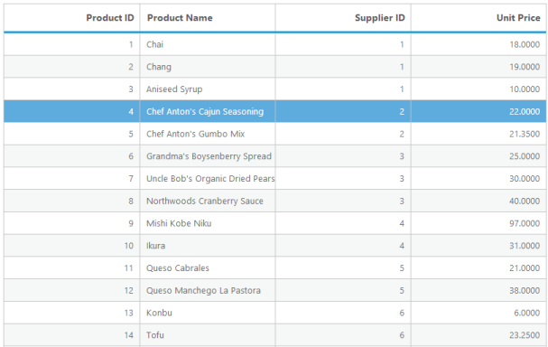

# Data Adaptors

DataManager consists of three concepts, commonly called as adaptors, that are used to manipulate data. There are two types of adaptors in DataManager. They are

* OData Adaptor
* Cache Adaptor

## OData Adaptor

Now a days oData is a very useful technique in consuming data. You can use oData protocol through DataManager’s ODataadaptor. The following code example demonstrates how you can use oDataadaptor with Grid.



@(Html.EJ().Grid<object>("Grid")

        .Datasource("http://mvc.syncfusion.com/Services/Northwnd.svc/Products")

        .Columns(col =>

        {

            col.Field("ProductID").HeaderText("Product ID").TextAlign(TextAlign.Right).Add();

            col.Field("ProductName").HeaderText("Product Name").Add();

            col.Field("SupplierID").HeaderText("Supplier ID").TextAlign(TextAlign.Right).Add();

            col.Field("UnitPrice").HeaderText("Unit Price").TextAlign(TextAlign.Right).Add();

        })

 )



The following screenshot is the result of the above code example.

_Figure : OData Adaptor_

## Cache Adaptor

Cache Adaptor is a technique used to cache multiple page data by using the property enableCaching. You can provide the number of pages that is required to cache in single request using CachingPageSize property. It enables you to reduce multiple request to server. You can use any type of adaptor with multiple page caching by using cache adaptor. The following code illustrates how to create cache adaptor and use it with grid.



  @(Html.EJ().Grid<OrdersView>("CacheAdaptor")

      .Datasource(ds =>         ds.URL("http://mvc.syncfusion.com/Services/Northwnd.svc/Orders/")

        .EnableCaching().CachingPageSize(10).TimeTillExpiration(120000))

        .Columns(col =>

        {

           col.Field("OrderID").HeaderText("OrderID").TextAlign(TextAlign.Right).Add();

           col.Field("CustomerID").HeaderText("Customer ID").Add();

           col.Field("EmployeeID.TextAlign(TextAlign.Right).Add();

            col.Field("Freight.TextAlign(TextAlign.Right).Add();

            col.Field("ShipCity").HeaderText("Ship City"). Add();

            col.Field("OrderDate").TextAlign(TextAlign.Right).Add();

        })

    )




public partial class GridController : Controller

    {

        //

        // GET: /UrlBinding/

        public ActionResult CacheAdaptor()

        {

            return View();

        }

    }



The following screenshot is the result of the above code example.

_Figure17: Cache Adaptor_

