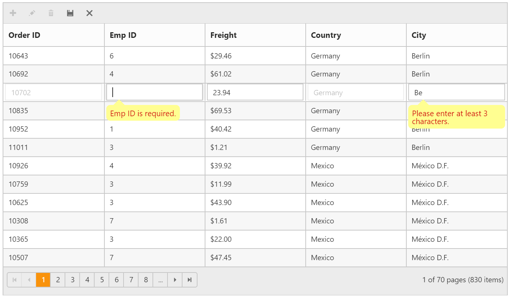

#  DataAnnotation

Data Annotations help us to define the rules to the model classes or properties for data validation and displaying suitable messages to end users.

You can enable Data Annotation by binding the corresponding Class to Grid helper and thus data annotations attributes will be mapped to the corresponding Grid Column property.

Please find the following list of annotation attributes that are supported in Grid Control.

<table>
  <tr>
     <th>Attribute Name</th>
     <th>Functioanlity in Grid</th>
  </tr>
  <tr>
     <td>BindAttribute - Exlcude</td>
     <td>To exclude the corresponding field from Grid Columns property in AutoGenerate Grid</td>
  </tr>
  <tr>
     <td>DisplayName</td>
     <td>It sets `HeaderText` property of Grid Column</td>
  </tr>
  <tr>
     <td>ReadOnly</td>
     <td>It sets `AllowEditing` for a particular column</td>
  </tr>
  <tr>
     <td>Key</td>
     <td>To Set `PrimaryKey` in Grid Columns</td>
   </tr>
   <tr>
     <td>ScaffoldColumn</td>
     <td>It sets `Visible` property of Grid Columns which is used to hide or show a Column in Grid</td>
   </tr>
   <tr>
     <td>DisplayFormat - DataFormatString</td>
     <td>To sets `Format` property of Grid Column that renders corresponding Grid Column data in respective format.</td>
   </tr>
   <tr>
     <td>DatabaseGenerated(DatabaseGeneratedOption.Identity)</td>
     <td>To set `isIdentity` Property of Grid Column</td></tr>
   <tr>
     <td>Validation
       <ul>
          <li>RequiredAttribute</li>
          <li>StringLengthAttribute</li>
          <li>RangeAttribute</li>
          <li>RegularExpressionAttribute</li>
          <li>MinLengthAttribute</li>
          <li>MaxLengthAttribute</li>
          <li>CompareAttribute</li>
          <li>DataTypeAttribute</li>
          <li>DataType.Custom</li>
          <li>DataType.Date</li>
          <li>DataType.DateTime</li>
          <li>DataType.EmailAddress</li>
          <li>DataType.ImageUrl</li>
          <li>DataType.Url</li>
          <li>Custom DataType </li>   
      </ul>
     </td>
     <td>The data annotaion validations attribute would used as `validation rules` in Grid CRUD operations</td>
   </tr>
   <tr>
   <td>ForeignKey</td>
   <td>Set `ForeignKeyField` Property of Grid Column</td></tr>   
</table>        

N> Grid Properties has more priority than Data Annotation. For Instance, if `DisplayName` Attribute is set to a Field in Grid Model class and also we set different value to the respective Grid Columns property `HeaderText`, then the value of `HeaderText` property will be considered and shown in Grid header.

The following code example shows how data annotation works in Grid Control.

  


             @model IEnumerable<EditableOrder>
             @(Html.EJ().Grid<EditableOrder>("FlatGrid")
                        .Datasource(Model)
                        .AllowPaging()
                  )


            
        namespace EJGrid.Controllers
         {
         public class EditableOrder
          {
           [Display(Name = "Order ID")]
           public int OrderID
            {
              get;
              set;
            }
           [Display(Name = "Emp ID")]
           public int? EmployeeID
            {
              get;
              set;
            }
           [Display(Name = "Freight")]
           public decimal? Freight
            {
              get;
              set;
           }
          [Display(Name = "Country")]
          public string ShipCountry
           {
             get;
             set;
           }
          [Display(Name = "City")]
          public string ShipCity
           {
             get;
             set;
           }
         }
         public class HomeController : Controller
          {
           public ActionResult Index()
            {
              List<EditableOrder> data = OrderRepository.GetAllRecords() ;
              return View(data);
            }
          }
        }

  
          
The following output is displayed as a result of the above code example.

 