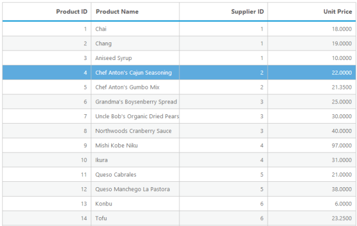
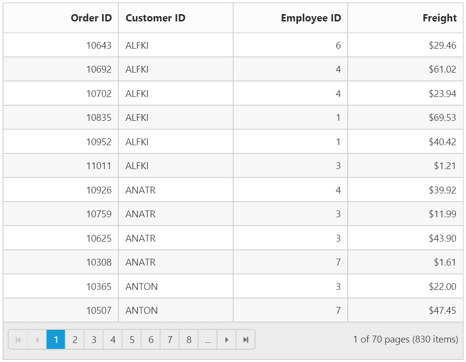
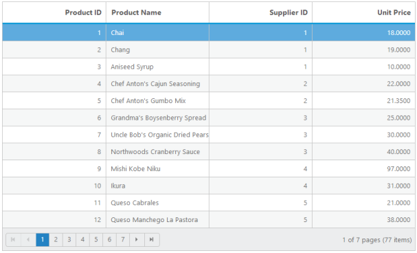
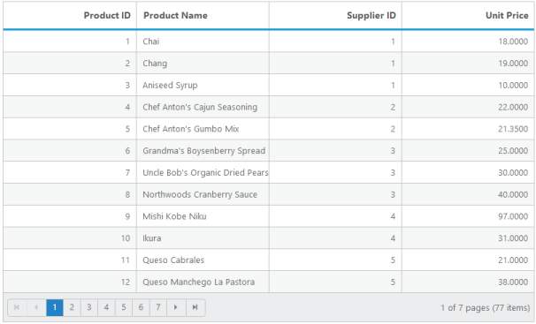
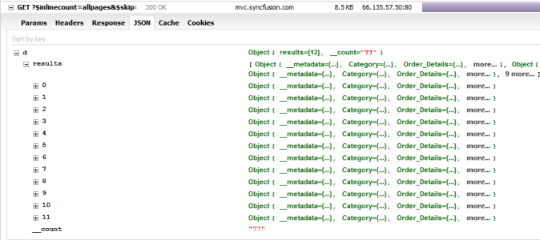
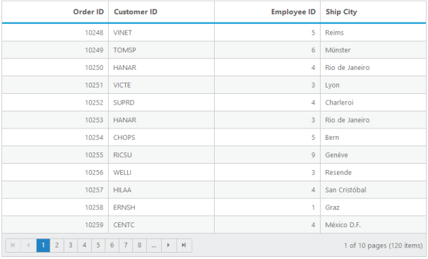
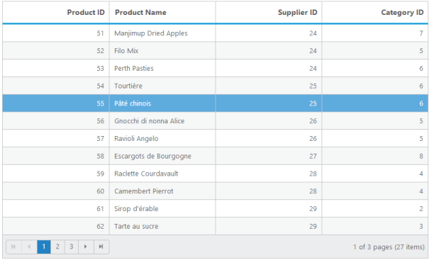
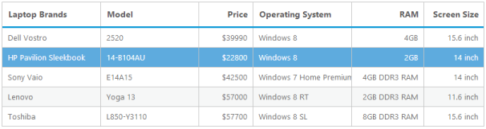

## Data Binding

### Local data

The DataSource property is used to bind the List collection to grid.It is used to bind records in client-side using List collection that is mostly helpful in Single Page Application (SPA).

[MVC]

 [razor]

@( Html.EJ().Grid<Person>("FlatGrid")

.Datasource((IEnumerable<object>)ViewBag.datasource)

        .Columns(c =>

        {

            c.Field("FirstName").HeaderText("First Name").Add();

            c.Field("LastName").HeaderText("Last Name").Add();

            c.Field("Email").HeaderText("Email").Add();

        })

        )

[controller]

namespace MVCSampleBrowser.Controllers

{

    public partial class GridController : Controller

    {

        public ActionResult Default()

        {

List<Person> Persons = new List<Person>();

            Persons.Add(new Person() { FirstName = "John", LastName = "Beckett", Email = "john@syncfusion.com" });

            Persons.Add(new Person() { FirstName = "Ben", LastName = "Beckett", Email = "ben@syncfusion.com" });

            Persons.Add(new Person() { FirstName = "Andrew", LastName = "Beckett", Email = "andrew@syncfusion.com" });

            ViewBag.datasource = Persons;

            return View();

        }

    }

}

Result of the above code example.

{  | markdownify }
{:.image }

### Remote data

#### oData Binding	

oData is standardized protocol for creating and consuming data. You can retrieve data from oDataservice using DataManager. The following code is a simple example of remote data binding using oDataservice.

[MVC]

[razor]

@( Html.EJ().Grid<object>("Grid")

        .Datasource("http://mvc.syncfusion.com/Services/Northwnd.svc/Products")

        .Columns(col =>

        {

            col.Field("ProductID").HeaderText("Product ID").TextAlign(TextAlign.Right).Add();

            col.Field("ProductName").HeaderText("Product Name").Add();

            col.Field("SupplierID").HeaderText("Supplier ID").TextAlign(TextAlign.Right).Add();

            col.Field("UnitPrice").HeaderText("Unit Price").TextAlign(TextAlign.Right).Add();

        })

 )

The following output is the result of the above code example.

{  | markdownify }
{:.image }

> {  | markdownify }
{:.image }
_Note: For information about DataManager with Grid check DataAdaptors concept._

#### Load at once

Through this load at once technique, you can load all remote data from the server to the Grid and process records in client-side. To enable load at once technique, use the Offline property set as true. The following code example shows load at once with Grid.

[MVC]

[razor]

@( Html.EJ().Grid<object>("Grid")

      .Datasource(d =>d.URL("http://mvc.syncfusion.com/Services/Northwnd.svc/Products").Offline(true))

        .AllowPaging(true)

        .Columns(col =>

        {

            col.Field("ProductID").HeaderText("Product ID").TextAlign(TextAlign.Right).Add();

            col.Field("ProductName").HeaderText("Product Name").Add();

            col.Field("SupplierID").HeaderText("Supplier ID").TextAlign(TextAlign.Right).Add();

            col.Field("UnitPrice").HeaderText("Unit Price").TextAlign(TextAlign.Right).Add();

        })

 )

The following output is the result of the above code example.

{  | markdownify }
{:.image }

#### Load on demand

Load on demand is a powerful technique that is used to reduce bandwidth size of consuming data. In Grid, you have support to use load on demand. In the following example, oDataservice is used. At load time, it retrieves required data from service, only for the visible page and not for all records. And if you move to another page, it loads for current page. You do not have to configure Grid to enable load on demand, since load on demand is enabled by default in Grid. The following code example shows you how load on demand works with Grid.

[MVC]

[razor]

@(Html.EJ().Grid<object>("Grid")

        .Datasource(d =>d.URL("http://mvc.syncfusion.com/Services/Northwnd.svc/Products"))

        .AllowPaging(true)

        .Columns(col =>

        {

            col.Field("ProductID").HeaderText("Product ID").TextAlign(TextAlign.Right).Add();

            col.Field("ProductName").HeaderText("Product Name").Add();

            col.Field("SupplierID").HeaderText("Supplier ID").TextAlign(TextAlign.Right).Add();

            col.Field("UnitPrice").HeaderText("Unit Price").TextAlign(TextAlign.Right).Add();

        })

 )

The following screenshot is the result of the above code example.

{  | markdownify }
{:.image }

If you have developer tools, you can capture network transfer to check Grid consumed data. The following screenshot shows demanded data being loaded in Grid.

{  | markdownify }
{:.image }

#### Cross domain

Grid can use cross domain data service with the help of DataManager. You must configure the server as well, to retrieve data from server code. For server configuration, you can refer this link ([https://developer.mozilla.org/en-US/docs/Web/HTTP/Access_control_CORS](https://developer.mozilla.org/en-US/docs/Web/HTTP/Access_control_CORS)). The following code example shows you how to use or retrieve cross domain data from Grid.

[MVC]

[razor]

@(Html.EJ().Grid<object>("Grid")

        .Datasource(d =>d.URL("http://mvc.syncfusion.com/UGService/api/Orders").Offline(true).CrossDomain(true))

        .AllowPaging(true)

        .Columns(col =>

        {

            col.Field("OrderID").HeaderText("Order ID").TextAlign(TextAlign.Right).Add();

            col.Field("CustomerID").HeaderText("Customer ID").Add();

            col.Field("EmployeeID").HeaderText("Employee ID").TextAlign(TextAlign.Right).Add();

            col.Field("ShipCity").HeaderText("Ship City").Add();

        })

 )

The following screenshot is the result of the above code example.

{  | markdownify }
{:.image }

#### HTTP additional parameters

In this section, you can learn how to customize or add an extra parameter for HTTP request. You can add parameter to oDataserviceURL using the Query property in Grid. DataManager uses this Query internally in Grid.

[MVC]

[razor]

@(Html.EJ().Grid<object>("Grid")

        .Datasource(d =>d.URL("http://mvc.syncfusion.com/Services/Northwnd.svc/Products"))

        .AllowPaging(true)

        .Query("new ej.Query().addParams('$filter','ProductID gt 50')")

        .Columns(col =>

        {

            col.Field("ProductID").HeaderText("Product ID").TextAlign(TextAlign.Right).Add();

            col.Field("ProductName").HeaderText("Product Name").Add();

            col.Field("SupplierID").HeaderText("Supplier ID").TextAlign(TextAlign.Right).Add();

            col.Field("UnitPrice").HeaderText("Unit Price").TextAlign(TextAlign.Right).Add();

        })

 )

The following screenshot is the result of the above code example.

{  | markdownify }
{:.image }

#### Supported DataTypes

Grid supports various DataTypes are string, number, datetime and Boolean. By default, Grid reads DataTypes from Grid data source. Using these data types, Grid uses it at to edit, add, save, filter and other such operations. You can also customize these DataTypes through column property Type. It can override default data type reading.

[MVC]

 [razor]

 @(Html.EJ().Grid<object>("Grid")

    .Datasource((DataTable)ViewBag.dataTable)

    .AllowPaging()

    .PageSettings(page => page.PageCount(4).PageSize(12))

    .Columns(col =>

                {

                    col.Field("OrderID").HeaderText("Order ID").IsPrimaryKey(true).TextAlign(TextAlign.Right).Width(75).Add();

                    col.Field("CustomerID").HeaderText("Customer ID").Type("string").Width(80).Add();

                    col.Field("EmployeeID").HeaderText("Employee ID").TextAlign(TextAlign.Right).Width(75).Add();

                    col.Field("ShipName").HeaderText("Ship Name").Type("string").Width(80).Add();

                })

    )

[controller]

namespace MVCSampleBrowser.Controllers

{

    public partial class GridController : Controller

    {

        //

        // GET: /Default/

        public ActionResult Default()

        {

            var DataSource = new NorthwindDataContext().OrdersViews.ToList();

            ViewBag.datasource = DataSource;

            return View();

        }

    }

}

### HTML binding

Grid provides support to form Grid from HTML table. It is flexible to convert from table to Grid with the help of the DataManager.

[MVC]

&lt;script id="table1" type="text/template" &gt;

        &lt;table&gt;

            &lt;thead&gt;

                &lt;tr&gt;

                    <th>Laptop

                    &lt;/th&gt;

                    <th>Model

                    &lt;/th&gt;

                    <th>Price

                    &lt;/th&gt;

                    <th>OS

                    &lt;/th&gt;

                    <th>RAM

                    &lt;/th&gt;

                    <th>ScreenSize

                    &lt;/th&gt;

                &lt;/tr&gt;

            &lt;/thead&gt;

            &lt;tbody&gt;

                &lt;tr&gt;

                    <td>Dell Vostro</td>

                    <td>2520</td>

                    <td>39990</td>

                    <td>Windows 8</td>

                    <td>4GB</td>

                    <td>15.6</td>

                &lt;/tr&gt;

                &lt;tr&gt;

                    <td>HP Pavilion Sleekbook</td>

                    <td>14-B104AU</td>

                    <td>22800</td>

                    <td>Windows 8</td>

                    <td>2GB</td>

                    <td>14</td>

                &lt;/tr&gt;

                &lt;tr&gt;

                    <td>Sony Vaio</td>

                    <td>E14A15</td>

                    <td>42500</td>

                    <td>Windows 7 Home Premium</td>

                    <td>4GB DDR3 RAM</td>

                    <td>14</td>

                &lt;/tr&gt;

                &lt;tr&gt;

                    <td>Lenovo</td>

                    <td>Yoga 13</td>

                    <td>57000</td>

                    <td>Windows 8 RT</td>

                    <td>2GB DDR3 RAM</td>

                    <td>11.6</td>

                &lt;/tr&gt;

                &lt;tr&gt;

                    <td>Toshiba</td>

                    <td>L850-Y3110</td>

                    <td>57700</td>

                    <td>Windows 8 SL</td>

                    <td>8GB DDR3 RAM</td>

                    <td>15.6</td>

                &lt;/tr&gt;

            &lt;/tbody&gt;

        &lt;/table&gt;

        &lt;/script&gt;

    @(Html.EJ().Grid<object>("Grid")

.Datasource(ds => { ds.Table("#table1"); })

          .Columns(col =>

          {

              col.Field("Laptop").HeaderText("Laptop Brands").Add();

              col.Field("Model").HeaderText("Model").Add();

              col.Field("Price").HeaderText("Price").TextAlign(TextAlign.Right).Width(90).Add();

              col.Field("OS").HeaderText("Operating System").Add();

              col.Field("RAM").HeaderText("RAM").TextAlign(TextAlign.Right).Width(120).Add();

              col.Field("ScreenSize").HeaderText("Screen Size").TextAlign(TextAlign.Right).Width(100).Add();

          })

          )

The following screenshot is the result of the above code example.

{  | markdownify }
{:.image }

