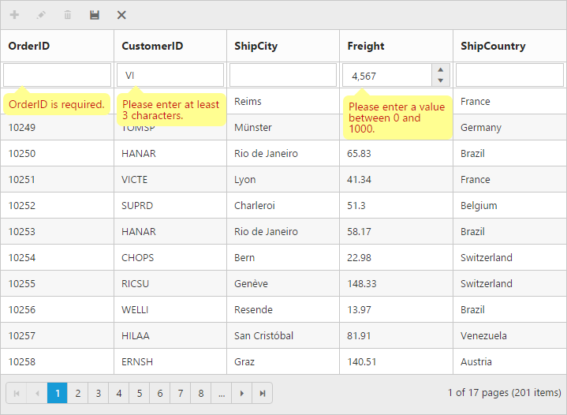
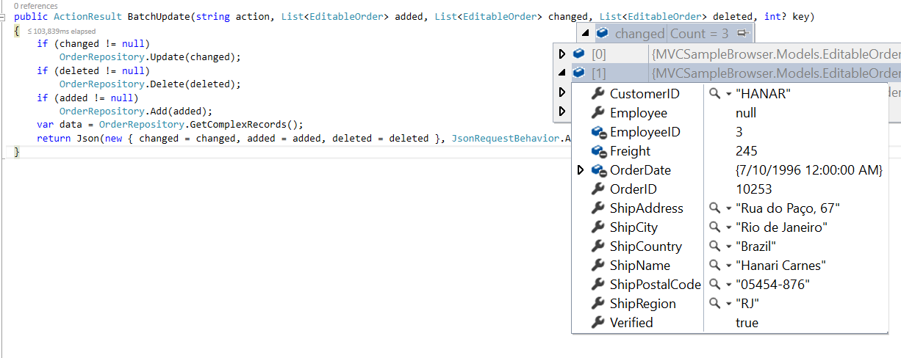

# Editing

Essential Studio JavaScript Grid has built-in support for editing Grid content. This can be achieved by defining an edit option for the Grid. You must provide toolbar support for editing records and validation support while editing the record. 

## Toolbar with edit option

Essential Studio JavaScript Grid provides toolbar support and it can be customized. It contains the following built-in toolbar items: 

* Add
* Edit
* Delete
* Update
* Cancel


[MVC]

[razor]

  @(Html.EJ().Grid<object>("Editing")

        .Datasource((IEnumerable<object>)ViewBag.datasource)

.EditSettings(edit => { edit.AllowAdding().AllowDeleting().AllowEditing(); })

        .ToolbarSettings(toolbar =>

            {

                toolbar.ShowToolbar().ToolbarItems(items =>

                {

                    items.AddTool(ToolBarItems.Add);

                    items.AddTool(ToolBarItems.Edit);

                    items.AddTool(ToolBarItems.Delete);

                    items.AddTool(ToolBarItems.Update);

                    items.AddTool(ToolBarItems.Cancel);

                });

            })

        .AllowPaging(true)

        .Columns(col =>

        {

            col.Field("OrderID").HeaderText("Order ID").IsPrimaryKey(true).TextAlign(TextAlign.Right).Add();

            col.Field("CustomerID").HeaderText("Customer ID").Add();

            col.Field("EmployeeID").HeaderText("Employee ID").TextAlign(TextAlign.Right).Add();

            col.Field("ShipCity").HeaderText("Ship City").Add();

            col.Field("Verified").HeaderText("Verified").Add();

        })

        )



[Controller]

namespace SyncfusionMvcApplication3.Controllers

{

    public class HomeController : Controller

    {

        public ActionResult Index()

        {

            ViewBag.datasource = OrderRepository.GetAllRecords();

            return View();

        }         

    }	

}



The following output is displayed as a result of the above code example.

## Cell edit type

Essential Studio JavaScript Grid supports column edit type by using delegated controls for specific data types. They are:

* CheckBox control for boolean data type.
* NumericTextBox control for integers, double, and decimal types.
* InputTextBox control for string data types.
* DatePicker control for date data.
* DateTimePicker control for date-time data.
* DropDownList control for list of data.

The edit type of every column can be customized using the EditType property.



[MVC]

[razor]

  @(Html.EJ().Grid<object>("Editing")

        .Datasource((IEnumerable<object>)ViewBag.datasource)

        .EditSettings(edit => { edit.AllowAdding().AllowDeleting().AllowEditing(); })

        .ToolbarSettings (toolbar =>

            {

                toolbar.ShowToolbar().ToolbarItems(items =>

                {

                    items.AddTool(ToolBarItems.Add);

                    items.AddTool(ToolBarItems.Edit);

                    items.AddTool(ToolBarItems.Delete);

                    items.AddTool(ToolBarItems.Update);

                    items.AddTool(ToolBarItems.Cancel);

                });

            })

        .AllowPaging(true)

        .Columns(col =>

        {

            col.Field("OrderID").HeaderText("Order ID").IsPrimaryKey(true).TextAlign(TextAlign.Right).Add();

            col.Field("CustomerID").HeaderText("Customer ID").EditType(EditingType.String).Add();

            col.Field("EmployeeID").HeaderText("Employee ID").TextAlign(TextAlign.Right).EditType(EditingType.Numeric).Add();

            col.Field("ShipCity").HeaderText("Ship City").EditType(EditingType.Dropdown).Add();

            col.Field("OrderDate").HeaderText("Order Date").EditType(EditingType.Datepicker).Format("{0:MM/dd/yyyy}").Add();            col.Field("Verified").HeaderText("Verified").EditType(EditingType.Boolean).Add();

        })

        )




[Controller]

namespace SyncfusionMvcApplication3.Controllers

{

    public class HomeController : Controller

    {

        public ActionResult Index()

        {

            ViewBag.datasource = OrderRepository.GetAllRecords();

            return View();

        }         

    }	

}



The following output is displayed as a result of the above code example.

### External DataSource for DropDown EditType Column

By default, the datasource for Dropdown Edit Column is set by Grid Control from its datasource. You can also bind external datasource to the Dropdown control of corresponding column in edit mode by using “DataSource” Grid Column property.

> Note: The external datasource must be given in a structure that it should contain properties “text” and_  _“value” which holds the data



[MVC]

[razor]

  @(Html.EJ().Grid<OrdersView>("FlatGrid")

        .Datasource((IEnumerable<object>)ViewBag.dataSource)
           .EditSettings(edit => { edit.AllowAdding().AllowDeleting().AllowEditing(); })
         .ToolbarSettings(toolbar =>
            {
                toolbar.ShowToolbar().ToolbarItems(items =>
                {
                    items.AddTool(ToolBarItems.Add);
                    items.AddTool(ToolBarItems.Edit);
                    items.AddTool(ToolBarItems.Delete);
                    items.AddTool(ToolBarItems.Update);
                    items.AddTool(ToolBarItems.Cancel);
                });
            })
        .AllowPaging()

        .Columns(col =>

        {

            col.Field("OrderID").HeaderText("Order ID").TextAlign(TextAlign.Right).Add();

            col.Field("CustomerID").HeaderText("Customer ID").Add();

            col.Field("EmployeeID").HeaderText("Employee ID").TextAlign(TextAlign.Right). Add();          

    col.Field("Freight").HeaderText("Freight").TextAlign(TextAlign.Right).Add();

            col.Field("OrderDate").HeaderText("Order Date").TextAlign(TextAlign.Right). Add();

            col.Field("ShipCountry").HeaderText("Ship Country").EditType(EditingType.Dropdown).DataSource((IEnumerable<object>)ViewBag.dataSource2).Add();

        })) 




[Controller]

public partial class GridController : Controller

    {

public ActionResult Index()

        {

            ViewBag.dataSource = new NorthwindDataContext().OrdersViews.ToList();

            var dropdown = new NorthwindDataContext().OrdersViews.Select(c => c.ShipCountry).Distinct().ToList();

var data = new List<object>();

            foreach (var val in dropdown)

            {

                data.Add(new { value = val, text = val });

            }

ViewBag.dataSource2 = data;

            return View();

        }

}



## Edit Template

EditTemplate feature is used to create a custom editor to edit column values. EditTemplate has three functions.

* Create – It is used to create the control at time of initialize
* Read –  It is used to read the input value at time of save
* Write – It is used to assign the value to control at time of editing

The following code example is for Edit Template.



[MVC]

[razor]

    @(Html.EJ().Grid<OrdersView>("Edittemplate")

        .Datasource((IEnumerable<object>)ViewBag.datasource)

        .EditSettings(edit => { edit.AllowAdding().AllowDeleting().AllowEditing(); })

        .ToolbarSettings(toolbar =>

        {

            toolbar.ShowToolbar().ToolbarItems(items =>

            {

                items.AddTool(ToolBarItems.Add);

                items.AddTool(ToolBarItems.Edit);

                items.AddTool(ToolBarItems.Delete);

                items.AddTool(ToolBarItems.Update);

                items.AddTool(ToolBarItems.Cancel);

            });

        })

        .AllowPaging()

        .Columns(col =>

        {

            col.Field("OrderID").HeaderText("Order ID").IsPrimaryKey(true).TextAlign(TextAlign.Right).Width(90).ValidationRules(v => v.AddRule("required", true).AddRule("number", true)).Add();

            col.Field("CustomerID").HeaderText("Customer ID").Width(90).Add();

            col.Field("EmployeeID").HeaderText("Employee ID").EditTemplate(a => { a.Create("create").Read("read").Write("write"); }).TextAlign(TextAlign.Right).Width(90).Add();

            col.Field("Freight").HeaderText("Freight").TextAlign(TextAlign.Right).Width(80).EditType(EditingType.Numeric).Format("{0:C}").NumericEditOptions(new EditorProperties() { DecimalPlaces = 2 }).Add();

            col.Field("ShipName").HeaderText("ShipName").Width(90).Add();

               col.Field("ShipCountry").HeaderText("ShipCountry").Width(90).EditType(EditingType.Dropdown).Add();

        })

    )


    


 [Controller]

namespace MVCSampleBrowser.Controllers

{

    public partial class GridController : Controller

    {

        public ActionResult EditTemplate()

        {

            var DataSource = new NorthwindDataContext().OrdersViews.ToList();

            ViewBag.datasource = DataSource;

            return View();

        }

    }

}



## Edit Mode

Essential Studio JavaScript Grid supports eight modes of editing feature in grid. They are:

* Normal row editing
* Inline form editing
* Inline template form editing
* Dialog editing
* Dialog template form editing
* External form editing
* External template form editing
* Batch editing

### Normal Editing

This feature allows you to edit various fields of a single record, simultaneously. The row goes to editable state. The following code example shows you how to set EditMode as Normal.



[MVC]

[razor]

  @(Html.EJ().Grid<object>("Editing")

        .Datasource((IEnumerable<object>)ViewBag.datasource)

        .EditSettings(edit => { edit.AllowAdding().AllowDeleting().AllowEditing()

.EditMode(EditMode.Normal); })

        .ToolbarSettings(toolbar =>

            {

                toolbar.ShowToolbar().ToolbarItems(items =>

                {

                    items.AddTool(ToolBarItems.Add);

                    items.AddTool(ToolBarItems.Edit);

                    items.AddTool(ToolBarItems.Delete);

                    items.AddTool(ToolBarItems.Update);

                    items.AddTool(ToolBarItems.Cancel);

                });

            })

        .AllowPaging(true)

        .Columns(col =>

        {

            col.Field("OrderID").HeaderText("Order ID").IsPrimaryKey(true).TextAlign(TextAlign.Right).Add();

            col.Field("CustomerID").HeaderText("Customer ID").EditType(EditingType.String).Add();

            col.Field("EmployeeID").HeaderText("Employee ID").TextAlign(TextAlign.Right).EditType(EditingType.Numeric).Add();

            col.Field("ShipCity").HeaderText("Ship City").EditType(EditingType.Dropdown).Add();

            col.Field("OrderDate").HeaderText("Order Date").EditType(EditingType.Datepicker).Format("{0:MM/dd/yyyy}").Add();            col.Field("Verified").HeaderText("Verified").EditType(EditingType.Boolean).Add();

        })

        )



[Controller]

namespace SyncfusionMvcApplication3.Controllers

{

    public class HomeController : Controller

    {

        public ActionResult Index()

        {

            ViewBag.datasource = OrderRepository.GetAllRecords();

            return View();

        }         

    }	

}



The following output is displayed as a result of the above code example.

### Dialog Editing

The Dialog Edit feature allows you to edit data, using a dialog box that has fields associated with the data record being edited. You can only edit the data stored in the fields that you have rendered to be visible. The following code example shows you how to set EditMode as Dialog.


[MVC]

[razor]

  @(Html.EJ().Grid<object>("Editing")

        .Datasource((IEnumerable<object>)ViewBag.datasource)

        .EditSettings(edit => { edit.AllowAdding().AllowDeleting().AllowEditing()

.EditMode(EditMode.Dialog); })

        .ToolbarSettings(toolbar =>

            {

                toolbar.ShowToolbar().ToolbarItems(items =>

                {

                    items.AddTool(ToolBarItems.Add);

                    items.AddTool(ToolBarItems.Edit);

                    items.AddTool(ToolBarItems.Delete);

                    items.AddTool(ToolBarItems.Update);

                    items.AddTool(ToolBarItems.Cancel);

                });

            })

        .AllowPaging(true)

        .Columns(col =>

        {

            col.Field("OrderID").HeaderText("Order ID").IsPrimaryKey(true).TextAlign(TextAlign.Right).Add();

            col.Field("CustomerID").HeaderText("Customer ID").EditType(EditingType.StringEdit).Add();

            col.Field("EmployeeID").HeaderText("Employee ID").TextAlign(TextAlign.Right).EditType(EditingType.Numeric).Add();

            col.Field("ShipCity").HeaderText("Ship City").EditType(EditingType.Dropdown).Add();

            col.Field("OrderDate").HeaderText("Order Date").EditType(EditingType.Datepicker).Format("{0:MM/dd/yyyy}").Add();            col.Field("Verified").HeaderText("Verified").EditType(EditingType.Boolean).Add();

        })

        )




[Controller]

namespace SyncfusionMvcApplication3.Controllers

{

    public class HomeController : Controller

    {

        public ActionResult Index()

        {

            ViewBag.datasource = OrderRepository.GetAllRecords();

            return View();

        }         

    }	

}


The following output is displayed as a result of the above code example.

### Inline Form Editing

This feature allows you to edit various fields of a single record, simultaneously. It is called inline because it is shown in between two rows, called as rows of control. After you have edited a row, the inline form is displayed. The following code example shows you how to set EditMode as InlineForm.



[MVC]

[razor]

  @(Html.EJ().Grid<object>("Editing")

        .Datasource((IEnumerable<object>)ViewBag.datasource)

        .EditSettings(edit => { edit.AllowAdding().AllowDeleting().AllowEditing()

.EditMode(EditMode.InlineForm); })

        .ToolbarSettings(toolbar =>

            {

                toolbar.ShowToolbar().ToolbarItems(items =>

                {

                    items.AddTool(ToolBarItems.Add);

                    items.AddTool(ToolBarItems.Edit);

                    items.AddTool(ToolBarItems.Delete);

                    items.AddTool(ToolBarItems.Update);

                    items.AddTool(ToolBarItems.Cancel);

                });

            })

        .AllowPaging(true)

        .PageSettings(page => { page.PageSize(8); })

        .Columns(col =>

        {

            col.Field("OrderID").HeaderText("Order ID").IsPrimaryKey(true).TextAlign(TextAlign.Right).Add();

            col.Field("CustomerID").HeaderText("Customer ID").EditType(EditingType.String).Add();

            col.Field("EmployeeID").HeaderText("Employee ID").TextAlign(TextAlign.Right).EditType(EditingType.Numeric).Add();

            col.Field("ShipCity").HeaderText("Ship City").EditType(EditingType.Dropdown).Add();

            col.Field("OrderDate").HeaderText("Order Date").EditType(EditingType.Datepicker).Format("{0:MM/dd/yyyy}").Add();            col.Field("Verified").HeaderText("Verified").EditType(EditingType.Boolean).Add();

        })

        )



[Controller]

namespace SyncfusionMvcApplication3.Controllers

{

    public class HomeController : Controller

    {

        public ActionResult Index()

        {

            ViewBag.datasource = OrderRepository.GetAllRecords();

            return View();

        }         

    }	

}



The following output is displayed as a result of the above code example.

### External Form Editing

The External Form Edit Mode helps you edit various data entries in the Grid, one at a time, using an external edit form.

This is different from the Dialog Editing mode in that it allows you to see the other entries in the Grid while you are editing one.

You can position the edit form either in the top-right corner or the bottom-left corner (by default) of the Grid. The following code example shows you how to set EditMode as ExternalForm.



[MVC]

[razor]

  @(Html.EJ().Grid<object>("Editing")

        .Datasource((IEnumerable<object>)ViewBag.datasource)

        .EditSettings(edit => { edit.AllowAdding().AllowDeleting().AllowEditing()

.EditMode(EditMode.InlineForm)

                                  .FormPosition(FormPosition.BottomLeft); })

        .ToolbarSettings(toolbar =>

            {

                toolbar.ShowToolbar().ToolbarItems(items =>

                {

                    items.AddTool(ToolBarItems.Add);

                    items.AddTool(ToolBarItems.Edit);

                    items.AddTool(ToolBarItems.Delete);

                    items.AddTool(ToolBarItems.Update);

                    items.AddTool(ToolBarItems.Cancel);

                });

            })

        .AllowPaging(true)

        .PageSettings(page => { page.PageSize(8); })

        .Columns(col =>

        {

            col.Field("OrderID").HeaderText("Order ID").IsPrimaryKey(true).TextAlign(TextAlign.Right).Add();

            col.Field("CustomerID").HeaderText("Customer ID").EditType(EditingType.String).Add();

            col.Field("EmployeeID").HeaderText("Employee ID").TextAlign(TextAlign.Right).EditType(EditingType.Numeric).Add();

            col.Field("ShipCity").HeaderText("Ship City").EditType(EditingType.Dropdown).Add();

            col.Field("OrderDate").HeaderText("Order Date").EditType(EditingType.Datepicker).Format("{0:MM/dd/yyyy}").Add();            col.Field("Verified").HeaderText("Verified").EditType(EditingType.Boolean).Add();

        })

        )




[Controller]

namespace SyncfusionMvcApplication3.Controllers

{

    public class HomeController : Controller

    {

        public ActionResult Index()

        {

            ViewBag.datasource = OrderRepository.GetAllRecords();

            return View();

        }         

    }	

}



The following output is displayed as a result of the above code example.

### Template Form Editing

You can edit any of the fields pertaining to a single record of data and apply it to a template so that the same format is applied to all the other records that you may edit later.

You can also edit the fields that are not visible in the Grid using this template. You are provided with three template editing support in Grid.

* Inline template form editing
* Dialog template form editing
* External template form editing

#### Inline Template Form Editing

In Inline Template, you can specify the template inside the script tag and select the type as text/template. Only then the HTML elements defined in the template will not be displayed in the browser. You can define the template as follows.


[Script]



To enable Inline Template edit, set EditMode as InlineTemplateForm and InlineFormTemplateID property of Grid as follows. 

[MVC]

[razor]

  @(Html.EJ().Grid<object>("Editing")

        .Datasource((IEnumerable<object>)ViewBag.datasource)

        .EditSettings(edit => { edit.AllowAdding().AllowDeleting().AllowEditing()

.EditMode(EditMode.InlineTemplateForm)

                                      .InlineFormTemplateID("#template");})

        .ToolbarSettings(toolbar =>

            {

                toolbar.ShowToolbar().ToolbarItems(items =>

                {

                    items.AddTool(ToolBarItems.Add);

                    items.AddTool(ToolBarItems.Edit);

                    items.AddTool(ToolBarItems.Delete);

                    items.AddTool(ToolBarItems.Update);

                    items.AddTool(ToolBarItems.Cancel);

                });

            })

        .AllowPaging(true)

        .PageSettings(page => { page.PageSize(6); })

        .Columns(col =>

        {

            col.Field("OrderID").HeaderText("Order ID").IsPrimaryKey(true).TextAlign(TextAlign.Right).Add();

            col.Field("CustomerID").HeaderText("Customer ID").EditType(EditingType.String).Add();

            col.Field("EmployeeID").HeaderText("Employee ID").TextAlign(TextAlign.Right).EditType(EditingType.Numeric).Add();

            col.Field("ShipCity").HeaderText("Ship City").EditType(EditingType.Dropdown).Add();

        })

        )




[Controller]

namespace SyncfusionMvcApplication3.Controllers

{

    public class HomeController : Controller

    {

        public ActionResult Index()

        {

            ViewBag.datasource = OrderRepository.GetAllRecords();

            return View();

        }         

    }	

}



The following output is displayed as a result of the above code example.

In the above screenshot you can see that the elements are not rendered based on the type of the column. For example, in Freight column, the textbox is rendered instead of NumericTextBox.

While using template, you can change the elements that are defined in the template, to appropriate control based on the column type. 

Through the ActionCompleteGrid event, you can achieve this.


[MVC]

[razor]

  @(Html.EJ().Grid<object>("Editing")

        //. . . .

        .ClientSideEvents(eve => { eve.ActionComplete("complete"); })

        )



[javascript]




[Controller]

namespace SyncfusionMvcApplication3.Controllers

{

    public class HomeController : Controller

    {

        public ActionResult Index()

        {

            ViewBag.datasource = OrderRepository.GetAllRecords();

            return View();

        }         

    }	

}



Now, the elements defined in the templates, are changed to JavaScript controls. You can see the entire code example for Template editing as follows.



[MVC]

[Script]




[razor]

  @(Html.EJ().Grid<object>("Editing")

        .Datasource((IEnumerable<object>)ViewBag.datasource)

        .EditSettings(edit => { edit.AllowAdding().AllowDeleting().AllowEditing()

.EditMode(EditMode.InlineTemplateForm)

                                      .InlineFormTemplateID("#template");})

        .ToolbarSettings(toolbar =>

            {

                toolbar.ShowToolbar().ToolbarItems(items =>

                {

                    items.AddTool(ToolBarItems.Add);

                    items.AddTool(ToolBarItems.Edit);

                    items.AddTool(ToolBarItems.Delete);

                    items.AddTool(ToolBarItems.Update);

                    items.AddTool(ToolBarItems.Cancel);

                });

            })

        .AllowPaging(true)

        .PageSettings(page => { page.PageSize(6); })

        .Columns(col =>

        {

            col.Field("OrderID").HeaderText("Order ID").IsPrimaryKey(true).TextAlign(TextAlign.Right).Add();

            col.Field("CustomerID").HeaderText("Customer ID").EditType(EditingType.String).Add();

            col.Field("EmployeeID").HeaderText("Employee ID").TextAlign(TextAlign.Right).EditType(EditingType.Numeric).Add();

            col.Field("ShipCity").HeaderText("Ship City").EditType(EditingType.Dropdown).Add();

        })

        .ClientSideEvents(eve => { eve.ActionComplete("complete"); })

        )




[javascript]



[Controller]

namespace SyncfusionMvcApplication3.Controllers

{

    public class HomeController : Controller

    {

        public ActionResult Index()

        {

            ViewBag.datasource = OrderRepository.GetAllRecords();

            return View();

        }         

    }	

}



The following output is displayed as a result of the above code example.

#### External Template Form Editing

The above mentioned procedure applies to ExternalTemplate editing feature also. Use the given code example instead of setting InlineTemplateForm as EditMode.


[MVC]

[razor]

  @(Html.EJ().Grid<object>("Editing")

             .EditSettings(edit => { edit.AllowAdding().AllowDeleting().AllowEditing()

.EditMode(EditMode.ExternalFormTemplate)

                                  .ExternalFormTemplateID("#template");})

             )



The following screenshot shows External Template Form Editing.

#### Dialog Template Editing

The above mentioned procedure applies to DialogTemplate editing feature also. Use the given code example instead of setting for DialogTemplate as EditMode. 


[MVC]

[razor]

  @(Html.EJ().Grid<object>("Editing")

             .EditSettings(edit => { edit.AllowAdding().AllowDeleting().AllowEditing()

                                  .EditMode(EditMode.DialogTemplate)

                                  .DialogEditorTemplateID("#template");})

             )



The following screenshot shows Dialog Template Form Editing.

### Batch Editing

This feature allows you to edit various fields of the Grid, simultaneously, with the ease of Excel-like functionality in editing data.

Edited data is marked on the Grid, so that you know which fields or cells have been edited.
These markers are not shown after the updated data is rendered. The following code example shows you how to enable Excel-like editing, also called Batchediting, in Grid.


[MVC]

[razor]

  @(Html.EJ().Grid<object>("Editing")

        .Datasource((IEnumerable<object>)ViewBag.datasource)

        .EditSettings(edit => { edit.AllowAdding().AllowDeleting().AllowEditing()

.EditMode(EditMode.Batch); })

        .ToolbarSettings(toolbar =>

            {

                toolbar.ShowToolbar().ToolbarItems(items =>

                {

                    items.AddTool(ToolBarItems.Add);

                    items.AddTool(ToolBarItems.Edit);

                    items.AddTool(ToolBarItems.Delete);

                    items.AddTool(ToolBarItems.Update);

                    items.AddTool(ToolBarItems.Cancel);

                });

            })

        .AllowPaging(true)

        .PageSettings(page => { page.PageSize(8); })

        .Columns(col =>

        {

            col.Field("OrderID").HeaderText("Order ID").IsPrimaryKey(true).TextAlign(TextAlign.Right).Add();

            col.Field("CustomerID").HeaderText("Customer ID").EditType(EditingType.String).Add();

            col.Field("EmployeeID").HeaderText("Employee ID").TextAlign(TextAlign.Right).EditType(EditingType.Numeric).Add();

            col.Field("ShipCity").HeaderText("Ship City").EditType(EditingType.Dropdown).Add();

        })

        )




[Controller]

namespace SyncfusionMvcApplication3.Controllers

{

    public class HomeController : Controller

    {

        public ActionResult Index()

        {

            ViewBag.datasource = OrderRepository.GetAllRecords();

            return View();

        }         

    }	

}



The following output is displayed as a result of the above code example.

When the Save or Cancel button is clicked, or performing an action before you save the edited records, the Confirmation message is displayed. 

The following screenshot shows the Confirmation Dialog box.

## Validation

Essential JavaScript Grid supports all the standard validation methods of jquery. Using this feature you can validate the value of the edited record cell before the edited record cell values are saved.

For validation you can refer the following two jquery validation script files.

1. jquery.validate.min.js
2. jquery.validate.unobtrusive.min.js

### jQuery Validation Methods

The following are jquery validation methods.

_Table4: List of jquery validation methods_

<table>
<tr>
<th>
Rules</th><th>
Description</th></tr>
<tr>
<td>
Required</td><td>
 Requires an element.</td></tr>
<tr>
<td>
Remote</td><td>
 Requests a resource to check the element for validity.</td></tr>
<tr>
<td>
Minlength</td><td>
 Requires the element to be of given minimum length.</td></tr>
<tr>
<td>
Maxlength</td><td>
 Requires the element to be of given maximum length.</td></tr>
<tr>
<td>
rangelength</td><td>
 Requires the element to be in given value range.</td></tr>
<tr>
<td>
Min</td><td>
 The element requires a given minimum.</td></tr>
<tr>
<td>
Max</td><td>
 The element requires a given maximum.</td></tr>
<tr>
<td>
Range</td><td>
 Requires the element to be in a given value range.</td></tr>
<tr>
<td>
Email</td><td>
 The element requires a valid email.</td></tr>
<tr>
<td>
url</td><td>
 The element requires a valid url</td></tr>
<tr>
<td>
Date</td><td>
 Requires the element to be a date.</td></tr>
<tr>
<td>
dateISO</td><td>
 The element requires an ISO date.</td></tr>
<tr>
<td>
number</td><td>
 The element requires a decimal number.</td></tr>
<tr>
<td>
digits</td><td>
 The element requires digits only.</td></tr>
<tr>
<td>
creditcard</td><td>
 Requires the element to be a credit card number.</td></tr>
<tr>
<td>
equalTo</td><td>
 Requires the element to be the same as another.</td></tr>
</table>

The following code example shows you how to include the jquery validation support for Grid while editing the records.



[MVC]

[razor]

  @(Html.EJ().Grid<object>("Editing")

        .Datasource((IEnumerable<object>)ViewBag.datasource)

        .EditSettings(edit => { edit.AllowAdding().AllowDeleting().AllowEditing();})

        .ToolbarSettings(toolbar =>

            {

                toolbar.ShowToolbar().ToolbarItems(items =>

                {

                    items.AddTool(ToolBarItems.Add);

                    items.AddTool(ToolBarItems.Edit);

                    items.AddTool(ToolBarItems.Delete);

                    items.AddTool(ToolBarItems.Update);

                    items.AddTool(ToolBarItems.Cancel);

                });

            })

        .AllowPaging(true)

        .PageSettings(page => { page.PageSize(8); })

        .Columns(col =>

        {

            col.Field("OrderID").HeaderText("Order ID").IsPrimaryKey(true).TextAlign(TextAlign.Right).ValidationRules(v => v.AddRule("required", true)).Add();

            col.Field("CustomerID").HeaderText("Customer ID").EditType(EditingType.String).Add();

            col.Field("EmployeeID").HeaderText("Employee ID").TextAlign(TextAlign.Right).EditType(EditingType.Numeric).Add();

            col.Field("Freight").HeaderText("Freight").TextAlign(TextAlign.Right).EditType(EditingType.Numeric).Format("{0:C}").ValidationRules(v => v.AddRule("range", "[0,1000]")).Add();

            col.Field("ShipCity").HeaderText("Ship City").EditType(EditingType.Dropdown).Add();

        })

        )



[Controller]

namespace SyncfusionMvcApplication3.Controllers

{

    public class HomeController : Controller

    {

        public ActionResult Index()

        {

            ViewBag.datasource = OrderRepository.GetAllRecords();

            return View();

        }         

    }	

}



The following output is displayed as a result of the above code example.

### Custom Validation

In addition to jquery validation methods, you can also add your own custom validation methods for a specific column. The following code example shows you how to specify the custom validation for a specific column.



[MVC]

[razor]

  @(Html.EJ().Grid<object>("Editing")

        .Datasource((IEnumerable<object>)ViewBag.datasource)

        .EditSettings(edit => { edit.AllowAdding().AllowDeleting().AllowEditing();})

        .ToolbarSettings(toolbar =>

            {

                toolbar.ShowToolbar().ToolbarItems(items =>

                {

                    items.AddTool(ToolBarItems.Add);

                    items.AddTool(ToolBarItems.Edit);

                    items.AddTool(ToolBarItems.Delete);

                    items.AddTool(ToolBarItems.Update);

                    items.AddTool(ToolBarItems.Cancel);

                });

            })

        .AllowPaging(true)

        .PageSettings(page => { page.PageSize(8); })

        .Columns(col =>

        {

col.Field("OrderID").HeaderText("Order ID").IsPrimaryKey(true).TextAlign(TextAlign.Right).ValidationRules(v => v.AddRule("required", true)).Add();

            col.Field("CustomerID").HeaderText("Customer ID").EditType(EditingType.String).ValidationRules(v => v.AddRule("customRegex", 5)).Add();

            col.Field("EmployeeID").HeaderText("Employee ID").TextAlign(TextAlign.Right).EditType(EditingType.Numeric).Add();

            col.Field("Freight").HeaderText("Freight").TextAlign(TextAlign.Right).EditType(EditingType.Numeric).Format("{0:C}").Format("{0:C}").ValidationRules(v => v.AddRule("customCompare", "[1, 9]")).Add();

            col.Field("ShipCity").HeaderText("Ship City").EditType(EditingType.Dropdown).Add();

        })

        )




[Controller]

namespace SyncfusionMvcApplication3.Controllers

{

    public class HomeController : Controller

    {

        public ActionResult Index()

        {

            ViewBag.datasource = OrderRepository.GetAllRecords();

            return View();

        }         

    }	

}




[javascript]



The following output is displayed as a result of the above code example.

## CRUD Operation With Server-Side

The Server-Side CRUD operation can be performed by using the following adaptor methods in Grid.

1. Url Adaptor
2. RemoteSaveAdaptor

The Server-Side function is declared with the following parameters for each editing functionality.

_Table5: Parameters Table_

<table>
<tr>
<th>
Action</th><th>
Parameter Name</th><th>
Example</th></tr>
<tr>
<td rowspan = "2">
Update, Insert</td><td rowspan = "2">
value</td><td>
public ActionResult Update(EditableOrder value){}</td></tr>
<tr>
<td>
public ActionResult Insert(EditableOrder value){}</td></tr>
<tr>
<td>
Remove</td><td>
key</td><td>
public ActionResult Remove(int key){}</td></tr>
<tr>
<td>
Batch Add</td><td>
added</td><td>
public ActionResult BatchUpdate(List&lt;Orders&gt; changed, List&lt;Orders&gt; added, List7lt;Orders&gt; deleted){}</td></tr>
</table>

### URL Adaptor

You can use the UrlAdaptor of DataManger when binding datasource from remote data. At initial load of Grid, using URL property of DataManager, data are fetched from remote data and binded to Grid. You can map CRUD operation in Grid to Server-Side Controller action using the properties “InsertURL”, “UpdateURL” and “RemoveURL”.

Also when you use UrlAdaptor, you need to return the data as JSON and the JSON object must contain field name as “result” with its value as dataSource and one more field name as “count” with its value as dataSource total records count.


[MVC][razor]@(Html.EJ().Grid<EJGrid.Models.Order>("Editing")        .Datasource(ds => ds.URL("Home/DataSource").UpdateURL("Home/Update").InsertURL("Home/Insert").RemoveURL("Home/Delete").Adaptor(Adaptor.UrlAdaptor))        .AllowSorting()        .EditSettings(edit => { edit.AllowAdding().AllowDeleting().AllowEditing(); })            .ToolbarSettings(toolbar =>            {                toolbar.ShowToolbar().ToolbarItems(items =>                {                    items.AddTool(ToolBarItems.Add);                    items.AddTool(ToolBarItems.Edit);                    items.AddTool(ToolBarItems.Delete);                    items.AddTool(ToolBarItems.Update);                    items.AddTool(ToolBarItems.Cancel);                });            })        .AllowPaging()        .Columns(col =>        {            col.Field("OrderID").HeaderText("Order ID").IsPrimaryKey(true).TextAlign(TextAlign.Right).Width(90).ValidationRules(v => v.AddRule("required", true).AddRule("number", true)).Add();            col.Field("EmployeeID").HeaderText("Employee ID").TextAlign(TextAlign.Right).Width(90).ValidationRules(v => v.AddRule("required", true)).Add();            col.Field("Freight").HeaderText("Freight").TextAlign(TextAlign.Right).Width(80).EditType(EditingType.Numeric).Format("{0:C}").Add();            col.Field("ShipCity").HeaderText("ShipCity").Width(150).Add();        }))


 [Controller]namespace EJGrid.Controllers{    public class HomeController : Controller    {        public ActionResult Index()        {            return View();        }        public ActionResult DataSource(Syncfusion.JavaScript.DataManager dm)        {var DataSource = OrderRepository.GetAllRecords();            DataResult result = new DataResult();            result.result = DataSource.Skip(dm.Skip).Take(dm.Take).ToList();            result.count = DataSource.Count();            return Json(result, JsonRequestBehavior.AllowGet);        }        public class DataResult        {            public IEnumerable<EditableOrder> result { get; set; }            public int count { get; set; }        }        public ActionResult Update(EditableOrder value)        {            OrderRepository.Update(value);            var data = OrderRepository.GetAllRecords();            return Json(data, JsonRequestBehavior.AllowGet);        }        public ActionResult Insert(EditableOrder value)        {            OrderRepository.Add(value);            var data = OrderRepository.GetAllRecords();            return Json(data, JsonRequestBehavior.AllowGet);        }        public ActionResult Delete(int key)        {            OrderRepository.Delete(key);           var data = OrderRepository.GetAllRecords();            return Json(data, JsonRequestBehavior.AllowGet);        }    }}


### remoteSave Adaptor

The RemoteSaveAdaptor of DataManager can be used when you bind local data to Grid datasource. CRUD operations in Grid local data can be mapped to server-side controller using CRUDURL’s “InsertUrl”, “UpdateUrl” and “RemoveUrl”.

When you use RemoteSaveAdaptor, server-side post back occurs only for CRUD actions in Grid. Rest of the Grid actions(paging, sorting, filtering, etc.,) can be handled at client-side itself.


 [MVC][razor]@(Html.EJ().Grid<EJGrid.Models.Order>("Editing")        .Datasource(ds => ds.Json((IEnumerable<object>)ViewBag.dataSource).UpdateURL("Home/Update").InsertURL("Home/Insert").RemoveURL("Home/Delete").Adaptor(AdaptorType.RemoteSaveAdaptor))        .AllowSorting()        .EditSettings(edit => { edit.AllowAdding().AllowDeleting().AllowEditing(); })            .ToolbarSettings(toolbar =>            {                toolbar.ShowToolbar().ToolbarItems(items =>                {                    items.AddTool(ToolBarItems.Add);                    items.AddTool(ToolBarItems.Edit);                    items.AddTool(ToolBarItems.Delete);                    items.AddTool(ToolBarItems.Update);                    items.AddTool(ToolBarItems.Cancel);                });            })        .AllowPaging()        .Columns(col =>        {            col.Field("OrderID").HeaderText("Order ID").IsPrimaryKey(true).TextAlign(TextAlign.Right).Width(90).ValidationRules(v => v.AddRule("required", true).AddRule("number", true)).Add();            col.Field("EmployeeID").HeaderText("Employee ID").TextAlign(TextAlign.Right).Width(90).ValidationRules(v => v.AddRule("required", true)).Add();            col.Field("Freight").HeaderText("Freight").TextAlign(TextAlign.Right).Width(80).EditType(EditingType.Numeric).Format("{0:C}").Add();            col.Field("ShipCity").HeaderText("ShipCity").Width(150).Add();        }))


 [Controller]During post back, dataSource for Grid needs to be returned as JSON.namespace EJGrid.Controllers{    public class HomeController : Controller    {        public ActionResult Index()        {           ViewBag.dataSource = OrderRepository.GetAllRecords();            return View();        }        public ActionResult Update(EditableOrder value)        {            OrderRepository.Update(value);            var data = OrderRepository.GetAllRecords();return Json(data, JsonRequestBehavior.AllowGet);        }        public ActionResult Insert(EditableOrder value)        {            OrderRepository.Add(value);            var data = OrderRepository.GetAllRecords();return Json(data, JsonRequestBehavior.AllowGet);        }        public ActionResult Delete(int key)        {            OrderRepository.Delete(key);           var data = OrderRepository.GetAllRecords();            return Json(data, JsonRequestBehavior.AllowGet);        }    }}


The output for the Server Binding of records is as follows:

_Figure63: Edit_

## Editing Remote Data

In general, the client-side controls cannot be directly bound to SQL Server database. To access or modify the database, you must create web services that will return the JSON data, based on the request made.  DataManager can be bound to any web services. For a quick start, you can use ODataServices like WebApi, WCF DataServices.

Refer to the following steps to create WCF dataservice.

The Grid control for JavaScript allows you to bind and edit data from the local server. Refer to the following steps to edit local server data.

1. Open Visual Studio 2012. In the File menu, click New and select Project. The New Project Dialog box is opened.

2. Select ASP.NETEmpty Web Application and click OK.
3. Create empty folders named App_Data and Models in the root of the application.
4. Add an HTML page in the root of the application. 
5. Add the NORTHWND.MDF file into the App_Data folder, and the corresponding NORTHWND_log.ldf is created automatically.
6. Right-click the Models folder in the Solution Explorer window and select the menu option Add New Item.
7. In the Add New Item dialog, select the Data category.

8. Select the ADO.NET Entity Data Model template, give the Entity Data Model the name Northwind.edmx, and click the Add button. Click Add to launch the Data Model Wizard. 
9. In the Choose Model Contents step, choose the Generate from database option and click Next.

10. In the Choose Your Data Connection step, select the NORTHWND.MDF database connection, enter the entities connection settings name NORTHWNDEntities and click Next.

11. In the Choose Your Database Objects step, select all the database tables and click Finish.

When you are finished, you can see the following image.

12. Right-click the Models folder in the Solution Explorer window and select the Menu option Add New Item.
13. In the Add New Item dialog, in the Web category, select WCF Data Service, enter Northwnd.svc in the Name textbox and click Add. 

14. The WCF Data Service file is created. Open the Nothwnd.svs.cs file and set the NORTHWNDEntities as a class for the DataService.

public class Northwnd : DataService</* TODO: put your data source class name here.*/>

Replace the above line with the following:

public class Northwnd : DataService<NORTHWNDEntities>

15. Add the highlighted line in the Nothwnd.svs.cs.



public static void InitializeService(DataServiceConfiguration config)

        {

            // TODO: Set rules to indicate which entity sets and service operations are visible, updatable, etc.

            // Examples:

            // config.SetEntitySetAccessRule("MyEntityset", EntitySetRights.AllRead);

            // config.SetServiceOperationAccessRule("MyServiceOperation", ServiceOperationRights.All);

            config.DataServiceBehavior.MaxProtocolVersion = DataServiceProtocolVersion.V3;

            config.SetEntitySetAccessRule("*", EntitySetRights.All);

        }


16. Refer to the following code sample to get the data from the local server.


var dataManger = ej.DataManager({

                url: "/model/Northwnd.svc/Orders"

});



17. Add the following codes into the HTML page.


[MVC]

[razor]

  @(Html.EJ().Grid<object>("Editing")

        .Datasource(ds => { ds.URL("/model/Northwnd.svc/Orders"); })

        .EditSettings(edit => { edit.AllowAdding().AllowDeleting().AllowEditing();})

        .ToolbarSettings(toolbar =>

            {

                toolbar.ShowToolbar().ToolbarItems(items =>

                {

                    items.AddTool(ToolBarItems.Add);

                    items.AddTool(ToolBarItems.Edit);

                    items.AddTool(ToolBarItems.Delete);

                    items.AddTool(ToolBarItems.Update);

                    items.AddTool(ToolBarItems.Cancel);

                });

            })

        .AllowPaging(true)        

        .Columns(col =>

        {

            col.Field("OrderID").HeaderText("Order ID").IsPrimaryKey(true).TextAlign(TextAlign.Right).Add();

            col.Field("CustomerID").HeaderText("Customer ID").Add();

            col.Field("ShipCity").HeaderText("Ship City").Add();

col.Field("Freight").HeaderText("Freight").TextAlign(TextAlign.Right).Format("{0:C}").Add();

           col.Field("ShipCountry").HeaderText("Ship Country").Add();

        })

        )



The output for the above Grid creation with editing options code example is as follows.

## Adding New Row Position

Adding new row position allows you to add new row in the top or bottom position that depends upon the requirement. 

Grid supports two types of rowposition. They are

* Top
* Bottom

The following code example illustrates you how to set RowPosition.



[MVC]

[razor]

@(Html.EJ().Grid<RowPosition.Models.Order>("FlatGrid")

        	.Datasource((IEnumerable<object>)ViewBag.datasource)

            .EditSettings(edit => { edit.RowPosition(Rowposition.Bottom) AllowAdding().AllowDeleting().AllowEditing(); })

        	.AllowPaging()        

        	.Columns(col =>

        	{

            	col.Field("OrderID").HeaderText("Order ID").TextAlign(TextAlign.Right).Add();

            	col.Field("CustomerID").HeaderText("Customer ID").Add();

            	col.Field("EmployeeID").HeaderText("Employee ID"). TextAlign(TextAlign.Right).Add();

            	col.Field("ShipCity").HeaderText("Ship City") .EditType(EditingType.Dropdown).Add();

        	}))



[controller]

namespace MVCSampleBrowser.Controllers

{

    public partial class GridController : Controller

    {

        public ActionResult RowPosition()

        {

            var DataSource = new NorthwindDataContext .Orders.ToList();

            ViewBag.datasource = DataSource;

            return View();

        }

    }}



The following output is displayed as a result of the above code example.

_Figure74: Adding new row position_

## Render grid with add new row

In Grid, there is an option toshow the newly add row at the bottom or top of the Grid content during Grid Initialize that is achieved by using ShowAddNewRow property of EditSettings in Grid. The default value is false.

This property helps you to add a new row dynamically and save the record either top or bottom of the Grid.



[MVC]

[razor]

@(Html.EJ().Grid<object>("FlatGrid")

        .Datasource((IEnumerable<object>)ViewBag.datasource)

.AllowPaging()    /*Paging Enabled*/

                  .EditSettings(edit => { edit.AllowAdding().AllowDeleting().AllowEditing().RowPosition(RowPosition.Bottom).ShowAddNewRow(); })

              .ToolbarSettings(toolbar =>

                {

                 toolbar.ShowToolbar().ToolbarItems(items =>

                 {

                  items.AddTool(ToolBarItems.Add);

                  items.AddTool(ToolBarItems.Edit);

                  items.AddTool(ToolBarItems.Delete);

                  items.AddTool(ToolBarItems.Update);

                  items.AddTool(ToolBarItems.Cancel);

                });

              })

.Columns(col =>

        {

         col.Field("OrderID").HeaderText("OrderID").IsPrimaryKey(true).Add();

            col.Field("CustomerID").HeaderText("Customer ID").Add();

            col.Field("EmployeeID").HeaderText("Employee ID").Add();

            col.Field("ShipCity").HeaderText("Ship City").Add();

            col.Field("ShipName").HeaderText("Ship Name").Add(); 

        }))



[Controller]

namespace MvcApplication2.Controllers

{   

 public class GridController : Controller

    {

        public ActionResult AddNewRow ()

        {

            var DataSource = new NorthwindDataContext().OrdersViews.ToList();

            ViewBag.datasource = DataSource;

            return View();

        }

    }

}



The following screenshot is the output of the above code example.

