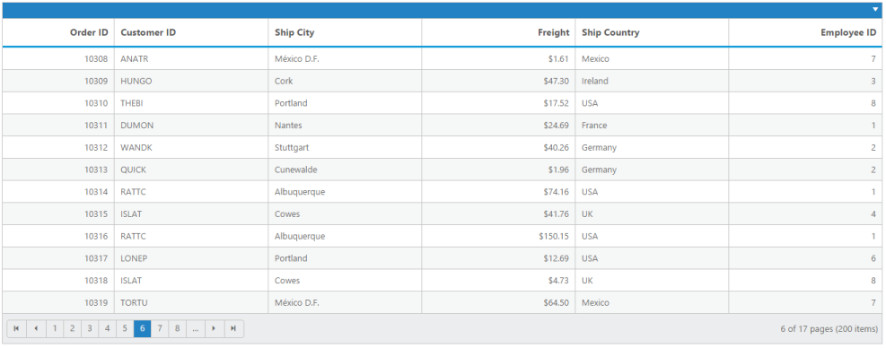

# Enable Persistence

EnablePersistence is used to maintain the current state of the Grid model. When you refresh the page, the current grid state is stored in localStorage and it renders from stored model. 


[MVC]

[razor] 

    @(Html.EJ().Grid<OrdersView>("StateMaintenance")

        .Datasource((IEnumerable<object>)ViewBag.datasource1)

        .AllowSorting()

        .AllowGrouping()

        .EnableAltRow(true)

        .AllowPaging()

.EnablePersistence(true)

        .Columns(col =>

        {

            col.Field("OrderID").HeaderText("Order ID").IsPrimaryKey(true).TextAlign(TextAlign.Right).Width(65).Add();

            col.Field("CustomerID").HeaderText("Customer ID").Width(90).Add();

            col.Field("ShipCity").HeaderText("Ship City").Width(90).Add();

            col.Field("Freight").HeaderText("Freight").TextAlign(TextAlign.Right).Width(90).Format("{0:C}").Add();

            col.Field("ShipCountry").HeaderText("Ship Country").Width(90).Add();

            col.Field("EmployeeID").HeaderText("Employee ID").TextAlign(TextAlign.Right).Width(90).Add();

        })

        )


[controller]

namespace MVCSampleBrowser.Controllers

{

    public partial class GridController : Controller

    {

        //

        // GET: /StateMaintenance/

        public ActionResult StateMaintenance()

        {

            var DataSource = new NorthwindDataContext().OrdersViews.ToList();

            ViewBag.dataSource1 = DataSource;

            return View();

        }

    }

}



The following output is displayed as a result of the above code example.

