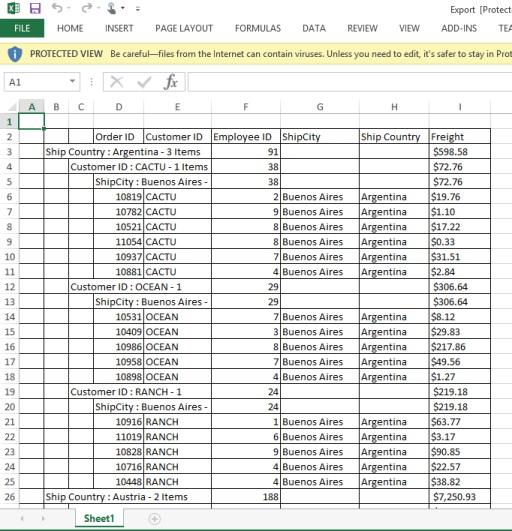
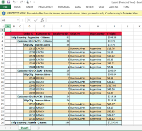

# Exporting

`Exporting` feature provides support to export Grid data into excel, word and PDF files. To export the grid, `export` JavaScript method should be called with export action as parameter. To make it work from grid tool bar, `ExcelExport`, `WordExport`, `PdfExport` toolbar items needs to be added in grid tool bar using `ToolbarItems` property of `ToolbarSettings` which are used to perform exporting. When you click the toolbar exporting icon, it internally invokes the `export` public method of Grid object to export.The code snippet for this is


 


    @(Html.EJ().Grid<OrdersView>("FlatGrid")

    .DataSource((IEnumerable<object>)ViewBag.datasource)

    .ToolbarSettings(toolBar => toolBar.ShowToolbar().ToolbarItems(items =>

    {

	   items.AddTool(ToolBarItems.ExcelExport);

       items.AddTool(ToolBarItems.WordExport);

	   items.AddTool(ToolBarItems.PdfExport);

    }))

    .AllowPaging()

    .Columns(col =>

    {

	   col.Field("OrderID").HeaderText("Order ID").TextAlign(TextAlign.Right).Add();

	   col.Field("CustomerID").HeaderText("Customer ID").Add();

	   col.Field("EmployeeID").HeaderText("Employee ID").TextAlign(TextAlign.Right). Add();          

	   col.Field("Freight").HeaderText("Freight").TextAlign(TextAlign.Right).Add();

	   col.Field("OrderDate").HeaderText("Order Date").TextAlign(TextAlign.Right). Add();

	   col.Field("ShipCity").HeaderText("Ship City").Add();

    })) 




    public partial class GridController : Controller

    {

	public ActionResult ExportingGrid()

    {

            var DataSource = new NorthwindDataContext().OrdersViews.ToList();

            ViewBag.datasource = DataSource;

            return View();

    }

    public void ExportToExcel(string GridModel)

    {

		ExcelExport exp = new ExcelExport();

		var DataSource = new NorthwindDataContext().OrdersViews.ToList();

		GridProperties obj =(GridProperties)DeserializeToModel(typeof(GridProperties), GridModel);

		exp.Export(obj, DataSource, "Export.xlsx", ExcelVersion.Excel2010, false, false, "flat-saffron");

	}

	public void ExportToWord(string GridModel)

	{

		WordExport exp = new WordExport();

		var DataSource = new NorthwindDataContext().OrdersViews.ToList();

		GridProperties obj =(GridProperties)DeserializeToModel(typeof(GridProperties), GridModel);

		exp.Export(obj, DataSource, "Export.docx", false, false, "flat-saffron");

	}

	public void ExportToPdf(string GridModel)

	{

		PdfExport exp = new PdfExport();

		var DataSource = new NorthwindDataContext().OrdersViews.ToList();

		GridProperties obj =(GridProperties)DeserializeToModel(typeof(GridProperties), GridModel);

		exp.Export(obj, DataSource, "Export.pdf", false, false, "flat-saffron");

	}

    }


 

## Server Dependencies

Export Helper functions are available in the Assembly `Syncfusion.EJ.Export`, which is available in the Essential Studio builds. Full list of assemblies needed for grid Export as follows

    1.  Syncfusion.EJ
    2.  Syncfusion.EJ.Export
    3.  Syncfusion.Linq.Base
    4.  Syncfusion.Compression.Base
    5.  Syncfusion.DocIO.Base
    6.  Syncfusion.XlsIO.Base
    7.  Syncfusion.PDF.Base

## Support Export Types

Currently server helper function allows following three types of exporting.

    1.  Word
    2.  Excel
    3.  PDF

##  Server side handlers

In MVC, exporting is achieved by using action controller method. In controller method, Grid property is passed as string parameter, you need to deserialize it into the Grid Property. By using the `Export` server method, you can export the Grid into excel, PDF and word documents.


 


    @(Html.EJ().Grid<OrdersView>("FlatGrid")

    .DataSource((IEnumerable<object>)ViewBag.datasource)

    .ToolbarSettings(toolBar => toolBar.ShowToolbar().ToolbarItems(items =>

    {

        items.AddTool(ToolBarItems.ExcelExport);

        items.AddTool(ToolBarItems.WordExport);

        items.AddTool(ToolBarItems.PdfExport);

    }))

    .AllowPaging()

    .Columns(col =>

    {

	   col.Field("OrderID").HeaderText("Order ID").TextAlign(TextAlign.Right).Add();

	   col.Field("CustomerID").HeaderText("Customer ID").Add();

	   col.Field("EmployeeID").HeaderText("Employee ID").TextAlign(TextAlign.Right). Add();          

	   col.Field("Freight").HeaderText("Freight").TextAlign(TextAlign.Right).Add();

	   col.Field("OrderDate").HeaderText("Order Date").TextAlign(TextAlign.Right). Add();

	   col.Field("ShipCity").HeaderText("Ship City").Add();

    })) 




    public partial class GridController : Controller

    {

	public ActionResult ExportingGrid()

    {

        var DataSource = new NorthwindDataContext().OrdersViews.ToList();

        ViewBag.datasource = DataSource;

        return View();

    }

    public void ExportToExcel(string GridModel)

    {

		ExcelExport exp = new ExcelExport();

		var DataSource = new NorthwindDataContext().OrdersViews.ToList();

		GridProperties obj =(GridProperties)DeserializeToModel(typeof(GridProperties), GridModel);

		exp.Export(obj, DataSource, "Export.xlsx", ExcelVersion.Excel2010, false, false, "flat-saffron");

	}

	public void ExportToWord(string GridModel)

	{

		WordExport exp = new WordExport();

		var DataSource = new NorthwindDataContext().OrdersViews.ToList();

		GridProperties obj =(GridProperties)DeserializeToModel(typeof(GridProperties), GridModel);

		exp.Export(obj, DataSource, "Export.docx", false, false, "flat-saffron");

	}

	public void ExportToPdf(string GridModel)

	{

		PdfExport exp = new PdfExport();

		var DataSource = new NorthwindDataContext().OrdersViews.ToList();

		GridProperties obj =(GridProperties)DeserializeToModel(typeof(GridProperties), GridModel);

		exp.Export(obj, DataSource, "Export.pdf", false, false, "flat-saffron");

	}

    }



 

On Exporting, the default routing path to server-side that contains the action name as ExportToExcel for Excel Exporting, ExportToWord for Word Exporting and ExportToPdf for PDF Exporting. The default controller name in routing path is the Grid view page’s Controller name. For instance, when Grid is rendered in GridFeatures View Page of Home Controller, then on Excel exporting Grid Content, the default routing path is ~/Home/ExportToExcel.

## Export Mapper in MVC

`Mappers` Grid property is used to modify the default routing path during exporting. By using Mappers, you can use any action name in Controller for exporting and the action can be in any controller (Need not to be in Grid View Page Controller).


 


    @(Html.EJ().Grid<OrdersView>("FlatGrid")

    .DataSource((IEnumerable<object>)ViewBag.datasource)

    .ToolbarSettings(toolBar => toolBar.ShowToolbar().ToolbarItems(items =>

    {

	   items.AddTool(ToolBarItems.ExcelExport);

	   items.AddTool(ToolBarItems.WordExport);

	   items.AddTool(ToolBarItems.PdfExport);

    }))

    .Mappers(map => map.ExportToExcelAction("ExcelAction")

    .ExportToPdfAction("PdfAction").ExportToWordAction("WordAction")

    )

    .AllowPaging()

    .Columns(col =>

    {

	   col.Field("OrderID").HeaderText("Order ID").TextAlign(TextAlign.Right).Add();

	   col.Field("CustomerID").HeaderText("Customer ID").Add();

	   col.Field("EmployeeID").HeaderText("Employee ID").TextAlign(TextAlign.Right). Add();          

	   col.Field("Freight").HeaderText("Freight").TextAlign(TextAlign.Right).Add();

	   col.Field("OrderDate").HeaderText("Order Date").TextAlign(TextAlign.Right). Add();

	   col.Field("ShipCity").HeaderText("Ship City").Add();

    })) 





    public partial class GridController : Controller

    {

	public ActionResult ExportingGrid()

	{

		var DataSource = new NorthwindDataContext().OrdersViews.ToList();

		ViewBag.datasource = DataSource;

		return View();

	}

	public void ExcelAction(string GridModel)

	{

		ExcelExport exp = new ExcelExport();

		var DataSource = new NorthwindDataContext().OrdersViews.ToList();

		GridProperties obj =(GridProperties)DeserializeToModel(typeof(GridProperties), GridModel);

		exp.Export(obj, DataSource, "Export.xlsx", ExcelVersion.Excel2010, false, false, "flat-saffron");

	}

	public void WordAction(string GridModel)

	{

		WordExport exp = new WordExport();

		var DataSource = new NorthwindDataContext().OrdersViews.ToList();

		GridProperties obj =(GridProperties)DeserializeToModel(typeof(GridProperties), GridModel);
        
		exp.Export(obj, DataSource, "Export.docx", false, false, "flat-saffron");

	}

	public void PdfAction(string GridModel)

	{

		PdfExport exp = new PdfExport();

		var DataSource = new NorthwindDataContext().OrdersViews.ToList();

		GridProperties obj =(GridProperties)DeserializeToModel(typeof(GridProperties), GridModel);

		exp.Export(obj, DataSource, "Export.pdf", false, false, "flat-saffron");

	}

    }


 

##  Multiple Exporting

`AllowMultipleExporting` property allows you to export multiple grids into same file. Once you enable `AllowMultipleExporting`, grid properties of all the grid which are available in current page are passed as string array parameter to controller action method.
In controller action method you are able to export all the grids available in current page. The code snippet for this is


 


    @(Html.EJ().Grid<EmployeeView>("Grid")
    .DataSource((System.Data.DataTable)ViewBag.datasource1)
    .AllowMultipleExporting()
    .AllowPaging()
    .ToolbarSettings(toolBar => toolBar.ShowToolbar().ToolbarItems(items =>
    {
        items.AddTool(ToolBarItems.ExcelExport);
        items.AddTool(ToolBarItems.WordExport);
        items.AddTool(ToolBarItems.PdfExport);
    }))
    .Mappers(map => map.ExportToExcelAction("ExportToExcel").ExportToPdfAction("/Home/ExportToExcel").ExportToWordAction("MultipleExportToWord"))
    .Columns(col =>
    {
        col.Field("EmployeeID").HeaderText("Employee ID").IsPrimaryKey(true).TextAlign(TextAlign.Right).Width(125).Add();
        col.Field("FirstName").HeaderText("First Name").Width(100).Add();
        col.Field("LastName").HeaderText("Last Name").Width(100).Add();
        col.Field("Title").HeaderText("Title").Width(150).Add();

    })
    )



 

// Excel export

    public void MultipleExportToExcel(string[] GridModel)

    {
        ExcelExport exp = new ExcelExport();
        var EmployeeData = new NorthwindDataContext().EmployeeViews.Take(5).ToList();
        var OrderData = new NorthwindDataContext().OrdersViews.Take(5).ToList();
        bool initial = true;
        IWorkbook book = null;
        foreach(string gridProperty in GridModel)
        {
            GridProperties gridProp = (GridProperties)DeserializeToModel(typeof(GridProperties), gridProperty);
            if (initial)
            {
                book = exp.Export(gridProp, EmployeeData, "Export.xlsx", ExcelVersion.Excel2010, true, true, "flat-saffron", true);
                initial = false;
            } 
            else
            {
                exp.Export(gridProp, OrderData, "Export.xlsx", ExcelVersion.Excel2010, true, true, "flat-saffron", false, book, MultipleExportType.AppendToSheet, "Second Grid");
            }
        }

    }

// Word export

    public void MultipleExportToWord(string[] GridModel)

    {
        WordExport exp = new WordExport();
        var EmployeeData = new NorthwindDataContext().EmployeeViews.Take(5).ToList();
        var OrderData = new NorthwindDataContext().OrdersViews.Take(5).ToList();
        IWordDocument document = null;
        bool initial = true;;
        foreach(string gridProperty in GridModel)
        {
            GridProperties gridProp = (GridProperties)DeserializeToModel(typeof(GridProperties), gridProperty);
            if (initial)
            {
                document = exp.Export(gridProp, EmployeeData, "Export.docx", true, true, "flat-saffron", true);
                initial = false;
            } else
            {
                exp.Export(gridProp, OrderData, "Export.docx", true, true, "flat-saffron", false, document, "Second Grid");
            }
        }

    }

// PDF export

    public void MultipleExportToPdf(string[] GridModel)
    {
        PdfExport exp = new PdfExport();
        var EmployeeData = new NorthwindDataContext().EmployeeViews.Take(5).ToList();
        var OrderData = new NorthwindDataContext().OrdersViews.Take(5).ToList();
        PdfDocument document = null;
        bool initial = true;
        foreach(string gridProperty in GridModel)
        {
            GridProperties gridProp = (GridProperties)DeserializeToModel(typeof(GridProperties), gridProperty);
            if (initial)
            {
                document = exp.Export(gridProp, EmployeeData, "Export.pdf", true, true, "flat-saffron", true);
                initial = false;
            } else

            {
                exp.Export(gridProp, OrderData, "Export.pdf", true, true, "flat-saffron", false, document, "Second Grid");
            }
        }
    }


 
  
## Export required grid in single file

You can export required grids in single file using `ej.Grid.exportAll` method. This method can be used with export action and array of jQuery selector of grid which need to be export. The code snippet for it is



    $('#exportAll').click(function(){
			ej.Grid.exportAll('MultipleExportToExcel',['Grid1', 'Grid2']);
		});



## List of properties ignored on export

Following are the list of properties that are exclude during grid export, to reduce the unwanted data transfer to server.  

* dataSource
* query
* rowTemplate
* detailsTemplate
* pageSettings
* enableRTL
* cssClass

##Export only visible records

By default `pageSettings` is ignored in export to facilitate all pages export. To achieve current visible page record export, `pageSettings` should be removed from ignore list using following code.

The snippet for this is.



	var grid = $('#Grid').ejGrid('instance');
	grid.ignoreOnExport.splice(grid.ignoreOnExport.indexOf('pageSettings'), 1);



On server before calling the `Export` function, the data source should be processed using DataOperations's Execute function. 



    public void ExportToExcel(string GridModel)
    {
        ExcelExport exp = new ExcelExport();
        var DataSource = new NorthwindDataContext().OrdersViews.ToList();
        GridProperties properties =(GridProperties)DeserializeToModel(typeof(GridProperties), GridModel);
        var dataSource = new DataOperations().Execute(GridModel, DataSource);
        exp.Export(properties, dataSource, "Export.xlsx", ExcelVersion.Excel2010, false, false, "flat-saffron");
    }

    public void ExportToWord(string GridModel)
    {
        WordExport exp = new WordExport();
        var DataSource = new NorthwindDataContext().OrdersViews.ToList();
        GridProperties properties =(GridProperties)DeserializeToModel(typeof(GridProperties), GridModel);
        var dataSource = new DataOperations().Execute(GridModel, DataSource);
        exp.Export(properties, dataSource, "Export.docx", false, false, "flat-saffron");
    }
    public void ExportToPdf(string GridModel)
    {
        PdfExport exp = new PdfExport();
        var DataSource = new NorthwindDataContext().OrdersViews.ToList();
        GridProperties properties = (GridProperties)DeserializeToModel(typeof(GridProperties), GridModel);
        var dataSource = new DataOperations().Execute(GridModel, DataSource);
        exp.Export(properties, dataSource, "Export.pdf", false, false, "flat-saffron");
    }



## Local data 

By default, client data source is not sent to server to prevent unwanted data transfer since all data origin is server. In case, if you don't want to query the data source again for exporting in server, the grid's client [`dataSource`](http://help.syncfusion.com/js/api/ejgrid#members:datasource) can be sent to server on export PostBack by removing the [`dataSource`](http://help.syncfusion.com/js/api/ejgrid#members:datasource) property in grid's ignore list. The code snippet for this as follows



var grid = $('#GridId').ejGrid('instance');
grid.ignoreOnExport.splice(grid.ignoreOnExport.indexOf('dataSource'), 1);



## Themes

The grid export have 13 theme option to match with our [built-in control themes](http://helpjs.syncfusion.com/js/theming-in-essential-javascript-components#). They are

<table>
<tr><th>Enum</th><th>Equivalent string input</th></tr>

<tr><td>ExportTheme.FlatAzure</td><td>default-theme</td></tr>

<tr><td>ExportTheme.FlatSaffron</td><td>flat-saffron</td></tr>

<tr><td>ExportTheme.FlatLime</td><td>flat-lime</td></tr>

<tr><td>ExportTheme.FlatDarkAzure</td><td>flat-azure-dark</td></tr>

<tr><td>ExportTheme.FlatDarkSaffron</td><td>flat-saffron-dark</td></tr>

<tr><td>ExportTheme.FlatDarkLime</td><td>flat-lime-dark</td></tr>

<tr><td>ExportTheme.GradientAzure</td><td>gradient-azure</td></tr>

<tr><td>ExportTheme.GradientSaffron</td><td>gradient-saffron</td></tr>

<tr><td>ExportTheme.GradientLime</td><td>gradient-lime</td></tr>

<tr><td>ExportTheme.GradientDarkAzure</td><td>gradient-azure-dark</td></tr>

<tr><td>ExportTheme.GradientDarkSaffron</td><td>gradient-saffron-dark</td></tr>

<tr><td>ExportTheme.GradientDarkLime</td><td>gradient-lime-dark</td></tr>

<tr><td>ExportTheme.BootstrapTheme</td><td>bootstrap-theme</td></tr>

<tr><td>ExportTheme.None</td><td>none</td></tr>
</table>

Also, it has `none` option which will export the grid without any theme.  The desired theme name can be passed as a parameter to `Export` method and the code snippet for this as follows





    public partial class GridController : Controller

    {
	public void ExportToExcel(string GridModel)

	{

		ExcelExport exp = new ExcelExport();

		var DataSource = new NorthwindDataContext().OrdersViews.ToList();

		GridProperties obj =(GridProperties) DeserializeToModel(typeof(GridProperties),GridModel);

		exp.Export(obj, DataSource, "Export.xlsx", ExcelVersion.Excel2010, false, false, "none");

	}

	public void ExportToWord(string GridModel)

	{

		WordExport exp = new WordExport();

		var DataSource = new NorthwindDataContext().OrdersViews.ToList();

		GridProperties obj =(GridProperties) DeserializeToModel(typeof(GridProperties),GridModel);

		exp.Export(obj, DataSource, "Export.docx", false, false, ExportTheme.FlatSaffron);

	}

	public void ExportToPdf(string GridModel)

	{

		PdfExport exp = new PdfExport();

		var DataSource = new NorthwindDataContext().OrdersViews.ToList();

		GridProperties obj =(GridProperties) DeserializeToModel(typeof(GridProperties),GridModel);

		exp.Export(obj, DataSource, "Export.pdf", false, false, "flat-saffron");

	}
	
	public ActionResult ExportingGrid()

	{

		var DataSource = new NorthwindDataContext().OrdersViews.ToList();

		ViewBag.datasource = DataSource;

		return View();

	}
	
    }





    @(Html.EJ().Grid<OrdersView>("FlatGrid")

	.DataSource((IEnumerable<object>)ViewBag.datasource)

	.ToolbarSettings(toolBar => toolBar.ShowToolbar().ToolbarItems(items =>

	{

	   items.AddTool(ToolBarItems.ExcelExport);

	   items.AddTool(ToolBarItems.WordExport);

	   items.AddTool(ToolBarItems.PdfExport);

	}))

	.AllowPaging()

	.Columns(col =>

	{

		col.Field("OrderID").HeaderText("Order ID").TextAlign(TextAlign.Right).Add();

		col.Field("CustomerID").HeaderText("Customer ID").Add();

		col.Field("EmployeeID").HeaderText("Employee ID").TextAlign(TextAlign.Right). Add();          

		col.Field("Freight").HeaderText("Freight").TextAlign(TextAlign.Right).Add();

		col.Field("OrderDate").HeaderText("Order Date").TextAlign(TextAlign.Right). Add();

		col.Field("ShipCity").HeaderText("Ship City").Add();

	})) 


  
When the theme is set as none and the autoFormat is not set to the grid, then no theme is applied to the exported grid. The grid is exported without any theme as in the following screenshots:

## AutoFormat Class

The **AutoFormat** Class can be used to customize the styles or themes applied to the exported grid. With the autoFormat class, you can provide required color to the grid content, alt row background or border color.

The customized theme is applied to the grid, only when the selected theme is either “none” or ExportTheme.None.

The various properties available under the autoFormat class are listed in the following table.

<table>
<tr>
<th>
Properties</th><th>
Type</th><th>
Description</th></tr>
<tr>
<td>
FontFamily</td><td>
String</td><td>
The font name</td></tr>
<tr>
<td>
HeaderBorderColor</td><td>
System.Drawing.Color</td><td>
The border color of the grid header</td></tr>
<tr>
<td>
HeaderFontSize</td><td>
int</td><td>
The size of the grid header font</td></tr>
<tr>
<td>
GHeaderBgColor</td><td>
System.Drawing.Color</td><td>
The Column Header cell color and the Group Header Indent cell color</td></tr>
<tr>
<td>
ContentBgColor</td><td>
System.Drawing.Color</td><td>
The background color of the content</td></tr>
<tr>
<td>
ContentBorderColor</td><td>
System.Drawing.Color</td><td>
The border color of the grid content</td></tr>
<tr>
<td>
ContentFontSize</td><td>
int</td><td>
The font size of the grid content</td></tr>
<tr>
<td>
GContentFontColor</td><td>
System.Drawing.Color</td><td>
The font color of the record field cell</td></tr>
<tr>
<td>
GCaptionBorderColor</td><td>
System.Drawing.Color</td><td>
The border color of the group caption cell</td></tr>
<tr>
<td>
AltRowBgColor</td><td>
System.Drawing.Color</td><td>
The background color of the alternative row of the grid content</td></tr>
</table>


 


    @(Html.EJ().Grid<OrdersView>("FlatGrid")

    .DataSource((IEnumerable<object>)ViewBag.datasource)

	.ToolbarSettings(toolBar => toolBar.ShowToolbar().ToolbarItems(items =>

	{

		items.AddTool(ToolBarItems.ExcelExport);

		items.AddTool(ToolBarItems.WordExport);

		items.AddTool(ToolBarItems.PdfExport);

	}))

    .AllowPaging()

    .Columns(col =>

    {

        col.Field("OrderID").HeaderText("Order ID").TextAlign(TextAlign.Right).Add();

        col.Field("CustomerID").HeaderText("Customer ID").Add();

        col.Field("EmployeeID").HeaderText("Employee ID").TextAlign(TextAlign.Right). Add();          

        col.Field("Freight").HeaderText("Freight").TextAlign(TextAlign.Right).Add();

        col.Field("OrderDate").HeaderText("Order Date").TextAlign(TextAlign.Right). Add();

        col.Field("ShipCity").HeaderText("Ship City").Add();

    })) 




    public partial class GridController : Controller

    {

	public void ExportToExcel(string GridModel)

	{

		ExcelExport exp = new ExcelExport();

		var DataSource = new NorthwindDataContext().OrdersViews.ToList();

		GridProperties obj = ConvertGridObject(GridModel);

		exp.Export(obj, DataSource, "Export.xlsx", ExcelVersion.Excel2010, false, false, "none");

	}

	public void ExportToWord(string GridModel)

	{

		WordExport exp = new WordExport();

		var DataSource = new NorthwindDataContext().OrdersViews.ToList();

		GridProperties obj = ConvertGridObject(GridModel);

		exp.Export(obj, DataSource, "Export.docx", false, false, ExportTheme.None);

	}

	public void ExportToPdf(string GridModel)

	{

		PdfExport exp = new PdfExport();

		var DataSource = new NorthwindDataContext().OrdersViews.ToList();

		GridProperties obj = ConvertGridObject(GridModel);

		exp.Export(obj, DataSource, "Export.pdf", false, false, "none");

	}

	private GridProperties ConvertGridObject(string gridProperty)

	{

		GridProperties gridProp = DeserializeToModel(typeof(GridProperties),gridProperty);

		AutoFormat auto = new AutoFormat();

		auto.FontFamily = "Arial";

		auto.ContentBorderColor = Color.Brown;

		auto.ContentFontSize = 10;

		auto.GCaptionBorderColor = Color.Cornsilk;

		auto.GContentFontColor = Color.DarkBlue;

		auto.HeaderFontSize = 12;

		auto.HeaderBorderColor = Color.Red;

		auto.ContentBgColor = Color.Wheat;

		auto.GHeaderBgColor = Color.Crimson;

		auto.AltRowBgColor = Color.LightCyan;

		gridProp.AutoFormat = auto;

		return gridProp;

	}
	
	public ActionResult ExportingGrid()

	{

		var DataSource = new NorthwindDataContext().OrdersViews.ToList();

		ViewBag.datasource = DataSource;

		return View();

	}
	
    }



 

## Exporting server events

`Exporting` feature supports server side event handler. You can handle server side event while exporting grid to various files such as Excel, PDF and Word. The various server side events available in Exporting and its argument types are listed in the following table.

<table>
<tr>
<th>
Event Name
</th>
<th>
Argument 
</th>
<th>
Description
</th>
</tr>
<tr>
<td>
ServerExcelQueryCellInfo
</td>
<td>
currentCell
</td>
<td>
It returns the current cell of excel sheet.
</td>
</tr>
<tr>
<td>
ServerExcelRowInfo
</td>
<td>
range
</td>
<td>
It returns the current row of excel sheet.
</td>
</tr>
<tr>
<td>
ServerWordQueryCellInfo
</td>
<td>
currentCell
</td>
<td>
It returns the current cell of word.
</td>
</tr>
<tr>
<td>
ServerWordRowInfo
</td>
<td>
range
</td>
<td>
It returns the current row of word.
</td>
</tr>
<tr>
<td>
ServerPdfQueryCellInfo
</td>
<td>
currentCell
</td>
<td>
It returns the current cell of PDF.
</td>
</tr>
<tr>
<td>
ServerPdfRowInfo
</td>
<td>
range
</td>
<td>
It returns the current row of PDF.
</td>
</tr>
</table>

You can customize the particular cell or particular  row of exporting files using server events. The code snippet for this is


 


    @(Html.EJ().Grid<OrdersView>("FlatGrid")

    .DataSource((IEnumerable<object>)ViewBag.datasource)

	.ToolbarSettings(toolBar => toolBar.ShowToolbar().ToolbarItems(items =>

	{

			items.AddTool(ToolBarItems.ExcelExport);

			items.AddTool(ToolBarItems.WordExport);

			items.AddTool(ToolBarItems.PdfExport);

	}))

    .AllowPaging()

    .Columns(col =>

    {

        col.Field("OrderID").HeaderText("Order ID").TextAlign(TextAlign.Right).Add();

        col.Field("CustomerID").HeaderText("Customer ID").Add();

        col.Field("EmployeeID").HeaderText("Employee ID").TextAlign(TextAlign.Right). Add();          

        col.Field("Freight").HeaderText("Freight").TextAlign(TextAlign.Right).Add();

        col.Field("OrderDate").HeaderText("Order Date").TextAlign(TextAlign.Right). Add();

        col.Field("ShipCity").HeaderText("Ship City").Add();

    })) 




    public partial class GridController : Controller

    {

	public void ExportToExcel(string GridModel)
    {
            ExcelExport exp = new ExcelExport();
            var DataSource = new NorthwindDataContext().EmployeeViews.Take(100).ToList(); 
            GridProperties obj =(GridProperties)DeserializeToModel(typeof(GridProperties), GridModel);
            obj.ServerExcelQueryCellInfo = QueryCellInfo;
            exp.Export(obj, DataSource, "Export.xlsx", ExcelVersion.Excel2010, false, false, "flat-saffron");
    }
    public void QueryCellInfo(object currentCell)
    {
            IRange range = (IRange)currentCell;
            if (range.Column==1 && int.Parse(range.Value) == 5)
                range.CellStyle.Color = Color.Red;
    } 
	public ActionResult ExportingGrid()
	{

		var DataSource = new NorthwindDataContext().OrdersViews.ToList();

		ViewBag.datasource = DataSource;

		return View();

	}

    }





