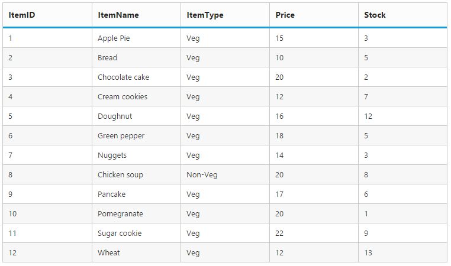

# Getting Started

This section explains briefly about how to create a Grid in your application with ASP.NET MVC, and also explains about how to enable basic grid operations like Paging, Filtering, Grouping and Summary. The following screenshot illustrates the Grid control.

## Create your first Grid in MVC

The following steps explain creating first grid with an empty datasource.

1.  Create Syncfusion ASP.NET MVC application. You can refer [MVC Getting Started documentation](http://help.syncfusion.com/aspnetmvc/getting-started) to create new project and add necessary dll’s and script files.
2.  Add a Grid control in View file with an empty datasource as like as follows. In `Columns` definition, the `TextAlign` property allows you to align text of the columns, the `Width` property is used to define width of the columns and `Format` property allows you to format the particular columns value.


	
    @(Html.EJ().Grid<object>("FlatGrid")

	.Columns(col =>

	{

        col.Field("OrderID").HeaderText("Order ID").TextAlign(TextAlign.Right).Width(75).Add();

		col.Field("CustomerID").HeaderText("Customer ID").Width(80).Add();

		col.Field("ShipName").HeaderText("Ship Name").Width(100).Add();

		col.Field("ShipCity").HeaderText("Ship City").Width(100).Add();

		col.Field("Freight").Format("{0:c3}").HeaderText("Freight").Width(80).TextAlign(TextAlign.Right).Add();
	})
    )
		 

   
You can execute the above code sample to render an empty Grid is rendered with specified column headers.

## Data binding

1.	You can bind the data to Grid control by either locally or remotely. The following code example shows how to bind remote data to grid control.
2.	Assign the remote service URL to `DataSource` property of Grid control to bind remote data with grid.
3.	You can retrieve the data from another domain using `CrossDomain` property, and also you can load all the data to grid on initial rendering using `Offline` property.



    @(Html.EJ().Grid<object>("FlatGrid")

    .Datasource(d=>d.URL("http://mvc.syncfusion.com/UGService/api/Orders").CrossDomain(true).Offline(true)).Columns(col =>

    {

	   col.Field("OrderID").HeaderText("Order ID").TextAlign(TextAlign.Right).Width(75).Add();

	   col.Field("CustomerID").HeaderText("Customer ID").Width(80).Add();

	   col.Field("ShipName").HeaderText("Ship Name").Width(100).Add();

	   col.Field("ShipCity").HeaderText("Ship City").Width(100).Add();

	   col.Field("Freight").Format("{0:c3}").HeaderText("Freight").Width(80).TextAlign(TextAlign.Right).Add();

    })

    )



## Enable Paging

[`Paging`](http://help.syncfusion.com/aspnetmvc/grid/paging) feature can be enabled by `AllowPaging` property of Grid control. This adds the pager in the bottom of the grid, using that pager you can display the grid records in paged view. The page size can be customized using `PageSize' property
`PageSettings` property.



    @(Html.EJ().Grid<object>("FlatGrid")

    .Datasource(d=>d.URL("http://mvc.syncfusion.com/UGService/api/Orders").CrossDomain(true).Offline(true)).AllowPaging()

    .Columns(col =>

    {

        col.Field("OrderID").HeaderText("Order ID").TextAlign(TextAlign.Right).Width(75).Add();

        col.Field("CustomerID").HeaderText("Customer ID").Width(80).Add();

        col.Field("ShipName").HeaderText("Ship Name").Width(100).Add();

         col.Field("ShipCity").HeaderText("Ship City").Width(100).Add();      col.Field("Freight").Format("{0:c3}").HeaderText("Freight").Width(80).TextAlign(TextAlign.Right).Add();
    })
    )



    N> _Pager settings can be customized by using the 'PageSize' and 'PageCount' properties. When it is not given the default values for `PageSize` and `PageCount` are 12 and 8 respectively._

## Enable Filtering

[`Filtering`](http://help.syncfusion.com/aspnetmvc/grid/filtering) feature in Grid is used to facilitate the extraction of a subset of records that meets certain criteria. You can apply Filter to one or more columns. Filtering feature can be enabled by AllowFiltering property. By default, the filter bar row is displayed to perform filtering, you can change the filter type by using `FilterType` property of FilterSettings.



    @(Html.EJ().Grid<object>("FlatGrid").Datasource(d=>d.URL("http://mvc.syncfusion.com/UGService/api/Orders").CrossDomain(true).Offline(true))   

    .AllowPaging()

    .AllowFiltering()

    .FilterSettings(d => d.FilterType(FilterType.FilterBar))

    .Columns(col =>

    {	

        col.Field("OrderID").HeaderText("Order ID").TextAlign(TextAlign.Right).Width(75).Add();

        col.Field("CustomerID").HeaderText("Customer ID").Width(80).Add();

        col.Field("ShipName").HeaderText("Ship Name").Width(100).Add();

        col.Field("ShipCity").HeaderText("Ship City").Width(100).Add();      

        col.Field("Freight").Format("{0:c3}").HeaderText("Freight").Width(80).TextAlign(TextAlign.Right).Add();

    })

    )



## Enable Grouping

['Grouping'](http://help.syncfusion.com/aspnetmvc/grid/grouping) feature in Grid is used to consolidate Grid data into groups. Grouping allows the categorization of records based on specified columns. You can enable grouping feature by `AllowGrouping` property. Columns can be grouped dynamically by drag and drop the grid column header to the group drop area. The initial grouping can be done by adding required column names in `GroupedColumns` property of `GroupSettings` property.



    @(Html.EJ().Grid<object>("FlatGrid")

    .Datasource(d=>d.URL("http://mvc.syncfusion.com/UGService/api/Orders").CrossDomain(true).Offline(true))    .AllowPaging()

    .AllowGrouping()

    .GroupSettings(group => group.GroupedColumns(col=>col.Add("ShipName") ))

    .AllowFiltering()

    .FilterSettings(d => d.FilterType(FilterType.FilterBar))

    .Columns(col =>

    {

        col.Field("OrderID").HeaderText("Order ID").TextAlign(TextAlign.Right).Width(75).Add();

        col.Field("CustomerID").HeaderText("Customer ID").Width(80).Add();

        col.Field("ShipName").HeaderText("Ship Name").Width(100).Add();

        col.Field("ShipCity").HeaderText("Ship City").Width(100).Add();    col.Field("Freight").Format("{0:c3}").HeaderText("Freight").Width(80).TextAlign(TextAlign.Right).Add();

    })

    )



## Add Summaries

[`Summaries`](http://help.syncfusion.com/aspnetmvc/grid/summary) can be enabled by setting the `ShowSummary` to true and adding required summary rows and columns in the `SummaryRows` property. 

The following code example shows the option to enable group summary.



    @(Html.EJ().Grid<object>("FlatGrid")

    .Datasource(d=>d.URL("http://mvc.syncfusion.com/UGService/api/Orders").CrossDomain(true).Offline(true))   

    .AllowPaging()

    .AllowGrouping()

    .ShowSummary()

    .GroupSettings(group => group.GroupedColumns(col=>col.Add("ShipName") ))

    .AllowFiltering()

    .FilterSettings(d => d.FilterType(FilterType.FilterBar))

    .SummaryRow(row =>

    {

        row.ShowTotalSummary(false)

           .SummaryColumns(col =>

           {

                col.SummaryType(SummaryType.Sum)

                .DisplayColumn("Freight")

                .DataMember("Freight")

                .Prefix("Sum = ")

                .Format("{0:c3}")

                .Add();

           }).Add();

    })

    .Columns(col =>

    {

         col.Field("OrderID").HeaderText("Order ID").TextAlign(TextAlign.Right).Width(75).Add();

         col.Field("CustomerID").HeaderText("Customer ID").Width(80).Add();

         col.Field("ShipName").HeaderText("Ship Name").Width(100).Add();

         col.Field("ShipCity").HeaderText("Ship City").Width(100).Add();
                        
         col.Field("Freight").Format("{0:c3}").HeaderText("Freight").Width(80).TextAlign(TextAlign.Right).Add();

    })

    )



