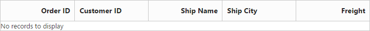
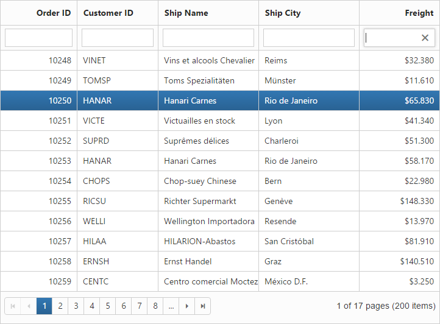

# Getting Started

This section explains briefly about how to create a Grid in your application with ASP.NET MVC.

## Create your first Grid in MVC

The Grid can be easily configured to the DOM element, such as 
. You can create a Grid with a highly customizable look and feel. You can use the Grid control to generate complex grid-based reports with rich formatting. In the following example, you can take a look at how the transaction of product is managed, analysis of a particular sale using filtering and grouping feature. This section explains you about adding group, filtering and paging of sales products.

Managed sales data
{:.caption}

1. Create Syncfusion ASP.NET MVC Application. Refer [common](http://docs.syncfusion.com/aspnetmvc/grid/getting-started) document
2. Add a Grid Control in index.cshtml page.In Columns definition, the TextAlign property allows you to align text of the columns, the Width property is used to define width of the columns and Format property allows you to format the particular columns value.

   ~~~ cshtml

	@(Html.EJ().Grid<object>("FlatGrid")

			.Columns(col =>

			{

				col.Field("OrderID").HeaderText("Order ID").TextAlign(TextAlign.Right).Width(75).Add();

				col.Field("CustomerID").HeaderText("Customer ID").Width(80).Add();

				col.Field("ShipName").HeaderText("Ship Name").Width(100).Add();

				col.Field("ShipCity").HeaderText("Ship City").Width(100).Add();

				col.Field("Freight").Format("{0:c3}").HeaderText("Freight").Width(80).TextAlign(TextAlign.Right).Add();
			})
	 )
		 
   ~~~
   
   
3. You can execute the above code sample to render an empty Grid is rendered with specified column headers, where the data must be specified.

   

   Empty grid
   {:.caption}
   
### Set Sales Data

You can add the following code example in index page to render grid. In DataSource definition, CrossDomain property is enabled to retrieve data from another domain and Offline property allows you to load data on time from server.



@(Html.EJ().Grid<object>("FlatGrid")

.Datasource(d=>d.URL("http://mvc.syncfusion.com/UGService/api/Orders").CrossDomain(true).Offline(true))   .Columns(col =>

{

	col.Field("OrderID").HeaderText("Order ID").TextAlign(TextAlign.Right).Width(75).Add();

	col.Field("CustomerID").HeaderText("Customer ID").Width(80).Add();

	col.Field("ShipName").HeaderText("Ship Name").Width(100).Add();

	col.Field("ShipCity").HeaderText("Ship City").Width(100).Add();

	col.Field("Freight").Format("{0:c3}").HeaderText("Freight").Width(80).TextAlign(TextAlign.Right).Add();

})

)


The following screenshot displays a Grid with sales data.

Management of sales data
{:.caption}

### Enable Paging

Paging feature in Grid offers complete navigation support to easily switch between the pages, using the page bar available at the bottom of the Grid control. To enable paging, use AllowPaging property of Grid as follows.



@(Html.EJ().Grid<object>("FlatGrid")

.Datasource(d=>d.URL("http://mvc.syncfusion.com/UGService/api/Orders").CrossDomain(true).Offline(true))      .AllowPaging()

   .Columns(col =>

 {

     col.Field("OrderID").HeaderText("Order ID").TextAlign(TextAlign.Right).Width(75).Add();

     col.Field("CustomerID").HeaderText("Customer ID").Width(80).Add();

     col.Field("ShipName").HeaderText("Ship Name").Width(100).Add();

     col.Field("ShipCity").HeaderText("Ship City").Width(100).Add();      col.Field("Freight").Format("{0:c3}").HeaderText("Freight").Width(80).TextAlign(TextAlign.Right).Add();

 })

)



Use AllowPaging to switch between pages.

Sales data with paging
{:.caption}

### Enable Filtering

Filtering feature in Grid is usedto facilitate the extraction of a subset of records that meets certain criteria. You can apply Filter to one or more columns. This feature is used to filter particular sales data to review details.

To enable filtering, use AllowFiltering property of Grid as follows.



@(Html.EJ().Grid<object>("FlatGrid")  .Datasource(d=>d.URL("http://mvc.syncfusion.com/UGService/api/Orders").CrossDomain(true).Offline(true))   

   .AllowPaging()

   .AllowFiltering()

   .FilterSettings(d => d.FilterType(FilterType.FilterBar))

   .Columns(col =>

     {	

      col.Field("OrderID").HeaderText("Order ID").TextAlign(TextAlign.Right).Width(75).Add();

      col.Field("CustomerID").HeaderText("Customer ID").Width(80).Add();

      col.Field("ShipName").HeaderText("Ship Name").Width(100).Add();

      col.Field("ShipCity").HeaderText("Ship City").Width(100).Add();      

      col.Field("Freight").Format("{0:c3}").HeaderText("Freight").Width(80).TextAlign(TextAlign.Right).Add();

      })

 )



The following screenshot illustrates how to filter sales data.

Filtered sales data
{:.caption}

### Enable Grouping

The Grouping feature in Grid is used to consolidate Grid data into groups. Grouping allows the categorization of records based on specified columns. You can easily group a particular column by simply dragging the column to the upper portion of the Grid. The Grid data is automatically grouped when you drop a particular column. In this example, Grouping feature is used to analyze the shipment details of products.

To enable grouping, use AllowGrouping property of Grid as follows.



@(Html.EJ().Grid<object>("FlatGrid")

.Datasource(d=>d.URL("http://mvc.syncfusion.com/UGService/api/Orders").CrossDomain(true).Offline(true))    .AllowPaging()

   .AllowGrouping()

   .GroupSettings(group => group.GroupedColumns(col=>col.Add("ShipName") ))

   .AllowFiltering()

   .FilterSettings(d => d.FilterType(FilterType.FilterBar))

   .Columns(col =>

     {

        col.Field("OrderID").HeaderText("Order ID").TextAlign(TextAlign.Right).Width(75).Add();

        col.Field("CustomerID").HeaderText("Customer ID").Width(80).Add();

        col.Field("ShipName").HeaderText("Ship Name").Width(100).Add();

        col.Field("ShipCity").HeaderText("Ship City").Width(100).Add();    col.Field("Freight").Format("{0:c3}").HeaderText("Freight").Width(80).TextAlign(TextAlign.Right).Add();

     })

 )



The following screenshot shows the analysis of sales data by grouping unit stock.

Grouped by ship name
{:.caption}

### Enable Group Summary

Enable ShowSummary property allows you to summarize the Grid data into groups. Grouping allows the categorization of records based on specified columns. Group summary summarizes the data present in the group. In this example, Group summary is used to summarize freight data of grouped ship name category.

The following code example shows the option to enable group summary.



@(Html.EJ().Grid<object>("FlatGrid")

.Datasource(d=>d.URL("http://mvc.syncfusion.com/UGService/api/Orders").CrossDomain(true).Offline(true))   

   .AllowPaging()

   .AllowGrouping()

.ShowSummary()

.GroupSettings(group => group.GroupedColumns(col=>col.Add("ShipName") ))

   .AllowFiltering()

   .FilterSettings(d => d.FilterType(FilterType.FilterBar))

.SummaryRow(row =>

      {

        row.ShowTotalSummary(false)

           .SummaryColumns(col =>

              {

                col.SummaryType(SummaryType.Sum)

                   .DisplayColumn("Freight")

                   .DataMember("Freight")

                   .Prefix("Sum = ")

                   .Format("{0:c3}")

                   .Add();

               }).Add();

     })

  .Columns(col =>

    {

     col.Field("OrderID").HeaderText("Order ID").TextAlign(TextAlign.Right).Width(75).Add();

     col.Field("CustomerID").HeaderText("Customer ID").Width(80).Add();

     col.Field("ShipName").HeaderText("Ship Name").Width(100).Add();

     col.Field("ShipCity").HeaderText("Ship City").Width(100).Add();                col.Field("Freight").Format("{0:c3}").HeaderText("Freight").Width(80).TextAlign(TextAlign.Right).Add();

        })

 )



The following screenshot shows the group summary.

Group summary
{:.caption}
