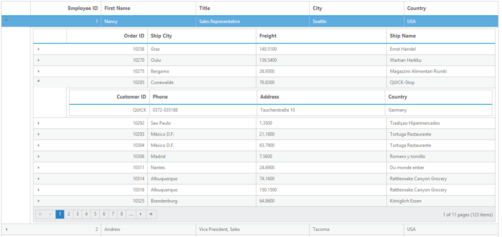

# Hierarchy Grid

Hierarchy Grid feature allows you to add the Grid control inside the Grid row. When you want to view the child Grid, you can expand the Grid. Bind the data to child Grid by assign the foreign key field to querystring property.


[MVC]

[razor]

@(Html.EJ().Grid<EmployeeView>("HierarchyGrid")

        .Datasource((IEnumerable<object>)ViewBag.datasource)

        .AllowPaging()

        .Columns(col =>

        {

            col.Field("EmployeeID").HeaderText("Employee ID").IsPrimaryKey(true).TextAlign(TextAlign.Right).Width(75).Add();

            col.Field("FirstName").HeaderText("First Name").Width(100).Add();

            col.Field("Title").Width(120).Add();

            col.Field("City").Width(100).Add();

            col.Field("Country").Width(100).Add();

        })

                 .ChildGrid(child =>

                 {

                     child.Datasource("http://mvc.syncfusion.com/Services/Northwnd.svc/Orders/")

                        .QueryString("EmployeeID")

                        .AllowPaging()

                        .Columns(col =>

                        {

                            col.Field("OrderID").HeaderText("OrderID").IsPrimaryKey(true).TextAlign(TextAlign.Right).Width(75).Add();

                            col.Field("ShipCity").HeaderText("ShipCity").Width(100).Add();

                            col.Field("Freight").Width(120).Add();

                            col.Field("ShipName").Width(100).Add();

                        })

                        .ChildGrid(d =>

                        {

                            d.Datasource("http://mvc.syncfusion.com/Services/Northwnd.svc/Customers/")

                           .QueryString("CustomerID")

                           .Columns(col =>

                        {

                            col.Field("CustomerID").HeaderText("CustomerID").IsPrimaryKey(true).TextAlign(TextAlign.Right).Width(75).Add();

                            col.Field("Phone").HeaderText("Phone").Width(100).Add();

                            col.Field("Address").Width(120).Add();

                            col.Field("Country").Width(100).Add();

                        });

                        });

                 })

    )


[Controller]

namespace MVCSampleBrowser.Controllers

{

    public partial class GridController : Controller

    {

        public ActionResult HierarchyGrid()

        {

            var DataSource = new NorthwindDataContext().EmployeeViews.ToList();

            ViewBag.datasource = DataSource;

            return View();

        }

    }

}



