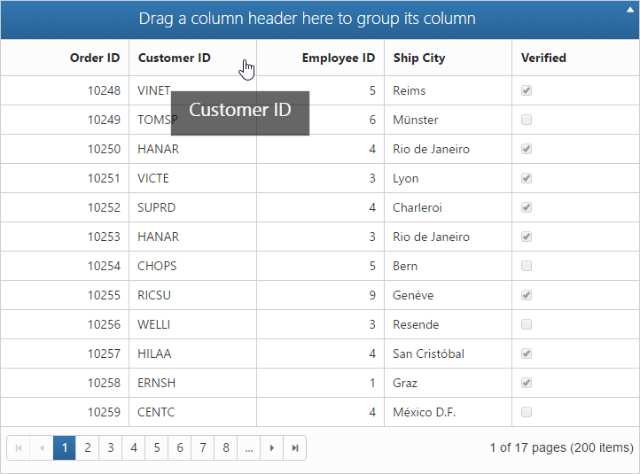

# How to

##  Apply formatting for columns dynamically

Column format can be used dynamically to change data values format with the help of the public method. The following code example illustrates the Essential JavaScript with column formatting in public method.



var grid = $("#Grid").data("ejGrid");

var column = grid.getColumnByField("fieldName");

column.format = "{0:n2}";

grid.refreshContent(true);



## Disable double-click edit

The AllowEditOnDblClick property can be set as true to enable editing the record by double-clicking it. When it is set as false, it cannot be edited by double-clicking it. In that case, you can edit the record by using the Toolbar option only.


 


@(Html.EJ().Grid<object>("Editing")

.Datasource((IEnumerable<object>)ViewBag.datasource)

.EditSettings(edit => { edit.AllowAdding().AllowDeleting().AllowEditing()

.AllowEditOnDblClick(false);})

.ToolbarSettings(toolbar =>

{

	toolbar.ShowToolbar().ToolbarItems(items =>

	{

		items.AddTool(ToolBarItems.Add);

		items.AddTool(ToolBarItems.Edit);

		items.AddTool(ToolBarItems.Delete);

		items.AddTool(ToolBarItems.Update);

		items.AddTool(ToolBarItems.Cancel);

	});

})

.AllowPaging(true)

.PageSettings(page => { page.PageSize(8); })

.Columns(col =>

{

	col.Field("OrderID").HeaderText("Order ID").IsPrimaryKey(true).TextAlign(TextAlign.Right).Add();

	col.Field("CustomerID").HeaderText("Customer ID").EditType(EditingType.String).Add();

	col.Field("EmployeeID").HeaderText("Employee ID").TextAlign(TextAlign.Right).EditType(EditingType.Numeric).Add();

	col.Field("ShipCity").HeaderText("Ship City").EditType(EditingType.Dropdown).Add();

})

)




namespace SyncfusionMvcApplication3.Controllers

{

    public class HomeController : Controller

    {

        public ActionResult Index()

        {

            ViewBag.datasource = OrderRepository.GetAllRecords();

            return View();

        }         

    }	

}




The following output is displayed as a result of the above code example.

## Customize Drag and Drop element while grouping

In this section, you can learn how to customize drag and drop element. This drag and drop element is framed by using CSS classes with default values. When you want to change or customize drag and drop element, then just override default values of CSS class values. e-cloneproperties is the name of drag and drop element in CSS class.


 


@(Html.EJ().Grid<EditableOrder>("FlatGrid")

.Datasource((IEnumerable<object>)ViewBag.datasource)

.AllowGrouping(true)

.AllowPaging()

)





namespace MVCSampleBrowser.Controllers

{

    public partial class GridController : Controller

    {
        public ActionResult Default()

        {
            ViewBag.datasource = OrderRepository.GetAllRecords();
            return View();
        }
    }
}



 

The following output is displayed as a result of the above code example.

## Display Tooltip

To apply tooltip for cells, You need to use `CustomAttributes` in columns. For more reference, about [`CustomAttributes`](http://help.syncfusion.com/aspnetmvc/grid/columns#custom-attribute).





@(Html.EJ().Grid<OrdersView>("FlatGrid")

        .Datasource((IEnumerable<object>)ViewBag.datasource)

        .AllowPaging()

        .Columns(col =>

           {

               col.Field("OrderID").HeaderText("Order ID").TextAlign(TextAlign.Right).Width(75).Add();
               col.Field("CustomerID").HeaderText("Customer ID").Width(80).CustomAttributes(customAttributes => customAttributes.AddAttribute("title","")).Add();
               col.Field("EmployeeID").HeaderText("Employee ID").Width(75).TextAlign(TextAlign.Right).Add();       
			   col.Field("Freight").HeaderText("Freight").TextAlign(TextAlign.Right).Width(75).Format("{0:C}").Add();

           })

        )





namespace MVCSampleBrowser.Controllers

{

    public partial class GridController : Controller

    {

        // GET: /Custom Attributes/

        public ActionResult Default()

        {

              // Data gets from DataContext

            var DataSource = new NorthwindDataContext().OrdersViews.ToList();

            ViewBag.datasource = DataSource;

            return View();

        }

    }

}


   

## Set Dynamic DataSource to Grid

Grid control is capable of updating its dataSource as and when required. Grid method “DataSource” helps in achieving this and in this method parameter, you have to pass the new dataSource as List Collection.

For instance, consider a textbox above Grid and depending on its value, you can update a new datasource to Grid dynamically.


 



Enter EmployeeID Field Value:

<input type="text" id="colValue" />

<input type="button" id="customButton" value="Change DataSource">

@(Html.EJ().Grid<EJGrid.Models.Order>("Grid")

.Datasource((IEnumerable<object>)ViewBag.datasource)

.AllowPaging()

.Columns(col =>

{

	 col.Field("OrderID").HeaderText("Order ID").TextAlign(TextAlign.Right).Width(75).Add();

	 col.Field("EmployeeID").HeaderText("Employee ID").TextAlign(TextAlign.Right).Width(90).Add();

	 col.Field("Freight").HeaderText("Freight").Format("{0:c}").TextAlign(TextAlign.Right).Width(90).Add();

	 col.Field("ShipCity").HeaderText("Ship City").Width(90).Add();

	 col.Field("Child.Test").HeaderText("TEst").Format("{0:c}").Width(90).Add();

	 col.Field("ShipCountry").HeaderText("Ship Country").Width(90).Add();

})

)





namespace EJGrid.Controllers

{

    public class HomeController : Controller

    {

        public ActionResult Index()

        {

            ViewBag.datasource = null;

            return View();

        }

        public JsonResult GetData(int EmployeeID)

        {

            var data = new DataClasses1DataContext().Orders.Where(datasource => datasource.EmployeeID ==        EmployeeID).ToList();

            return Json(data, JsonRequestBehavior.AllowGet);

        }

    }

}


 

The following screenshot illustrates the output.

## Custom Binding for Grid CRUD operation

In Grid control DataManager is used for data processing. The adaptors of dataManager are customizable that can be extended for custom Binding with server-side for Grid CRUD operation.

For instance bind the data to Grid by using “remoteSaveAdaptor” and extend it to modify its update method to bind edited record values of Grid as “FormCollection” in server-side.





@(Html.EJ().Grid<EJGrid.Models.Order>("Grid")

        .Datasource(datasource => datasource.Json((IEnumerable<object>)ViewBag.datasource).UpdateURL("Home/Update")

            .InsertURL("Home/Insert").RemoveURL("Home/Remove").Adaptor("remoteSaveAdaptor"))

        .AllowSorting()

        .AllowPaging()

        .EditSettings(edit => { edit.AllowAdding().AllowDeleting().AllowEditing(); })

        .ToolbarSettings(toolbar =>

        {

            toolbar.ShowToolbar().ToolbarItems(items =>

            {

                items.AddTool(ToolBarItems.Add);

                items.AddTool(ToolBarItems.Edit);

                    items.AddTool(ToolBarItems.Delete);

                items.AddTool(ToolBarItems.Update);

                items.AddTool(ToolBarItems.Cancel);

            });

        })

        .Columns(col =>

        {

            col.Field("OrderID").HeaderText("Order ID").IsPrimaryKey(true).TextAlign(TextAlign.Right).Width(90).ValidationRules(v => v.AddRule("required", true).AddRule("number", true)).Add();

            col.Field("EmployeeID").HeaderText("Employee ID").TextAlign(TextAlign.Right).Width(90).ValidationRules(v => v.AddRule("required", true)).Add();

            col.Field("Freight").HeaderText("Freight").TextAlign(TextAlign.Right).Width(80).Add();

            col.Field("ShipName").HeaderText("ShipName").Width(150).Add();

        })

        .ClientSideEvents(eve => eve.Load("load"))

)

    var adaptor = new ej.remoteSaveAdaptor().extend({

        insert: function (dataManager, data, tableName) {

            return {

                url: dataManager.dataSource.insertUrl,

                dataType: 'json',

                contentType: "application/x-www-form-urlencoded; charset=utf-8",

                data: $("#GridEditForm").serialize()

            };

        },

        update: function (dataManager, keyField, value, tableName) {

            return {

                type: "POST",

                url: dataManager.dataSource.updateUrl+"?id="+value.OrderID,

                dataType: 'json',

                contentType: "application/x-www-form-urlencoded; charset=utf-8",

                data: $("#GridEditForm").serialize()

            };

        },

    })

    function load(args) {

        this.model.dataSource.adaptor = new adaptor();

    }





namespace EJGrid.Controllers

{

    public class HomeController : Controller

    {

        public ActionResult Index()

        {

            ViewBag.datasource = OrderRepository.GetAllRecords();

            return View();

        }

        public ActionResult Update(int id, FormCollection value)

        {

            var order = new EditableOrder();

            order.OrderID = id;

            if (value["EmployeeID"] != "")

            order.EmployeeID = Convert.ToInt32(value["EmployeeID"]);

            if (value["Freight"] != "")

            order.Freight = Convert.ToDecimal(value["Freight"]);

            if (value["ShipCity"] != null)

            order.ShipCity = value["ShipCity"];

            OrderRepository.Update(order);

            var data = OrderRepository.GetAllRecords();

            return Json(data, JsonRequestBehavior.AllowGet);

        }

        public ActionResult Insert(FormCollection value)

        {

            var order = new EditableOrder();

            order.OrderID = Convert.ToInt32(value["OrderID"]);

            if (value["EmployeeID"] != "")

                order.EmployeeID = Convert.ToInt32(value["EmployeeID"]);

            if (value["Freight"] != "")

                order.Freight = Convert.ToDecimal(value["Freight"]);

            if (value["ShipCity"] != null)

                order.ShipCity = value["ShipCity"];

            OrderRepository.Add(order);

            var data = OrderRepository.GetAllRecords();

            return Json(data, JsonRequestBehavior.AllowGet);

        }

    }

}


    

 
 
  
## Binding SignalR endpoint

Grid  supports SignalR features for live updates in record. Please find the below option to configure signalR with Grid. 

1) Before configure SignalR with ejGrid. You need to Setup SignalR configuration in Visual Studio project. For reference, please find the link.

N> [signalR](http://www.asp.net/signalr/overview/getting-started/tutorial-getting-started-with-signalr#setup "signalr") 

2) After configuration of SignalR, you have to create Hub for communication between different actions of grid. 


public class SignalHub: Hub

{

	public void modify(string action, string details)

	{

		Clients.All.modify(action, details);

	}

}



3) Implementation of SignalR communication with Grid through Hub.





@(Html.EJ().Grid<OrdersView>("FlatGrid")

        .Datasource((IEnumerable<object>)ViewBag.datasource)

        .AllowPaging()

        .Columns(col =>

           {

            col.Field("OrderID").HeaderText("Order ID").IsPrimaryKey(true).TextAlign(TextAlign.Right).Width(75).Add();
            col.Field("CustomerID").HeaderText("Customer ID").Width(80).Add();
            col.Field("EmployeeID").HeaderText("Employee ID").TextAlign(TextAlign.Right).Width(75).Add();
            col.Field("Freight").HeaderText("Freight").TextAlign(TextAlign.Right).Width(75).Format("{0:C}").Add();
            col.Field("ShipCity").HeaderText("Ship City").Width(80).Add();

           })

        )
	<!--Reference the SignalR library. -->	

<!--Reference the autogenerated SignalR hub script. -->





namespace MVCSampleBrowser.Controllers

{

    public partial class GridController : Controller

    {

        // GET: /Custom Attributes/

        public ActionResult Default()

        {

              // Data gets from DataContext

            var DataSource = new NorthwindDataContext().OrdersViews.ToList();

            ViewBag.datasource = DataSource;

            return View();

        }

    }

}


   

## Copy data from Excel to Grid

This [blog](https://www.syncfusion.com/blogs/post/Copying-and-Pasting-Excel-Sheet-Data-to-Grid-ASPNET-MVC.aspx) is about conversion of Excel to JSON data. After got JSON data you can bind it to Grid. 

## Use NHibernate with Grid

### NHibernate

NHibernate is an object-relational mapping (ORM) solution for the Microsoft .NET platform. It provides a Framework for mapping an object-oriented domain model to a traditional relational database.

### Populate Grid with data by using NHibernate

You can populate the Grid with data obtained by using NHibernate. The UrlAdaptor can be used for data binding and to handle the request and response from the server. You can use the CRUD URL mappers (InsertUrl/UpdateUrl/RemoveUrl/CrudUrl) to provide the action/method to be called while editing.

The Grid initialization is as follows.





@(Html.EJ().Grid<EmployeeMap>("Grid")

.Datasource(datasource =>

	datasource.URL("Home/GetData") //Action which returns data

	.InsertURL("Home/PerformInsert") 

	.UpdateURL("Home/PerformUpdate")

	.RemoveURL("Home/PerformDelete")

	.Adaptor(AdaptorType.UrlAdaptor)

)

.AllowPaging()

.EditSettings(edit => edit.AllowEditing().AllowAdding().AllowDeleting().EditMode(EditMode.Normal))

.ToolbarSettings(tools => tools.ShowToolbar().ToolbarItems(items =>

{

	items.AddTool(ToolBarItems.Add);

	items.AddTool(ToolBarItems.Edit);

	items.AddTool(ToolBarItems.Delete);

	items.AddTool(ToolBarItems.Update);

	items.AddTool(ToolBarItems.Cancel);

}))

.Columns(col =>

{

	col.Field("EmployeeID").HeaderText("Employee ID").IsPrimaryKey(true).TextAlign(TextAlign.Right).Width(75).Add();

	col.Field("FirstName").HeaderText("First Name").Width(80).Add();

	col.Field("LastName").HeaderText("Last Name").Add();

	col.Field("Designation").HeaderText("Designation"). Width(75).Add();

})

)




namespace UsingNHibernate.Controllers

{

    public class HomeController : Controller

    {

        public IEnumerable<EmployeeMap> list { get; set; }

        public ActionResult Index()

        {

            return View();

        }

        //PROVIDE GRID DATASOURCE

        public ActionResult GetData()

        {

            using (ISession session = AppSession.OpenSession())

            {

                list = session.Query<EmployeeMap>().ToList();

            }

            return Json(new { result = list, count = list.Count() }, JsonRequestBehavior.AllowGet);

        }

        //PERFORM INSERT

        public ActionResult PerformInsert(string action, EmployeeMap value)

        {

            using (ISession session = AppSession.OpenSession())

            {

                using (ITransaction transaction = session.BeginTransaction())

                {

                    session.Save(value);

                    transaction.Commit();

                }

                list = session.Query<EmployeeMap>().ToList();

            }

            return Json(new { result = value, count = list.Count() }, JsonRequestBehavior.AllowGet);

        }

        //PERFORM UPDATE

        public ActionResult PerformUpdate(int key, EmployeeMap value)

        {

            using (ISession session = AppSession.OpenSession())

            {

                var employeeUpdate = session.Get<EmployeeMap>(key);

                employeeUpdate.Designation = value.Designation;

                employeeUpdate.FirstName = value.FirstName;

                employeeUpdate.LastName = value.LastName;

                using (ITransaction transaction = session.BeginTransaction())

                {

                    session.Save(employeeUpdate);

                    transaction.Commit();

                }

                list = session.Query<EmployeeMap>().ToList();

            }

            return Json(new { result = value, count = list.Count() }, JsonRequestBehavior.AllowGet);

        }

        //PERFORM DELETE

        public ActionResult PerformDelete(int key)

        {

            using (ISession session = AppSession.OpenSession())

            {

                using (ITransaction transaction = session.BeginTransaction())

                {

                    session.Delete(session.Get<EmployeeMap>(key));

                    transaction.Commit();

                }

                list = session.Query<EmployeeMap>().ToList();

            }

            return Content("Success"); // Json(new { result = list, count = list.Count() }, JsonRequestBehavior.AllowGet);

        }

    }

}


  
The SessionFactory used by the application is as follows.


public static class AppSession

{

	public static ISession OpenSession()

	{

		var configuration = new Configuration();

		var configurationPath = HttpContext.Current.Server.MapPath(@"~\Models\nHibernateConfig\Employee.cfg.xml");

		configuration.Configure(configurationPath);

		var employeeConfigurationFile = HttpContext.Current.Server.MapPath(@"~\Models\nHibernateConfig\EmployeeMap.hbm.xml");

		configuration.AddFile(employeeConfigurationFile);

		ISessionFactory sessionFactory = configuration.BuildSessionFactory();

		return sessionFactory.OpenSession();

	}

}



N> In the above code example, the ORM mapping is performed by using the XML-documents and the mapping files are Employee.cfg.xml and EmployeeMap.hbm.xml

## Adding comments in the Exported file (Excel, Word or PDF)

We can add comments in the exported file while exporting the grid control.

### Adding comments in Excel sheet

Using the Range property and AddComment method of the XlsIO IRange Class, we will add comments to any cell of particular range in Excel sheet. 





    @(Html.EJ().Grid<OrdersView>("FlatGrid")
        .Datasource((IEnumerable<object>)ViewBag.datasource)
        .ToolbarSettings(toolBar => toolBar.ShowToolbar().ToolbarItems(items =>
            {
              items.AddTool(ToolBarItems.ExcelExport);                    
            }))
        .AllowPaging()
        .Columns(col =>
        {
            col.Field("OrderID").HeaderText("Order ID").TextAlign(TextAlign.Right).Add();
            col.Field("CustomerID").HeaderText("Customer ID").Add();
            col.Field("EmployeeID").HeaderText("Employee ID").TextAlign(TextAlign.Right). Add();          
            col.Field("Freight").HeaderText("Freight").TextAlign(TextAlign.Right).Add();
        })) 
        



    public partial class GridController : Controller
    {

        public ActionResult ExportingGrid()
        {
            var DataSource = new NorthwindDataContext().OrdersViews.ToList();
            ViewBag.datasource = DataSource;
            return View();
        }
        public void ExportToExcel(string GridModel)
        {
            GridProperties gridProperty = (GridProperties)Utils.DeserializeToModel(typeof(GridProperties), GridModel);
            ExcelExport exp = new ExcelExport();
            IEnumerable data = new NorthwindDataContext().OrdersViews.ToList();
            IWorkbook book = exp.Export(gridProperty, (IEnumerable)data, "Export.xlsx", ExcelVersion.Excel2010, false, false, "flat-lime", true);            
            book.ActiveSheet.Range["A1:D1"].Merge();
            book.ActiveSheet.Range["A1"].Text = "*Exported Grid Data";//Adding text to the cells of particular range
            book.ActiveSheet.Range["A1"].AddComment().Text = "*Add Comments";//Adding comments to cells of particular range
            book.SaveAs("Export.xlsx", ExcelSaveType.SaveAsXLS, System.Web.HttpContext.Current.Response, ExcelDownloadType.Open);
        }          
    }




The following screenshot displays the exported grid with comments added to cells

### Adding Comments in Exported Word document

We can add comments to the word document using the AppendComment method in the WComment class of the DocIO namespace. We can traverse through the required row/cell with the help of WTable class and thus can append the comment to the table cell.





    @(Html.EJ().Grid<OrdersView>("FlatGrid")
        .Datasource((IEnumerable<object>)ViewBag.datasource)
        .ToolbarSettings(toolBar => toolBar.ShowToolbar().ToolbarItems(items =>
            {                    
              items.AddTool(ToolBarItems.WordExport);                    
            }))
        .AllowPaging()
        .Columns(col =>
        {
            col.Field("OrderID").HeaderText("Order ID").TextAlign(TextAlign.Right).Add();
            col.Field("CustomerID").HeaderText("Customer ID").Add();
            col.Field("EmployeeID").HeaderText("Employee ID").TextAlign(TextAlign.Right). Add();          
            col.Field("Freight").HeaderText("Freight").TextAlign(TextAlign.Right).Add();            
        })) 




    public partial class GridController : Controller
    {

        public ActionResult ExportingGrid()
        {
            var DataSource = new NorthwindDataContext().OrdersViews.ToList();
            ViewBag.datasource = DataSource;
            return View();
        }
        public void ExportToWord(string GridModel)
        {
            WordExport exp = new WordExport();
            var DataSource = new NorthwindDataContext().OrdersViews.ToList();
            GridProperties gridProperty = (GridProperties)Utils.DeserializeToModel(typeof(GridProperties), GridModel);
            IWordDocument document = exp.Export(gridProperty, (IEnumerable)data, "Export.docx", false, false, "flat-lime", true);
            var table = document.Sections[0].Tables[0];
            table.AddRow();//Add new row to the grid table                    
            var para = table.Rows[0].Cells[0].AddParagraph().AppendComment("*Comments added");
            document.Save("Export.docx", FormatType.Docx, System.Web.HttpContext.Current.Response, HttpContentDisposition.Attachment);
        }
          
    }
    



The following screenshot shows the exported grid with comments added to the document.

### Adding Comments in Exported PDF document

We can add comments to a PDF documents using the annotation support provided in the PDF namespace. The Annotation added can be of any format such as freeTextAnnotation, popUpAnnotation, LineAnnotation etc., Based on our requirement, we can add annotation which is available under Syncfusion.Pdf.Interactive namespace.





    @(Html.EJ().Grid<OrdersView>("FlatGrid")
        .Datasource((IEnumerable<object>)ViewBag.datasource)
        .ToolbarSettings(toolBar => toolBar.ShowToolbar().ToolbarItems(items =>
            {
              items.AddTool(ToolBarItems.PdfExport);                    
            }))
        .AllowPaging()
        .Columns(col =>
        {
            col.Field("OrderID").HeaderText("Order ID").TextAlign(TextAlign.Right).Add();
            col.Field("CustomerID").HeaderText("Customer ID").Add();
            col.Field("EmployeeID").HeaderText("Employee ID").TextAlign(TextAlign.Right). Add();          
            col.Field("Freight").HeaderText("Freight").TextAlign(TextAlign.Right).Add();
        })) 
        



    public partial class GridController : Controller
    {

        public ActionResult ExportingGrid()
        {
            var DataSource = new NorthwindDataContext().OrdersViews.ToList();
            ViewBag.datasource = DataSource;
            return View();
        }
        public void ExportToPdf(string GridModel)
        {
            PdfExport exp = new PdfExport();
            var DataSource = new NorthwindDataContext().OrdersViews.ToList();
            GridProperties gridProperty = (GridProperties)Utils.DeserializeToModel(typeof(GridProperties), GridModel);
            PdfDocument document = exp.Export(gridProperty, (IEnumerable)data, "Export.pdf", false, false, "flat-lime", true);           
            RectangleF rectangle = new RectangleF(120, 20, 20, 125);
            //Creates a new pop-up annotation.
            PdfPopupAnnotation popupAnnotation = new PdfPopupAnnotation(rectangle, "*Comments added");
            popupAnnotation.Border.Width = 2;
            popupAnnotation.Border.HorizontalRadius = 10;
            popupAnnotation.Border.VerticalRadius = 20;            
            //Sets the PDF pop-up icon.
            popupAnnotation.Icon = PdfPopupIcon.Comment;
            //Adds the annotation to page.
            document.Pages[0].Annotations.Add(popupAnnotation);
            document.Save("Export.pdf", Response, HttpReadType.Save);
        }
          
    }
    



The following screenshot displays the exported grid with comments added to cells.

## Adding header and footer in the Exported file (Excel, Word or PDF)

We can add header and footer in the exported file while exporting the grid control.

### Adding header and footer in Excel sheet

Using the Range Text property and SetValue method of the XlsIO IRange Class, we can add headers and footers in Excel sheet. 





    @(Html.EJ().Grid<OrdersView>("FlatGrid")
        .Datasource((IEnumerable<object>)ViewBag.datasource)
        .ToolbarSettings(toolBar => toolBar.ShowToolbar().ToolbarItems(items =>
            {
              items.AddTool(ToolBarItems.ExcelExport);                    
            }))
        .AllowPaging()
        .Columns(col =>
        {
            col.Field("OrderID").HeaderText("Order ID").TextAlign(TextAlign.Right).Add();
            col.Field("CustomerID").HeaderText("Customer ID").Add();
            col.Field("EmployeeID").HeaderText("Employee ID").TextAlign(TextAlign.Right). Add();          
            col.Field("Freight").HeaderText("Freight").TextAlign(TextAlign.Right).Add();
        })) 
        



    public partial class GridController : Controller
    {

        public ActionResult ExportingGrid()
        {
            var DataSource = new NorthwindDataContext().OrdersViews.ToList();
            ViewBag.datasource = DataSource;
            return View();
        }
        public void ExportToExcel(string GridModel)
        {
            GridProperties gridProperty = (GridProperties)Utils.DeserializeToModel(typeof(GridProperties), GridModel);
            ExcelExport exp = new ExcelExport();
            IEnumerable data = new NorthwindDataContext().OrdersViews.ToList();
            IWorkbook book = exp.Export(gridProperty, (IEnumerable)data, "Export.xlsx", ExcelVersion.Excel2010, false, false, "flat-lime", true);
            book.ActiveSheet.InsertRow(1);

            // Merging the sheet from Range A1 to D1 for adding title space
            book.ActiveSheet.Range["A1:D1"].Merge();

            //Adding the title using Text property
            book.ActiveSheet.Range["A1"].Text = "Grid Order Data";
            book.ActiveSheet.Range["A1"].CellStyle.HorizontalAlignment = ExcelHAlign.HAlignCenter;//set text alignment

            //Adding footer using SetValue method
            book.ActiveSheet.SetValue(book.ActiveSheet.Rows.Length + 2, book.ActiveSheet.Columns.Length - 3, "CopyRights");
            book.SaveAs("Export.xlsx", ExcelSaveType.SaveAsXLS, System.Web.HttpContext.Current.Response, ExcelDownloadType.Open);
        }          
    }




### Adding header and footer in Exported Word document

We can add header and footer to the word document using the HeadersFooters property in the WHeadersFooters class of the DocIO namespace. We can create an instance of the IWParagraph class and append the header/footer text to it using the AppendText method.





    @(Html.EJ().Grid<OrdersView>("FlatGrid")
        .Datasource((IEnumerable<object>)ViewBag.datasource)
        .ToolbarSettings(toolBar => toolBar.ShowToolbar().ToolbarItems(items =>
            {                    
              items.AddTool(ToolBarItems.WordExport);                    
            }))
        .AllowPaging()
        .Columns(col =>
        {
            col.Field("OrderID").HeaderText("Order ID").TextAlign(TextAlign.Right).Add();
            col.Field("CustomerID").HeaderText("Customer ID").Add();
            col.Field("EmployeeID").HeaderText("Employee ID").TextAlign(TextAlign.Right). Add();          
            col.Field("Freight").HeaderText("Freight").TextAlign(TextAlign.Right).Add();            
        })) 




    public partial class GridController : Controller
    {

        public ActionResult ExportingGrid()
        {
            var DataSource = new NorthwindDataContext().OrdersViews.ToList();
            ViewBag.datasource = DataSource;
            return View();
        }
        public void ExportToWord(string GridModel)
        {
            WordExport exp = new WordExport();
            var DataSource = new NorthwindDataContext().OrdersViews.ToList();
            GridProperties gridProperty = (GridProperties)Utils.DeserializeToModel(typeof(GridProperties), GridModel);
            IWordDocument document = exp.Export(gridProperty, (IEnumerable)DataSource, "Export.docx", false, false, "flat-lime", true);
            IWParagraph para = new WParagraph(document);

            //Add header to the word document
            para = document.Sections[0].HeadersFooters.Header.AddParagraph();
            //Insert the header text using AppendText method
            para.AppendText("[Header]");
            //Add footer to the word document
            para = document.Sections[0].HeadersFooters.Footer.AddParagraph();
            //Insert the footer text using AppendText method
            para.AppendText("[Footer]");

            //Adding Title to the Grid
            var index = document.LastSection.Body.ChildEntities.IndexOf(document.LastSection.Tables[0]);
            WParagraph para1 = new WParagraph(document);
            para1.Text = "Grid Title";
            document.LastSection.Body.ChildEntities.Insert(index, para1); 
            document.Save("Export.docx", FormatType.Docx, System.Web.HttpContext.Current.Response, HttpContentDisposition.Attachment);
        }
          
    }
    



### Adding header and footer in Exported PDF document

We can add header/footer to a PDF documents using PdfPageTemplateElement class. The header and footer can contain any types of element including dynamic fields.





    @(Html.EJ().Grid<OrdersView>("FlatGrid")
        .Datasource((IEnumerable<object>)ViewBag.datasource)
        .ToolbarSettings(toolBar => toolBar.ShowToolbar().ToolbarItems(items =>
            {
              items.AddTool(ToolBarItems.PdfExport);                    
            }))
        .AllowPaging()
        .Columns(col =>
        {
            col.Field("OrderID").HeaderText("Order ID").TextAlign(TextAlign.Right).Add();
            col.Field("CustomerID").HeaderText("Customer ID").Add();
            col.Field("EmployeeID").HeaderText("Employee ID").TextAlign(TextAlign.Right). Add();          
            col.Field("Freight").HeaderText("Freight").TextAlign(TextAlign.Right).Add();
        })) 
        



    public partial class GridController : Controller
    {

        public ActionResult ExportingGrid()
        {
            var DataSource = new NorthwindDataContext().OrdersViews.ToList();
            ViewBag.datasource = DataSource;
            return View();
        }
        public ActionResult ExportToPdf(string GridModel)
        {
            var DataSource = new NorthwindDataContext().OrdersViews.ToList();
            GridProperties gridProperty = (GridProperties)Utils.DeserializeToModel(typeof(GridProperties), GridModel);
            PdfExport exp = new PdfExport();
            PdfDocument document = exp.Export(gridProperty, (IEnumerable)DataSource, "Export.pdf", false, false, "flat-lime", true);

            RectangleF rect = new RectangleF(0, 0, document.PageSettings.Width, 50);

            //create a header pager template
            PdfPageTemplateElement header = new PdfPageTemplateElement(rect);

            //create a footer pager template
            PdfPageTemplateElement footer = new PdfPageTemplateElement(rect);

            Font f = new Font("Helvetica", 10, System.Drawing.FontStyle.Bold);

            PdfFont font = new PdfTrueTypeFont(f, true);

            header.Graphics.DrawString("Demo Report", font, PdfBrushes.Black, new Point(250, 0)); //Add custom text to the Header
            document.Template.Top = header; //Append custom template to the document           

            footer.Graphics.DrawString("CopyRights", font, PdfBrushes.Gray, new Point(250, 0));//Add Custom text to footer
            document.Template.Bottom = footer;//Add the footer template to document
            document.Save(Server.MapPath("/Output/Export.pdf"));
            return RedirectToAction("Index");
        }
          
    }
    



## External Search in Grid

Using `search` method of grid, you can search the string in grid externally without using in-built toolbar search support. While using `search` method it is necessary to set `AllowSearching` property as `true`. The following code example explains the above behavior.


<input type="text" id="search" class="e-ejinputtext" />

@(Html.EJ().Button("search")
.Text("Searching")
.ClientSideEvents(eve => { eve.Click("onSearching"); })
)
@(Html.EJ().Grid<OrdersView>("Grid")
.Datasource((IEnumerable<object>)ViewBag.datasource)
.AllowPaging()
.AllowSearching()
.Columns(col =>
{
col.Field("OrderID").Add();
col.Field("CustomerID").Add();
col.Field("EmployeeID").Add();
col.Field("Freight").Add();
col.Field("ShipCity").Add();
col.Field("ShipCountry").Add();
})

)




function onSearching(args) {
var obj = $("#Grid").ejGrid("instance");
var val = $("#search").val();
obj.search(val);
}




namespace SyncfusionMvcApplication3.Controllers

{
  public class HomeController : Controller
    {
        public ActionResult Index()
           {
             ViewBag.datasource = OrderRepository.GetAllRecords();
             return View();
            }         
     }	
}


The following output is displayed as a result of the above code example.

##  Configure Grid through Grid Model properties
    
There comes a time when you want to set Grid properties other than using Grid builder i.e., in the Controller side. At the time you can pass `GridProperties` Model instance as a parameter to Grid Helper.

We can set Grid properties in server-side using  `GridProperties`  class and use it in view page using Grid Helper overload.

In addition to `id` parameter of Grid helper we can also pass `GridProperties` Model as another parameter to Grid helper. 

The following code example shows you how to set Grid properties such as `AllowPaging`, `DataSource` and `Columns` in Controller using `GridProperties` class.

   

    
        @model Syncfusion.JavaScript.Models.GridProperties
        @(Html.EJ().Grid<object>("FlatGrid",Model))          
      
      



        namespace EJGrid.Controllers
         {
         public class HomeController : Controller
          {
         public ActionResult Index()
          {            
            List<Column> cols = new List<Column>();
            cols.Add(new Column() { Field = "OrderID" });
            cols.Add(new Column() { Field = "EmployeeID" });
            cols.Add(new Column() { Field = "ShipCity" });
            cols.Add(new Column() { Field = "ShipCountry" });
            cols.Add(new Column() { Field = "Freight" });

            GridProperties prop = new GridProperties();
            prop.DataSource = OrderRepository.GetAllRecords();
            prop.Columns = cols;
            prop.AllowPaging = true;
            return View(prop);
          }
         }
        }

  

The following output is displayed as a result of the above code example.

##  Work with partial views

The Grid can be rendered in either `Unobtrusive` or `Non-unobtrusive` mode.
       
In unobtrusive mode, to load grid from partial view via AJAX, in the success callback, the partial view should be parsed using `ej.widget.init` method.  

 N> The `ej.widget.init` method is available in `ej.unobtrusive.min.js` file.
    
 N> If  `InitUnobtrusiveInScriptManager`  key is set in appSettings of web config then the `Html.EJ().ScriptManager()` should be placed in the partial view.

 The following code example describes the above behavior.

   


           @(Html.EJ().Grid<OrdersView>("PartialGrid")
                .Datasource((IEnumerable<OrdersView>)Model)
                .AllowPaging()           
                .Columns(col =>
                 {
                    col.Field(o => o.OrderID).HeaderText("Order ID").Width(70).TextAlign(TextAlign.Right).Add();
                    col.Field(o => o.EmployeeID).HeaderText("Employee ID").Width(70).TextAlign(TextAlign.Right).Add();
                    col.Field(o => o.CustomerID).HeaderText("Customer ID").Width(70).Add();
                    col.Field(o => o.Freight).HeaderText("Freight").Width(70).TextAlign(TextAlign.Right).Add();
                })
             )



          namespace Grid.Controllers
           {      
            public class HomeController : Controller
             {
              public ActionResult Index()
              {           
               return View();
              }
              public ActionResult GetPartial()
              {
               var model = new NorthwindDataContext().OrdersViews.ToList();
               return PartialView("_GridPartial", model);
               }
              }
           }


   
         


     
    
        

  

The following output is displayed as a result of the above code example.

In non-unobtrusive mode, to load grid from partial view via AJAX, the `ScriptManager` HTML helper should be placed at the bottom of the partial view.

N> The `Html.EJ().ScriptManager()` which is placed in the Layout page will not initiate control rendering in partial view hence every partial view should have their own `ScriptManager`.

The following code example describes the above behavior.

   


           @(Html.EJ().Grid<OrdersView>("PartialGrid")
                .Datasource((IEnumerable<OrdersView>)Model)
                .AllowPaging()           
                .Columns(col =>
                 {
                    col.Field(o => o.OrderID).HeaderText("Order ID").Width(70).TextAlign(TextAlign.Right).Add();
                    col.Field(o => o.EmployeeID).HeaderText("Employee ID").Width(70).TextAlign(TextAlign.Right).Add();
                    col.Field(o => o.CustomerID).HeaderText("Customer ID").Width(70).Add();
                    col.Field(o => o.Freight).HeaderText("Freight").Width(70).TextAlign(TextAlign.Right).Add();
                })
            )
           @(Html.EJ().ScriptManager())



        namespace Grid.Controllers
        {      
         public class HomeController : Controller
         {
          public ActionResult Index()
           {           
            return View();
           }
           public ActionResult GetPartial()
           {
            var model = new NorthwindDataContext().OrdersViews.ToList();
            return PartialView("_GridPartial", model);
          }
         }
        }


   
          

 
     
    
                 

  

The following output is displayed as a result of the above code example.

## Rendering the grid using Grid Properties in server-side

The GridProperties helps to render the Grid control in server-side.

The following code example which will explain to render the grid control in server-side.





  @(Html.EJ().Grid<object>("FlatGrid", Model))
  





   namespace Grid.Controllers
   {
     public class GridController : Controller
     {
        public ActionResult GridFeatures()
        {
            GridProperties grid = new GridProperties();
            List<Column> colList = new List<Column>();
            colList.Add(new Column() { Field = "OrderID", HeaderText="Order ID", TextAlign = Syncfusion.JavaScript.TextAlign.Right, Width = 75 });
            colList.Add(new Column() { Field = "CustomerID", HeaderText = "Customer ID", Width = 80 });
            colList.Add(new Column() { Field = "ShipName", HeaderText = "Ship Name", Width = 100 });
            colList.Add(new Column() { Field = "ShipCity", HeaderText = "Ship City", Width = 100 });
            colList.Add(new Column() { Field = "Freight", HeaderText = "Freight", Width = 80, TextAlign = Syncfusion.JavaScript.TextAlign.Right });
            grid.Columns = colList;
            grid.AllowPaging = true;
            grid.DataSource = OrderRepository.GetAllRecords().ToList();
            return View(grid);
        }
     }
   }
   


 

The following output is displayed as a result of the above code example.

## Export Grid to target location without download prompt(Excel, Word or PDF)

In the Export method we have assigned the target location to save the exported file in the specified path. The target location is placed using the Server.MapPath.

The following code example shows how to save the exported files in a target location.





 @(Html.EJ().Grid<EmployeeView>("MasterGrid")
        .Datasource((IEnumerable<object>)ViewBag.DataSource)
        .AllowPaging()
        .ToolbarSettings(toolBar => toolBar.ShowToolbar().ToolbarItems(items =>
        {
            items.AddTool(ToolBarItems.ExcelExport);
            items.AddTool(ToolBarItems.WordExport);
            items.AddTool(ToolBarItems.PdfExport);
        }))
        .Columns(col =>
        {
            col.Field("OrderID").HeaderText("Order ID").TextAlign(TextAlign.Right).Add();
            col.Field("CustomerID").HeaderText("Customer ID").Add();
            col.Field("EmployeeID").HeaderText("Employee ID").TextAlign(TextAlign.Right).Add();
            col.Field("Freight").HeaderText("Freight").TextAlign(TextAlign.Right).Add();
        })        
)
  





   public ActionResult GridFeatures()
        {

            var DataSource = new NorthwindDataContext().OrdersViews.ToList();
            ViewBag.DataSource = DataSource;
            return View();
            
        }
        public void ExportToExcel(string GridModel)
        {

            ExcelExport exp = new ExcelExport();
            string targetFolder = Server.MapPath("") + "\\New folder\\";    // Set the target folder using Server.MapPath
            var DataSource = new NorthwindDataContext().OrdersViews.ToList();
            GridProperties obj = (GridProperties)Syncfusion.JavaScript.Utils.DeserializeToModel(typeof(GridProperties), GridModel);
            exp.Export(obj, DataSource, "Export.xlsx", ExcelVersion.Excel2010, false, false, "flat-saffron", true, targetFolder);    //specify the path which helps to save the excel file in local folder  

        }
        public void ExportToWord(string GridModel)
        {

            WordExport exp = new WordExport();
            string targetFolder = Server.MapPath("") + "\\New folder\\";   // Set the target folder using Server.MapPath
            var DataSource = new NorthwindDataContext().OrdersViews.ToList();
            GridProperties obj = (GridProperties)Syncfusion.JavaScript.Utils.DeserializeToModel(typeof(GridProperties), GridModel);
            exp.Export(obj, DataSource, "Export.docx", false, false, "flat-saffron", true, targetFolder);   //specify the path which helps to save the excel file in local folder 

        }

        public void ExportToPdf(string GridModel)
        {

            PdfExport exp = new PdfExport();
            string targetFolder = Server.MapPath("") + "\\New folder\\";    // Set the target folder using Server.MapPath
            var DataSource = new NorthwindDataContext().OrdersViews.ToList();
            GridProperties obj = (GridProperties)Syncfusion.JavaScript.Utils.DeserializeToModel(typeof(GridProperties), GridModel);
            exp.Export(obj, DataSource, "Export.pdf", false, false, "flat-saffron", true, targetFolder);     //specify the path which helps to save the excel file in local folder 

        }
        




See Also

For more information on enable unobtrusive please refer this [link]( http://help.syncfusion.com/aspnetmvc/getting-started#to-enable-unobtrusive-option-in-your-application).

## Hierarchy Grid with different foreignKeyField in parent and child table

The `QueryString` property is used to filter the childGrid data based on value in parent Grid data. But when the field name provided in `QueryString` does not exists in Child Grid, then `ForeignKeyField` property is used to filter the childGrid data. If the foreign key column name differs for parent and child grid then use `ForeignKeyField` property of Grid.

The following code example explains the above behavior.





@(Html.EJ().Grid<EmployeeView>("HierarchyGrid")
        .Datasource((IEnumerable<object>)ViewBag.datasource)
        .Columns(col =>
        {
            col.Field("EmployeeID").HeaderText("Employee ID").TextAlign(TextAlign.Right).Width(85).Add();
            col.Field("FirstName").HeaderText("First Name").Width(100).Add();
            col.Field("City").Width(100).Add();
            col.Field("Country").Width(100).Add();
        })
        .ChildGrid(child =>
        {
            child.Datasource("http://js.syncfusion.com/demos/ejServices/Wcf/Northwind.svc/Orders")
                .QueryString("FirstName")
                .ForeignKeyField("CustomerName")
                .AllowPaging()
                .PageSettings(page => page.PageSize(5))
                .Columns(col =>
                {
                    col.Field("OrderID").HeaderText("Order ID").TextAlign(TextAlign.Right).Width(75).Add();
                    col.Field("ShipCity").HeaderText("Ship City").Width(100).Add();
                    col.Field("CustomerName").HeaderText("First Name").Width(100).Add();
                    col.Field("CustomerID").HeaderText("Customer ID").Width(120).Add();
                    col.Field("ShipName").HeaderText("Ship Name").Width(100).Add();
                });
        })

)




public partial class GridController : Controller

{

	//

	// GET: /HierarchyGrid/

	 public ActionResult HierarchyGrid()

        {

            var DataSource = new NorthwindDataContext().EmployeeViews.ToList();

            ViewBag.datasource = DataSource;

            return View();

        }

}



 

The following output is displayed as a result of the above code example.

## Display other Syncfusion controls in Grid columns

We can display the other Syncfusion controls using `Template` property of Grid columns and `TemplateRefresh` event of ejGrid control.





  @(Html.EJ().Grid<object>("FlatGrid")
        .Datasource((IEnumerable<object>)ViewBag.datasource)
        .AllowPaging()
        .ClientSideEvents(cevent => cevent.TemplateRefresh("template"))
        .Columns(col =>
        {
            col.HeaderText("Employee Rating").Template("#columnTemplate").Width(100).Add();
            col.Field("EmployeeID").HeaderText("Employee ID").Width(90).Add();
            col.Field("FirstName").HeaderText("First Name").Width(90).Add();
            col.Field("LastName").HeaderText("Last Name").Width(90).Add();
            col.Field("Country").HeaderText("Country").Width(80).Add();    
        })
  )
  




   namespace Grid.Controllers
   {
     public class GridController : Controller
     {
        public ActionResult GridFeatures()
        {
            var DataSource = new NorthwindDataContext().EmployeeViews.ToList();
            ViewBag.datasource = DataSource;
            return View();
        }
     }
   }
   




   


 

The following output is displayed as a result of the above code example.

## Perform Grid Actions on External button click

### CRUD operations

Using `addRecord` method of Grid, you can add a record to a Grid externally without using in-built toolbar add support. While using `addRecord` method it is necessary to set `AllowAdding` property as `true`.
Using `deleteRecord` method of Grid, you can delete a record to a Grid externally without using in-built toolbar delete support. While using `deleteRecord` method it is necessary to set `AllowDeleting` property as `true`.
Using `updateRecord` method of Grid, you can update a record to a Grid externally without using in-built toolbar update support. While using `updateRecord` method it is necessary to set `AllowEditing` property as `true`.

### Filtering

Using `filterColumn` method of Grid, you can filter the data in the Grid externally without using in-built filter support. While using `filterColumn` method it is necessary to set `AllowFiltering` property as `true`.

### Grouping

Using `groupColumn` and `ungroupColumn` method of Grid, you can group/ungroup the Grid externally without using in-built grouping support. While using `groupColumn` and `ungroupColumn` method it is necessary to set `AllowGrouping` property as `true`.

### Sorting

Using `sortColumn` method of Grid, you can sort the Grid externally without using in-built sorting support. While using `sortColumn` method it is necessary to set `AllowSorting` property as `true`.

The following code example explains the above behavior.



<table>
    <tr>
        <td>
            <b>CRUD</b> @(Html.EJ().Button("Addrecord")
                  .Width("100px")
                  .ClientSideEvents(eve => { eve.Click("addRecord"); })
                  .Text("Addrecord")
            )
            @(Html.EJ().Button("Updaterecord")
                  .Width("100px")
                  .ClientSideEvents(eve => { eve.Click("updateRecord"); })
                  .Text("Updaterecord")
            )
            @(Html.EJ().Button("DeleteRecord")
                  .Width("100px")
                  .ClientSideEvents(eve => { eve.Click("deleteRecord"); })
                  .Text("DeleteRecord")
            )
        </td>
        <td>
            <b>Filtering</b>  
            @(Html.EJ().DropDownList("filtercolumnone")
                  .TargetID("Order")
                  .Width("120px")
                  .WatermarkText("Select filter value one")
                  .SelectedIndex(0)
            )
            @(Html.EJ().DropDownList("filtercolumntwo")
                  .TargetID("Employee")
                  .Width("120px")
                  .WatermarkText("Select filter value two")
                  .SelectedIndex(0)
            )
            @(Html.EJ().Button("filteri")
                  .Width("100px")
                  .ClientSideEvents(eve => { eve.Click("Filterfn"); })
                  .Text("Filter")
            )
            @(Html.EJ().Button("ClearFilter")
                  .Width("100px")
                  .ClientSideEvents(eve => { eve.Click("clearfilterfn"); })
                  .Text("Clear")
            )
        </td>
        
<ul><li>10001</li><li>10249</li><li>10250</li><li>10251</li><li>10252</li></ul>

        
<ul><li>1</li><li>2</li><li>3</li><li>4</li><li>5</li></ul>

        <td>
            <b>Grouping</b>  
            

                <ul>
                    <li>OrderID</li>
                    <li>CustomerID</li>
                    <li>Freight</li>
                    <li>Verified</li>
                    <li>ShipName</li>
                </ul>
            
 
            @(Html.EJ().DropDownList("groupcolumnname")
                .TargetID("columnName")
                .Width("115px")
                .SelectedIndex(0)
                .ClientSideEvents(eve => { eve.Change("Onchange"); })
            )
            @(Html.EJ().Button("groupColumn")
                .Width("100px")
                .Size(ButtonSize.Medium)
                .ClientSideEvents(eve => { eve.Click("clicktoGroup"); })
                .Text("GroupColumn")
            )
            @(Html.EJ().Button("unGroupColumn")
                .Width("115px")
                .Size(ButtonSize.Medium)
                .ClientSideEvents(eve => { eve.Click("clicktoGroup"); })
                .Text("UnGroupColumn")
            )
        </td>
        <td>
            <b>Sorting</b>  
            

                <ul>
                    <li>Order ID</li>
                    <li>Customer ID</li>
                    <li>Employee ID</li>
                    <li>Freight</li>
                    <li>Ship City</li>
                </ul>
            

            @(Html.EJ().DropDownList("SortColumnName")
                  .TargetID("sortcolumnName")
                  .Width("120px")
                  .SelectedIndex(0)
            )
            

                <ul>
                    <li>Ascending</li>
                    <li>Descending</li>
                </ul>
            

            @(Html.EJ().DropDownList("Directions")
                  .TargetID("directions")
                  .Width("120px")
                  .SelectedIndex(0)
            )
            @(Html.EJ().Button("doSorting")
                  .Width("100px")
                  .ClientSideEvents(eve => { eve.Click("Sortfn"); })
                  .Text("Sort")
            )
            @(Html.EJ().Button("clearSort")
                  .Width("100px")
                  .ClientSideEvents(eve => { eve.Click("Sortfn"); })
                  .Text("Clear")
            )
        </td>
    </tr>
</table>

@(Html.EJ().Grid<object>("FlatGrid")
        .Datasource((IEnumerable<object>)ViewBag.datasource)
        .AllowGrouping()
        .AllowFiltering()
        .AllowPaging()
        .AllowSorting()
        .EditSettings(edit => { edit.AllowAdding().AllowDeleting().AllowEditing(); })
        .ToolbarSettings(toolbar =>
        {
            toolbar.ShowToolbar().ToolbarItems(items =>
            {
                items.AddTool(ToolBarItems.Add);
                items.AddTool(ToolBarItems.Edit);
                items.AddTool(ToolBarItems.Delete);
                items.AddTool(ToolBarItems.Update);
                items.AddTool(ToolBarItems.Cancel);
            });
        })
        .Columns(col =>
        {
            col.Field("OrderID").HeaderText("Order ID").IsPrimaryKey(true).TextAlign(TextAlign.Right).Width(150).Add();
            col.Field("CustomerID").HeaderText("Customer ID").Width(200).Add();
            col.Field("EmployeeID").HeaderText("Employee ID").Width(150).Add();
            col.Field("Freight").HeaderText("Freight").TextAlign(TextAlign.Right).Width(150).Format("{0:C}").Add();
            col.Field("OrderDate").HeaderText("Order Date").Width(200).Add();
        })
)




    public partial class GridController : Controller

{

	//

	// GET: /Externalbutton/

	 public ActionResult Externalbutton()

        {

            var DataSource = new NorthwindDataContext().EmployeeViews.ToList();

            ViewBag.datasource = DataSource;

            return View();

        }

}








The following output is displayed as a result of the above code example.
