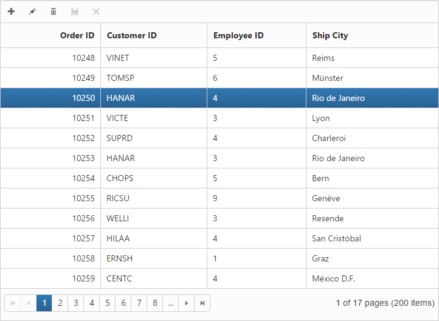
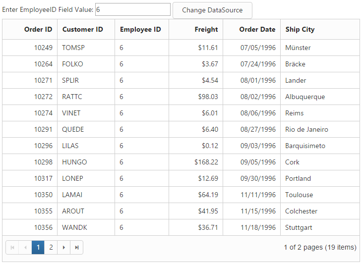

# How to

##  Apply formatting for columns dynamically

Column format can be used dynamically to change data values format with the help of the public method. The following code example illustrates the Essential JavaScript with column formatting in public method.



var grid = $("#Grid").data("ejGrid");

var column = grid.getColumnByField("fieldName");

column.format = "{0:n2}";

grid.refreshContent(true);



## Disable double-click edit

The AllowEditOnDblClick property can be set as True to enable editing the record by double-clicking it. When it is set as False, it cannot be edited by double-clicking it. In that case, you can edit the record by using the Toolbar option only.


 


@(Html.EJ().Grid<object>("Editing")

.Datasource((IEnumerable<object>)ViewBag.datasource)

.EditSettings(edit => { edit.AllowAdding().AllowDeleting().AllowEditing()

.AllowEditOnDblClick(false);})

.ToolbarSettings(toolbar =>

{

	toolbar.ShowToolbar().ToolbarItems(items =>

	{

		items.AddTool(ToolBarItems.Add);

		items.AddTool(ToolBarItems.Edit);

		items.AddTool(ToolBarItems.Delete);

		items.AddTool(ToolBarItems.Update);

		items.AddTool(ToolBarItems.Cancel);

	});

})

.AllowPaging(true)

.PageSettings(page => { page.PageSize(8); })

.Columns(col =>

{

	col.Field("OrderID").HeaderText("Order ID").IsPrimaryKey(true).TextAlign(TextAlign.Right).Add();

	col.Field("CustomerID").HeaderText("Customer ID").EditType(EditingType.String).Add();

	col.Field("EmployeeID").HeaderText("Employee ID").TextAlign(TextAlign.Right).EditType(EditingType.Numeric).Add();

	col.Field("ShipCity").HeaderText("Ship City").EditType(EditingType.Dropdown).Add();

})

)




namespace SyncfusionMvcApplication3.Controllers

{

    public class HomeController : Controller

    {

        public ActionResult Index()

        {

            ViewBag.datasource = OrderRepository.GetAllRecords();

            return View();

        }         

    }	

}




The following output is displayed as a result of the above code example.

## Customize Drag and Drop element while grouping

In this section, you can learn how to customize drag and drop element. This drag and drop element is framed by using CSS classes with default values. When you want to change or customize drag and drop element, then just override default values of CSS class values. e-cloneproperties is the name of drag and drop element in CSS class.


 


@(Html.EJ().Grid<EditableOrder>("FlatGrid")

.Datasource((IEnumerable<object>)ViewBag.datasource)

.AllowGrouping(true)

.AllowPaging()

)





namespace MVCSampleBrowser.Controllers

{

    public partial class GridController : Controller

    {
        public ActionResult Default()

        {
            ViewBag.datasource = OrderRepository.GetAllRecords();
            return View();
        }
    }
}



 

The following output is displayed as a result of the above code example.

## Display Tooltip

To apply tooltip for cells, You need to use `CustomAttributes` in columns. For more reference, about [`CutomAttributes`](http://help.syncfusion.com/aspnetmvc/grid/columns#custom-attribute).





@(Html.EJ().Grid<OrdersView>("FlatGrid")

        .Datasource((IEnumerable<object>)ViewBag.datasource)

        .AllowPaging()

        .Columns(col =>

           {

               col.Field("OrderID").HeaderText("Order ID").TextAlign(TextAlign.Right).Width(75).Add();
               col.Field("CustomerID").HeaderText("Customer ID").Width(80).CustomAttributes(cus => cus.AddAttribute("title","")).Add();
               col.Field("EmployeeID").HeaderText("Employee ID").Width(75).TextAlign(TextAlign.Right).Add();       
			   col.Field("Freight").HeaderText("Freight").TextAlign(TextAlign.Right).Width(75).Format("{0:C}").Add();

           })

        )





namespace MVCSampleBrowser.Controllers

{

    public partial class GridController : Controller

    {

        // GET: /Custom Attributes/

        public ActionResult Default()

        {

              // Data gets from DataContext

            var DataSource = new NorthwindDataContext().OrdersViews.ToList();

            ViewBag.datasource = DataSource;

            return View();

        }

    }

}


   

## Set Dynamic DataSource to Grid

Grid control is capable of updating its dataSource as and when required. Grid method “DataSource” helps in achieving this and in this method parameter, you have to pass the new dataSource as List Collection.

For instance, consider a textbox above Grid and depending on its value, you can update a new datasource to Grid dynamically.


 



Enter EmployeeID Field Value:

<input type="text" id="colValue" />

<input type="button" id="customButton" value="Change DataSource">

@(Html.EJ().Grid<EJGrid.Models.Order>("Grid")

.Datasource((IEnumerable<object>)ViewBag.datasource)

.AllowPaging()

.Columns(col =>

{

	 col.Field("OrderID").HeaderText("Order ID").TextAlign(TextAlign.Right).Width(75).Add();

	 col.Field("EmployeeID").HeaderText("Employee ID").TextAlign(TextAlign.Right).Width(90).Add();

	 col.Field("Freight").HeaderText("Freight").Format("{0:c}").TextAlign(TextAlign.Right).Width(90).Add();

	 col.Field("ShipCity").HeaderText("Ship City").Width(90).Add();

	 col.Field("Child.Test").HeaderText("TEst").Format("{0:c}").Width(90).Add();

	 col.Field("ShipCountry").HeaderText("Ship Country").Width(90).Add();

})

)





namespace EJGrid.Controllers

{

    public class HomeController : Controller

    {

        public ActionResult Index()

        {

            ViewBag.datasource = null;

            return View();

        }

        public JsonResult GetData(int EmployeeID)

        {

            var data = new DataClasses1DataContext().Orders.Where(ds => ds.EmployeeID ==        EmployeeID).ToList();

            return Json(data, JsonRequestBehavior.AllowGet);

        }

    }

}


 

The following screenshot illustrates the output.

## Custom Binding for Grid CRUD operation

In Grid control DataManager is used for data processing. The adaptors of dataManager are customizable that can be extended for custom Binding with server-side for Grid CRUD operation.

For instance bind the data to Grid by using “remoteSaveAdaptor” and extend it to modify its update method to bind edited record values of Grid as “FormCollection” in server-side.





@(Html.EJ().Grid<EJGrid.Models.Order>("Grid")

        .Datasource(ds => ds.Json((IEnumerable<object>)ViewBag.datasource).UpdateURL("Home/Update")

            .InsertURL("Home/Insert").RemoveURL("Home/Remove").Adaptor("remoteSaveAdaptor"))

        .AllowSorting()

        .AllowPaging()

        .EditSettings(edit => { edit.AllowAdding().AllowDeleting().AllowEditing(); })

        .ToolbarSettings(toolbar =>

        {

            toolbar.ShowToolbar().ToolbarItems(items =>

            {

                items.AddTool(ToolBarItems.Add);

                items.AddTool(ToolBarItems.Edit);

                    items.AddTool(ToolBarItems.Delete);

                items.AddTool(ToolBarItems.Update);

                items.AddTool(ToolBarItems.Cancel);

            });

        })

        .Columns(col =>

        {

            col.Field("OrderID").HeaderText("Order ID").IsPrimaryKey(true).TextAlign(TextAlign.Right).Width(90).ValidationRules(v => v.AddRule("required", true).AddRule("number", true)).Add();

            col.Field("EmployeeID").HeaderText("Employee ID").TextAlign(TextAlign.Right).Width(90).ValidationRules(v => v.AddRule("required", true)).Add();

            col.Field("Freight").HeaderText("Freight").TextAlign(TextAlign.Right).Width(80).Add();

            col.Field("ShipName").HeaderText("ShipName").Width(150).Add();

        })

        .ClientSideEvents(eve => eve.Load("load"))

)

    var adaptor = new ej.remoteSaveAdaptor().extend({

        insert: function (dm, data, tableName) {

            return {

                url: dm.dataSource.insertUrl,

                dataType: 'json',

                contentType: "application/x-www-form-urlencoded; charset=utf-8",

                data: $("#GridEditForm").serialize()

            };

        },

        update: function (dm, keyField, value, tableName) {

            return {

                type: "POST",

                url: dm.dataSource.updateUrl+"?id="+value.OrderID,

                dataType: 'json',

                contentType: "application/x-www-form-urlencoded; charset=utf-8",

                data: $("#GridEditForm").serialize()

            };

        },

    })

    function load(args) {

        this.model.dataSource.adaptor = new adaptor();

    }





namespace EJGrid.Controllers

{

    public class HomeController : Controller

    {

        public ActionResult Index()

        {

            ViewBag.datasource = OrderRepository.GetAllRecords();

            return View();

        }

        public ActionResult Update(int id, FormCollection value)

        {

            var ord = new EditableOrder();

            ord.OrderID = id;

            if (value["EmployeeID"] != "")

            ord.EmployeeID = Convert.ToInt32(value["EmployeeID"]);

            if (value["Freight"] != "")

            ord.Freight = Convert.ToDecimal(value["Freight"]);

            if (value["ShipCity"] != null)

            ord.ShipCity = value["ShipCity"];

            OrderRepository.Update(ord);

            var data = OrderRepository.GetAllRecords();

            return Json(data, JsonRequestBehavior.AllowGet);

        }

        public ActionResult Insert(FormCollection value)

        {

            var ord = new EditableOrder();

            ord.OrderID = Convert.ToInt32(value["OrderID"]);

            if (value["EmployeeID"] != "")

                ord.EmployeeID = Convert.ToInt32(value["EmployeeID"]);

            if (value["Freight"] != "")

                ord.Freight = Convert.ToDecimal(value["Freight"]);

            if (value["ShipCity"] != null)

                ord.ShipCity = value["ShipCity"];

            OrderRepository.Add(ord);

            var data = OrderRepository.GetAllRecords();

            return Json(data, JsonRequestBehavior.AllowGet);

        }

    }

}


    

 
 
  
## Binding SignalR endpoint

Grid  supports SignalR features for live updates in record. Please find the below option to configure signalR with Grid. 

1) Before configure SignalR with ejGrid. You need to Setup SignalR configuration in visual studio project. For reference, please find the link.

N> [signalR](http://www.asp.net/signalr/overview/getting-started/tutorial-getting-started-with-signalr#setup "signalr") 

2) After configuration of SignalR, you have to create Hub for communication between different actions of grid. 


public class SignalHub: Hub

{

	public void modify(string action, string details)

	{

		Clients.All.modify(action, details);

	}

}



3) Implementation of SignalR communication with Grid through Hub.





@(Html.EJ().Grid<OrdersView>("FlatGrid")

        .Datasource((IEnumerable<object>)ViewBag.datasource)

        .AllowPaging()

        .Columns(col =>

           {

            col.Field("OrderID").HeaderText("Order ID").IsPrimaryKey(true).TextAlign(TextAlign.Right).Width(75).Add();
            col.Field("CustomerID").HeaderText("Customer ID").Width(80).Add();
            col.Field("EmployeeID").HeaderText("Employee ID").TextAlign(TextAlign.Right).Width(75).Add();
            col.Field("Freight").HeaderText("Freight").TextAlign(TextAlign.Right).Width(75).Format("{0:C}").Add();
            col.Field("ShipCity").HeaderText("Ship City").Width(80).Add();

           })

        )
	<!--Reference the SignalR library. -->	

<!--Reference the autogenerated SignalR hub script. -->





namespace MVCSampleBrowser.Controllers

{

    public partial class GridController : Controller

    {

        // GET: /Custom Attributes/

        public ActionResult Default()

        {

              // Data gets from DataContext

            var DataSource = new NorthwindDataContext().OrdersViews.ToList();

            ViewBag.datasource = DataSource;

            return View();

        }

    }

}


   

## Copy data from Excel to Grid

This [blog](https://www.syncfusion.com/blogs/post/Copying-and-Pasting-Excel-Sheet-Data-to-Grid-ASPNET-MVC.aspx) is about conversion of Excel to JSON data. After got JSON data you can bind it to Grid. 

## Use NHibernate with Grid

### NHibernate

NHibernate is an object-relational mapping (ORM) solution for the Microsoft .NET platform. It provides a framework for mapping an object-oriented domain model to a traditional relational database.

### Populate Grid with data by using NHibernate

You can populate the Grid with data obtained by using NHibernate. The UrlAdaptor can be used for data binding and to handle the request and response from the server. You can use the CRUD URL mappers (InsertUrl/UpdateUrl/RemoveUrl/CrudUrl) to provide the action/method to be called while editing.

The Grid initialization is as follows.





@(Html.EJ().Grid<EmployeeMap>("Grid")

.Datasource(ds =>

	ds.URL("Home/GetData") //Action which returns data

	.InsertURL("Home/PerformInsert") 

	.UpdateURL("Home/PerformUpdate")

	.RemoveURL("Home/PerformDelete")

	.Adaptor(AdaptorType.UrlAdaptor)

)

.AllowPaging()

.EditSettings(edit => edit.AllowEditing().AllowAdding().AllowDeleting().EditMode(EditMode.Normal))

.ToolbarSettings(tools => tools.ShowToolbar().ToolbarItems(items =>

{

	items.AddTool(ToolBarItems.Add);

	items.AddTool(ToolBarItems.Edit);

	items.AddTool(ToolBarItems.Delete);

	items.AddTool(ToolBarItems.Update);

	items.AddTool(ToolBarItems.Cancel);

}))

.Columns(col =>

{

	col.Field("EmployeeID").HeaderText("Employee ID").IsPrimaryKey(true).TextAlign(TextAlign.Right).Width(75).Add();

	col.Field("FirstName").HeaderText("First Name").Width(80).Add();

	col.Field("LastName").HeaderText("Last Name").Add();

	col.Field("Designation").HeaderText("Designation"). Width(75).Add();

})

)




namespace UsingNHibernate.Controllers

{

    public class HomeController : Controller

    {

        public IEnumerable<EmployeeMap> list { get; set; }

        public ActionResult Index()

        {

            return View();

        }

        //PROVIDE GRID DATASOURCE

        public ActionResult GetData()

        {

            using (ISession session = AppSession.OpenSession())

            {

                list = session.Query<EmployeeMap>().ToList();

            }

            return Json(new { result = list, count = list.Count() }, JsonRequestBehavior.AllowGet);

        }

        //PERFORM INSERT

        public ActionResult PerformInsert(string action, EmployeeMap value)

        {

            using (ISession session = AppSession.OpenSession())

            {

                using (ITransaction transaction = session.BeginTransaction())

                {

                    session.Save(value);

                    transaction.Commit();

                }

                list = session.Query<EmployeeMap>().ToList();

            }

            return Json(new { result = value, count = list.Count() }, JsonRequestBehavior.AllowGet);

        }

        //PERFORM UPDATE

        public ActionResult PerformUpdate(int key, EmployeeMap value)

        {

            using (ISession session = AppSession.OpenSession())

            {

                var employeetoUpdate = session.Get<EmployeeMap>(key);

                employeetoUpdate.Designation = value.Designation;

                employeetoUpdate.FirstName = value.FirstName;

                employeetoUpdate.LastName = value.LastName;

                using (ITransaction transaction = session.BeginTransaction())

                {

                    session.Save(employeetoUpdate);

                    transaction.Commit();

                }

                list = session.Query<EmployeeMap>().ToList();

            }

            return Json(new { result = value, count = list.Count() }, JsonRequestBehavior.AllowGet);

        }

        //PERFORM DELETE

        public ActionResult PerformDelete(int key)

        {

            using (ISession session = AppSession.OpenSession())

            {

                using (ITransaction transaction = session.BeginTransaction())

                {

                    session.Delete(session.Get<EmployeeMap>(key));

                    transaction.Commit();

                }

                list = session.Query<EmployeeMap>().ToList();

            }

            return Content("Success"); // Json(new { result = list, count = list.Count() }, JsonRequestBehavior.AllowGet);

        }

    }

}


  
The SessionFactory used by the application is as follows.


public static class AppSession

{

	public static ISession OpenSession()

	{

		var configuration = new Configuration();

		var configurationPath = HttpContext.Current.Server.MapPath(@"~\Models\nHibernateConfig\Employee.cfg.xml");

		configuration.Configure(configurationPath);

		var employeeConfigurationFile = HttpContext.Current.Server.MapPath(@"~\Models\nHibernateConfig\EmployeeMap.hbm.xml");

		configuration.AddFile(employeeConfigurationFile);

		ISessionFactory sessionFactory = configuration.BuildSessionFactory();

		return sessionFactory.OpenSession();

	}

}



N> In the above code example, the ORM mapping is performed by using the xml-documents and the mapping files are Employee.cfg.xml and EmployeeMap.hbm.xml

