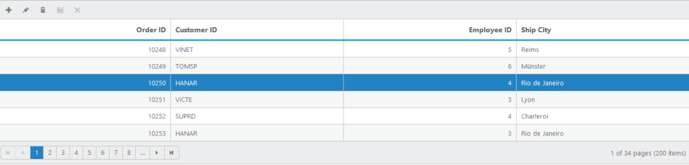

# Disable double-click edit

The AllowEditOnDblClick property can be set as True to enable editing the record by double-clicking it. When it is set as False, it cannot be edited by double-clicking it. In that case, you can edit the record by using the Toolbar option only.


 


@(Html.EJ().Grid<object>("Editing")

.Datasource((IEnumerable<object>)ViewBag.datasource)

.EditSettings(edit => { edit.AllowAdding().AllowDeleting().AllowEditing()

.AllowEditOnDblClick(false);})

.ToolbarSettings(toolbar =>

{

	toolbar.ShowToolbar().ToolbarItems(items =>

	{

		items.AddTool(ToolBarItems.Add);

		items.AddTool(ToolBarItems.Edit);

		items.AddTool(ToolBarItems.Delete);

		items.AddTool(ToolBarItems.Update);

		items.AddTool(ToolBarItems.Cancel);

	});

})

.AllowPaging(true)

.PageSettings(page => { page.PageSize(8); })

.Columns(col =>

{

	col.Field("OrderID").HeaderText("Order ID").IsPrimaryKey(true).TextAlign(TextAlign.Right).Add();

	col.Field("CustomerID").HeaderText("Customer ID").EditType(EditingType.String).Add();

	col.Field("EmployeeID").HeaderText("Employee ID").TextAlign(TextAlign.Right).EditType(EditingType.Numeric).Add();

	col.Field("ShipCity").HeaderText("Ship City").EditType(EditingType.Dropdown).Add();

})

)




namespace SyncfusionMvcApplication3.Controllers

{

    public class HomeController : Controller

    {

        public ActionResult Index()

        {

            ViewBag.datasource = OrderRepository.GetAllRecords();

            return View();

        }         

    }	

}




The following output is displayed as a result of the above code example.

Disable double-click edit
{:.caption}
