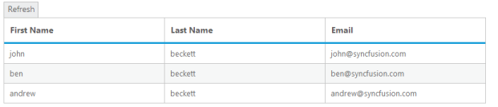
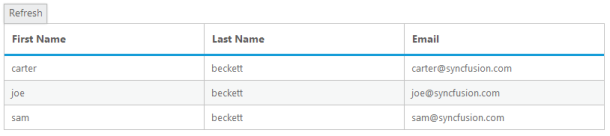

# Refresh datasource

Grid allows you to refresh datasource dynamically after Gridinitialization. It is useful to refresh Griddatasource.





@(Html.EJ().Button("refresh").Text("refresh").ClientSideEvents(d=>d.Click("refresh"))

)

@(Html.EJ().Grid<Person>("Grid")

.Datasource((IEnumerable<object>)ViewBag.datasource)

.Columns(c =>

{

	c.Field("FirstName").HeaderText("First Name").Add();

	c.Field("LastName").HeaderText("Last Name").Add();

	c.Field("Email").HeaderText("Email").Add();

})

)





namespace MVCSampleBrowser.Controllers

{

    public partial class GridController : Controller

    {

        public ActionResult Default()

        {

            List<Person> Persons = new List<Person>();

            Persons.Add(new Person() { FirstName = "John", LastName = "Beckett", Email = "john@syncfusion.com" });

            Persons.Add(new Person() { FirstName = "Ben", LastName = "Beckett", Email = "ben@syncfusion.com" });

            Persons.Add(new Person() { FirstName = "Andrew", LastName = "Beckett", Email = "andrew@syncfusion.com" });

            ViewBag.datasource = Persons;

            return View();

        }

    }

}


 
The following screenshot displays the Grid data source before refreshing.

Before Refreshing
{:.caption}

The following screenshot displays the Grid data source after refreshing.

After Refreshing
{:.caption}

