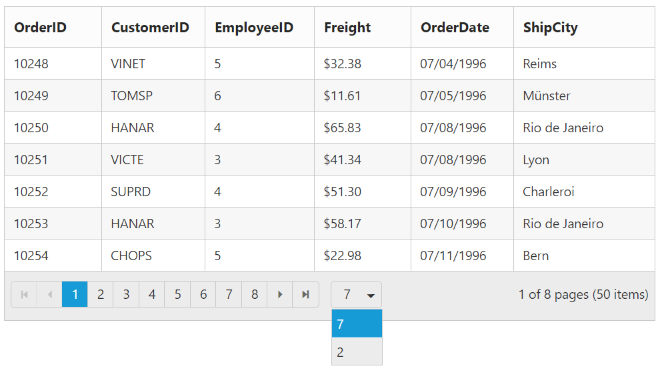

# Paging

 You can display the grid records in paged view, by setting the `AllowPaging` property as `true`.

The code sample to enable paging is as follows.




       @(Html.EJ().Grid<Object>("Paging")
            .Datasource((IEnumerable<object>)ViewBag.datasource)
            .AllowPaging()
            .Columns(col =>
            {
                col.Field("OrderID").Add();
                col.Field("EmployeeID").Add();
                col.Field("CustomerID").Add();
                col.Field("ShipCountry").Add();
                col.Field("Freight").Format("{0:C}").Add();
            })
       )
 


      namespace MVCSampleBrowser.Controllers
      {
       public class GridController : Controller
       { 
         public ActionResult Paging()
          {
            var DataSource = new NorthwindDataContext().OrdersViews.ToList();
            ViewBag.datasource = DataSource;
            return View();
          }
       }
     }    
 
  
 
 The following output is displayed as a result of the previous code example.
 
 

## Pager with query string

You can pass the current page information as a query string while navigating to other page. To enable query string, set the `EnableQueryString` property of `PageSettings` as `true`.

The following code example describes the previous behavior.




     @(Html.EJ().Grid<Object>("Paging")
            .Datasource((IEnumerable<object>)ViewBag.datasource)
            .AllowPaging()
            .PageSettings(Page => { Page.EnableQueryString(true); })
            .Columns(col =>
            {
                col.Field("OrderID").Add();
                col.Field("EmployeeID").Add();
                col.Field("CustomerID").Add();
                col.Field("ShipCountry").Add();
                col.Field("Freight").Format("{0:C}").Add();
            })
     )            
  
  
        
          namespace MVCSampleBrowser.Controllers
           {
            public class GridController : Controller
              { 
               public ActionResult Paging()
                 {
                   var DataSource = new NorthwindDataContext().OrdersViews.ToList();
                   ViewBag.datasource = DataSource;
                   return View();
                 }
              }   
            } 

 
  

The following output is displayed as a result of the previous code example.

 

## Pager template

Apart from default pager, there is an option to render a specific custom template in a grid pager. To render template in pager, set `EnableTemplates`  as true and `Template`  properties of `PageSettings`.

 Prevent to show the default pager while enabling the pager `Template`  by setting `ShowDefaults`  property of `PageSettings`  as `false`.

 N> It's a standard way to enclose the `Template`  within the `script` tag with `type` as "text/x-jsrender".

The following code example describes the previous behavior.

 



        @(Html.EJ().Grid<OrdersView>("Paging")
            .Datasource((IEnumerable<object>)ViewBag.datasource)
            .AllowPaging() 
            .PageSettings(Page => { Page.EnableTemplates().Template("#template").ShowDefaults(false); })
            .Columns(col =>
            {
                col.Field("OrderID").Add();
                col.Field("EmployeeID").Add();
                col.Field("ShipCity").Add();
                col.Field("ShipCountry").Add();
                col.Field("Freight").Format("{0:C}").Add();
            }).ClientSideEvents(e=>e.Create("create")) 
        )         



     namespace MVCSampleBrowser.Controllers
      {
       public partial class GridController : Controller
       {
        public ActionResult Paging()
          {
           var DataSource = new NorthwindDataContext().OrdersViews.ToList();
           ViewBag.datasource = DataSource;
           return View();
           }
       }
     }




         
          



     .e-grid .e-pager .e-pagercontainer {
	       border-width: 0px;
	       overflow: visible;
         }         
 
   
 
 The following output is displayed as a result of the previous code example.

## Pager with pageSize drop down

There is an option to set the size of page by means of selecting from the page size values available at the dropdown in pager. Once selected it updates the pageSize value accordingly. To render drop down in pager, provide the pageSize values you wish to display in drop down as `List` to the `PageSizeList` property of `PageSettings`.

The following code sample describes the previous behavior.




    @(Html.EJ().Grid<object>("Paging")
                .Datasource((IEnumerable<object>)ViewBag.datasource)
                .AllowPaging()
                .PageSettings(p => { p.PageSizeList(new List<int>() { 7, 2 }); 
                })
                .Columns(col =>
                {
                    col.Field("OrderID").Add();
                    col.Field("CustomerID").Add();
                    col.Field("EmployeeID").Add();
                    col.Field("Freight").Format("{0:C}").Add();
                    col.Field("ShipCity").Add();
                    col.Field("ShipCountry").Add();
                })
    )

  
  
        
          namespace MVCSampleBrowser.Controllers
           {
            public class GridController : Controller
              { 
               public ActionResult Paging()
                 {
                   var DataSource = new NorthwindDataContext().OrdersViews.ToList();
                   ViewBag.datasource = DataSource;
                   return View();
                 }
              }   
            } 

 
  

The following output is displayed as a result of the previous code example.

 
 
## Pager with pageSettings

We can customize the default page settings, such as the [`pageCount`](https://help.syncfusion.com/api/js/ejgrid#members:pagesettings-pagecount "pageCount"), [`pageSize`](https://help.syncfusion.com/api/js/ejgrid#members:pagesettings-pagesize "pageSize")  of the grid's pager by using the [`pageSettings`](https://help.syncfusion.com/api/js/ejgrid#members:pagesettings "pageSettings") property of grid control. 

The following code example describes the previous behavior.




    @(Html.EJ().Grid<object>("Paging")
                .Datasource((IEnumerable<object>)ViewBag.datasource)
                .AllowPaging()
                .PageSettings(page => page.PageSize(8).PageCount(3)) 
                .Columns(col =>
                {
                    col.Field("OrderID").Add();
                    col.Field("CustomerID").Add();
                    col.Field("EmployeeID").Add();
                    col.Field("Freight").Format("{0:C}").Add();
                    col.Field("ShipCity").Add();
                    col.Field("ShipCountry").Add();
                })
    )

  
  
        
          namespace MVCSampleBrowser.Controllers
           {
            public class GridController : Controller
              { 
               public ActionResult Paging()
                 {
                   var DataSource = new NorthwindDataContext().OrdersViews.ToList();
                   ViewBag.datasource = DataSource;
                   return View();
                 }
              }   
            } 

 
  

The following output is displayed as a result of the previous code example.

