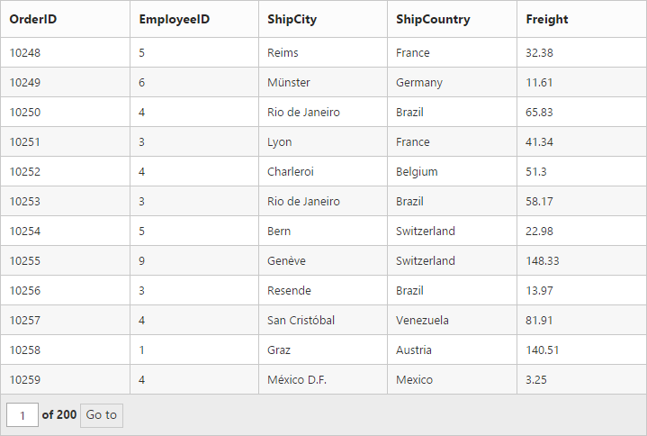

# Paging

Paging is a powerful technique in Grid that is used to navigate from one page to another. Using this pager, you can implement load on demand concept that loads only required data to Grid. To enable paging in Grid set AllowPaging as True at Grid Initialize.

## Default Paging

When the AllowPaging property is set as True, the properties in the pagesettings take the following default values.

* PageSize-12
* PageCount – 8
* CurrentPage-1

The following code example is for the Grid with default options.



@(Html.EJ().Grid<OrdersView>("Grid")

        .Datasource((IEnumerable<object>)ViewBag.datasource)

.AllowPaging()        

        )




namespace MVCSampleBrowser.Controllers

{

    public partial class GridController : Controller

    {

        public ActionResult Paging()

        {

            var DataSource = new NorthwindDataContext().OrdersViews.ToList();

            ViewBag.datasource = DataSource;

            return View();

        }

     }

}


The following output is displayed as a result of the above code example.

_Figure : Paging_

## External Paging

In this section, you can see how to use external paging. The following code example is for external paging.



@(Html.EJ().Grid<OrdersView>("Paging")

        .Datasource((IEnumerable<object>)ViewBag.datasource)

        .AllowPaging()

       )

    

        

        

            goto

        

        

            @(Html.EJ().NumericTextbox("goto")

            .Value("1")

            .MinValue(1)

            .MaxValue(10)

            .ClientSideEvents(eve => { eve.Change("pageChange"); })

            )

        

        




   





namespace MVCSampleBrowser.Controllers

{

    public partial class GridController : Controller

    {

        public ActionResult PagingAPI()

        {

            var DataSource = new NorthwindDataContext().OrdersViews.ToList();

            ViewBag.datasource = DataSource;

            return View();

        }

    }

}    



The following output is displayed as a result of the above code example.

_Figure : External Paging_

## Pager Templates

Pager Templates feature provide support to render a specific custom template to a Grid pager using EnableTemplates and Template properties of PageSettings. ShowDefaults property is used to show/hide default pager for Grid.



@(Html.EJ().Grid<OrdersView>("Paging")

        .Datasource((IEnumerable<object>)ViewBag.datasource)

        .PageSettings(page=>page.EnableTemplates().Template("#template"))

        .Columns(col =>

        {

            col.Field("OrderID").HeaderText("Order ID"). TextAlign(TextAlign.Right). Add();

            col.Field("CustomerID").HeaderText("Customer ID"). Add();

            col.Field("EmployeeID").HeaderText("Employee ID").TextAlign(TextAlign.Right).Add();

            col.Field("Freight").HeaderText("Freight").TextAlign(TextAlign.Right). Add();

            col.Field("ShipCity").HeaderText("Ship City").Add();

            col.Field("ShipCountry").HeaderText("Ship Country").Add();

        })

    ) 





    


 

public partial class GridController : Controller

    {

        //

        // GET: /PrintGrid/

        public ActionResult PrintGrid()

        {

            var DataSource = new NorthwindDataContext().OrdersViews.ToList();

            ViewBag.datasource = DataSource;

            return View();

        }

    }



_Figure : Pager Template_

## Methods

The following are the public methods of pager.

* goto
* refreshPager

In this section, you can see how to use paging methods in Grid control. The following code example is for paging methods. 



 @(Html.EJ().Grid<OrdersView>("Paging")

     .Datasource((IEnumerable<object>)ViewBag.datasource)

     .AllowPaging()

     .PageSettings(page => page.PageSize(5))

)

     

    

    

        goto

    

    

        @(Html.EJ().NumericTextbox("goto")

            .Value("1")

            .MinValue(1)

            .ClientSideEvents(eve => { eve.Change("pageChange"); })

            )

    

    

        Page Count

    

    

        @(Html.EJ().NumericTextbox("pageCount")

            .Value("1")

            .MinValue(1)

            .MaxValue(10)

            .ClientSideEvents(eve => { eve.Change("pageCountChange"); })

            )

    

    

        pageSize

    

    

        @(Html.EJ().NumericTextbox("pageSize")

            .Value("12")

            .MinValue(1)

            .MaxValue(10)

            .ClientSideEvents(eve => { eve.Change("pageSizeChange"); })

            )

    



  

namespace MVCSampleBrowser.Controllers

{

    public partial class GridController : Controller

    {

        public ActionResult PagingAPI()

        {

       var DataSource = new NorthwindDataContext().OrdersViews.ToList();

            ViewBag.datasource = DataSource;

            return View();

        }

    }

}



The following output is displayed as a result of the above code example.

_Figure : Paging Methods_

## Localization for paging

Localization is the process of customizing the user interface (UI) as locale-specific, inorder to display regional data. With this feature, data can be displayed in a language and culture specific to a particular country or region. The JavaScript Grid control provides inherent support to localize its UI.

The following UIs are provided to localize based on culture. The default English localization UIs are as follows.



pagerInfo: "{0} of {1} pages ({2} items)",

firstPageTooltip: "Go to first page",

lastPageTooltip: "Go to last page",

nextPageTooltip: "Go to next page",

previousPageTooltip: "Go to previous page ",

nextPagerTooltip: "Go to next pager",

previousPagerTooltip: "Go to previous pager "



In this section, you can see how to use Globilzation in Grid pager. The following code example is for pager localization in German and Spanish. 



  
@(Html.EJ().Grid<OrdersView>("Localization")

        .Datasource((IEnumerable<object>)ViewBag.datasource)

        .AllowPaging()

        .PageSettings(page => page.PageSize(5))

        .Locale("de-DE")

        )

    

        <ul>

            <li>English</li>

            <li>German</li>

            <li>Spanish</li>

        </ul>

    

    

        

            Selection Type

        

        

            @(Html.EJ().DropDownList("language")

                .TargetID("ddl")

                .SelectedItemIndex(1)

                .ClientSideEvents(eve => eve.Change("onChange"))

                .Width("120px")

                )

        

    

    




namespace MVCSampleBrowser.Controllers

{

    public partial class GridController : Controller

    {

        //

        // GET: /PagingAPI/

        public ActionResult PagingAPI()

        {

            var DataSource = new NorthwindDataContext().OrdersViews.ToList();

            ViewBag.datasource = DataSource;

            return View();

        }

    }

}



The following output is displayed as a result of the above code example.

_Figure : Pager Localization_

