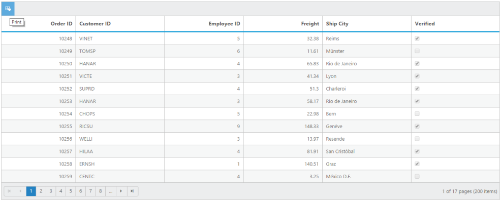

## Print Grid

Printing is easy with Grid control by using Print Grid feature. Toolbar has the Print icon, it allows to print the Grid records. When you click the Print icon, it internally calls the public print() method of Grid object to print the Grid. You can also use print() method manually to print.

[MVC]

[razor]

@(Html.EJ().Grid<OrdersView>("PrintGrid")

        .Datasource((IEnumerable<object>)ViewBag.datasource)

        .ToolbarSettings(toolbar =>

        {

            toolbar.ShowToolbar().ToolbarItems(items =>

            {

                items.AddTool(ToolBarItems.PrintGrid);

            });

        })

        .Columns(col =>

        {

            col.Field("OrderID").HeaderText("Order ID").IsPrimaryKey(true).TextAlign(TextAlign.Right).Add();

            col.Field("CustomerID").HeaderText("Customer ID").Add();

            col.Field("EmployeeID").HeaderText("Employee ID").TextAlign(TextAlign.Right).Width(80).Add();

            col.Field("Freight").HeaderText("Freight").TextAlign(TextAlign.Right). Add();

            col.Field("ShipName").HeaderText("ShipName").Add();

            col.Field("ShipCountry").HeaderText("ShipCountry").Add();

        }))

[Controller]

public partial class GridController : Controller

    {

        //

        // GET: /PrintGrid/

        public ActionResult PrintGrid()

        {

            var DataSource = new NorthwindDataContext().OrdersViews.ToList();

            ViewBag.datasource = DataSource;

            return View();

        }

    }

{  | markdownify }
{:.image }

