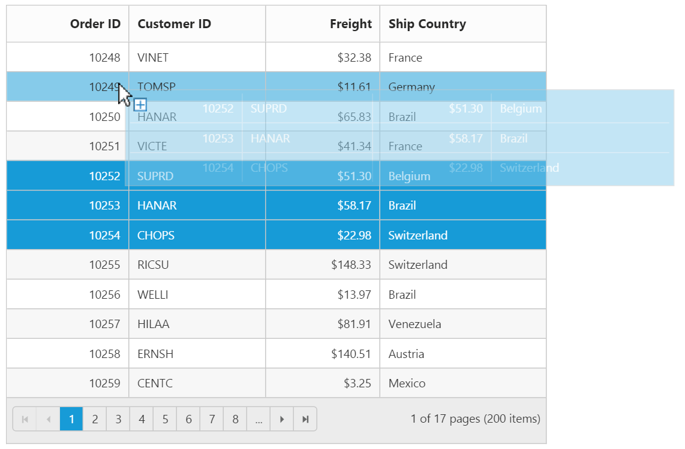
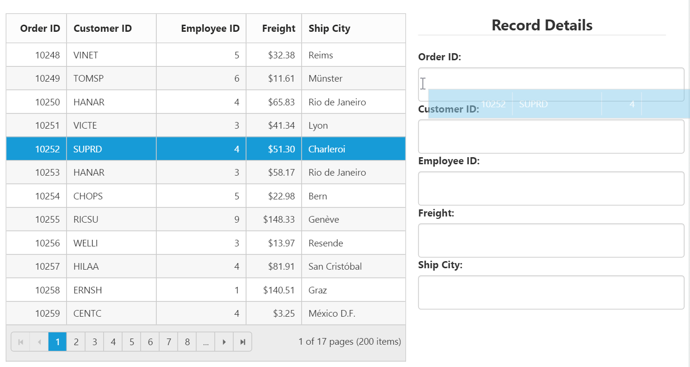
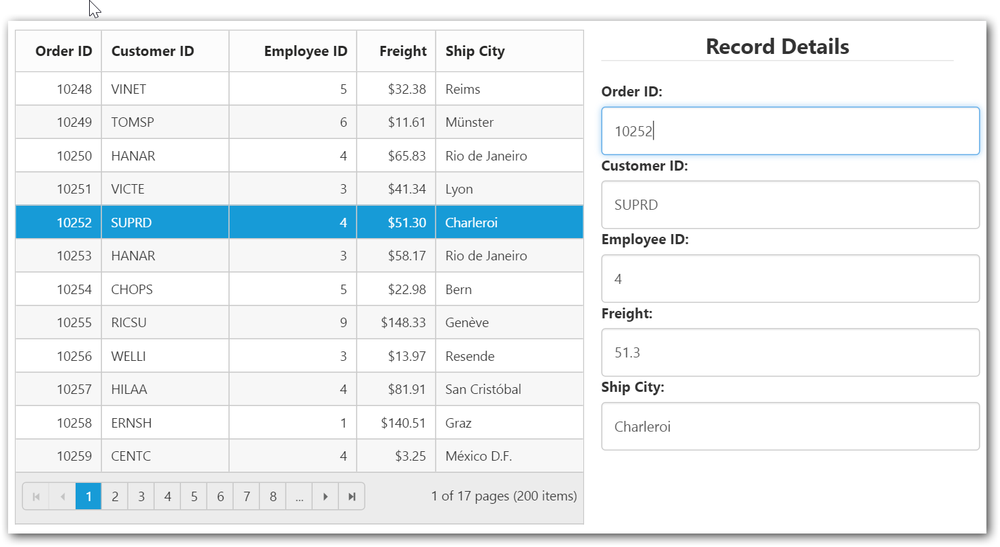

# Row
It represents the record details that are fetched from the datasource.

## Row hover
You can see the mouse hovering effect on the corresponding Grid rows using the `EnableRowHover` property. By default its value is `true`.
The following code example describes the previous behavior.




     @(Html.EJ().Grid<OrdersView>("FlatGrid")
         .Datasource((IEnumerable<object>)ViewBag.datasource)
         .AllowPaging()   
         .EnableRowHover(true)        
         .Columns(col =>
          {
             col.Field("OrderID").Add();
             col.Field("EmployeeID").Add();
             col.Field("ShipCity").Add();
             col.Field("ShipCountry").Add();
             col.Field("Freight").Add();
        }))



     namespace MVCSampleBrowser.Controllers
      {
       public class GridController : Controller
        {
         public ActionResult Default()
          {
            var DataSource = new NorthwindDataContext().OrdersViews.ToList();
            ViewBag.datasource = DataSource;
            return View();
           }
        }
      }

 
The following output is displayed as a result of the previous code example.

## Details template

It provides a detailed view /additional information about each row of the grid. You can render any type of JsRender template and assign the script template id in the `DetailsTemplate` property. Also, you can change HTML elements in detail template row into JavaScript controls using  the `DetailsDataBound ` event.

On enabling details template, new column will be added in the grid with an expander button in it and that can be expanded or collapsed to show or hide the underlying details row respectively.

N> It's a standard way to enclose the template within the `script` tag with `type` as "text/x-jsrender".

The following code example describes the previous behavior.




   @(Html.EJ().Grid<EmployeeView>("DetailTemplate")
          .Datasource((IEnumerable<object>)ViewBag.datasource)
          .DetailsTemplate("#tabGridContents")
          .ClientSideEvents(eve => { eve.DetailsDataBound("detailGridData"); })
          .Columns(col =>
               {
                     col.Field("EmployeeID").Add();
                     col.Field("FirstName").Add();
                     col.Field("Title").Add();
                     col.Field("City").Add();
                     col.Field("Country").Add();
                })
               )



     namespace MVCSampleBrowser.Controllers
       {
         public class GridController : Controller
           { 
             public ActionResult DetailTemplate()
               {
                   var DataSource = new NorthwindDataContext().EmployeeViews.ToList();
                   ViewBag.datasource = DataSource;
                   return View();
                }
           }
      }



   



The following output is displayed as a result of the previous code example.

## Row Template

Row template enables you to set the customized look and behavior to grid all rows. The `RowTemplate` property can be used bind the `id` of HTML template.
The following code example describes the previous behavior.









@(Html.EJ().Grid<EmployeeView>("RowTemplate")
        .Datasource((IEnumerable<object>)ViewBag.datasource)
        .Query("new ej.Query().take(2)")
        .Columns(col =>
            {
                col.HeaderText("Photo").Width(30).Add();
                col.HeaderText("Employee Details").Width(70).Add();
            })
       .RowTemplate("#templateData")    // row template
)


namespace MVCSampleBrowser.Controllers
  {
	   public class GridController : Controller
         {
               public ActionResult RowTemplate()
                {
                     var DataSource = new NorthwindDataContext().EmployeeViews.ToList();
                      ViewBag.datasource = DataSource;
                      return View();
                }
         }
  }



The following output is displayed as a result of the previous code example.

## Alternate row styling

Alternate row styling enhances the readability of grid rows by setting different background color for every alternate row. You can enable the alternative row styling in grid by using the `EnableAltRow` property. 

By default its value is `true`, so the following code example describes the how to turn off alternate row behavior.




   @(Html.EJ().Grid<OrdersView>("Grid")
         .Datasource((IEnumerable<object>)ViewBag.datasource)
         .AllowPaging()
         .EnableAltRow(false)
         .Columns(col =>
            {
               col.Field("OrderID").Add();
               col.Field("EmployeeID").Add();
               col.Field("ShipCity").Add();
               col.Field("ShipCountry").Add();
               col.Field("Freight").Add();
            })
)



     namespace MVCSampleBrowser.Controllers
      {
        public class GridController : Controller
         {
           public ActionResult Default()
            {
               var DataSource = new NorthwindDataContext().OrdersViews.ToList();
               ViewBag.datasource = DataSource;
               return View();
            }
        }
     }

 
The following output is displayed as a result of the previous code example.

## Drag-and-Drop

The grid rows can be reordered, dropped to another grid or custom control by enabling the `AllowRowDragAndDrop` grid property.

N> To enable selection of multiple rows by mouse dragging on grid rows, the `SelectionType` property of grid must be set to the “multiple”.

### Reorder

By simply enabling the property `AllowRowDragAndDrop`, grid rows can be reordered within the same grid.

The following code example describes the previous behavior.




@(Html.EJ().Grid<OrdersView>("Grid")
        .Datasource(datasource => datasource.Json((IEnumerable<object>)ViewBag.datasource).Adaptor(AdaptorType.RemoteSaveAdaptor))
        .AllowSorting()
        .AllowPaging()
        .SelectionType(SelectionType.Multiple)
        .AllowRowDragAndDrop()
        .RowDropSettings(drop => drop.RowDropMapper("RowDropHandler"))
        .Columns(col =>
        {
            col.Field("OrderID").HeaderText("Order ID").IsPrimaryKey(true).TextAlign(TextAlign.Right).Width(75).Add();
            col.Field("CustomerID").HeaderText("Customer ID").Width(80).Add();
            col.Field("EmployeeID").HeaderText("Employee ID").TextAlign(TextAlign.Right).Width(75).Add();
            col.Field("Freight").HeaderText("Freight").TextAlign(TextAlign.Right).Width(75).Format("{0:C}").Add();
            col.Field("ShipCity").HeaderText("Ship City").Width(110).Add();
        })
)



     namespace MVCSampleBrowser.Controllers
      {
        public class GridController : Controller
         {
           public ActionResult Default()
            {
               ViewBag.datasource =OrderRepository.GetAllRecords();
               return View();
            }
            public ActionResult RowDropHandler(List<EditableOrder> changed)
            {
                JavaScriptSerializer ser = new JavaScriptSerializer();
                RowDropModel dropDetails = (RowDropModel)ser.Deserialize(Request.Headers["rowDropDetails"], typeof(RowDropModel));
                var count = 0;
                foreach (var item in changed)
                {
                    EditableOrder result = OrderRepository.GetAllRecords().Where(o => o.OrderID == item.OrderID).FirstOrDefault();
                    OrderRepository.GetAllRecords().Remove(result);
                    OrderRepository.GetAllRecords().Insert(dropDetails.DestinationRowIndex + count, item);
                    count++;
                }
                return Json(changed, JsonRequestBehavior.AllowGet);
           }

        }
     }

 

The following output is displayed before reordering rows. 

{:Before Drop}

The following output is displayed after reordering rows.

{:After Drop}

### Grid-to-grid

To drag and drop rows between two grid, enable the grid property `AllowRowDragAndDrop` and specify the target grid ID in `DropTargetID` property of the grid `RowDropSettings`.

Dragged and Dropped rows can be mapped to server-side using the `RowDragMapper` and `RowDropMapper` property of grid `RowDropSettings`.

The following code example describes the previous behavior.




    @(Html.EJ().Grid<OrdersView>("Grid")
        .Datasource(datasource => datasource.Json((IEnumerable<object>)ViewBag.datasource).Adaptor(AdaptorType.RemoteSaveAdaptor))
        .AllowSorting()
        .AllowPaging()
        .SelectionType(SelectionType.Multiple)
        .AllowRowDragAndDrop()
        .RowDropSettings(drop => drop.RowDragMapper("RowDragHandler").RowDropMapper("RowDropHandler").DropTargetID("#DesignationGrid"))
        .Columns(col =>
        {
            col.Field("OrderID").HeaderText("Order ID").IsPrimaryKey(true).TextAlign(TextAlign.Right).Width(75).Add();
            col.Field("CustomerID").HeaderText("Customer ID").Width(80).Add();
            col.Field("EmployeeID").HeaderText("Employee ID").TextAlign(TextAlign.Right).Width(75).Add();
            col.Field("Freight").HeaderText("Freight").TextAlign(TextAlign.Right).Width(75).Format("{0:C}").Add();
            col.Field("ShipCity").HeaderText("Ship City").Width(110).Add();
        }))
    

    @(Html.EJ().Grid<OrdersView>("DesignationGrid")
        .Datasource(datasource => datasource.Json((IEnumerable<object>)ViewBag.datasource2).Adaptor(AdaptorType.RemoteSaveAdaptor))
        .AllowSorting()
        .AllowPaging()
        .SelectionType(SelectionType.Multiple)
        .AllowRowDragAndDrop()
        .RowDropSettings(drop => drop.RowDragMapper("RowDragHandler2").RowDropMapper("RowDropHandler2").DropTargetID("#Grid"))
        .Columns(col =>
        {
            col.Field("OrderID").HeaderText("Order ID").IsPrimaryKey(true).TextAlign(TextAlign.Right).Width(75).Add();
            col.Field("CustomerID").HeaderText("Customer ID").Width(80).Add();
            col.Field("EmployeeID").HeaderText("Employee ID").TextAlign(TextAlign.Right).Width(75).Add();
            col.Field("Freight").HeaderText("Freight").TextAlign(TextAlign.Right).Width(75).Format("{0:C}").Add();
            col.Field("ShipCity").HeaderText("Ship City").Width(110).Add();
        }))
    




     namespace MVCSampleBrowser.Controllers
{
    public partial class GridController : Controller
    {

        JavaScriptSerializer ser = new JavaScriptSerializer();
        public ActionResult DragAndDrop()
        {
           
            ViewBag.datasource2 = OrderRepository.GetAllRecords2();  
            ViewBag.datasource = OrderRepository.GetAllRecords();
            return View();
        }

        public ActionResult RowDragHandler(List<EditableOrder> deleted)
        {
            OrderRepository.Delete(deleted);
            return Json(deleted, JsonRequestBehavior.AllowGet);
        }
        public ActionResult RowDragHandler2(List<EditableOrder> deleted)
        {
            OrderRepository.Delete2(deleted);
            return Json(deleted, JsonRequestBehavior.AllowGet);
        }

        public ActionResult RowDropHandler(List<EditableOrder> added)
        {
            RowDropModel dropDetails = (RowDropModel)ser.Deserialize(Request.Headers["rowDropDetails"], typeof(RowDropModel));
            var count = 0;
            var data = OrderRepository.GetAllRecords();
            if (added != null)
            {
                foreach (var item in added)
                {
                    data.Insert(dropDetails.DestinationRowIndex + count, item);
                    count++;
                }
            }
            return Json(added, JsonRequestBehavior.AllowGet);
        }
        public ActionResult RowDropHandler2(List<EditableOrder> added)
        {
            RowDropModel dropDetails = (RowDropModel)ser.Deserialize(Request.Headers["rowDropDetails"], typeof(RowDropModel));
            var count = 0;
            var data = OrderRepository.GetAllRecords2();
            foreach (var item in added)
            {
                data.Insert(dropDetails.DestinationRowIndex + count, item);
                count++;
            }
            return Json(added, JsonRequestBehavior.AllowGet);
        }

    }
}


 

The following output is displayed before dropping grid rows.

{:Before Drop}

The following output is displayed after dropping grid rows.

{:After Drop}

### Grid-to-custom control

You can also drag and drop grid rows to any custom control. For instance, let it be a form.

Enable the grid property `AllowRowDragAndDrop` and specify the target form element ID in `DropTargetID` property of grid `RowDropSettings`.

On dropping the grid records on form element, grid event “RowDrop” would be triggered by which we can populate input elements in form.

The following code example describes the previous behavior.




    @(Html.EJ().Grid<OrdersView>("Grid")
        .Datasource(datasource => datasource.Json((IEnumerable<object>)ViewBag.datasource).Adaptor(AdaptorType.RemoteSaveAdaptor))
        .AllowSorting()
        .AllowPaging()
        .AllowRowDragAndDrop()
        .RowDropSettings(drop => drop.DropTargetID("#DropForm"))
        .ClientSideEvents(eve => eve.RowDrop("rowDropHandler"))
        .Columns(col =>
        {
            col.Field("OrderID").HeaderText("Order ID").IsPrimaryKey(true).TextAlign(TextAlign.Right).Width(75).Add();
            col.Field("CustomerID").HeaderText("Customer ID").Width(80).Add();
            col.Field("EmployeeID").HeaderText("Employee ID").TextAlign(TextAlign.Right).Width(75).Add();
            col.Field("Freight").HeaderText("Freight").TextAlign(TextAlign.Right).Width(75).Format("{0:C}").Add();
            col.Field("ShipCity").HeaderText("Ship City").Width(110).Add();
        }))
    

    <form role="form" id="dropForm" style="width:98%">
        <fieldset style="text-align:center; font-weight:700"><legend>Record Details</legend></fieldset>
        

            <label for="OrderID">Order ID:</label>
            <input class="form-control" name="OrderID">
        

        

            <label for="CustomerID">Customer ID:</label>
            <input name="CustomerID" class="form-control">
        

        

            <label for="EmployeeID">Employee ID:</label>
            <input name="EmployeeID" class="form-control">
        

        

            <label for="Freight">Freight:</label>
            <input name="Freight" class="form-control">
        

        

            <label for="ShipCity">Ship City:</label>
            <input name="ShipCity" class="form-control">
        

         
    </form>




     namespace MVCSampleBrowser.Controllers
      {
        public class GridController : Controller
         {
           public ActionResult Default()
            {
               ViewBag.datasource =OrderRepository.GetAllRecords();
               return View();
            }
        }
     }




 

The following output is displayed before dropping the rows on form.

{:Before Drop}

The following output is displayed after dropping the rows on form.

{:After Drop}

N>   The default behavior of drag and drop between grid or any other controls is as cut and paste. For copy and paste behavior specify the drag behavior in the `DragBehavior` property of `RowDropSettings` as "DragBehavior.Copy".