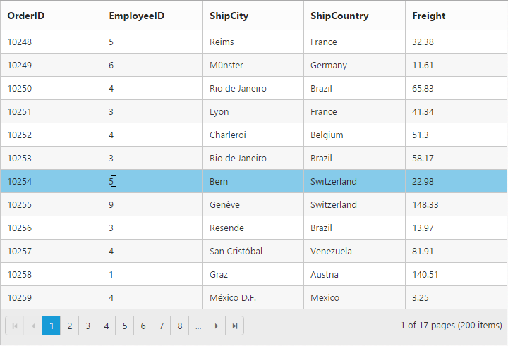

## Row

### Details Template

Details Template feature provides a detailed view about additional information of each row. If you want to view the detailed information, you can expand a row. To enable Details Template, used DetailsTemplate property of Grid as follows:

[MVC]

[razor]

&lt;script id="tabGridContents" type="text/x-jsrender"&gt;

    &lt;div id="contact{{:EmployeeID}}" style="font-weight:bold; padding:5px;"&gt;

        &lt;div id="cont"&gt;

            contact:{{:Address}}&lt;br /&gt;

            city:{{:City}}&lt;br /&gt;

            Country:{{:Country}}&lt;br /&gt;

            phone:{{:HomePhone}}&lt;br /&gt;

        &lt;/div&gt;

    &lt;/div&gt;

&lt;/script&gt;

@(Html.EJ().Grid<EmployeeView>("DetailTemplate")

.Datasource((IEnumerable<object>)ViewBag.datasource)

.AllowPaging()

   .DetailsTemplate("#tabGridContents") // detail template

 )

[controller]

namespace MVCSampleBrowser.Controllers

{

    public partial class GridController : Controller

    {

        public ActionResult DetailTemplate()

        {

            var DataSource = new NorthwindDataContext().EmployeeViews.Take(9).ToList();

            ViewBag.datasource = DataSource;

            return View();

        }

    }

}

The following output is displayed as a result of the above code example.

{  | markdownify }
{:.image }

### Hierarchy

In this section, you can learn how to use the Hierachytree in GridView. The following code example is of HierachyGrid.

[MVC]

[razor]

@(Html.EJ().Grid<EmployeeView>("DetailTemplate")

.Datasource((IEnumerable<object>)ViewBag.datasource)

.DetailsTemplate("#tabGridContents")

.ClientSideEvents(eve => { eve.DetailsDataBound ("detailGridData"); })

)

&lt;script src="~/Scripts/jsondata.min.js"&gt;&lt;/script&gt;

&lt;script id="tabGridContents" type="text/x-jsrender"&gt;

&lt;div class="tabcontrol" id="Test"&gt;

&lt;div id="detailGrid"&gt;

&lt;/div&gt;

&lt;label id="employeeDet" style="display: none"&gt;{{:EmployeeID}}&lt;/label&gt;

&lt;/div&gt;

&lt;/script&gt;

&lt;script type="text/javascript"&gt;

function detailGridData(e) {

var filteredData = e.detailsElement.find("#employeeDet").text();

// the datasource "window.ordersView" is referred from jsondata.min.js

var data = ej.DataManager(window.ordersView).executeLocal(ej.Query().where("EmployeeID", "equal", parseInt(filteredData), true));

e.detailsElement.find("#detailGrid").ejGrid({

dataSource: data,

});

}

&lt;/script&gt;

[controller]

namespace MVCSampleBrowser.Controllers

{

public partial class GridController : Controller

{

//

// GET: /DetailTemplate/

public ActionResult DetailTemplate()

{

var DataSource = new NorthwindDataContext().EmployeeViews.Take(9).ToList();

ViewBag.datasource = DataSource;

return View();

}

}

}

The following output is displayed as a result of the above code example.

{  | markdownify }
{:.image }

### Row Template

RowTemplate is used to render your template in every row. It is used to place elements inside Grid rows. This feature makes it easier to customise Grid rows with HTML elements.

[MVC]

[razor]

&lt;script id="templateData" type="text/x-jsrender"&gt;

&lt;tr&gt;

&lt;td class="photo"&gt;

&lt;img style="width:130px;height: 160px" src="http://js.syncfusion.com/demos/web/themes/images/Employees//{{:EmployeeID}}.png" alt="{{:EmployeeID}}" /&gt;

&lt;/td&gt;

&lt;td class="details"&gt;

&lt;table class="CardTable" cellpadding="3" cellspacing="6"&gt;

&lt;colgroup&gt;

&lt;col width="50%"&gt;

&lt;col width="50%"&gt;

&lt;/colgroup&gt;

&lt;tbody&gt;

&lt;tr&gt;

<td class="CardHeader">First Name: &lt;/td&gt;

&lt;td style="padding:20px"&gt;{{:FirstName}} &lt;/td&gt;

&lt;/tr&gt;

&lt;tr&gt;

&lt;td class="CardHeader"&gt;

Birth Date:

&lt;/td&gt;

&lt;td style="padding:20px"&gt;

{{:BirthDate.toLocaleDateString()}}

&lt;/td&gt;

&lt;/tr&gt;

&lt;tr&gt;

&lt;td class="CardHeader"&gt;

Hire Date:

&lt;/td&gt;

&lt;td style="padding:20px"&gt;

{{:HireDate.toLocaleDateString()}}

&lt;/td&gt;

&lt;/tr&gt;

&lt;/tbody&gt;

&lt;/table&gt;

&lt;/td&gt;

&lt;/tr&gt;

&lt;/script&gt;

&lt;style&gt;

.CardHeader {

font-weight:bold;

font-size:14px;

padding:20px;

}

&lt;/style&gt;

@(Html.EJ().Grid<EmployeeView>("RowTemplate")

.Datasource((IEnumerable<object>)ViewBag.datasource)

.ScrollSettings(scroll => scroll.Height(480).Width(500))

.Columns(col =>

{

col.HeaderText("photo").TextAlign(TextAlign.Center).Width(30).Add();

col.HeaderText("Employee Details").TextAlign(TextAlign.Left).Width(70).Add();

})

.RowTemplate("#templateData")    // row template

)

[controller]

namespace MVCSampleBrowser.Controllers

{

public partial class GridController : Controller

{

public ActionResult RowTemplate()

{

var DataSource = new NorthwindDataContext().EmployeeViews.ToList();

ViewBag.datasource = DataSource;

return View();

}

}

}

The following output is displayed as a result of the above code example.

{  | markdownify }
{:.image }

### Customize Hover and AltRow 

EnableAltRow and EnableRowHover are graphical features in Grid that are used to enable alternate row color in Grid and enable hover effects while hovering over row cells. By default, these two features are enabled in Grid. In this section, you can learn how to cutomize alternative rows color and hover color in the ejGrid controls.

[MVC]

[razor]

@*custom style*@

&lt;style&gt;

.e-grid .e-alt_row {

        background-color: lightgreen !important;

    }

.e-grid .e-hover {

        background: black !important;

    }

&lt;/style&gt;

@(Html.EJ().Grid<OrdersView>("FlatGrid")

.Datasource((IEnumerable<object>)ViewBag.datasource)

    .AllowPaging()

    .PageSettings(page => page.PageSize(5))

.EnableAltRow (true)

    .EnableRowHover(true)

    )

[controller]

namespace MVCSampleBrowser.Controllers

{

    public partial class GridController : Controller

    {

        public ActionResult Default()

        {

            var DataSource = new NorthwindDataContext().OrdersViews.ToList();

            ViewBag.datasource = DataSource;

            return View();

        }

    }

}

The following output is displayed as a result of the above code example.

{  | markdownify }
{:.image }

