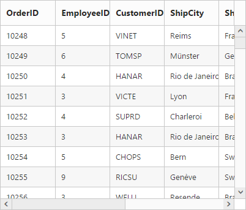
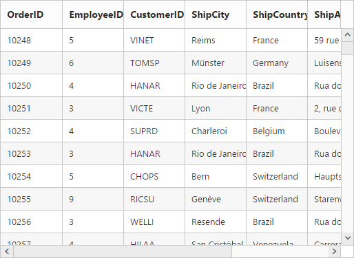
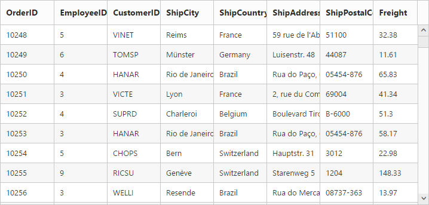
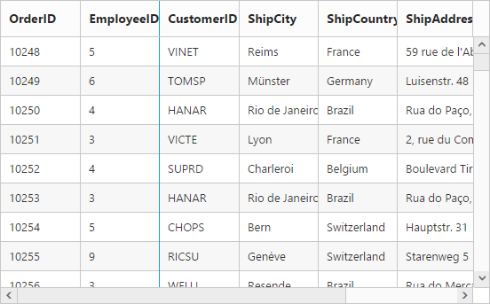
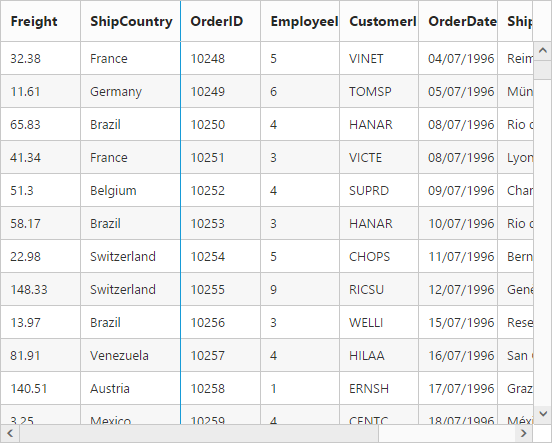
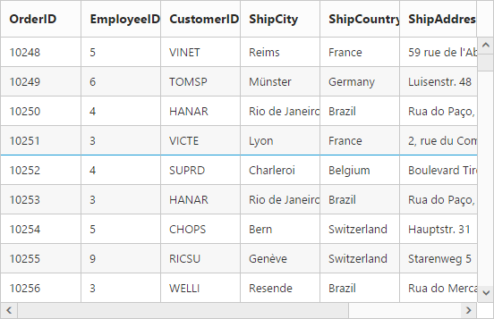

# Scrolling

## Default Scrolling

Scrolling is an important feature in Grid. It makes Grid more compatible with layout and design. The AllowScrolling property is used to enable scrolling functionality to the Grid. The default value for AllowScrolling is false.

In this following code example, ScrollSettings property is used to adjust the Grid width and height. 


[MVC]

[cshtml]

    @(Html.EJ().Grid<object>("Grid")

        .Datasource((IEnumerable<object>)ViewBag.dataSource)

.AllowScrolling(true)

        .ScrollSettings(scroll => scroll.Width(886).Height(300))

        .Columns(col =>

        {

            col.Field("OrderID").HeaderText("Order ID").TextAlign(TextAlign.Right).Width(100).Add();

            col.Field("CustomerID").HeaderText("Customer ID").Width(100).Add();

            col.Field("EmployeeID").HeaderText("Employee ID").TextAlign(TextAlign.Right).Width(100).Add();

            col.Field("Freight").HeaderText("Freight").TextAlign(TextAlign.Right).Format("{0:C}").Width(100).Add();

            col.Field("ShipCity").HeaderText("Ship City").Width(100).Add();

            col.Field("ShipName").HeaderText("Ship Name").Width(100).Add();

            col.Field("OrderDate").HeaderText("Order Date").TextAlign(TextAlign.Right).Format("{0:MM/dd/yyyy}").Width(100).Add();

            col.Field("ShipCountry").HeaderText("Ship Country").Width(100).Add();

            col.Field("ShipPostalCode").HeaderText("Postal Code").TextAlign(TextAlign.Right).Width(100).Add();

            col.Field("Verified").HeaderText("Verified").Width(100).Add();

        })

)




[Controller]

public partial class GridController : Controller

    {

        //

        // GET: /VirtualPaging/ 

        public ActionResult VirtualPaging()

        {

            var DataSource = new NorthwindDataContext().OrdersViews.ToList();

            ViewBag.datasource = DataSource;

            return View();

        } 

    }



The following output is displayed as a result of the above code example.

## Scroll Settings

The ScrollSettings contains the properties to enable scrolling related functionalities in the Grid.

### To Enable Vertical Scrolling

The Height property in the ScrollSettings is used to enable the vertical scroll bar in the Grid. The scroll height should be less than the Grid content height. That is, total rows height for enabling vertical scroll bar.

The Height property can support percentage, pixel and auto values in ScrollSettings. The default value for height in ScrollSettings is 0.

The following code example illustrates how to enable vertical scrolling in the Grid. 



[MVC]

[cshtml]

    @(Html.EJ().Grid<object>("Grid")

        .Datasource((IEnumerable<object>)ViewBag.dataSource)

.AllowScrolling(true)

        .ScrollSettings(scroll => scroll.Height(300))

        .Columns(col =>

        {

            col.Field("OrderID").HeaderText("Order ID").TextAlign(TextAlign.Right).Width(100).Add();

            col.Field("CustomerID").HeaderText("Customer ID").Width(100).Add();

            col.Field("EmployeeID").HeaderText("Employee ID").TextAlign(TextAlign.Right).Width(100).Add();

            col.Field("Freight").HeaderText("Freight").TextAlign(TextAlign.Right).Format("{0:C}").Width(100).Add();

            col.Field("ShipCity").HeaderText("Ship City").Width(100).Add();

            col.Field("ShipName").HeaderText("Ship Name").Width(100).Add();

            col.Field("OrderDate").HeaderText("Order Date").TextAlign(TextAlign.Right).Format("{0:MM/dd/yyyy}").Width(100).Add();

            col.Field("ShipCountry").HeaderText("Ship Country").Width(100).Add();

            col.Field("ShipPostalCode").HeaderText("Postal Code").TextAlign(TextAlign.Right).Width(100).Add();

            col.Field("Verified").HeaderText("Verified").Width(100).Add();

        })

)



[Controller]

public partial class GridController : Controller

    {

        //

        // GET: /VirtualPaging/ 

        public ActionResult VirtualPaging()

        {

            var DataSource = new NorthwindDataContext().OrdersViews.ToList();

            ViewBag.datasource = DataSource;

            return View();

        } 

    }



The following output is displayed as a result of the above code example.

### To Enable Horizontal Scrolling

The Width property in the ScrollSettings is used to enable the horizontal scroll bar in the Grid. The scroll width should be less than the Grid content width. That is, total columns width for enabling horizontal scroll bar.

The Width property can support percentage, pixel and auto values in ScrollSettings. The default value for width in ScrollSettings is auto. The default Grid content width is 100%, when you don’t specify the width to the columns it takes its width value from the Grid content.

When you set Width as auto, it renders Grid with browser calculate value.

The following code example illustrates how to enable horizontal scrolling in the Grid. 


[MVC]

[cshtml]

    @(Html.EJ().Grid<object>("Grid")

        .Datasource((IEnumerable<object>)ViewBag.dataSource)

.AllowScrolling(true)

        .ScrollSettings(scroll => scroll.Width(800))

        .Columns(col =>

        {

            col.Field("OrderID").HeaderText("Order ID").TextAlign(TextAlign.Right).Width(100).Add();

            col.Field("CustomerID").HeaderText("Customer ID").Width(100).Add();

            col.Field("EmployeeID").HeaderText("Employee ID").TextAlign(TextAlign.Right).Width(100).Add();

            col.Field("Freight").HeaderText("Freight").TextAlign(TextAlign.Right).Format("{0:C}").Width(100).Add();

            col.Field("ShipCity").HeaderText("Ship City").Width(100).Add();

            col.Field("ShipName").HeaderText("Ship Name").Width(100).Add();

            col.Field("OrderDate").HeaderText("Order Date").TextAlign(TextAlign.Right).Format("{0:MM/dd/yyyy}").Width(100).Add();

            col.Field("ShipCountry").HeaderText("Ship Country").Width(100).Add();

            col.Field("ShipPostalCode").HeaderText("Postal Code").TextAlign(TextAlign.Right).Width(100).Add();

            col.Field("Verified").HeaderText("Verified").Width(100).Add();

        })

)



[Controller]

public partial class GridController : Controller

    {

        //

        // GET: /VirtualPaging/ 

        public ActionResult VirtualPaging()

        {

            var DataSource = new NorthwindDataContext().OrdersViews.ToList();

            ViewBag.datasource = DataSource;

            return View();

        } 

    }



The following output is displayed as a result of the above code example.

## Virtual scrolling on demand

Virtual scrolling is powerful technique in Grid. It makes Grid more compatible with layout and its loading record performance is high. The AllowVirtualScrolling property in ScrollSettings is used to enable virtual scroll functionality in the Grid. The default value for AllowVirtualScrolling is false.

Essential JavaScriptGrid supports two mode of virtualization. They are,

* Normal Mode
* Continuous Mode

### Normal Mode

This feature allows you to load the Grid with data while scrolling. The following code example illustrates how to set VirtualScrollMode as Normal.



[MVC]

[cshtml]

@(Html.EJ().Grid<OrdersView>("Grid")

      .Datasource((IEnumerable<object>)ViewBag.datasource)

      .AllowScrolling()      

      .ScrollSettings(scroll => { scroll.AllowVirtualScrolling().Height(0).Width(300).VirtualScrollMode(VirtualScrollMode.Normal); })

      .Columns(col =>

      {

            col.Field("OrderID").HeaderText("Order ID").IsPrimaryKey(true).TextAlign(TextAlign.Right).Add();

            col.Field("CustomerID").HeaderText("Customer ID").Width(100).Add();

            col.Field("EmployeeID").HeaderText("Employee ID").TextAlign(TextAlign.Right).Add();

             col.Field("Freight").HeaderText("Freight").TextAlign(TextAlign.Right).Format("{0:C}")

            .Add();

            col.Field("ShipCity").HeaderText("Ship City").Add();

            col.Field("ShipName").HeaderText("Ship Name").Add();

      })

      )



[Controller]

public partial class GridController : Controller

    {

        //

        // GET: /VirtualPaging/ 

        public ActionResult VirtualPaging()

        {

            var DataSource = new NorthwindDataContext().OrdersViews.ToList();

            ViewBag.datasource = DataSource;

            return View();

        } 

    }


The following screenshot displays the Grid while scrolling. The request is sent to the server to fetch data.

The following screenshot displays the Grid after it is loaded with data.

### Continuous Mode

You can enable the continuous mode by setting the VirtualScrollMode property as Continuous. In Continuous mode, the data is loaded in Grid when the scrollbar reaches the end. The following code example illustrates how to set the continuous mode in virtualization.


[MVC] 

[cshtml]

@(Html.EJ().Grid<OrdersView>("Grid")

      .Datasource((IEnumerable<object>)ViewBag.datasource)

      .AllowScrolling()      

      .ScrollSettings(scroll => { scroll.AllowVirtualScrolling().Height(0).Width(300).VirtualScrollMode(VirtualScrollMode.Continuous); })

      .Columns(col =>

      {

            col.Field("OrderID").HeaderText("Order ID").IsPrimaryKey(true).TextAlign(TextAlign.Right).Add();

            col.Field("CustomerID").HeaderText("Customer ID").Width(100).Add();

            col.Field("EmployeeID").HeaderText("Employee ID").TextAlign(TextAlign.Right).Add();

             col.Field("Freight").HeaderText("Freight").TextAlign(TextAlign.Right).Format("{0:C}")

            .Add();

            col.Field("ShipCity").HeaderText("Ship City").Add();

            col.Field("ShipName").HeaderText("Ship Name").Add();

      })

      )



[Controller]

public partial class GridController : Controller

    {      

        public ActionResult VirtualPaging()

        {

            var DataSource = new NorthwindDataContext().OrdersViews.ToList();

            ViewBag.datasource = DataSource;

            return View();

        }

    }



The following screenshot illustrates the request made to fetch the data after the Grid scrollbar touches the end.

The following screenshot illustrates the Grid after the data is loaded.

