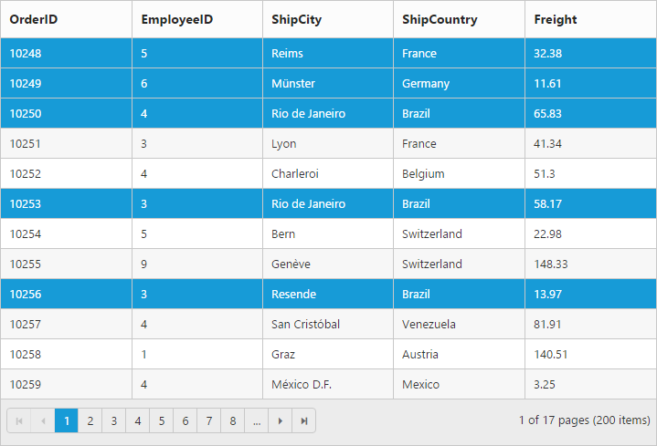
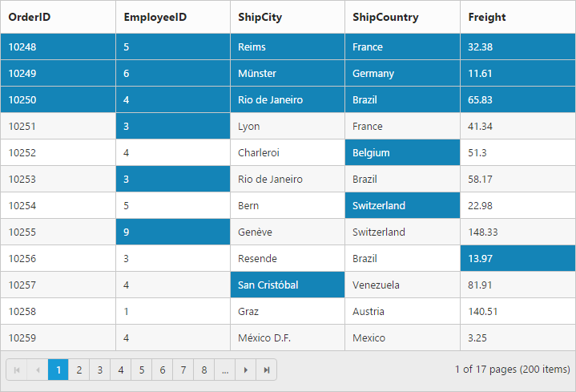
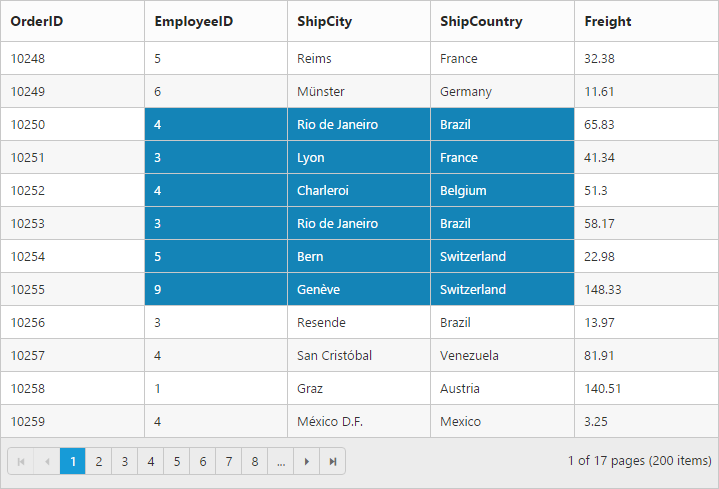
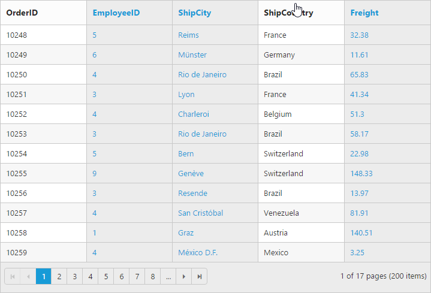

## Selection

The Selection property is used to highlight a row that you select. 

### Types of selection

 There are two types of Selections. 

* Single
* Multiple

Single selection is used to select a single row, cell or column in Grid. In Multiple selection you can select more than one row, cell or column. Refer to the following code examples of Selection types.

#### Single Selection

By default, the selection type is “Single”.

##### Selection Modes

Row

By default, the selection mode of the grid is “Row”. This enables you to select the row in the grid. Refer to the following code example.

[MVC]

[controller]

using MVCSampleBrowser.Models;

using System;

using System.Collections.Generic;

using System.Linq;

using System.Web;

using System.Web.Mvc;

namespace MVCSampleBrowser.Controllers

{

    public partial class GridController : Controller

    {

        //

        // GET: /Default/

        public ActionResult Default()

        {

            var DataSource = OrderRepository.GetAllRecords();

            ViewBag.datasource = DataSource;

            return View();

        }

    }

}

[razor]

@(Html.EJ().Grid<OrdersView>("Grid")

        .Datasource((IEnumerable<object>)ViewBag.datasource)

.AllowSelection()

        .AllowPaging()

.SelectionSettings(sel=>{sel.SelectionMode(SelectionMode.Row);})      

        .Columns(col =>

        {

            col.Field("OrderID").HeaderText("Order ID").IsPrimaryKey(true).TextAlign(TextAlign.Right).Width(75).Add();

            col.Field("CustomerID").HeaderText("Customer ID").Width(80).Add();

            col.Field("EmployeeID").HeaderText("Employee ID").TextAlign(TextAlign.Right).Width(75).Add();

            col.Field("Freight").HeaderText("Freight").TextAlign(TextAlign.Right).Width(75).Format("{0:C}").Add();

            col.Field("OrderDate").HeaderText("Order Date").TextAlign(TextAlign.Right).Width(80).Format("{0:MM/dd/yyyy}").Add();

            col.Field("ShipCity").HeaderText("Ship City").Width(110).Add();

        })

        )

The following screenshot displays the result of the above code.

{  | markdownify }
{:.image }

Cell

Cell selection can be enabled using the SelectionMode property. This enables you to select a cell in the grid. Refer to the following code example.

[MVC]

[controller]

using MVCSampleBrowser.Models;

using System;

using System.Collections.Generic;

using System.Linq;

using System.Web;

using System.Web.Mvc;

namespace MVCSampleBrowser.Controllers

{

    public partial class GridController : Controller

    {

        //

        // GET: /Default/

        public ActionResult Default()

        {

            var DataSource = OrderRepository.GetAllRecords();

            ViewBag.datasource = DataSource;

            return View();

        }

    }

}

[razor]

@(Html.EJ().Grid<OrdersView>("Grid")

        .Datasource((IEnumerable<object>)ViewBag.datasource)

        .AllowSelection()

        .AllowPaging() 

        .SelectionSettings(sel=>{sel.SelectionMode(SelectionMode.Cell);})

        .Columns(col =>

        {

            col.Field("OrderID").HeaderText("Order ID").IsPrimaryKey(true).TextAlign(TextAlign.Right).Width(75).Add();

            col.Field("CustomerID").HeaderText("Customer ID").Width(80).Add();

            col.Field("EmployeeID").HeaderText("Employee ID").TextAlign(TextAlign.Right).Width(75).Add();

            col.Field("Freight").HeaderText("Freight").TextAlign(TextAlign.Right).Width(75).Format("{0:C}").Add();

            col.Field("OrderDate").HeaderText("Order Date").TextAlign(TextAlign.Right).Width(80).Format("{0:MM/dd/yyyy}").Add();

            col.Field("ShipCity").HeaderText("Ship City").Width(110).Add();

        })

        )

The following screenshot displays the result of the above code.

{  | markdownify }
{:.image }

Column

Column selection can be enabled using the SelectionMode property. This enables you to select a particular column in the grid. Refer to the following code example.

[MVC]

[controller]

using MVCSampleBrowser.Models;

using System;

using System.Collections.Generic;

using System.Linq;

using System.Web;

using System.Web.Mvc;

namespace MVCSampleBrowser.Controllers

{

    public partial class GridController : Controller

    {

        //

        // GET: /Default/

        public ActionResult Default()

        {

            var DataSource = OrderRepository.GetAllRecords();

            ViewBag.datasource = DataSource;

            return View();

        }

    }

}

[razor]

@(Html.EJ().Grid<OrdersView>("Grid")

        .Datasource((IEnumerable<object>)ViewBag.datasource)

.AllowSelection()

        .AllowPaging()

        .SelectionSettings(sel=>{sel.SelectionMode(SelectionMode.Column);})

        .Columns(col =>

        {

            col.Field("OrderID").HeaderText("Order ID").IsPrimaryKey(true).TextAlign(TextAlign.Right).Width(75).Add();

            col.Field("CustomerID").HeaderText("Customer ID").Width(80).Add();

            col.Field("EmployeeID").HeaderText("Employee ID").TextAlign(TextAlign.Right).Width(75).Add();

            col.Field("Freight").HeaderText("Freight").TextAlign(TextAlign.Right).Width(75).Format("{0:C}").Add();

            col.Field("OrderDate").HeaderText("Order Date").TextAlign(TextAlign.Right).Width(80).Format("{0:MM/dd/yyyy}").Add();

            col.Field("ShipCity").HeaderText("Ship City").Width(110).Add();

        })

        )

The following screenshot displays the result of the above code.

{  | markdownify }
{:.image }

#### Multiple Selection

Multiple selection can be enabled using SelectionType property. This allows you to select more than one row, cell and column at a time.

##### Selection Modes

Row

By default, the selection mode of the grid is “Row”. This enable you to select the row in the grid. Refer to the following code example.

[controller]

using MVCSampleBrowser.Models;

using System;

using System.Collections.Generic;

using System.Linq;

using System.Web;

using System.Web.Mvc;

namespace MVCSampleBrowser.Controllers

{

    public partial class GridController : Controller

    {

        //

        // GET: /Default/

        public ActionResult Default()

        {

            var DataSource = OrderRepository.GetAllRecords();

            ViewBag.datasource = DataSource;

            return View();

        }

    }

}

[razor]

@(Html.EJ().Grid<OrdersView>("Grid")

        .Datasource((IEnumerable<object>)ViewBag.datasource)

        .AllowSelection()

        .AllowPaging()

        .SelectionType(SelectionType.Multiple)

.SelectionSettings(sel=>{sel.SelectionMode(SelectionMode.Row);})      

        .Columns(col =>

        {

            col.Field("OrderID").HeaderText("Order ID").IsPrimaryKey(true).TextAlign(TextAlign.Right).Width(75).Add();

            col.Field("CustomerID").HeaderText("Customer ID").Width(80).Add();

            col.Field("EmployeeID").HeaderText("Employee ID").TextAlign(TextAlign.Right).Width(75).Add();

            col.Field("Freight").HeaderText("Freight").TextAlign(TextAlign.Right).Width(75).Format("{0:C}").Add();

            col.Field("OrderDate").HeaderText("Order Date").TextAlign(TextAlign.Right).Width(80).Format("{0:MM/dd/yyyy}").Add();

            col.Field("ShipCity").HeaderText("Ship City").Width(110).Add();

        })

        )

The following screenshot displays the result of the above code.

{  | markdownify }
{:.image }

Cell

Cell selection can be enabled using the SelectionMode property. This enables you to select a cell in the grid. Refer to the following code example.

[controller]

using MVCSampleBrowser.Models;

using System;

using System.Collections.Generic;

using System.Linq;

using System.Web;

using System.Web.Mvc;

namespace MVCSampleBrowser.Controllers

{

    public partial class GridController : Controller

    {

        //

        // GET: /Default/

        public ActionResult Default()

        {

            var DataSource = OrderRepository.GetAllRecords();

            ViewBag.datasource = DataSource;

            return View();

        }

    }

}

[razor]

@(Html.EJ().Grid<OrdersView>("Grid")

        .Datasource((IEnumerable<object>)ViewBag.datasource)

        .AllowSelection()

        .AllowPaging() 

        .SelectionType(SelectionType.Multiple)

        .SelectionSettings(sel=>{sel.SelectionMode(SelectionMode.Cell);})

        .Columns(col =>

        {

            col.Field("OrderID").HeaderText("Order ID").IsPrimaryKey(true).TextAlign(TextAlign.Right).Width(75).Add();

            col.Field("CustomerID").HeaderText("Customer ID").Width(80).Add();

            col.Field("EmployeeID").HeaderText("Employee ID").TextAlign(TextAlign.Right).Width(75).Add();

            col.Field("Freight").HeaderText("Freight").TextAlign(TextAlign.Right).Width(75).Format("{0:C}").Add();

            col.Field("OrderDate").HeaderText("Order Date").TextAlign(TextAlign.Right).Width(80).Format("{0:MM/dd/yyyy}").Add();

            col.Field("ShipCity").HeaderText("Ship City").Width(110).Add();

        })

        )

The following screenshot displays the result of the above code.

{  | markdownify }
{:.image }

Column

Column selection can be enabled using the SelectionMode property. This enables you to select a particular column in the grid. Refer to the following code example.

[controller]

using MVCSampleBrowser.Models;

using System;

using System.Collections.Generic;

using System.Linq;

using System.Web;

using System.Web.Mvc;

namespace MVCSampleBrowser.Controllers

{

    public partial class GridController : Controller

    {

        //

        // GET: /Default/

        public ActionResult Default()

        {

            var DataSource = OrderRepository.GetAllRecords();

            ViewBag.datasource = DataSource;

            return View();

        }

    }

}

[razor]

@(Html.EJ().Grid<OrdersView>("Grid")

        .Datasource((IEnumerable<object>)ViewBag.datasource)

        .AllowSelection()

        .AllowPaging()

        .SelectionSettings(sel=>{sel.SelectionMode(SelectionMode.Column);})

        .Columns(col =>

        {

            col.Field("OrderID").HeaderText("Order ID").IsPrimaryKey(true).TextAlign(TextAlign.Right).Width(75).Add();

            col.Field("CustomerID").HeaderText("Customer ID").Width(80).Add();

            col.Field("EmployeeID").HeaderText("Employee ID").TextAlign(TextAlign.Right).Width(75).Add();

            col.Field("Freight").HeaderText("Freight").TextAlign(TextAlign.Right).Width(75).Format("{0:C}").Add();

            col.Field("OrderDate").HeaderText("Order Date").TextAlign(TextAlign.Right).Width(80).Format("{0:MM/dd/yyyy}").Add();

            col.Field("ShipCity").HeaderText("Ship City").Width(110).Add();

        })

        )

The following screenshot displays the result of the above code.

{  | markdownify }
{:.image }

### Enable All Modes of selection

You can also enable all the three modes of selection. Refer to the following code example.

[controller]

using MVCSampleBrowser.Models;

using System;

using System.Collections.Generic;

using System.Linq;

using System.Web;

using System.Web.Mvc;

namespace MVCSampleBrowser.Controllers

{

    public partial class GridController : Controller

    {

        //

        // GET: /Default/

        public ActionResult Default()

        {

            var DataSource = OrderRepository.GetAllRecords();

            ViewBag.datasource = DataSource;

            return View();

        }

    }

}

[razor]

@(Html.EJ().Grid<OrdersView>("Grid")

        .Datasource((IEnumerable<object>)ViewBag.datasource)

        .AllowSelection()

        .AllowPaging()

        .SelectionSettings(sel=>{sel.SelectionMode(SelectionMode.Row). SelectionMode(SelectionMode.Cell) SelectionMode(SelectionMode.Column)); })

        .Columns(col =>

        {

            col.Field("OrderID").HeaderText("Order ID").IsPrimaryKey(true).TextAlign(TextAlign.Right).Width(75).Add();

            col.Field("CustomerID").HeaderText("Customer ID").Width(80).Add();

            col.Field("EmployeeID").HeaderText("Employee ID").TextAlign(TextAlign.Right).Width(75).Add();

            col.Field("Freight").HeaderText("Freight").TextAlign(TextAlign.Right).Width(75).Format("{0:C}").Add();

            col.Field("OrderDate").HeaderText("Order Date").TextAlign(TextAlign.Right).Width(80).Format("{0:MM/dd/yyyy}").Add();

            col.Field("ShipCity").HeaderText("Ship City").Width(110).Add();

        })

        )

The following screenshot displays the result of the above code.

{  | markdownify }
{:.image }

### Enable toggle

You can toggle the selection using the EnableToggle property. This provides support to toggle selection based on the Boolean value specified to the property. By default the EnableToggle property is set to disabled. Refer to the following code example.

[controller]

using MVCSampleBrowser.Models;

using System;

using System.Collections.Generic;

using System.Linq;

using System.Web;

using System.Web.Mvc;

namespace MVCSampleBrowser.Controllers

{

    public partial class GridController : Controller

    {

        //

        // GET: /Default/

        public ActionResult Default()

        {

            var DataSource = OrderRepository.GetAllRecords();

            ViewBag.datasource = DataSource;

            return View();

        }

    }

}

[razor]

@(Html.EJ().Grid<OrdersView>("Grid")

        .Datasource((IEnumerable<object>)ViewBag.datasource)

        .AllowSelection()

        .AllowPaging()

        .SelectionSettings(sel=>{sel.SelectionMode(SelectionMode.Row).EnableToggle(true); })

        .Columns(col =>

        {

            col.Field("OrderID").HeaderText("Order ID").IsPrimaryKey(true).TextAlign(TextAlign.Right).Width(75).Add();

            col.Field("CustomerID").HeaderText("Customer ID").Width(80).Add();

            col.Field("EmployeeID").HeaderText("Employee ID").TextAlign(TextAlign.Right).Width(75).Add();

            col.Field("Freight").HeaderText("Freight").TextAlign(TextAlign.Right).Width(75).Format("{0:C}").Add();

            col.Field("OrderDate").HeaderText("Order Date").TextAlign(TextAlign.Right).Width(80).Format("{0:MM/dd/yyyy}").Add();

            col.Field("ShipCity").HeaderText("Ship City").Width(110).Add();

        })

        )

The following screenshot displays the result of the above code.

{  | markdownify }
{:.image }

{  | markdownify }
{:.image }

### Customize Selection Color

In this section, you can learn how to customize or override selection background color through css. The following code example is for Selection color customization.

[MVC]

[razor]

&lt;style&gt;

.e-grid td.e-active {

        background-color: lightseagreen !important;

    }

&lt;/style&gt;

@(Html.EJ().Grid<OrdersView>("Grid")

.Datasource((IEnumerable<object>)ViewBag.datasource)

.AllowPaging()

.PageSettings(page => page.PageSize(8))  

.SelectionType(SelectionType.Multiple)

)

[controller]

namespace MVCSampleBrowser.Controllers

{

    public partial class GridController : Controller

    {

        public ActionResult Default()

        {

            var DataSource = new NorthwindDataContext().OrdersViews.ToList();

            ViewBag.datasource = DataSource;

            return View();

        }

    }

}

The following output is displayed as a result of the above code example.

{  | markdownify }
{:.image }

### Get selected record data

In this section, you can learn how to get selected records from one Grid and how this selected record is used to update datasource of another Grid. 

[MVC]

[razor]

    &lt;div class="label1"&gt;

        Master Grid

    &lt;/div&gt;

    @(Html.EJ().Grid<EmployeeView>("MasterGrid")

        .Datasource((IEnumerable<object>)ViewBag.datasource1)      

        .ClientSideEvents(eve => { eve.RowSelected("rowSelected"); })

        )

    &lt;div class="label1"&gt;

        Detail Grid

    @(Html.EJ().Grid<OrdersView>("DetailGrid")

        .Datasource((IEnumerable<object>)ViewBag.datasource2)       

        .AllowPaging(false)

        )

[javascript]

    &lt;script src="http://js.syncfusion.com/demos/web/scripts/jsondata.min.js"&gt;&lt;/script&gt;

    &lt;script type="text/javascript"&gt;

        $(function () {           

            window.rowSelected = function (args) {

                var employeeID = args.currentData.EmployeeID;

                var detaildata = ej.DataManager(window.gridData).executeLocal(ej.Query().where("EmployeeID", ej.FilterOperators.equal, employeeID, false).take(10));

                var gridObj = $("#DetailGrid").ejGrid("instance");

                gridObj.model.dataSource = ej.DataManager(detaildata.slice(0, 5));

                $("#DetailGrid").ejGrid("refreshContent");

            }

        });

    &lt;/script&gt;

[controller]

namespace MVCSampleBrowser.Controllers

{

    public partial class GridController : Controller

    {

        public ActionResult MasterDetails()

        {

            var MasterData = new NorthwindDataContext().EmployeeViews.Take(5).ToList();

            ViewBag.dataSource1 = MasterData;

            var DetailData = new NorthwindDataContext().OrdersViews.Where(ord => ord.EmployeeID == 1).Take(5).ToList();

            ViewBag.dataSource2 = DetailData;

            return View();

        }

    }

}

The following output is displayed as a result of the above code example.

{  | markdownify }
{:.image }

