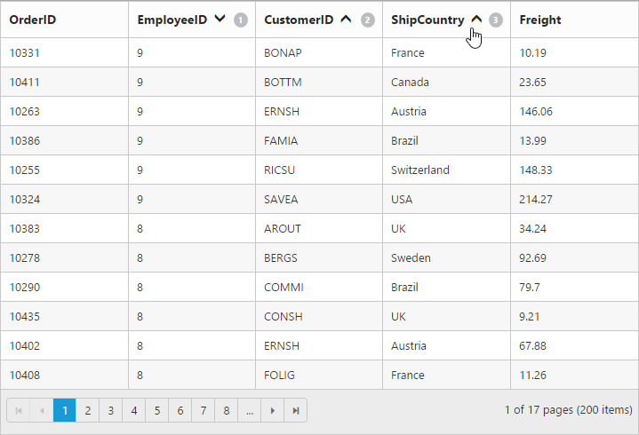

# Sorting

## Default Sorting

Sorting is a basic technique in Grid. It helps you view Grid records in ascending or descending, based on a particular column. If you want to enable sorting in Grid then use AllowSorting property at Grid initialize. By default, sorting operation can be performed by user interaction (UI) on Grid header.



@(Html.EJ().Grid<object>("Grid")

  .Datasource((IEnumerable<object>)ViewBag.datasource)

	.AllowSorting()

  .AllowPaging()

)

namespace SyncfusionMvcApplication3.Controllers

{

    public class HomeController : Controller

    {

        public ActionResult Index()

        {

            ViewBag.datasource = OrderRepository.GetAllRecords();

            return View();

        }         

    }	

}



The following output is displayed as a result of the above code example.

Sorting
{:.caption}

N> Grid also has support to sort more than one column. This behavior is called as multi sorting. To enable this behavior in Grid then use AllowMultiSorting in Grid.

## External Sorting

In Grid, you have an API to sort a column dynamically. The following code example shows you how to sort a column through API. 


  


<select id="columns">

	<option value="OrderID">Order ID</option>

	<option value="CustomerID">Customer ID</option>

	<option value="EmployeeID">Employee ID</option>

	<option value="ShipCity">Ship City</option>

</select>

 

<select id="direction">

	<option>Ascending</option>

	<option>Descending</option>

</select>     

 

<input type="button" value="sort" id="sort"/>

 

@(Html.EJ().Grid<object>("Grid")

.Datasource((IEnumerable<object>)ViewBag.datasource)

.AllowSorting()

.AllowPaging()

)





   





namespace SyncfusionMvcApplication3.Controllers

{

    public class HomeController : Controller

    {

        public ActionResult Index()

        {

            ViewBag.datasource = OrderRepository.GetAllRecords();

            return View();

        }

    }

}




The following output is displayed as a result of the above code example.

External Sorting
{:.caption}

## Multi sorting in Touch device

While using Grid in a touch device environment, you have the option of multi sorting. If you click Grid header it shows a popup to enable or disable single click on Grid header as multi sorting or simple sorting. If you want to enable multi sorting with a single click then click the sorting symbol in popup.

The following output is displayed as a result of the above code example.

Multi sorting in touch device
{:.caption}

N> To enable Multi Sorting, use AllowMultiSorting() property of Grid

## Multi sorting key configs

In the normal way of sorting, if you want to sort any column, you can click the header cell of that column. For multi sorting, you need to press ctrl key plus mouse left click.

If you want to clear sorting for a column then you need to use shift plus mouse left click.

## Clear sorting using API

In Grid, you have an API to clear sorted columns. Through this API, you can clear sorting at any stage.





 <input type="button" id="clearsorting" name="sorting" value="clear sorting" />

    @(Html.EJ().Grid<object>("Grid")

      .Datasource((IEnumerable<object>)ViewBag.datasource)

      .AllowSorting()

      .AllowMultiSorting()

      .AllowPaging()

      )







namespace MVCSampleBrowser.Controllers

{

    public partial class GridController : Controller

    {

        public ActionResult Index()

        {

            ViewBag.datasource = OrderRepository.GetAllRecords();

            return View();

        } 

    }

}



  

The following output is displayed as a result of the above code example.

Before sorting clearance
{:.caption}

After sorting clearance
{:.caption}

## Merge Sort

In the normal way of sorting, first preference is given to capital letters and then small letters. When you do not want discrimination between small and capital letters, you can set “enableLocalizedSort” API as true to sort both small and capital letters.


 


  @(Html.EJ().Grid<object>("Grid")

      .Datasource((IEnumerable<object>)ViewBag.datasource)

	  .AllowSorting()

      .SortSettings(sort => sort.SortedColumns(col => col.Field("CustomerID").Direction(SortOrder.Ascending).Add()))

      .AllowPaging()

      .Columns(col =>

        {

            col.Field("OrderID").HeaderText("Order ID").Width(75).Add();

            col.Field("CustomerID").HeaderText("Customer ID").Width(110).Add();

            col.Field("Freight").HeaderText("Freight").Width(75).Add();

            col.Field("ShipCountry").HeaderText("Ship Country").Width(110).Add();

        })

    )








namespace SyncfusionMvcApplication3.Controllers

{

    public class HomeController : Controller

    {

        public ActionResult Index()

        {

            ViewBag.datasource = OrderRepository.GetAllRecords();

            return View();

        }         

    }   

}


 
 The following output is displayed as a result of the above code example.

Grid with MergeSort
{:.caption}
