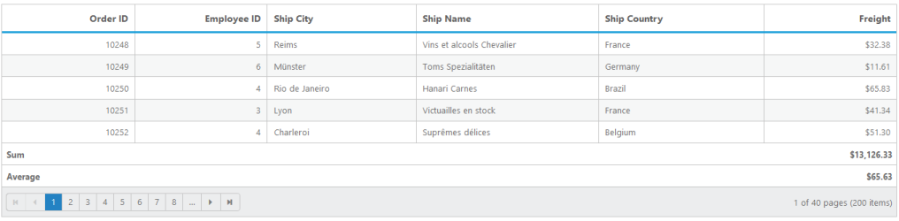
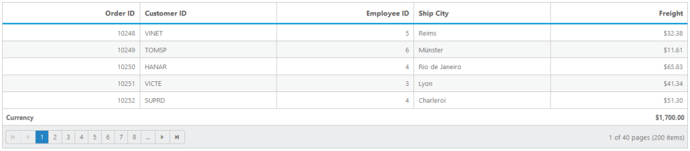
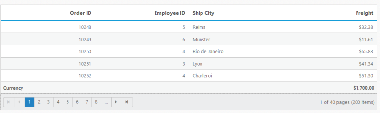
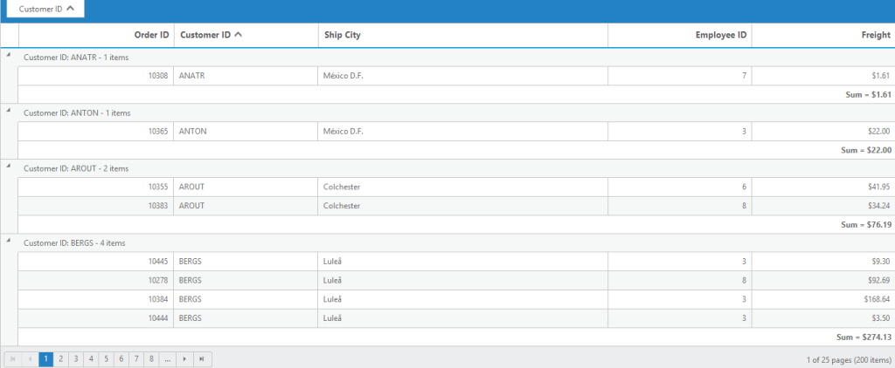
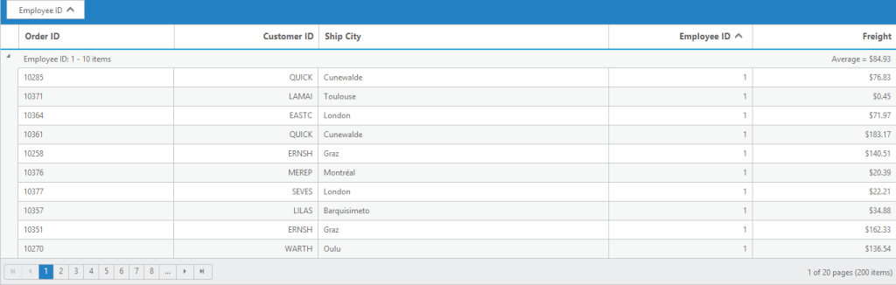

# Summary 

Summary is a key feature of Grid that is used to aggregate a particular column. This is useful to analyse the details of a particular column. It has the following types:

* Sum
* Average 
* Count
* Minimum
* Maximum
* Custom

## Default Summary

There are some default summary types available for basic summary formula. The following code example is for Default Summary Types.



[MVC]

[razor]

@(Html.EJ().Grid<OrdersView>("Summary")

        .Datasource((IEnumerable<object>)ViewBag.datasource)

        .ShowSummary()

        .AllowPaging()

        .PageSettings(page => { page.PageSize(5); })

.SummaryRow(row =>

        {

            row.Title("Sum").SummaryColumns(col => { col.SummaryType(SummaryType.Sum).Format("{0:C}").DisplayColumn("Freight").DataMember("Freight").Add(); }).Add();

            row.Title("Average").SummaryColumns(col => { col.SummaryType(SummaryType.Average).Format("{0:C}").DisplayColumn("Freight").DataMember("Freight").Add(); }).Add();

        })

        .Columns(col =>

        {

            col.Field("OrderID").HeaderText("Order ID").IsPrimaryKey(true).TextAlign(TextAlign.Right).Width(80).Add();

            col.Field("EmployeeID").HeaderText("Employee ID").TextAlign(TextAlign.Right).Width(80).Add();

            col.Field("ShipCity").HeaderText("Ship City").Width(90).Add();

            col.Field("ShipName").HeaderText("Ship Name").Width(110).Add();

            col.Field("ShipCountry").HeaderText("Ship Country").Width(100).Add();

            col.Field("Freight").HeaderText("Freight").TextAlign(TextAlign.Right).Width(80).Format("{0:C}").Add();

        })

    )




[Controller]

namespace SyncfusionMvcApplication3.Controllers

{

    public class HomeController : Controller

    {

        public ActionResult Index()

        {

            var DataSource = new NorthwindDataContext().OrdersViews.ToList();

            ViewBag.datasource = DataSource;

            return View();

        }

    }

}



## Custom Summary by String

This property helps you to create custom summary formula for summary. The following code example is for custom summary using Essential JavaScript.


[MVC]

[razor]

  @(Html.EJ().Grid<SyncfusionMvcApplication3.Models.OrdersView>("Summary")

        .Datasource((IEnumerable<object>)ViewBag.datasource)

.ShowSummary()

        .AllowPaging()

        .PageSettings(page => { page.PageSize(5); })

.SummaryRow(row =>

        {

            row.Title("Currency").SummaryColumns(col => { col.SummaryType(SummaryType.Custom).CustomSummaryValue((string)ViewBag.data).DisplayColumn("Freight").Format("{0:C2}").Add(); }).Add();

        })

        .Columns(col =>

        {

            col.Field("OrderID").HeaderText("Order ID").TextAlign(TextAlign.Right).Width(70).Add();

            col.Field("CustomerID").HeaderText("Customer ID").Width(70).Add();

            col.Field("EmployeeID").HeaderText("Employee ID").TextAlign(TextAlign.Right).Width(70).Add();

            col.Field("ShipCity").HeaderText("Ship City").Width(70).Add();

            col.Field("Freight").HeaderText("Freight").TextAlign(TextAlign.Right).Width(70).Format("{0:C}").Add();

        })

    )



[controller]

namespace MVCSampleBrowser.Controllers

{

    public partial class GridController : Controller

    {

        // GET: /Summary/

        public ActionResult Summary()

        {

            ViewBag.data = this.currency().ToString();

            var DataSource = new NorthwindDataContext().OrdersViews.ToList();

            ViewBag.datasource = DataSource;

            return View();

        }

        private double currency()

        {

            double rs = 100000;

            double dol = 0.017;

            double value = rs * dol;

            return value;

        } 

    }

}



The following output is displayed as a result of the above code example.

## Custom Summary by Function

Custom Summary is used to create custom summary formula for summary. The following code example is for custom summary using Essential JavaScript.



[MVC]

[razor]

@(Html.EJ().Grid<EditableOrder>("Summary")

                .Datasource((IEnumerable<object>)ViewBag.datasource)

                .ShowSummary()

                .AllowPaging()

                .PageSettings(page => { page.PageSize(5); })

                .SummaryRow(row =>

                {

                    row.Title("Currency").SummaryColumns(col => { col.SummaryType(SummaryType.Custom).CustomSummaryValue("currency").DisplayColumn("Freight").Format("{0:C2}").Add(); }).Add();

                })

                .Columns(col =>

                {

                    col.Field("OrderID").HeaderText("Order ID").TextAlign(TextAlign.Right).Width(70).Add();

                    col.Field("EmployeeID").HeaderText("Employee ID").TextAlign(TextAlign.Right).Width(70).Add();

                    col.Field("ShipCity").HeaderText("Ship City").Width(70).Add();

                    col.Field("Freight").HeaderText("Freight").TextAlign(TextAlign.Right).Width(70).Format("{0:C}").Add();

                })

    )




    




[Controller]

namespace MVCSampleBrowser.Controllers

{

    public partial class GridController : Controller

    {

        //

        // GET: /CustomSummary/

        public ActionResult CustomSummary()

        {

            var DataSource = OrderRepository.GetAllRecords().ToList();

            ViewBag.dataSource = DataSource;

            return View();

        }

    }

}



## Group Summary

This property helps you to enable the group summary column in Grid. The following code example is for Group summary.



[MVC]

[razor]

@(Html.EJ().Grid<OrdersView>("Summary")

          .Datasource((IEnumerable<object>)ViewBag.datasource)

          .ShowSummary()

          .AllowPaging()

          .PageSettings(page => { page.PageSize(10); })

.SummaryRow(row =>

          {

              row.ShowTotalSummary(false)

                 .SummaryColumns(col =>

                 {

                     col.SummaryType(SummaryType.Average)

                        .DisplayColumn("Freight")

                        .DataMember("Freight")

                        .Prefix("Average = ")

                        .Format("{0:C}")

                        .Add();

                 }).Add();

          })

          .GroupSettings(group => { group.GroupedColumns(col => { col.Add("CustomerID"); }); })

          .Columns(col =>

          {

              col.Field("OrderID").HeaderText("Order ID").IsPrimaryKey(true).TextAlign(TextAlign.Right).Width(80).Add();

              col.Field("CustomerID").HeaderText("Customer ID").TextAlign(TextAlign.Left).Width(75).Add();

              col.Field("ShipCity").HeaderText("Ship City").Width(75).Add();

              col.Field("EmployeeID").HeaderText("Employee ID").TextAlign(TextAlign.Right).Width(150).Add();

              col.Field("Freight").HeaderText("Freight").TextAlign(TextAlign.Right).Width(75).Format("{0:C}").Add();

          })

          )



[controller]

namespace MVCSampleBrowser.Controllers

{

    public partial class GridController : Controller

    {

        public ActionResult GroupSummary()

        {

            var DataSource = new NorthwindDataContext().OrdersViews.ToList();

            ViewBag.dataSource = DataSource;

            return View();

        }

    }

}



The following output is displayed as a result of the above code example.

## Caption Summary

This property is used to create Caption Summary column in Grid. The following code example is for Caption Summary.


[MVC]

[razor]

@(Html.EJ().Grid<EditableOrder>("Summary")

          .Datasource((IEnumerable<object>)ViewBag.datasource)

          .ShowSummary()

          .AllowPaging()

          .PageSettings(page => { page.PageSize(10); })

          .SummaryRow(row =>

          {

              row.ShowCaptionSummary(true)

                 .ShowTotalSummary(false)

                 .SummaryColumns(col =>

                 {

                     col.SummaryType(SummaryType.Average)

                        .DisplayColumn("Freight")

                        .DataMember("Freight")

                        .Format("{0:C}")

                        .Prefix("Average = ")

                        .Add();

                 }).Add();

          })

          .GroupSettings(group => { group.GroupedColumns(col => { col.Add("CustomerID"); }); })

          .Columns(col =>

          {

              col.Field("OrderID").HeaderText("Order ID").IsPrimaryKey(true).TextAlign(TextAlign.Right).Width(80).Add();

              col.Field("CustomerID").HeaderText("Customer ID").Width(75).Add();

              col.Field("EmployeeID").HeaderText("Employee ID").TextAlign(TextAlign.Right).Width(75).Add();

              col.Field("Freight").HeaderText("Freight").TextAlign(TextAlign.Right).Width(75).Format("{0:C}").Add();

          })

          )


[controller]

namespace MVCSampleBrowser.Controllers

{

    public partial class GridController : Controller

    {

        public ActionResult CaptionSummary()

        {

            var DataSource = OrderRepository.GetAllRecords().ToList();

            ViewBag.dataSource = DataSource;

            return View();

        }

    }

}



The following output is displayed as a result of the above code example.

