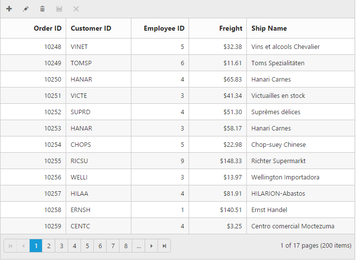

# Toolbar 

## Default buttons

Toolbar is one of the user interaction controls related with Grid. It is handy to use the Toolbar to trigger more actions. The default toolbar items created for Grid are:

* Add
* Edit
* Delete
* Update
* Cancel
* Search

If you want Toolbar items other than the above items, you can make it using CustomToolBarItems.

## Custom Toolbar action

Custom Toolbar is a key functionality, used to customize Toolbar elements. Here you can learn in detail about the Toolbar template and its actions in the Custom Toolbar category. In the following code example, ejDropDownList is used to filter records by category.



[MVC]

[razor]

@(Html.EJ().Grid<Object>("Grid")

                .Datasource(s => s.URL("http://mvc.syncfusion.com/Services/Northwnd.svc/Products"))

        .AllowScrolling()

                .ScrollSettings(scroll => { scroll.Height(300).Width(980); })

.ToolbarSettings(toolbar =>

                {

                    toolbar.ShowToolbar(true).CustomToolbarItems(new List<object>() { new Syncfusion.JavaScript.Models.CustomToolbarItems() { TemplateID = "#Refresh" } });

                })

        .Columns(col =>

        {

            col.Field("ProductID").HeaderText("Product ID").IsPrimaryKey(true).TextAlign(TextAlign.Right).Width(100).Add();

            col.Field("ProductName").HeaderText("Product Name").Width(200).Add();

            col.Field("QuantityPerUnit").HeaderText("Quantity").TextAlign(TextAlign.Right).Width(100).Add();

            col.Field("UnitsOnOrder").HeaderText("UnitsOnOrder").Width(100).Add();

        })

        .ClientSideEvents(eve=>eve.ActionComplete("complete"))

        )


[javascript]



The following output is displayed as a result of the above code example.

