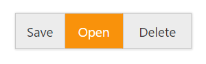

# Getting Started

This section provides details on how to create and customize Groupbutton control in an ASP.NET MVC application.

## Dependencies

The following assemblies are needs to referenced to render a Groupbutton control in your application.

1. Syncfusion.EJ.dll
2. Syncfusion.EJ.MVC.dll

The script and CSS dependencies for rendering Groupbutton is given in the [JS help document](https://help.syncfusion.com/js/groupbutton/getting-started#a-new-html-document-and-required-codes).

## Create a simple GroupButton control

Create an ASP.NET MVC project and add necessary DLLs and script dependencies with the help of given Getting started document.

Add the below code in the view page to render a simple groupbutton control.



 @Html.EJ().GroupButton("GroupButton").Items(item =>
{
item.Add().Text("Save");
item.Add().Text("Open");
item.Add().Text("Delete");
})



Run the project to get the following output

