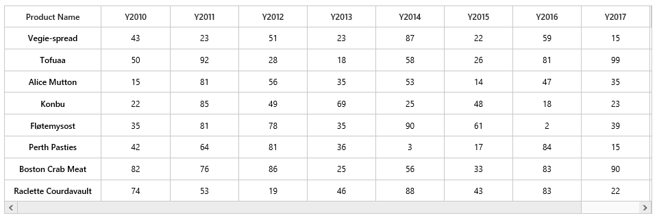
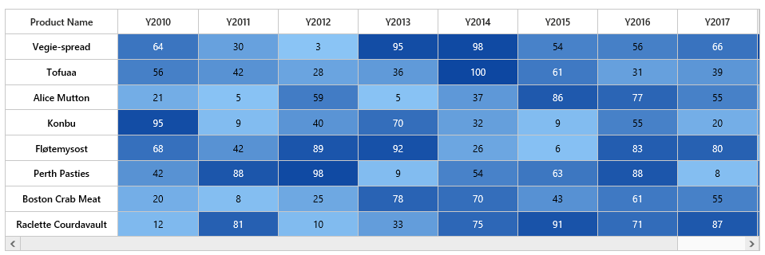
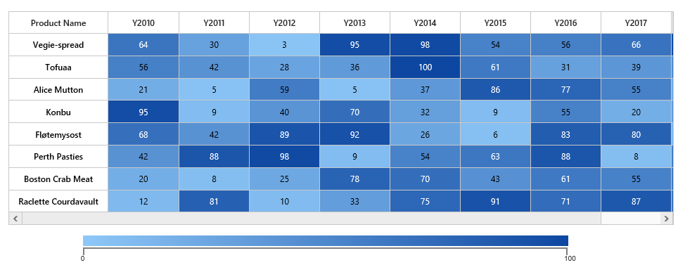

# Getting Started

This section explains briefly about how to create a HeatMap in your application with ASP.NET MVC.

## Initialize the HeatMap

1. Create Syncfusion ASP.NET MVC application. You can refer [MVC Getting Started documentation](http://help.syncfusion.com/aspnetmvc/getting-started) to create new project and add necessary dll’s and script files.
2. Add a HeatMap control in View file as like as follows.



    @Html.EJ().HeatMap("heatmap", ViewData["HeatMapModel"] as Syncfusion.JavaScript.DataVisualization.Models.HeatMapProperties)

 
 

## Prepare and Populate data

Populate product information in a collection



public ActionResult Default()
{
    CellMapping CellMapping = new CellMapping();
    CellMapping.Column = new PropertyMapping() { PropertyName = "ProductName", DisplayName = "Product Name" };
    CellMapping.Row = new PropertyMapping() { PropertyName = "Year", DisplayName = "Year" };
    CellMapping.Value = new PropertyMapping() { PropertyName = "Value" };
    Collection columnMapping = new Collection();
    columnMapping.Add(new HeaderMapping() { PropertyName = "Vegie-spread", DisplayName = "Vegie-spread" });
    columnMapping.Add(new HeaderMapping() { PropertyName = "Tofuaa", DisplayName = "Tofuaa" });
    columnMapping.Add(new HeaderMapping() { PropertyName = "Alice Mutton", DisplayName = "Alice Mutton" });
    columnMapping.Add(new HeaderMapping() { PropertyName = "Konbu", DisplayName = "Konbu" });
    columnMapping.Add(new HeaderMapping() { PropertyName = "Fløtemysost", DisplayName = "Fløtemysost" });
    columnMapping.Add(new HeaderMapping() { PropertyName = "Perth Pasties", DisplayName = "Perth Pasties" });
    CellMapping.ColumnMapping = columnMapping;
    HeaderMapping headerMapping = new HeaderMapping() { PropertyName = "Year", DisplayName = "Year", ColumnStyle = new ColumnStyle() { Width = 105, TextAlign = HeatMapTextAlign.Right } };
    CellMapping.HeaderMapping = headerMapping;
    ViewData["HeatMapModel"] = Heatmap;
    return View();
}



## Map data into HeatMap

Now data is ready, next we need to configure data source and map rows and columns to visualize.

* Prepare `ItemsMapping` add it in resource.



public ActionResult Default()
{

    CellMapping CellMapping = new CellMapping();
    CellMapping.Column = new PropertyMapping() { PropertyName = "ProductName", DisplayName = "Product Name" };
    CellMapping.Row = new PropertyMapping() { PropertyName = "Year", DisplayName = "Year" };
    CellMapping.Value = new PropertyMapping() { PropertyName = "Value" };
    Collection columnMapping = new Collection();
    columnMapping.Add(new HeaderMapping() { PropertyName = "Vegie-spread", DisplayName = "Vegie-spread" });
    columnMapping.Add(new HeaderMapping() { PropertyName = "Tofuaa", DisplayName = "Tofuaa" });
    columnMapping.Add(new HeaderMapping() { PropertyName = "Alice Mutton", DisplayName = "Alice Mutton" });
    columnMapping.Add(new HeaderMapping() { PropertyName = "Konbu", DisplayName = "Konbu" });
    columnMapping.Add(new HeaderMapping() { PropertyName = "Fløtemysost", DisplayName = "Fløtemysost" });
    columnMapping.Add(new HeaderMapping() { PropertyName = "Perth Pasties", DisplayName = "Perth Pasties" });
    CellMapping.ColumnMapping = columnMapping;
    HeaderMapping headerMapping = new HeaderMapping() { PropertyName = "Year", DisplayName = "Year", ColumnStyle = new ColumnStyle() { Width = 105, TextAlign = HeatMapTextAlign.Right } };
    CellMapping.HeaderMapping = headerMapping;
    Heatmap.ItemsMapping = CellMapping;
    ViewData["HeatMapModel"] = Heatmap;
    return View();
}



* Set items source and mapping



public ActionResult Default()
{
    Heatmap.ItemsMapping = CellMapping;
    ViewData["HeatMapModel"] = Heatmap;
    return View();
}

public Collection GetCellSource()
{
    Collection collection = new Collection();
    string[] name = { "Vegie-spread", "Tofuaa", "Alice Mutton", "Konbu", "Fløtemysost", "Perth Pasties" };
    Random random = new Random();

    foreach (string item in name)
    {
        for (int i = 0; i < 6; i++)
        {
            double value = random.Next(0, random.Next(0, 100));
            collection.Add(new SampleCellData() { ProductName = item, Year = "Y" + (2011 + i), Value = value });
        }
    }
    return collection;
}



 
## Color Mapping
  
Next we can configure color range for these values using color mapping
 
* Configure items mapping based on items source.
 

       
public ActionResult Default()
{
    HeatMapProperties Heatmap = new HeatMapProperties();
    List<HeatMapColorMapping> colorCollection = new List<HeatMapColorMapping>();
    colorCollection.Add(new HeatMapColorMapping() { Color = "#8ec8f8", Label = new HeatMapLabel() { Text = "0" }, Value = 0 });
    colorCollection.Add(new HeatMapColorMapping() { Color = "#0d47a1", Label = new HeatMapLabel() { Text = "100" }, Value = 100 });
    Heatmap.ColorMappingCollection = colorCollection;
    ViewData["HeatMapModel"] = Heatmap;
    return View();
}

  
 
* This will show the grid data with color based on the range given.

 
# Legend

A legend control is used to represent range value in a gradient, create a legend with the same color mapping as shown below.
  


    @Html.EJ().HeatMapLegend("heatmapLegend", ViewData["HeatMapLegendModel"] as Syncfusion.JavaScript.DataVisualization.Models.HeatMapLegendProperties)

            
 
 

* Final code files looks like this.




public ActionResult Default()
{
    HeatMapProperties Heatmap = new HeatMapProperties();
    List<HeatMapColorMapping> colorCollection = new List<HeatMapColorMapping>();
    colorCollection.Add(new HeatMapColorMapping() { Color = "#8ec8f8", Label = new HeatMapLabel() { Text = "0" }, Value = 0 });
    colorCollection.Add(new HeatMapColorMapping() { Color = "#0d47a1", Label = new HeatMapLabel() { Text = "100" }, Value = 100 });
    Heatmap.ColorMappingCollection = colorCollection;
    Heatmap.LegendCollection.Add("heatmapLegend");
    Heatmap.Width = "830"; 
    CellMapping CellMapping = new CellMapping();
    CellMapping.Column = new PropertyMapping() { PropertyName = "ProductName", DisplayName = "Product Name" };
    CellMapping.Row = new PropertyMapping() { PropertyName = "Year", DisplayName = "Year" };
    CellMapping.Value = new PropertyMapping() { PropertyName = "Value" };
    Collection columnMapping = new Collection();
    columnMapping.Add(new HeaderMapping() { PropertyName = "Vegie-spread", DisplayName = "Vegie-spread" });
    columnMapping.Add(new HeaderMapping() { PropertyName = "Tofuaa", DisplayName = "Tofuaa" });
    columnMapping.Add(new HeaderMapping() { PropertyName = "Alice Mutton", DisplayName = "Alice Mutton" });
    columnMapping.Add(new HeaderMapping() { PropertyName = "Konbu", DisplayName = "Konbu" });
    columnMapping.Add(new HeaderMapping() { PropertyName = "Fløtemysost", DisplayName = "Fløtemysost" });
    columnMapping.Add(new HeaderMapping() { PropertyName = "Perth Pasties", DisplayName = "Perth Pasties" });
    CellMapping.ColumnMapping = columnMapping;
    HeaderMapping headerMapping = new HeaderMapping() { PropertyName = "Year", DisplayName = "Year", ColumnStyle = new ColumnStyle() { Width = 105, TextAlign = HeatMapTextAlign.Right } };
    CellMapping.HeaderMapping = headerMapping;
    Heatmap.ItemsSource = GetCellSource();
    Heatmap.ItemsMapping = CellMapping;
    Heatmap.IsResponsive = true;
    ViewData["HeatMapModel"] = Heatmap;

    HeatMapLegendProperties legend = new HeatMapLegendProperties();
    legend.ColorMappingCollection = colorCollection;
    legend.Orientation = HeatMapLegendOrientation.Horizontal;
    legend.LegendMode = Syncfusion.JavaScript.DataVisualization.HeatMapEnums.HeatMapLegendMode.Gradient;
    legend.Height = "50px";
    legend.Width = "75%";
    legend.IsResponsive = true;
    ViewData["HeatMapLegendModel"] = legend;
    return View();
}

public Collection GetCellSource()
{
    Collection collection = new Collection();
    string[] name = { "Vegie-spread", "Tofuaa", "Alice Mutton", "Konbu", "Fløtemysost", "Perth Pasties" };
    Random random = new Random();

    foreach (string item in name)
    {
        for (int i = 0; i < 6; i++)
        {
            double value = random.Next(0, random.Next(0, 100));
            collection.Add(new SampleCellData() { ProductName = item, Year = "Y" + (2011 + i), Value = value });
        }
    }
    return collection;
}

 



    @Html.EJ().HeatMap("heatmap", ViewData["HeatMapModel"] as Syncfusion.JavaScript.DataVisualization.Models.HeatMapProperties)

    @Html.EJ().HeatMapLegend("heatmapLegend", ViewData["HeatMapLegendModel"] as Syncfusion.JavaScript.DataVisualization.Models.HeatMapLegendProperties)




