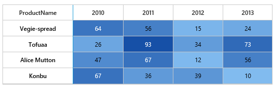

# Items Mapping

External data source can be mapped with HeatMap using `ItemsMapping` property. It supports 2 kind of data source.

* In `TableMapping` rows represents an objects in collection, columns represents numerical properties of that object.
* In `CellMapping` each cell represent an object in collection, this collection is grouped based on specific property to form as rows and columns.

Let us see the difference between two types of mapping. Following table represents two different data structure to represent the same HeatMap.

<table>
<tr>
 <th>CellMapping</th>
<th>TableMapping</th>
</tr>
<tr>
<td>
      


public ActionResult Default()
{
    HeatMapProperties Heatmap = new HeatMapProperties();

    CellMapping CellMapping = new CellMapping();
    CellMapping.Column = new PropertyMapping() { PropertyName = "ProductName", DisplayName = "Product Name" };
    CellMapping.Row = new PropertyMapping() { PropertyName = "Year", DisplayName = "Year" };
    CellMapping.Value = new PropertyMapping() { PropertyName = "Value" };
    Collection columnMapping = new Collection();
    columnMapping.Add(new HeaderMapping() { PropertyName = "Veggie-spread", DisplayName = "Veggie-spread" });
    columnMapping.Add(new HeaderMapping() { PropertyName = "Tofu", DisplayName = "Tofu" });
    columnMapping.Add(new HeaderMapping() { PropertyName = "Alice Mutton", DisplayName = "Alice Mutton" });
    columnMapping.Add(new HeaderMapping() { PropertyName = "Donut", DisplayName = "Donut" });
    columnMapping.Add(new HeaderMapping() { PropertyName = "Burger", DisplayName = "Burger" });
    columnMapping.Add(new HeaderMapping() { PropertyName = "Perth Pasties", DisplayName = "Perth Pasties" });
    CellMapping.ColumnMapping = columnMapping;
    HeaderMapping headerMapping = new HeaderMapping() { PropertyName = "Year", DisplayName = "Year", ColumnStyle = new ColumnStyle() { Width = 105, TextAlign = HeatMapTextAlign.Right } };
    CellMapping.HeaderMapping = headerMapping;

    Heatmap.ItemsSource = GetCellSource();
    Heatmap.ItemsMapping = CellMapping;

    ViewData["HeatMapModel"] = Heatmap; 
    return View();
}

public Collection GetCellSource()
{
    Collection collection = new Collection();
    string[] name = { "Veggie-spread", "Tofu", "Alice Mutton", "Donut", "Burger", "Perth Pasties" };
    Random random = new Random();

    foreach (string item in name)
    {
        for (int i = 0; i < 6; i++)
        {
        double value = random.Next(0, random.Next(0, 100));
        collection.Add(new SampleCellData() { ProductName = item, Year = "Y" + (2011 + i), Value = value });
        }
    }
    return collection;
}


</td>
<td>


public ActionResult TableDataBinding()
{
    HeatMapProperties Heatmap = new HeatMapProperties();

    TableMapping TableMapping = new TableMapping();
    TableMapping.HeaderMapping = new HeaderMapping() { PropertyName = "ProductName", DisplayName = "Product Name", ColumnStyle = new ColumnStyle() { Width = 140, TextAlign = HeatMapTextAlign.Right } };
    TableMapping.ColumnMapping.Add(new HeaderMapping() { PropertyName = "Y2010", DisplayName = "Y2010" });
    TableMapping.ColumnMapping.Add(new HeaderMapping() { PropertyName = "Y2011", DisplayName = "Y2011" });
    TableMapping.ColumnMapping.Add(new HeaderMapping() { PropertyName = "Y2012", DisplayName = "Y2012" });
    TableMapping.ColumnMapping.Add(new HeaderMapping() { PropertyName = "Y2013", DisplayName = "Y2013" });
    TableMapping.ColumnMapping.Add(new HeaderMapping() { PropertyName = "Y2014", DisplayName = "Y2014" });
    TableMapping.ColumnMapping.Add(new HeaderMapping() { PropertyName = "Y2015", DisplayName = "Y2015" });

    Heatmap.ItemsMapping = TableMapping; 
    Heatmap.ItemsSource = GetTableSource(); 

    ViewData["HeatMapModel"] = Heatmap;
    return View();    
}

public Collection GetTableSource()
{
    Collection collection = new Collection();
    Random random = new Random();
    string[] rows = { "Veggie-spread", "Tofu", "Alice Mutton", "Donut", "Burger", "Perth Pasties", "Boston Crab Meat", "Racket Burger" };
    for (int i = 0; i < 8; i++)
    {
        collection.Add(new SampleTableData()
        {
        ProductName = rows[i],
        Y2010 = random.Next(0, 100),
        Y2011 = random.Next(0, 100),
        Y2012 = random.Next(0, 100),
        Y2013 = random.Next(0, 100),
        Y2014 = random.Next(0, 100),
        Y2015 = random.Next(0, 100)
        });
    }
    return collection;
}


</td>
</tr>
<tr>
<td>
Here, a single `ProductInfo` object represent a value for a particular product in a particular year
</td>
<td>
Here, a single `ProductInfo` object represents value for a particular product from year 2010 to 2015.	
</td>
</tr>
 
<tr>
<td>

</td>
<td>

</td>
</tr>
</table>