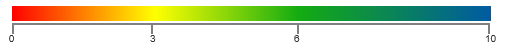
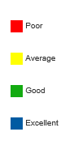

---
layout: post
title: Legend gives visual guideline for mapping between value and color.
description: How to create and configure legend for HeatMap
platform: ejmvc
control: HeatMapLegend
documentation: ug
---

# Legend

Legend is a control used to summarize the range of colors in HeatMap. This gives visual guideline for mapping between value and color.

## Create Legend

Legend can be created with color mapping as shown below.



public ActionResult TableDataBinding()
{
    List<HeatMapColorMapping> colorCollection = new List<HeatMapColorMapping>();
    colorCollection.Add(new HeatMapColorMapping() { Color = "#fe0002", Label = new HeatMapLabel() { Text = "Poor" }, Value = 0 });
    colorCollection.Add(new HeatMapColorMapping() { Color = "#ffff01", Label = new HeatMapLabel() { Text = "Average" }, Value = 3 });
    colorCollection.Add(new HeatMapColorMapping() { Color = "#13ab11", Label = new HeatMapLabel() { Text = "Good" }, Value = 6 });
    colorCollection.Add(new HeatMapColorMapping() { Color = "#005ba2", Label = new HeatMapLabel() { Text = "Excellent" }, Value = 10 });
    Heatmap.ColorMappingCollection = colorCollection;

    HeatMapLegendProperties legend = new HeatMapLegendProperties();
    legend.ColorMappingCollection = colorCollection;
    legend.Orientation = HeatMapLegendOrientation.Horizontal;
    legend.LegendMode = HeatMapLegendMode.Gradient;
    legend.Height = "50px";
    legend.Width = "75%"; 
    ViewData["HeatMapLegendModel"] = legend;
    return View();
}



Resultant legend will be like following image.

 
## Legend Mode

There are two modes for Legend
* Gradient
* List

### Gradient:



public ActionResult TableDataBinding()
{ 
    HeatMapLegendProperties legend = new HeatMapLegendProperties();

    legend.Orientation = HeatMapLegendOrientation.Horizontal;
    legend.LegendMode = HeatMapLegendMode.Gradient;

    ViewData["HeatMapLegendModel"] = legend;
    return View();
}



### List:

 

public ActionResult TableDataBinding()
{
    HeatMapLegendProperties legend = new HeatMapLegendProperties();

    legend.Orientation = HeatMapLegendOrientation.Horizontal;
    legend.LegendMode = HeatMapLegendMode.List;

    ViewData["HeatMapLegendModel"] = legend;
    return View();
}
        


## Orientation

There are 2 types of Orientation, applicable for Gradient and List Mode 
* Horizontal
* Vertical

### Horizontal:

 

public ActionResult TableDataBinding()
{
    HeatMapLegendProperties legend = new HeatMapLegendProperties();

    legend.Orientation = HeatMapLegendOrientation.Horizontal;
    legend.LegendMode = HeatMapLegendMode.List;

    ViewData["HeatMapLegendModel"] = legend;
    return View();
}
        


### Vertical:

 

public ActionResult TableDataBinding()
{
    HeatMapLegendProperties legend = new HeatMapLegendProperties();

    legend.Orientation = HeatMapLegendOrientation.Vertical;
    legend.LegendMode = HeatMapLegendMode.List;

    ViewData["HeatMapLegendModel"] = legend;
    return View();
}
        


