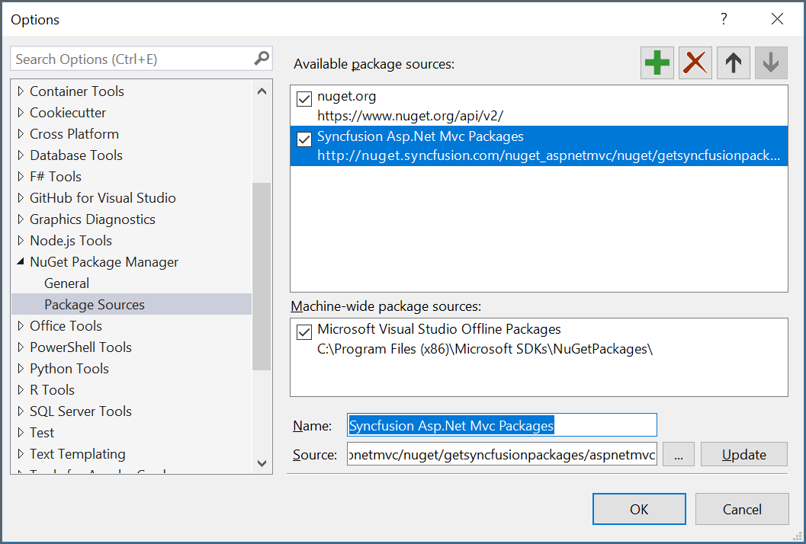
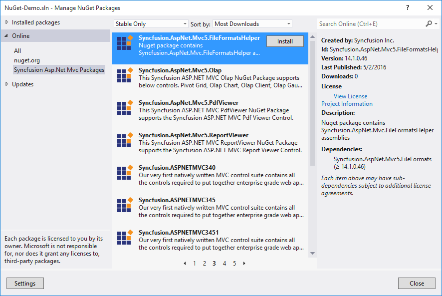

# Installation and Deployment

## Installation

* Download the setup file (.exe) of Essential Studio for ASP.NET MVC product from this [link](http://www.syncfusion.com/downloads/aspnetmvc) with your Syncfusion account.
* You can now follow the steps mentioned in the [setup guide](http://help.syncfusion.com/common/essential-studio/essential-studio-installer-for-individual-platform) install the specific/entire platform in your machine.

## Configuring Syncfusion NuGet Packages in Visual Studio 

Syncfusion ASP.NET MVC NuGet packages are available [here](http://nuget.syncfusion.com/package/aspnetmvc).

### NuGet Configuration  

The steps to install the Syncfusion ASP.NET MVC NuGet Packages in Visual Studio are as follows,

1. In Visual Studio, navigate to `Tools | NuGet Package Manager | Package Manager Settings`, the options dialog will appear on the screen as shows below,

   

2. Select `NuGet Package Manager | Package Sources` and click `Add` button to add the `Package Name` and `Package Source` of Syncfusion NuGet Packages.    

   **Name**: Name of the package that listed in Available package sources  
   **Source**: Syncfusion ASP.NET MVC NuGet Package feed URL
   [http://nuget.syncfusion.com/aspnetmvc](http://nuget.syncfusion.com/aspnetmvc)
    
   

   N> The `Source` text box in the above image denotes the location of the NuGet packages and the `Name` section, allows you to provide a unique name for NuGet Packages Source.
   You may face the NuGet package installation/restore error while installing the Syncfusion ASP.NET Core NuGet packages from Syncfusion Public feed URL since some URL redirecting issue in NuGet Package Manager. To resolve this, use the below Syncfusion ASP.NET MVC NuGet feed link. 
   Syncfusion ASP.NET MVC NuGet Full Feed Link: [http://nuget.syncfusion.com/nuget_aspnetmvc/nuget/getsyncfusionpackages/aspnetmvc](http://nuget.syncfusion.com/nuget_aspnetmvc/nuget/getsyncfusionpackages/aspnetmvc)
 
I> Syncfusion other platforms NuGet packages feed links are available [here](http://nuget.syncfusion.com/)

### NuGet Installation

Syncfusion ASP.NET MVC NuGet can install once configured the package source. The NuGet installation steps as below,

1. Once configured the Package source with Syncfusion NuGet Packages, right click on project and choose `Manage NuGet Packages | Online | <Package Source Name>`.

   

2. The NuGet Packages are listed which are available in package source location. Install the required packages to your application by clicking `Install` button.

   N> NuGet packages can be install directly through the **command line** (Package Manager Console). Further details click [here](http://help.syncfusion.com/extension/syncfusion-nuget-packages/nuget-install-and-configuration#install-from-package-manager-console)

### Updating a NuGet Package

Using the `Manage NuGet Packages` in Visual Studio, NuGet packages can be update.
 
1. Right click on Project and Navigate to the `Manage NuGet Packages` and click on the `Updates` tab to check for updates.

2. Select the `Updates -> <Syncfusion Package Source>`. Refer to the following screenshot for more information.

   

3. If there is a new version of NuGet you will see it in the list of available updates.

4. Select NuGet Package in the list and click `Update`. When the update is complete, close and re-open all open instances of Visual Studio.

   N> By clicking `Update All` button, all NuGet packages are getting update. When the update is complete, close and re-open all open instances of Visual Studio.
   
## Configuring Syncfusion NuGet Packages from command line in Linux/MAC 
   
### NuGet Configuration
   
1. Download the latest NuGet executable from [here](https://dist.nuget.org/win-x86-commandline/latest/nuget.exe).  

2. Open the downloaded executable location in command window and run the following command,

     mono nuget.exe Sources Add –Name [Source name] –Source [source location]

     For Ex: mono nuget.exe Add –Name “Syncfusion Source” –Source “http://nuget.syncfusion.com/aspnetmvc”
                                                                                  
3. Once the Source gets added successfully the confirmation message will be shown like below.

     For Linux OS :

     

     For MAC OS:

     

### NuGet Installation

Once the NuGet source has been added, then install the NuGet package which is available in that source by using following command.

mono nuget.exe install [Package name] 

For Ex: mono nuget.exe install “Syncfusion.EJ” – Pre release 

For Linux OS :

For MAC OS :

## Deployment

The MVC applications are deployed in the development server by referencing the Syncfusion assemblies appropriately. The steps are as shown below,

* **Mark the Project directory as Application** – Here, the appropriate directory where the project file is usually saved, should be marked as Application in IIS.
* **Reference the Syncfusion Assemblies** – The Syncfusion assemblies can be referenced in the application either from the Global Assembly Cache (GAC) or from the Application’s bin folder.
* **Use any of the two available deployment patterns** – Default or Fast deployment pattern.

### Default Deployment Pattern      

Deploy the application in the development server by referencing the **assemblies** from **GAC**.

* **Web.config** file is configured according to the referenced **dll**. 

* When you deploy your application, ensure that the above referenced assemblies (in your **web.config** files) are present in the **GAC**. This method supports almost all the features of the control.

N> With this pattern, all our **Syncfusion** assemblies run at full trust.

### Fast Deployment Pattern                

Deploy the application in the development server by referencing Syncfusion assemblies in the application's **bin** folder.

* Delete the **Syncfusion** assembly **GAC** entries in your development machine. Now copy the required reference assemblies to the **bin** folder of your application.

* **Web.config** file is configured according to the referenced **dll**.

* In this case, the control’s **DeprecateFunctionalityToRunInPartialTrust** property is turned **on** for the control to work properly. In some cases, few features may not be available. You can refer the control's documentation for more information.

N> If you have XML, mdb or other data files in your application, ensure that they have sufficient security permissions. Only the Authenticated Users should have access to the files and directory, so as to permit the ASP.NET code to open the file at run-time.
Also, ensure that the machine.config of the deployed system includes appropriate entries for Mozilla and so on within the <browsercaps> tag. The default entries consider these browsers as down level and hence will not render the Syncfusion controls properly.

## Install Location & Samples

Here, the default location on your machine is illustrated where the **Essential Studio package** or the **Essential Studio for ASP.NET MVC** suite gets installed, from where the Syncfusion assemblies and dashboard samples can be accessed.

* The below specified location is the place from where all the assemblies, scripts, CSS files and samples are available,

  `(installed location)\Syncfusion\Essential Studio\{{ site.releaseversion }}\`

  _**For example**, If you have installed the Essential Studio package within **C:\Program Files(x86),** then navigate to the below location,_
  `C:\Program Files (x86)\Syncfusion\Essential Studio\{{ site.releaseversion }}\`

* The **ASP.NET MVC samples** can be accessed from the below location,

  `(installed location)\Syncfusion\Essential Studio\{{ site.releaseversion }}\Samples`

  _**For example**, If you have installed the Essential Studio package within **C:\Program Files(x86),** then navigate to the below location,_
  `C:\Program Files (x86)\Syncfusion\Essential Studio\{{ site.releaseversion }}\Samples`

* The Dashboard can be opened by running the **Dashboard.exe** file present within the following location,

  `(installed location)\Syncfusion\Essential Studio\{{ site.releaseversion }}\Infrastructure\Dashboard\4.0`

  _**For example**, If you have installed the Essential Studio package within **C:\Program Files(x86),** then navigate to the below location,_
  `C:\Program Files (x86)\Syncfusion\Essential Studio\{{ site.releaseversion }}\Infrastructure\Dashboard\4.0`

To run the local samples from dashboard and other online samples, refer the link [here](http://help.syncfusion.com/ug/common/index.html#!Documents/samples.htm).

## Assemblies Location & Structure

All the Syncfusion assemblies are located in the below specified installed location on your machine,

`(installed location)\Syncfusion\Essential Studio\{{ site.releaseversion }}\precompiledassemblies\{{ site.releaseversion }}`

_**For example**, If you have installed the Essential Studio package within **C:\Program Files(x86),** then navigate to the below location,_
`C:\Program Files (x86)\Syncfusion\Essential Studio\{{ site.releaseversion }}\precompiledassemblies\{{ site.releaseversion }}`

The Syncfusion assemblies are packed in a separate folder on the basis of the following two types,

  * .NET Framework version
  * MVC version
  
### .NET Framework version-based assemblies

The assemblies based on the version of the .NET Framework are packed under the folders namely **3.5**, **4.0**, **4.5** and **4.5.1** available in the above specified location. Some of the important assemblies available based on the .NET frameworks under each folders (3.5, 4.0, 4.5, 4.5.1) are listed below,

<table>
<tr><td>
Syncfusion.Compression.Base.dll</td></tr><tr><td>
Syncfusion.EJ.dll</td></tr><tr><td>
Syncfusion.EJ.Export.dll</td></tr><tr><td>
Syncfusion.EJ.Olap.dll</td></tr><tr><td>
Syncfusion.EJ.PdfViewer.dll</td></tr><tr><td>
Syncfusion.EJ.ReportViewer.dll</td></tr><tr><td>
Syncfusion.Olap.Base.dll</td></tr><tr><td>
Syncfusion.Linq.Base.dll</td></tr><tr><td>
Syncfusion.XlsIO.Base.dll</td></tr><tr><td>
Syncfusion.Pdf.Base.dll</td></tr><tr><td>
Syncfusion.DocIO.Base.dll
</td></tr>
</table>

### MVC version-based assemblies

The assemblies based on the version of the MVC Framework (MVC3, MVC4, MVC5) are packed under the folder namely **MVC** available in the below location,

`(installed location)\Syncfusion\Essential Studio\{{ site.releaseversion }}\precompiledassemblies\ {{ site.releaseversion }}\MVC`

_**For example**, If you have installed the Essential Studio package within **C:\Program Files (x86)**, then navigate to the below location,_
`C:\Program Files (x86)\Syncfusion\Essential Studio\{{ site.releaseversion }}\precompiledassemblies\ {{ site.releaseversion }}\MVC`

Some of the important assemblies available based on the MVC versions (within each folder namely MVC3, MVC4 & MVC5) in the above specified location are listed below,

<table>
<tr><td>
Syncfusion.EJ.Mvc.dll</td></tr><tr><td>
Syncfusion.DocIO.Helper.Mvc.dll</td></tr><tr><td>
Syncfusion.Pdf.Helper.Mvc.dll</td></tr><tr><td>
Syncfusion.XlsIO.Helper.Mvc.dll</td></tr><tr><td>
Syncfusion.PdfViewer.Mvc.dll
</td></tr>
</table>