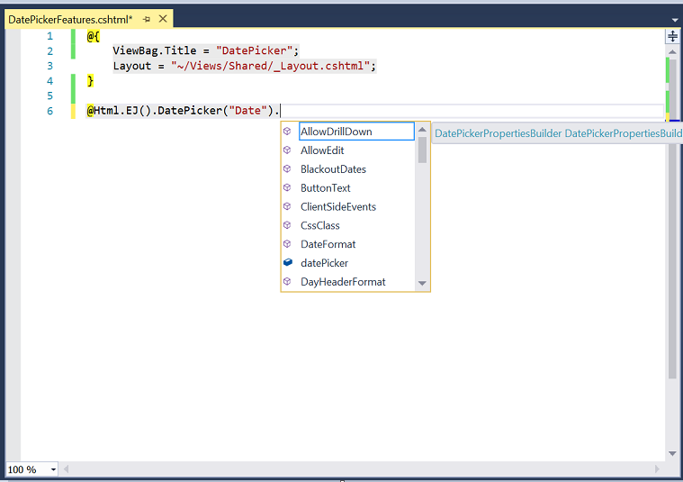

# IntelliSense

We have provided an IntelliSense support as like the default ASP.NET MVC controls. It has the object list which holds the properties, public methods and event arguments of respective controls. On pressing the (.) Dot operator it displays those properties, public methods and event arguments of the corresponding control in dropdown.

Refer to the below screenshot where we have used our DatePicker control in the sample.

