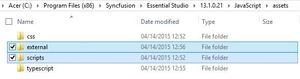
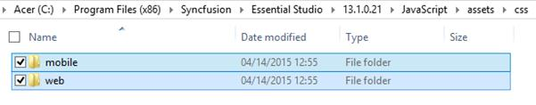
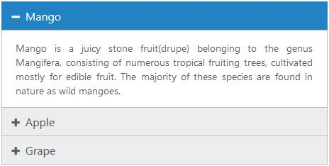

# Introduction

## Overview

The **Syncfusion Essential Studio for ASP.NET MVC** is a set of server-side wrappers which is empowered by Essential JavaScript. With the help of the server-side wrapper helper classes, the user can add the Syncfusion MVC components into their application. The MVC helper’s values are passed from the server-side wrapper classes to browser via ScriptManager, the control creation and manipulations takes place in the client-side.

## How to best read this User Guide

* The best way to get started would be to read the common “[Getting Started](http://help.syncfusion.com/aspnet/overview#Getting_Started)” document then read the “Getting Started” document of the component that you would like to start using first. The “Getting Started” guide gives just enough information that you need to know before starting to write code. This is the only section that we recommend reading end-to-end before starting to write code, all other information can be referred as needed.
* Now that you are familiar with the basics of using the component, the next step would be to start integrating the component into your application. A good starting point would be to refer to the code snippets in the [online sample browser](http://mvc.syncfusion.com/demos/web) which contains hundreds of code samples, it is very likely that you will find a code sample that resembles your intended usage scenario.
* After you have integrated the component into your application using one of the sample code snippets as a starting point, it is likely that you would want additonal information on specific features and API. The best option would be to search a specific topic using the search box that is available at the top of the user guide.
* Another valuable resource is the [API reference](http://help.syncfusion.com/js/api) which provides detailed information on the object hierarchy as well as the settings available on every object.

## Additional Help Resources

* The [Knowledge Base](http://www.syncfusion.com/kb/aspnetmvc) section contains responses to some of the most common questions that other customers have asked us in the past so this would be a good place to search for topics that are not covered in the user guide.
* Similar to the [Knowledge Base](http://www.syncfusion.com/kb/aspnetmvc), the [forum](http://www.syncfusion.com/forums/aspnetmvc) section also contains responses to questions that other customers have asked us in the past.

## Create a Support Incident

If you are still not able to find the information that you are looking for in the self-help resources mentioned above then please [contact us](http://www.syncfusion.com/support) by creating a support ticket.

## Installation & Deployment

### Installation

* Download the setup file (.exe) of Essential Studio for ASP.NET MVC product from this [link](http://www.syncfusion.com/downloads/aspnetmvc) with your Syncfusion account.
* You can now follow the steps mentioned in the [setup guide](http://help.syncfusion.com/ug/common/index.html#!Documents/stepbystepinstallation1.htm) install the specific/entire platform in your machine.

### Deployment

The MVC applications are deployed in the development server by referencing the Syncfusion assemblies appropriately. The steps are as shown below,

* **Mark the Project directory as Application** – Here, the appropriate directory where the project file is usually saved, should be marked as Application in IIS.
* **Reference the Syncfusion Assemblies** – The Syncfusion assemblies can be referenced in the application either from the Global Assembly Cache (GAC) or from the Application’s bin folder.
* **Use any of the two available deployment patterns** – Default or Fast deployment pattern.

#### Default Deployment Pattern      

Deploy the application in the development server by referencing the **assemblies** from **GAC**.

* **Web.config** file is configured according to the referenced **dlls**. 

* When you deploy your application, ensure that the above referenced assemblies (in your **web.config** files) are present in the **GAC**. This method supports almost all the features of the control.

N> With this pattern, all our **Syncfusion** assemblies run at full trust.

#### Fast Deployment Pattern                

Deploy the application in the development server by referencing Syncfusion assemblies in the application's **bin** folder.

* Delete the **Syncfusion** assembly **GAC** entries in your development machine. Now copy the required reference assemblies to the **bin** folder of your application.

* **Web.config** file is configured according to the referenced **dlls**.

* In this case, the control’s **DeprecateFunctionalityToRunInPartialTrust** property is turned **on** for the control to work properly. In some cases, few features may not be available. You can refer the control's documentation for more information.

N> If you have XML, mdb or other data files in your application, ensure that they have sufficient security permissions. Only the Authenticated Users should have access to the files and directory, so as to permit the ASP.NET code to open the file at run-time.
Also, ensure that the machine.config of the deployed system includes appropriate entries for Mozilla and so on within the <browsercaps> tag. The default entries consider these browsers as downlevel and hence will not render the Syncfusion controls properly.

### Install Location & Samples

Here, the default location on your machine is illustrated where the **Essential Studio package** or the **Essential Studio for ASP.NET MVC** suite gets installed, from where the Syncfusion assemblies and dashboard samples can be accessed.

* The below specified location is the place from where all the assemblies, scripts, css files and samples are available,

  `(installed location)\Syncfusion\Essential Studio\{{ site.releaseversion }}\`

  _**For example**, If you have installed the Essential Studio package within **C:\Program Files(x86),** then navigate to the below location,_
  `C:\Program Files (x86)\Syncfusion\Essential Studio\{{ site.releaseversion }}\`

* The **ASP.NET MVC samples** can be accessed from the below location,

  `(installed location)\Syncfusion\Essential Studio\{{ site.releaseversion }}\Samples`

  _**For example**, If you have installed the Essential Studio package within **C:\Program Files(x86),** then navigate to the below location,_
  `C:\Program Files (x86)\Syncfusion\Essential Studio\{{ site.releaseversion }}\Samples`

* The Dashboard can be opened by running the **Dashboard.exe** file present within the following location,

  `(installed location)\Syncfusion\Essential Studio\{{ site.releaseversion }}\Infrastructure\Dashboard\4.0`

  _**For example**, If you have installed the Essential Studio package within **C:\Program Files(x86),** then navigate to the below location,_
  `C:\Program Files (x86)\Syncfusion\Essential Studio\{{ site.releaseversion }}\Infrastructure\Dashboard\4.0`

To run the local samples from dashboard and other online samples, refer the link [here](http://help.syncfusion.com/ug/common/index.html#!Documents/samples.htm).

### Assemblies Location & Structure

All the Syncfusion assemblies are located in the below specified installed location on your machine,

`(installed location)\Syncfusion\Essential Studio\{{ site.releaseversion }}\precompiledassemblies\{{ site.releaseversion }}`

_**For example**, If you have installed the Essential Studio package within **C:\Program Files(x86),** then navigate to the below location,_
`C:\Program Files (x86)\Syncfusion\Essential Studio\{{ site.releaseversion }}\precompiledassemblies\{{ site.releaseversion }}`

The Syncfusion assemblies are packed in a separate folder on the basis of the following two types,

  * .Net framework version
  * MVC version
  
#### .Net framework version-based assemblies

The assemblies based on the version of the .NET framework are packed under the folders namely **3.5**, **4.0**, **4.5** and **4.5.1** available in the above specified location. Some of the important assemblies available based on the .NET frameworks under each folders (3.5, 4.0, 4.5, 4.5.1) are listed below,

<table>
<tr><td>
Syncfusion.Compression.Base.dll 
Syncfusion.EJ.dll 
Syncfusion.EJ.Olap.dll 
Syncfusion.Olap.Base.dll 
Syncfusion.Linq.Base.dll 
Syncfusion.XlsIO.Base.dll
</td></tr>
</table>

#### MVC version-based assemblies

The assemblies based on the version of the MVC framework (MVC3, MVC4, MVC5) are packed under the folder namely **MVC** available in the below location,

`(installed location)\Syncfusion\Essential Studio\{{ site.releaseversion }}\precompiledassemblies\ {{ site.releaseversion }}\MVC`

_**For example**, If you have installed the Essential Studio package within **C:\Program Files (x86)**, then navigate to the below location,_
`C:\Program Files (x86)\Syncfusion\Essential Studio\{{ site.releaseversion }}\precompiledassemblies\ {{ site.releaseversion }}\MVC`

Some of the important assemblies available based on the MVC versions (within each folder namely MVC3, MVC4 & MVC5) in the above specified location are listed below,

<table>
<tr><td>
Syncfusion.EJ.Mvc.dll 
Syncfusion.DocIO.Helper.Mvc.dll 
Syncfusion.Pdf.Helper.Mvc.dll 
Syncfusion.XlsIO.Helper.Mvc.dll
</td></tr>
</table>

## Dependencies

Other than the above specified assemblies, Scripts and StyleSheets are the two essential requirements to render the Syncfusion components. The components mainly relies on the following 4 common libraries –

* jQuery 1.7.1 and later versions
* jsRender
* jQuery.easing
* jQuery.Globalize

Currently, we use **jQuery 1.10.2** version, which supports almost all the old and modern browsers.

**jsRender** script file is required to render the templates.

**jQuery.easing** script file is required, so as to support the animation effects in the components.

**jQuery.Globalize** script file is to support the globalization concept.

### Scripts

* All the required scripts for rendering a component is available in a minified format in the below specified location, 

  `(installed location)\Syncfusion\Essential Studio\{{ site.releaseversion }}\ JavaScript\assets`

  _**For example**, If you have installed the Essential Studio package within **C:\Program Files(x86)**, then navigate to the below location,_
  `C:\Program Files (x86)\Syncfusion\Essential Studio\{{ site.releaseversion }}\JavaScript\assets`

* When you navigate to the above location, you can see the folder named **external**, where the common script libraries (like jQuery, jQuery.easing, jsRender and so on) are available and another folder named **scripts** within which the Syncfusion components UI scripts are available in a minified format. You can copy the required scripts from the location depicted below and use it in your application.

  

### StyleSheets

* The stylesheets required for supporting the theming and styling of the Syncfusion components (both mobile and web) is available in a minified format in the below specified location, 

  `(installed location)\Syncfusion\Essential Studio\{{ site.releaseversion }}\ JavaScript\assets\css`

  _**For** **example****,** If you have installed the Essential Studio package within **C****:\****Program** **Files** **(****x86****),** then navigate to the below location,_
  `C:\Program Files (x86)\Syncfusion\Essential Studio\{{ site.releaseversion }}\JavaScript\assets\css`

* When you navigate to the above location, you can see 2 folders namely **mobile** and **web**. The mobile related css files are present within the **mobile** folder and all the css files related to web components are availed within the **web** folder. You can copy the required css files from the location depicted below and use it in your application.

  

### CDN

In case, if the users need to make use of the CDN links instead of the normal above specified scripts and stylesheet references in their application, then have a look at the link [here](http://help.syncfusion.com/js/cdn).

## Compatibility & System Requirements

### Platforms

Our Syncfusion components are compatible with almost all the major platforms which are specified below,

* Windows
* Mac OS
* Linux

### Web browsers

Syncfusion components are also mostly compatible with all the major browsers that we use on these days, which includes the following - 

* Internet Explorer 8+
* Microsoft Edge
* Mozilla Firefox 22 +
* Chrome 17 +
* Opera 12 +
* Safari 5 +

### System Requirements

To work with Syncfusion MVC components, you need to install the following 

* **Visual Studio 2010** or higher
* **ASP.NET MVC3**, **MVC4** and **MVC5** (**beta 8**)
* **.NET framework version 4.0** or higher
* **Microsoft SQL Server 2005** or higher
* **Web browsers** with **JavaScript** enabled

## Syntax for VB

Since our Syncfusion ASP.NET MVC components can render the control either by using **C#** or **VB**. As only the control declaration syntax varies across languages and other functionalities are usually performed in the client-side.

The following example code depicts the VB syntax to be used within the server-side wrapper declaration – **to** **create** **an** **Accordion** **control** using lambda expression,



@Code 

Html.EJ().Accordion("basicAccordion").Items(Sub(data)

data.Add().Text("Mango").ContentTemplate(Sub()@
 Mango is a juicy stone fruit(drupe) belonging to the genus Mangifera, consisting of numerous tropical fruiting trees, cultivated mostly for edible fruit. The majority of these species are found in nature as wild mangoes.
End Sub)

data.Add().Text("Apple").ContentTemplate(Sub()@
Apple is a sweet, pomaceous fruit originated in Central Asia, where its wild ancestor, Malus sieversii, is still found today. Apples have been grown for thousands of years in Asia and Europe, and were brought to North America by European colonists.
 End Sub)

data.Add().Text("Grapes").ContentTemplate(Sub()@
Grapes are a non-climacteric type of fruit, generally occurring in clusters. It is a fruiting berry of the deciduous woody vines of the botanical genus Vitis. The cultivation of the domesticated grape began 6,000–8,000 years ago in the Near East.
 End Sub)

End Sub).Render()

End Code



The output for the above code will look like the one as shown below,

