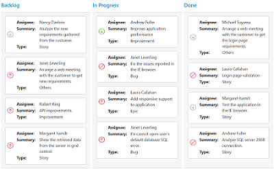

# Cards

## Customization

Cards can be customized with appropriate mapping fields from the database. The customizable mapping properties are listed as follows

<table>
<tr>
<th>
Mapping Fields</th><th>
Description</th></tr>
<tr>
<td>
 {{ 'Content' | markdownify }} </td><td> Map the column name to use as content to cards.</td></tr>
<tr>
<td>
{{ 'Tag'| markdownify }} </td><td>
Map the column name to use as tag. Multiple tags can be given with comma separated.  E.g. "API","SQL, Database".</td></tr>
<tr>
<td>
{{ 'Color' | markdownify }} </td><td>
 Map the column name to use as colors to highlight cards left border.</td></tr>
<tr>
<td>
{{ 'ColorMapping' | markdownify }} </td><td>
Map the colors to use with column values which is mapped with {{ 'fields.color' | markdownify }}. </td></tr>
<tr>
<td>
{{ 'ImageUrl' | markdownify }} </td><td>
Map the column name to use as image to cards.</td></tr>
<tr>
<td>
{{ 'PrimaryKey' | markdownify }} </td><td>
Map the column name to use as primary key to cards.</td></tr>
<tr>
<td>
{{ 'PriorityKey'| markdownify }}</td><td>
Map the column name to use as priority key to cards.</td></tr>
<tr>
<td>
 {{ 'Title' | markdownify }} </td><td>
Map the column name to use as title to cards. Default title is {{ 'primaryKey' | markdownify }}.</td></tr>
<tr>
<td>
{{ 'AllowTitle'| markdownify }} </td><td>
Set as true to enable title for card.</td></tr>
</table>

The following code example describes the above behavior.





    @(Html.EJ().Kanban("Kanban")
                    .DataSource((IEnumerable<object>)ViewBag.datasource)
                    .Columns(col =>
                    {
                        col.HeaderText("Backlog").Key("Open").Add();
                        col.HeaderText("In Progress").Key("InProgress").Add();
                        col.HeaderText("Done").Key("Close").Add();
                    })
                    .AllowTitle(true)
                    .AllowSelection(true) 
                    .KeyField("Status")
                    .Fields(field =>
                    {
                        field.Color("Type")
                            .Content("Summary")
                            .ImageUrl("Image")  
                            .Tag("Tags")
                            .Priority("RankId")                  
                            .PrimaryKey("Id");
                    })
                    .CardSettings(card=>
                    {
                        card.ColorMapping(color =>
                        {
                            color.Add("#cb2027", "Bug,Story")
                                .Add("#67ab47", "Improvement")
                                .Add("#fbae19", "Epic")
                                .Add("#6a5da8", "Others");
                        });
                    })
                    
    )
  



    namespace MVCSampleBrowser
    {
        public partial class KanbanController : Controller
        {
            //
            // GET: /Kanban/
            public ActionResult KanbanFeatures()
            {
                var DataSource = new NorthwindDataContext().Tasks.Take(30).ToList();
                ViewBag.datasource = DataSource;
                return View();
            }
        }
    }



  

The following output is displayed as a result of the above code example.

## Template

Templates are used to create custom card layout as per the user convenient. HTML templates can be specified in the `Template` property of the `CardSettings` as an ID of the template’s HTML element.

You can use JsRender syntax in the template. For more information about JsRender syntax, please refer this [`link`](https://www.jsviews.com/).

The following code example describes the above behavior.



    
            




    <!--CSS for card template-->
        







    @(Html.EJ().Kanban("Kanban")
                    .DataSource((IEnumerable<object>)ViewBag.datasource)
                    .Columns(col =>
                    {
                        col.HeaderText("Backlog").Key("Open").Add();
                        col.HeaderText("In Progress").Key("InProgress").Add();
                        col.HeaderText("Done").Key("Close").Add();
                    })
                    .KeyField("Status")
                    .Fields(field =>
                    {
                        field.Color("Type")
                            .PrimaryKey("Id");
                    })
                    .CardSettings(card=>
                    {
                        card.ColorMapping(color =>
                        {
                            color.Add("#cb2027", "Bug,Story")
                                .Add("#67ab47", "Improvement")
                                .Add("#fbae19", "Epic")
                                .Add("#6a5da8", "Others");
                        });
                        card.Template("#template");
                    })
                    
    )




    namespace MVCSampleBrowser
    {
        public partial class KanbanController : Controller
        {
            //
            // GET: /Kanban/
            public ActionResult KanbanFeatures()
            {
                var DataSource = new NorthwindDataContext().Tasks.Take(30).ToList();
                ViewBag.datasource = DataSource;
                return View();
            }
        }
    }
        


  

The following output is displayed as a result of the above code example.

## Tooltip

You can enable HTML tooltip for Kanban card elements by setting ‘Enable` property as true in `TooltipSettings`.

The following code example describes the above behavior. 





    @(Html.EJ().Kanban("Kanban")
                    .DataSource((IEnumerable<object>)ViewBag.datasource)
                    .TooltipSettings(tooltip=>tooltip.Enable(true))
                    .Columns(col =>
                    {
                        col.HeaderText("Backlog").Key("Open").Add();
                        col.HeaderText("In Progress").Key("InProgress").Add();
                        col.HeaderText("Done").Key("Close").Add();
                    })
                    
                    .KeyField("Status")
                    .Fields(field =>
                    {
                        field.Content("Summary")
                            .Tag("Tags")                  
                            .PrimaryKey("Id");
                    })
                    
                    
    )




    namespace MVCSampleBrowser
    {
        public partial class KanbanController : Controller
        {
            //
            // GET: /Kanban/
            public ActionResult KanbanFeatures()
            {
                var DataSource = new NorthwindDataContext().Tasks.Take(30).ToList();
                ViewBag.datasource = DataSource;
                return View();
            }
        }
    }



  

The following output is displayed as a result of the above code example.

### Template

By making use of template feature with tooltip, all the field names that are mapped from the `dataSource` can be accessed to define the `Template` tooltip for card. The `TooltipSettings.Enable` must be enabled first.

The following code example describes the tooltip template.



    





    <!--toolTip template releated css -->
    







    @(Html.EJ().Kanban("Kanban")
                    .DataSource((IEnumerable<object>)ViewBag.datasource)
                    .TooltipSettings(tooltip=>tooltip.Enable(true).Template("#tooltipTemp"))
                    .Columns(col =>
                    {
                        col.HeaderText("Backlog").Key("Open").Add();
                        col.HeaderText("In Progress").Key("InProgress").Add();
                        col.HeaderText("Done").Key("Close").Add();
                    })
                    .KeyField("Status")
                    .Fields(field =>
                    {
                        field.Content("Summary")
                            .Tag("Tags")                  
                            .PrimaryKey("Id");
                    })
                    
                    
    )




    namespace MVCSampleBrowser
    {
        public partial class KanbanController : Controller
        {
            //
            // GET: /Kanban/
            public ActionResult KanbanFeatures()
            {
                var DataSource = new NorthwindDataContext().Tasks.Take(30).ToList();
                ViewBag.datasource = DataSource;
                return View();
            }
        }
    }



  

The following output is displayed as a result of the above code example.

## Collapsible Cards

You can set particular cards collapsed state in Kanban by defining the `CollapsibleCards` property. Based on the `CollapsibleCards` object value, it maps the cards to the collapsible area. 

You can set `CollapsibleCards` as object which consists of `Field` and `Key` properties. The `Field` property map the datasource field to be used in `CollapsibleCards`. The `Key` property map the specific column key to be in collapsed state.

<table>
<tr>
<th>
Mapping Fields</th><th>
Description</th></tr>
<tr>
<td>
{{ 'CollapsibleCards.Field' | markdownify }} </td><td>
 Map the collapsible card's field mapping.</td></tr>
<tr>
<td>
{{ 'CollapsibleCards.Key' | markdownify }} </td><td>
Map the collapsible card's key mapping which is available in datasource value of field mapped in {{ 'collapsibleCards.field' | markdownify }}.</td></tr>
</table>

N> 1. If the `CollapsibleCards` with `Field` is in the dataSource and `Key` values specified will available in column values, then the cards will be rendered inside the collapsible card's division.

The following code example describes the collapsible cards.





    @(Html.EJ().Kanban("Kanban")
                    .DataSource((IEnumerable<object>)ViewBag.datasource)
                    .Columns(col =>
                    {
                       col.HeaderText("Andrew").Key("Andrew Fuller").Add();
                       col.HeaderText("Janet").Key("Janet Leverling").Add();
                       col.HeaderText("Nancy").Key("Nancy Davloio").Add();
                    })
                   .AllowTitle(true)
                   .AllowSelection(false)
                   .KeyField("Assignee")
                   .Fields(field =>
                   {
                       field.PrimaryKey("Id");
                       field.Content("Summary");
                       field.Tag("Status");
                       field.CollapsibleCards(collapsibleCards =>
                       {
                          collapsibleCards.Field("Status").Key("Close");
                       });
                    })
    )




    namespace MVCSampleBrowser
    {
        public partial class KanbanController : Controller
        {
            //
            // GET: /Kanban/
            public ActionResult KanbanFeatures()
            {
                var DataSource = new NorthwindDataContext().Tasks.Take(30).ToList();
                ViewBag.datasource = DataSource;
                return View();
            }
        }
    }





The following output is displayed as a result of the above code example.

