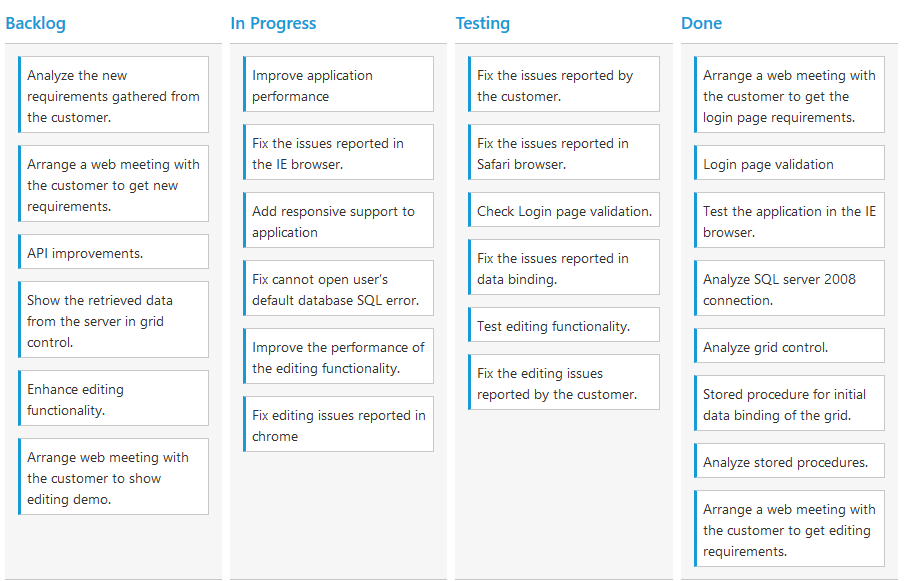
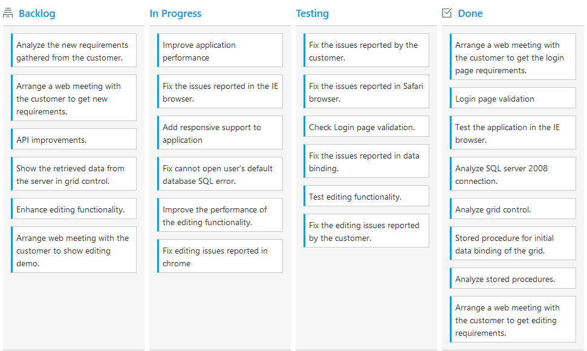
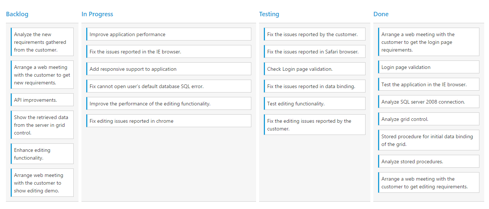
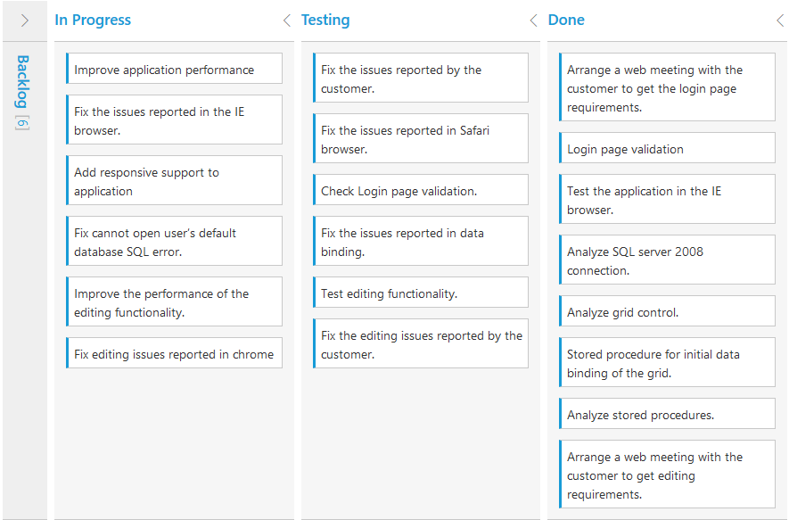
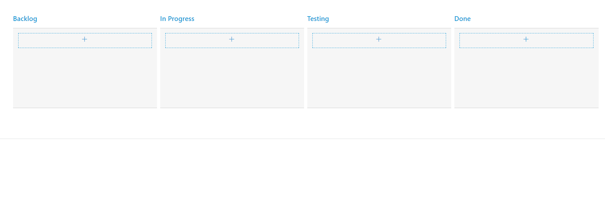

# Columns

Column fields are present in the [`dataSource`](https://help.syncfusion.com/js/api/ejgrid#members:datasource) schema and it is rendering cards based its mapping column values.

## Key Mapping

To render Kanban with simple cards, you need to map the `dataSource` fields to Kanban cards and `Columns`. The required mapping field are listed as follows

<table>
<tr>
<th>
Mapping Fields</th><th>
Description</th></tr>
<tr>
<td>
{{ 'KeyField' | markdownify }} </td><td>
Map the column name to use as {{ 'Key'| markdownify }} values to columns.</td></tr>
<tr>
<td>
{{ 'Columns.Key' | markdownify }} </td><td>
Map the corresponding {{ 'key'| markdownify }} values of {{ 'KeyField'| markdownify }} column to each columns.</td></tr>
<tr>
<td>
{{ 'Columns.HeaderText'| markdownify }} </td><td>
 It represents the title for particular column</td></tr>
<tr>
<td>
{{ 'Fields.Content'| markdownify }} </td><td>
Map the column name to use as content to cards.</td></tr>
</table>

N> 1. If the column with `KeyField` is not in the dataSource and `Key` values specified will not available in column values, then the cards will not be rendered.
N> 2. If the `Fields.Content` is not in the dataSource, then empty cards will be rendered.

The following code example describes the above behavior.




   
    @(Html.EJ().Kanban("Kanban")
                    .DataSource((IEnumerable<object>)ViewBag.datasource)
                    .Columns(col =>
                    {
                        col.HeaderText("Backlog").Key("Open").Add();
                        col.HeaderText("In Progress").Key("InProgress").Add();
                        col.HeaderText("Testing").Key("Testing").Add();
                        col.HeaderText("Done").Key("Close").Add();
                    })                
                    .KeyField("Status")
                    .Fields(field =>
                    {                    
                            field.Content("Summary");
                            
                    })
    )




    namespace MVCSampleBrowser
    {
        public partial class KanbanController : Controller
        {
            public ActionResult KanbanFeatures()
            {
                var DataSource = new NorthwindDataContext().Tasks.Take(30).ToList();
                ViewBag.datasource = DataSource;
                return View();
            }
        }
    }

    


  

The following output is displayed as a result of the above code example.

## Multiple Key Mapping

You can map more than one datasource fields as `Key` values to show different key cards into single column. For e.g , you can map "Validate,In progress" keys under "In progress" column. 

The following code example and screenshot which describes the above behavior.




   
    @(Html.EJ().Kanban("Kanban")
                    .DataSource((IEnumerable<object>)ViewBag.datasource)
                    .Columns(col =>
                    {
                        col.HeaderText("Backlog").Key("Open").Add();
                        col.HeaderText("In Progress or Validate").Key("InProgress,Validate").Add();
                        col.HeaderText("Testing").Key("Testing").Add();
                        col.HeaderText("Done").Key("Close").Add();
                    })                
                    .KeyField("Status")
                    .Fields(field =>
                    {                    
                            field.Content("Summary");
                            
                    })
    )




    namespace MVCSampleBrowser
    {
        public partial class KanbanController : Controller
        {
            public ActionResult KanbanFeatures()
            {
                var DataSource = new NorthwindDataContext().Tasks.Take(30).ToList();
                ViewBag.datasource = DataSource;
                return View();
            }
        }
    }

    


  

The following output is displayed as a result of the above code example.

## Headers

### Header Template

The template design that applies on for the column header. To render template, set `HeaderTemplate` property of the `Columns`.

You can use JsRender syntax in the template. For more information about JsRender syntax, please refer the link.

The following code example describes the above behavior.



        <!-- Column Template -->
        
        

             Done
        

    

 







    @(Html.EJ().Kanban("Kanban")
                        .DataSource((IEnumerable<object>)ViewBag.datasource)
                        .Columns(col =>
                        {
                            col.HeaderText("Backlog").Key("Open").HeaderTemplate("#column1").Add();
                            col.HeaderText("In Progress").Key("InProgress").Add();
                            col.HeaderText("Testing").Key("Testing").Add();
                            col.HeaderText("Done").Key("Close").HeaderTemplate("#column4").Add();
                        })                
                        .KeyField("Status")
                        .Fields(field =>
                        {                    
                                field.Content("Summary");
                                
                        })
        )





    namespace MVCSampleBrowser
    {
        public partial class KanbanController : Controller
        {
            public ActionResult KanbanFeatures()
            {
                var DataSource = new NorthwindDataContext().Tasks.Take(30).ToList();
                ViewBag.datasource = DataSource;
                return View();
            }
        }
    }

                 


  


    /*CSS for Header template icon*/
    .e-backlog,.e-done {
        font-size: 16px;
        padding-right: 5px;
        display: inline-block;
        }    
    .e-backlog:before {
        content: "\e807";
        }    
    .e-done:before {
        content: "\e80a";
        }



The following output is displayed as a result of the above code example.

## Width

You can specify the width for particular column by setting `Width` property of `Columns` as in pixel (ex: 100) or in percentage (ex: 40%).

The following code example describes the above behavior.





    @(Html.EJ().Kanban("Kanban")
                    .DataSource((IEnumerable<object>)ViewBag.datasource)
                    .Columns(col =>
                    {
                        col.HeaderText("Backlog").Key("Open").Width(70).Add();
                        col.HeaderText("In Progress").Key("InProgress").Width("40%").Add();
                        col.HeaderText("Testing").Key("Testing").Width(90).Add();
                        col.HeaderText("Done").Key("Close").Width(90).Add();
                    })                
                    .KeyField("Status")
                    .Fields(field =>
                    {                    
                            field.Content("Summary");
                            
                    })
    )




    namespace MVCSampleBrowser
    {
        public partial class KanbanController : Controller
        {
            public ActionResult KanbanFeatures()
            {
                var DataSource = new NorthwindDataContext().Tasks.Take(30).ToList();
                ViewBag.datasource = DataSource;
                return View();
            }
        }
    }



  

The following output is displayed as a result of the above code example.

## Visibility 

You can hide particular column in Kanban by setting `Visible` property of it as false.

The following code example describes the above behavior.





    @(Html.EJ().Kanban("Kanban")
                    .DataSource((IEnumerable<object>)ViewBag.datasource)
                    .Columns(col =>
                    {
                        col.HeaderText("Backlog").Key("Open").Add();
                        col.HeaderText("In Progress").Key("InProgress").Add();
                        col.HeaderText("Testing").Key("Testing").Visible(false).Add();
                        col.HeaderText("Done").Key("Close").Add();
                    })                
                    .KeyField("Status")
                    .Fields(field =>
                    {                    
                            field.Content("Summary");
                            
                    })
    )




    namespace MVCSampleBrowser
    {
    public partial class KanbanController : Controller
    {
        public ActionResult KanbanFeatures()
        {
            var DataSource = new NorthwindDataContext().Tasks.Take(30).ToList();
            ViewBag.datasource = DataSource;
            return View();
        }
    }
}
            


  

The following output is displayed as a result of the above code example.

## Toggle 

You can set particular column collapsed state in Kanban by setting `IsCollapsed` property of it as true. You need to set `AllowToggleColumn` as true to use `Expand/Collapse` Column.

The following code example describes the above behavior.




 
    @(Html.EJ().Kanban("Kanban")
                   .DataSource((IEnumerable<object>)ViewBag.datasource)
                   .AllowToggleColumn(true)
                   .Columns(col =>
                   {
                       col.HeaderText("Backlog").Key("Open").IsCollapsed(true).Add();
                       col.HeaderText("In Progress").Key("InProgress").Add();
                       col.HeaderText("Testing").Key("Testing").Add();
                       col.HeaderText("Done").Key("Close").Add();
                   })                
                  .KeyField("Status")
                  .Fields(field =>
                  {                    
                          field.Content("Summary");
                          field.PrimaryKey("Id");
                        
                  })

    



    @(Html.EJ().Kanban("Kanban")
                   .DataSource((IEnumerable<object>)ViewBag.datasource)
                   .AllowToggleColumn(true)
                   .Columns(col =>
                   {
                       col.HeaderText("Backlog").Key("Open").IsCollapsed(true).Add();
                       col.HeaderText("In Progress").Key("InProgress").Add();
                       col.HeaderText("Testing").Key("Testing").Add();
                       col.HeaderText("Done").Key("Close").Add();
                   })                
                  .KeyField("Status")
                  .Fields(field =>
                  {                    
                          field.Content("Summary");
                          field.PrimaryKey("Id");
                        
                  })



  

The following output is displayed as a result of the above code example.

## Allow Dragging

You can enable and disable drag behavior to the cards in the Kanban columns using the `AllowDrag` property and the default value is `true`.

The following code example describes the above behavior.





    @(Html.EJ().Kanban("Kanban")
                    .DataSource((IEnumerable<object>)ViewBag.datasource)                   
                    .Columns(col =>
                    {
                        col.HeaderText("Backlog").Key("Open").AllowDrag(false).Add();
                        col.HeaderText("In Progress").Key("InProgress").Add();
                        col.HeaderText("Done").Key("Close").Add();
                    })
                    .KeyField("Status")
                    .Fields(field =>
                    {
                        field.Content("Summary")
                            .Priority("RankId")           
                            .PrimaryKey("Id");
                    })
                    
                    
    )




    namespace MVCSampleBrowser
    {
        public partial class KanbanController : Controller
        {
            //
            // GET: /Kanban/
            public ActionResult KanbanFeatures()
            {
                var DataSource = new NorthwindDataContext().Tasks.Take(30).ToList();
                ViewBag.datasource = DataSource;
                return View();
            }
        }
    }



 

The following output is displayed as a result of the above code example.

## Allow Dropping

You can enable and disable drop behavior to the cards in the Kanban columns using the `AllowDrop` property and the default value is `true`.

The following code example describes the above behavior.





    @(Html.EJ().Kanban("Kanban")
                    .DataSource((IEnumerable<object>)ViewBag.datasource)                   
                    .Columns(col =>
                    {
                        col.HeaderText("Backlog").Key("Open").Add();
                        col.HeaderText("In Progress").Key("InProgress").Add();
                        col.HeaderText("Done").Key("Close").AllowDrop(false).Add();
                    })
                    .KeyField("Status")
                    .Fields(field =>
                    {
                        field.Content("Summary")
                            .Priority("RankId")           
                            .PrimaryKey("Id");
                    })
                    
                    
    )




    namespace MVCSampleBrowser
    {
        public partial class KanbanController : Controller
        {
            //
            // GET: /Kanban/
            public ActionResult KanbanFeatures()
            {
                var DataSource = new NorthwindDataContext().Tasks.Take(30).ToList();
                ViewBag.datasource = DataSource;
                return View();
            }
        }
    }



 

The following output is displayed as a result of the above code example.

## Items Count

You can show total cards count in each column's header using the property `EnableTotalCount` and the default value is `false`.

The following code example describes the above behavior.





    @(Html.EJ().Kanban("Kanban")
                    .DataSource((IEnumerable<object>)ViewBag.datasource)                   
                    .Columns(col =>
                    {
                        col.HeaderText("Backlog").Key("Open").Add();
                        col.HeaderText("In Progress").Key("InProgress").Add();
                        col.HeaderText("Done").Key("Close").Add();
                    })
                    .KeyField("Status")
                    .EnableTotalCount(true)
                    .Fields(field =>
                    {
                        field.Content("Summary")  
                            .PrimaryKey("Id");
                    })
                    
                    
    )




    namespace MVCSampleBrowser
    {
        public partial class KanbanController : Controller
        {
            //
            // GET: /Kanban/
            public ActionResult KanbanFeatures()
            {
                var DataSource = new NorthwindDataContext().Tasks.Take(30).ToList();
                ViewBag.datasource = DataSource;
                return View();
            }
        }
    }



 

The following output is displayed as a result of the above code example.

## Customize Items Count Text

You can customize the Items count text using the property `TotalCount.Text`.

The following code example describes the above behavior.





             @(Html.EJ().Kanban("Kanban")
                    .DataSource((IEnumerable<object>)ViewBag.datasource)                   
                    .Columns(col =>
                     {
                       col.HeaderText("Backlog").Key("Open").TotalCount(
                            t => {
                                t.Text("Backlog Count");
                            }
                           ).Add();
                       col.HeaderText("In Progress").Key("InProgress").Add();
                       col.HeaderText("Done").Key("Close").Add();
                    })
                    .KeyField("Status")
                    .EnableTotalCount(true)
                    .Fields(field =>
                    {
                        field.Content("Summary")  
                            .PrimaryKey("Id");
                    })
                )





    namespace MVCSampleBrowser
    {
        public partial class KanbanController : Controller
        {
            //
            // GET: /Kanban/
            public ActionResult KanbanFeatures()
            {
                var DataSource = new NorthwindDataContext().Tasks.Take(30).ToList();
                ViewBag.datasource = DataSource;
                return View();
            }
        }
    }



 

The following output is displayed as a result of the above code example.

## Display Empty Column

On binding empty data source to Kanban control, it displays "No cards to display" text. Using `ShowColumnWhenEmpty` property, we can render empty kanban columns. Set AllowEditing and AllowAdding property as true to add new data into the empty kanban column.

The following code example describes the above behavior.





             @(Html.EJ().Kanban("Kanban")
                    .DataSource((IEnumerable<object>)ViewBag.datasource)
                    .ShowColumnWhenEmpty(true)					
                    .Columns(col =>
                     {
                       col.HeaderText("Backlog").Key("Open").Add();
                       col.HeaderText("In Progress").Key("InProgress").Add();
					   col.HeaderText("Testing").Key("Testing").Add();
                       col.HeaderText("Done").Key("Close").Add();
                    })
                    .KeyField("Status")
                    .Fields(field =>
                    {
                        field.Content("Summary")  
                            .PrimaryKey("Id");
                    })
					.EditSettings(edit =>
                    {
                            edit.AllowAdding(true)
                                .AllowEditing(true)
                                .EditItems(e =>
                                {
                                    e.Field("Id").ValidationRules(rule => { rule.AddRule("required", true).AddRule("number", true); }).Add();
                                    e.Field("Status").Add();
                                    e.Field("Assignee").Add();
                                    e.Field("Estimate").EditType(KanbanEditingType.Numeric).NumericEditOptions(new EditorProperties() { DecimalPlaces = 2 }).ValidationRules(rule => { rule.AddRule("range", "[0,1000]"); }).Add();
                                    e.Field("Summary").EditType(KanbanEditingType.TextArea).ValidationRules(rule => { rule.AddRule("required", true); }).Add();
                                }).EditMode(KanbanEditMode.Dialog);
                    })
                )





    namespace MVCSampleBrowser
    {
        public partial class KanbanController : Controller
        {
            //
            // GET: /Kanban/
            public ActionResult KanbanFeatures()
            {
                var DataSource = new NorthwindDataContext().Tasks.Take(0).ToList();
                ViewBag.datasource = DataSource;
                return View();
            }
        }
    }



 

The following output is displayed as a result of the above code example.

