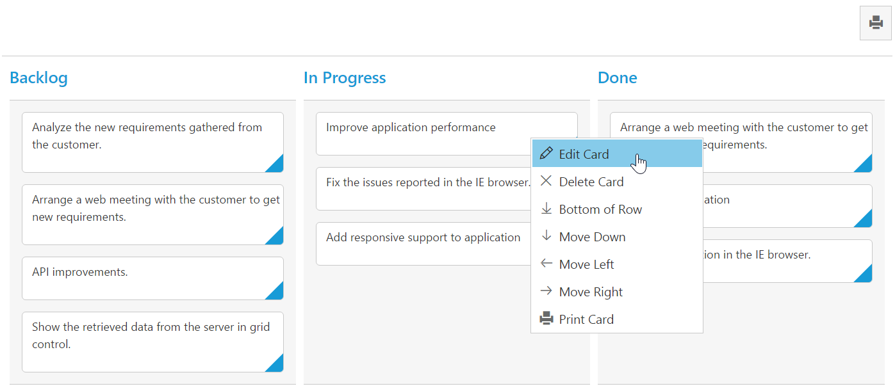

# Context Menu 

Context menu is used to improve user action with Kanban using popup menu. It can be shown by defining `ContextMenuSettings.Enable` as true. Context menu has option to add default items in `ContextMenuSettings.MenuItems` and customized items in `ContextMenuSettings.CustomMenuItems`.

## Default Context Menu items

Please find the below table for default context menu items and its actions.

<table>
        <tr>
            <th>
                Section 
            </th>
            <th>
               Context menu items 
            </th>
            <th>
                Action
            </th>
        </tr>
        <tr>
            <td rowspan="2">
                Header 
            </td>
            <td>
                Hide Column
            </td>
            <td>
               Hide the current column 
            </td>
        </tr>
        <tr>
            <td>
                Visible Columns
            </td>
            <td>
                Show the column if already hidden 
            </td>
        </tr>
       <tr>
            <td>
                Content
            </td>
            <td>
                Add Card 
            </td>
             <td>
                Start Add new card 
            </td>
        </tr>
        <tr>
            <td rowspan="10">
                Card
            </td>
            <td>
               Edit Card 
            </td>
            <td>
               Start Edit in current card 
            </td>
        </tr>
        <tr>
            <td>
               Delete Card 
            </td>
            <td>
                Delete the current card 
            </td>
        </tr>
        <tr>
            <td>
                Top of Row
            </td>
            <td>
                Move the card to Top of Row
            </td>
        </tr>
        <tr>
            <td>
               Bottom of Row
            </td>
            <td>
                Move the card to Bottom of Row
            </td>
        </tr>
        <tr>
            <td>
               Move Up
            </td>
            <td>
                Move the card in Up direction 
            </td>
        </tr>
        <tr>
            <td>
               Move Down
            </td>
            <td>
               Move the card in Down direction
            </td>
        </tr>
        <tr>
            <td>
                Move Left
            </td>
            <td>
                Move the card in Left direction
            </td>
        </tr>
        <tr>
            <td>
               Move Right
            </td>
            <td>
                Move the card in Right direction
            </td>
        </tr>
        <tr>
            <td>
              Move Swimlane
            </td>
            <td>
                Move the card to Swim lane which is chosen from given list
            </td>
        </tr>
          <tr>
            <td>
              Print Card
            </td>
            <td>
              Print the specific card
            </td>
        </tr>
  </table>

The following code example describes the above behavior.





    @(Html.EJ().Kanban("Kanban")
        .DataSource((IEnumerable<object>)ViewBag.datasource)
        .Columns(col =>
        {
            col.HeaderText("Backlog").Key("Open").Add();
            col.HeaderText("In Progress").Key("InProgress").Add();
            col.HeaderText("Done").Key("Close").Add();
        })
        .KeyField("Status")
        .Fields(field =>
        {
            field.Content("Summary")
                .Tag("Tags")
                .PrimaryKey("Id");
        })
        .ContextMenuSettings(menu => menu.Enable(true))   
    )

  




    namespace MVCSampleBrowser
    {
        public partial class KanbanController : Controller
        {
            //
            // GET: /Kanban/
            public ActionResult KanbanFeatures()
            {
                var DataSource = new NorthwindDataContext().Tasks.Take(30).ToList();
                ViewBag.datasource = DataSource;
                return View();
            }
        }
    }



  

The following output is displayed as a result of the above code example.

## Custom Context Menu

Custom context menu is used to create your own menu item and its action. To add customized context menu items, you need to use `ContextMenuSettings.CustomMenuItems` property and to bind required actions for this, use `ContextClick` event.

The following code example describes the above behavior.





    @(Html.EJ().Kanban("Kanban")
        .DataSource((IEnumerable<object>)ViewBag.datasource)
        .Columns(col =>
        {
            col.HeaderText("Backlog").Key("Open").Add();
            col.HeaderText("In Progress").Key("InProgress").Add();
            col.HeaderText("Done").Key("Close").Add();
        })
        .KeyField("Status")
        .Fields(field =>
        {
            field.Content("Summary")
                .Tag("Tags")
                .SwimlaneKey("Assignee")
                .PrimaryKey("Id");
        })
        .ContextMenuSettings(menu => menu.Enable(true) .MenuItems(menuitem=>menuitem.Add()).CustomMenuItems(custom => custom.Text("Clear Selection").Target(ContextTarget.All).Add()))
    )
  




    namespace MVCSampleBrowser
    {
        public partial class KanbanController : Controller
        {
            //
            // GET: /Kanban/
            public ActionResult KanbanFeatures()
            {
                var DataSource = new NorthwindDataContext().Tasks.Take(30).ToList();
                ViewBag.datasource = DataSource;
                return View();
            }
        }
    }
 


  

The following output is displayed as a result of the above code example.

## Sub Context Menu

Sub context menu is used to add customized sub menu to the custom context menu item. To add a sub context menu, you need to use `ContextMenuSettings.subMenu` property and to bind required actions for this, use `ContextClick` event.

The following code example describes the above behavior.





    @(Html.EJ().Kanban("Kanban")
        .DataSource((IEnumerable<object>)ViewBag.datasource)
        .ClientSideEvents(eve => eve.ContextClick("contextclick"))
        .Columns(col =>
        {
            col.HeaderText("Backlog").Key("Open").Add();
            col.HeaderText("In Progress").Key("InProgress").Add();
            col.HeaderText("Done").Key("Close").Add();
        })
        .KeyField("Status")
        .Fields(field =>
        {
            field.Content("Summary")
                .Tag("Tags")
                .SwimlaneKey("Assignee")
                .PrimaryKey("Id");
        })
        .ContextMenuSettings(menu => menu.Enable(true).MenuItems(menuitem=>menuitem.Add()).CustomMenuItems(custom =>
                {
            custom.Text("Clear Selection").Target(ContextTarget.All).Add();         
            custom.Text("Move to Column").Target(ContextTarget.All).Template("#template").Add();
                }
            ))
    )
	




    namespace MVCSampleBrowser
    {
        public partial class KanbanController : Controller
        {
            //
            // GET: /Kanban/
            public ActionResult KanbanFeatures()
            {
                var DataSource = new NorthwindDataContext().Tasks.Take(30).ToList();
                ViewBag.datasource = DataSource;
                return View();
            }
        }
    }
 


  



    <ul id="template">
    <li><a>Open</a></li>
    <li><a>InProgress</a></li>
    <li><a>Close</a></li>
    </ul>





    function contextclick(args)
    {
        if (args.text == "Clear Selection")
            this.clearSelection();
    }



The following output is displayed as a result of the above code example.

