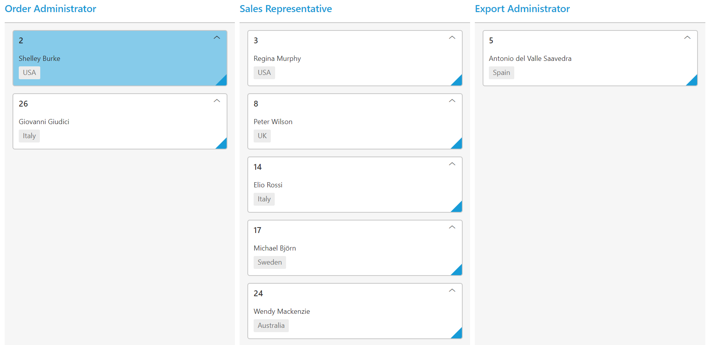

# Data Binding 

Kanban `DataSource` property allows to bind datasource as the instance of one of the following types.

•	Collection that implements IEnumerable or IEnumerable.
•	REST Service URL as string.
•	ORM components such as Entity Framework/Linq to SQL.

We can also bind the above type of data source by using lambda Expressions of Kanban `DataSource` Property.

In the following section, let us see on how to bind various data sources to Kanban using `DataSource` API.

## IEnumerable

The Kanban can be bound with collection that implements IEnumerable interface. It can be assigned to Kanban `DataSource` property.

N> When using DataSource builder, the IEnumerable data source can be passed as parameter either directly to the DataSource builder or to the JSON property of the DataSource builder.

The following code example describes the above behavior.





    @(Html.EJ().Kanban("Kanban")
                   .DataSource((IEnumerable<Tasks>)ViewBag.datasource)
                   .Columns(col =>
                   {
                       col.HeaderText("Backlog").Key("Open").Add();
                       col.HeaderText("In Progress").Key("InProgress").Add();
                       col.HeaderText("Testing").Key("Testing").Add();
                   })                
                  .KeyField("Status")
                  .Fields(field =>
                  {                    
                          field.Content("Summary");
                        
                  })
)




    namespace MVCSampleBrowser
    {
    public partial class KanbanController : Controller
    {
        public ActionResult KanbanFeatures()
        {
            List<Tasks> Task = new List<Tasks>();
            Task.Add(new Tasks(1, "Open", "Analyze the new requirements gathered from the customer.", "Nancy Davloio"));
            Task.Add(new Tasks(2, "InProgress", "Improve application performance", "Andrew Fuller"));
            Task.Add(new Tasks(3, "Open", "Arrange a web meeting with the customer to get new requirements.","Janet Leverling"));
            Task.Add(new Tasks(4, "InProgress", "Fix the issues reported in the IE browser.", "Janet Leverling"));
            Task.Add(new Tasks(5, "Testing", "Fix the issues reported by the customer.","Steven walker"));
            ViewBag.datasource = Task;
            return View();
        }
        [Serializable]
        public class Tasks
        {
            public Tasks()
            {
            }
            public Tasks(int Id, string Status, string Summary, string Assignee)
            {
                this.Id = Id;
                this.Status = Status;
                this.Summary = Summary;             
                this.Assignee = Assignee;          
            }
            public int Id { get; set; }
            public string Status { get; set; }
            public string Summary { get; set; }
            public string Assignee { get; set; }
        }
    }
}



  

The following output is displayed as a result of the above code example.

## Entity Framework

The collection of business objects generated from Entity Framework ORM can be used as Kanban data source. The Kanban can be used with Entity Framework using either code first technique or Database first technique.

The following code example describes the above behavior.





    @(Html.EJ().Kanban("Kanban")
                   .DataSource((IEnumerable<object>)ViewBag.datasource)
                   .Columns(col =>
                   {
                       col.HeaderText("Backlog").Key("Open").Add();
                       col.HeaderText("In Progress").Key("InProgress").Add();
                       col.HeaderText("Done").Key("Close").Add();
                   })                
                  .KeyField("Status")
                  .Fields(field =>
                  {                    
                          field.Content("Summary");
                        
                  })
)




    namespace MVCSampleBrowser
    {
    public partial class KanbanController : Controller
        {
            public ActionResult KanbanFeatures()
            {
                var DataSource = new NorthwindDataContext().Tasks.Take(30).ToList();
                ViewBag.datasource = DataSource;
                return View();
            }
        }
    }



  

The following output is displayed as a result of the above code example.

## LINQ to SQL

The LINQ to SQL can be used as the data source of the Kanban. And the Object Relation class which is used to map with Relational table.

The following code example describes the above behavior.





    .DataSource((IEnumerable<object>)ViewBag.datasource)
                   .Columns(col =>
                   {
                       col.HeaderText("Backlog").Key("Open").Add();
                       col.HeaderText("In Progress").Key("InProgress").Add();
                       col.HeaderText("Done").Key("Close").Add();
                   })                
                  .KeyField("Status")
                  .Fields(field =>
                  {                    
                          field.Content("Summary");
                        
                  })
)




    namespace MVCSampleBrowser
    {
     public partial class KanbanController : Controller
     {
            public ActionResult KanbanFeatures()
            {
                var DataSource = new NorthwindDataContext().Tasks.Take(30).ToList();
                ViewBag.datasource = DataSource;
                return View();
            }
        }
    }



  

The following output is displayed as a result of the above code example.

## WCF DataService / OData Service

WCF Data Services is a component of the .NET Framework that enables you to create services that use the Open Data Protocol (OData) to expose and consume data over the Web or intranet by using the semantics of representational state transfer (REST).

To consume WCF DataService in Kanban control, provide the service link directly to the Kanban DataSource property.

We have an online OData Service `http://mvc.syncfusion.com/Services/Northwnd.svc/Tasks` created specifically for Syncfusion Controls

The following code example describes the above behavior.



    @(Html.EJ().Kanban("Kanban")
                            .DataSource("http://mvc.syncfusion.com/Services/Northwnd.svc/Tasks")
                    .Columns(col =>
                    {
                        col.HeaderText("Backlog").Key("Open").Add();
                        col.HeaderText("In Progress").Key("InProgress").Add();
                        col.HeaderText("Done").Key("Close").Add();
                    })
                    
                    .KeyField("Status")	 
                    .Fields(field =>
                    {
                        field.Content("Summary")                                       
                            .PrimaryKey("Id");
                    })
    )

 


The following output is displayed as a result of the above code example.

## ODataV4 Service

ODataV4Adaptor is used for consuming data from OData V4 Service. To consume OData V4 service, set the service link to the `URL` property of Kanban `DataSource` and set `AdaptorType.ODataV4Adaptor` to the Adaptor Property of Kanban `DataSource`.

W> ODL supports to parse the `$search` query option, however, Web API OData doesn’t support it so far.

The following code example describes the above behavior.


     
    @(Html.EJ().Kanban("Kanban")
                    .DataSource(ds => ds.URL("http://services.odata.org/v4/northwind/northwind.svc/Suppliers").Adaptor(AdaptorType.ODataV4Adaptor))
                    .Columns(col =>
                    {
                        col.HeaderText("Order Administrator ").Key("Order Administrator").Add();
                        col.HeaderText("Sales Representative").Key("Sales Representative").Add();
                        col.HeaderText("Export Administrator").Key("Export Administrator").Add();
                    })

                    .KeyField("ContactTitle")
                    .AllowTitle(true)
                    .Fields(field =>
                    {
                        field.Content("ContactName")
                            .Tag("Country")
                            .PrimaryKey("SupplierID");
                            
                    })
    )



The following output is displayed as a result of the above code example.

## WebAPI

Using `ej.WebApiAdaptor`, you can bind WebApi service data to Kanban. The data from WebApi service must be returned as object that has property `Items` with its value as `dataSource` and another property `Count` with its value as dataSource’s total cards count.

The following code example describes the above behavior.





    @(Html.EJ().Kanban("Kanban")
        .DataSource(ds => ds.URL("/api/Orders").Adaptor(AdaptorType.WebApiAdaptor))
        .Columns(col =>
        {
            col.HeaderText("Backlog").Key("Backlog ").Add();
            col.HeaderText("In Progress").Key("InProgress ").Add();
            col.HeaderText("Testing").Key("Testing ").Add();
        })
        .KeyField("Status")
        .Fields(field =>
        {
            field.Content("Summary")
                .PrimaryKey("Id");
        })
    )

     



    namespace MVCSampleBrowser.Controllers
    {
        public class OrdersController : ApiController
        {
            NorthwindDataContext db = new NorthwindDataContext();

            public object Get()
            {
                var data = db.Tasks.Take(10).ToList();
                return new
                {
                    Items = data,
                    Count = data.Count()
                };
            }

        }
    }



  

Please refer the following link for common WebAPI creation.

`http://www.asp.net/web-api/overview/getting-started-with-aspnet-web-api/tutorial-your-first-web-api`

The following output is displayed as a result of the above code example.

