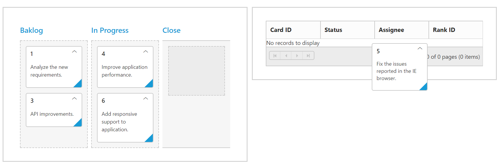

# Drag and Drop

By default, `AllowDragAndDrop` is true. Cards can be transited from one column to another column, by dragging and dropping. And it has drop position indicator which enables easier positioning of cards

N> It is not possible transit cards to other swim lanes through Drag and Drop.

## Drag and Drop to external control

Kanban is now provided support to drag and drop cards to external controls, when `AllowExternalDragAndDrop` is set to true.  Along with that you need to specify the ID of the component to which the card must be dropped in `CardSettings` property `ExternalDropTarget`.

Here, in order to drag and drop cards between two Kanban, enable the Kanban property `AllowExternalDragAndDrop` and specify the target Kanban ID in `ExternalDropTarget`.

The following code example describes the above behavior. 





    @(Html.EJ().Kanban("Kanban")
        .DataSource((IEnumerable<object>)ViewBag.datasource)
        .Columns(col =>
            {
               col.HeaderText("Open").Key("Open,InProgress").Add();
               col.HeaderText("Done").Key("Testing,Close").Add();
            })
        .AllowTitle(true)
        .KeyField("Status")
        .AllowExternalDragAndDrop(true)
        .CardSettings(card =>
           {
             card.ExternalDropTarget("#Kanban1");
           })
        .Fields(field =>
           {
             field.Content("Summary")
                  .PrimaryKey("Id");
            })
     )
     @(Html.EJ().Kanban("Kanban1")
        .DataSource((IEnumerable<object>)ViewBag.datasource1)
        .Columns(col =>
         {
            col.HeaderText("Open").Key("Open,InProgress").Add();
            col.HeaderText("Done").Key("Testing,Close").Add();
         })
        .AllowTitle(true)
        .AllowExternalDragAndDrop(true)
        .CardSettings(card =>
          {
             card.ExternalDropTarget("#Kanban");
          })
        .KeyField("Status")
        .Fields(field =>
           {
             field.Content("Summary")
                  .PrimaryKey("Id");
           })
      )
    




 public partial class KanbanController : Controller
    {

        List<Tasks> Task = new List<Tasks>();
        List<Tasks> Task1 = new List<Tasks>();
      
        public ActionResult KanbanFeatures()
        {
            Task.Add(new Tasks(1, "Open", "Analyze the new requirements gathered from the customer.", "Story", "Low", "Analyze,Customer", 3.5, "Andrew Fuller", "../content/images/kanban/1.png", 1));
            Task.Add(new Tasks(2, "InProgress", "Improve application performance", "Improvement", "Normal", "Improvement", 6, "Andrew Fuller", "../content/images/kanban/2.png", 1));
            Task.Add(new Tasks(3, "Open", "Arrange a web meeting with the customer to get new requirements.", "Others", "Critical", "Meeting", 5.5, "Janet", "../content/images/kanban/3.png", 2));
            Task.Add(new Tasks(4, "InProgress", "Fix the issues reported in the IE browser.", "Bug", "Release Breaker", "IE", 2.5, "Janet", "../content/images/kanban/3.png", 2));
            Task.Add(new Tasks(5, "Testing", "Fix the issues reported by the customer.", "Bug", "Low", "Customer", 3.5, "Andrew Fuller", "../content/images/kanban/5.png", 1));
            Task.Add(new Tasks(6, "Close", "Arrange a web meeting with the customer to get the login page requirements.", "Others", "Low", "Meeting", 2, "Janet", "../content/images/kanban/6.png", 1));
            Task1.Add(new Tasks(7, "Open", "Analyze the new requirements gathered from the customer.", "Story", "Low", "Analyze,Customer", 3.5, "Andrew Fuller", "../content/images/kanban/1.png", 1));
            Task1.Add(new Tasks(8, "InProgress", "Improve application performance", "Improvement", "Normal", "Improvement", 6, "Andrew Fuller", "../content/images/kanban/2.png", 1));
            Task1.Add(new Tasks(9, "Open", "Arrange a web meeting with the customer to get new requirements.", "Others", "Critical", "Meeting", 5.5, "Janet", "../content/images/kanban/3.png", 2));
            Task1.Add(new Tasks(10, "InProgress", "Fix the issues reported in the IE browser.", "Bug", "Release Breaker", "IE", 2.5, "Janet", "../content/images/kanban/3.png", 2));
            Task1.Add(new Tasks(11, "Testing", "Fix the issues reported by the customer.", "Bug", "Low", "Customer", 3.5, "Andrew Fuller", "../content/images/kanban/5.png", 1));
            ViewBag.datasource = Task;
            ViewBag.datasource1 = Task1;
            return View();
        }
        public class Tasks
        {
            public Tasks()
            {
            }
            public Tasks(int Id, string Status, string Summary, string Type, string Priority, string Tags, double Estimate, string Assignee, string Image, int RankId)
            {
                this.Id = Id;
                this.Status = Status;
                this.Summary = Summary;
                this.Type = Type;
                this.Priority = Priority;
                this.Tags = Tags;
                this.Estimate = Estimate;
                this.Assignee = Assignee;
                this.Image = Image;
                this.RankId = RankId;
            }
            public int Id { get; set; }
            public string Status { get; set; }
            public string Summary { get; set; }
            public string Type { get; set; }
            public string Priority { get; set; }
            public string Tags { get; set; }
            public double Estimate { get; set; }
            public string Assignee { get; set; }
            public string Image { get; set; }
            public int RankId { get; set; }
        }
   }







    .e-kanban .e-draggedcard {
	     z-index:1;
	  }



The following output is displayed before dropping Kanban cards.

 

The following output is displayed after dropping Kanban cards.

 

### See Also

You can also drag and drop Kanban cards to any custom control. For instance, let it be a Grid control. Enable the Kanban property `AllowExternalDragAndDrop` and specify the target Grid element ID in `ExternalDropTarget`.

N> The target control must have droppable feature to handle the card dropped from Kanban and customize it based on corresponding control. 

The following code example describes the above behavior. 





        @(Html.EJ().Kanban("Kanban")
              .DataSource((IEnumerable<object>)ViewBag.datasource)
              .Columns(col =>
               {
                   col.HeaderText("Open").Key("Open").Add();
                   col.HeaderText("In Progress").Key("InProgress").Add();
                   col.HeaderText("Done").Key("Close").Add();
                })
                .AllowTitle(true)
                .KeyField("Status")
                .AllowExternalDragAndDrop(true)
                .CardSettings(card =>
                  {
                    card.ExternalDropTarget("#Kanban1");
                 })
                .Fields(field =>
                  {
                    field.Content("Summary")
                         .PrimaryKey("Id");
                  })
                 .ClientSideEvents(eve => { eve.CardDragStop("cardDragStop"); })
        )
   
        @(Html.EJ().Grid<object>("FlatGrid")
              .Datasource((IEnumerable<object>)ViewBag.DataSource1)
              .AllowSorting()
              .AllowPaging()
              .EditSettings(edit => { edit.AllowAdding(); })
              .Columns(col =>
                {
                    col.Field("Id").HeaderText("Card ID").IsPrimaryKey(true).Add();
                    col.Field("Status").HeaderText("Status").Add();
                    col.Field("Assignee").HeaderText("Assignee").Add();
                    col.Field("RankId").HeaderText("Rank ID").Add();
               })
          )
    




 public partial class KanbanController: Controller
    {

        List<Tasks> Task = new List<Tasks>();
        List<Tasks> Task1 = new List<Tasks>();

        public ActionResult KanbanFeatures()
        {
            Task.Add(new Tasks(1, "Open", "Analyze the new requirements gathered from the customer.", "Story", "Low", "Analyze,Customer", 3.5, "Andrew Fuller", "../content/images/kanban/1.png", 1));
            Task.Add(new Tasks(2, "InProgress", "Improve application performance", "Improvement", "Normal", "Improvement", 6, "Andrew Fuller", "../content/images/kanban/2.png", 1));
            Task.Add(new Tasks(3, "Open", "Arrange a web meeting with the customer to get new requirements.", "Others", "Critical", "Meeting", 5.5, "Janet", "../content/images/kanban/3.png", 2));
            Task.Add(new Tasks(4, "InProgress", "Fix the issues reported in the IE browser.", "Bug", "Release Breaker", "IE", 2.5, "Janet", "../content/images/kanban/3.png", 2));
            Task.Add(new Tasks(5, "Close", "Fix the issues reported by the customer.", "Bug", "Low", "Customer", 3.5, "Andrew Fuller", "../content/images/kanban/5.png", 1));
            ViewBag.datasource = Task;
            ViewBag.datasource1 = Task1;
              return View();
        }
        public class Tasks
        {
            public Tasks()
            {
            }
            public Tasks(int Id, string Status, string Summary, string Type, string Priority, string Tags, double Estimate, string Assignee, string Image, int RankId)
            {
                this.Id = Id;
                this.Status = Status;
                this.Summary = Summary;
                this.Type = Type;
                this.Priority = Priority;
                this.Tags = Tags;
                this.Estimate = Estimate;
                this.Assignee = Assignee;
                this.Image = Image;
                this.RankId = RankId;
            }
            public int Id { get; set; }
            public string Status { get; set; }
            public string Summary { get; set; }
            public string Type { get; set; }
            public string Priority { get; set; }
            public string Tags { get; set; }
            public double Estimate { get; set; }
            public string Assignee { get; set; }
            public string Image { get; set; }
            public int RankId { get; set; }
        }
     }







    function cardDragStop(args) {
        if ($(args.dropTarget).parents(".e-grid").length != 0) {
            var gridObj = $("#FlatGrid").data("ejGrid");
            gridObj.addRecord(args.data[0][0]);
            gridObj.refreshContent();
        }
    }





    .e-kanban .e-draggedcard {
	     z-index:1;
	  }



The following output is displayed before dropping the cards on Grid.

The following output is displayed after dropping the cards on Grid.

