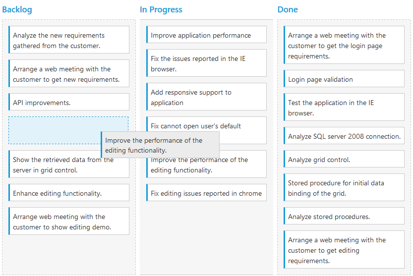

# Drag and Drop

By default, `AllowDragAndDrop` is true. Cards can be transited from one column to another column, by dragging and dropping. And it has drop position indicator which enables easier positioning of cards

N> It is not possible transit cards to other swim lanes through Drag and Drop.

## Prioritization of cards

Prioritizing cards is easy with drag-and-drop re-ordering that helps you to categorize most important work at the top. Cards can be categorized with priority by mapping specific database field into `Priority` property.

`RankId` defined in the dataSource which is consist priority of cards. The `RankId` will be changed while card ordering changes through `Drag and Drop` and `Editing`.

The following code example describes the above behavior.





    @(Html.EJ().Kanban("Kanban")
                    .DataSource((IEnumerable<object>)ViewBag.datasource)                   
                    .Columns(col =>
                    {
                        col.HeaderText("Backlog").Key("Open").Add();
                        col.HeaderText("In Progress").Key("InProgress").Add();
                        col.HeaderText("Done").Key("Close").Add();
                    })
                    .KeyField("Status")
                    .Fields(field =>
                    {
                        field.Content("Summary")
                            .Priority("RankId")           
                            .PrimaryKey("Id");
                    })
                    
                    
    )




    namespace MVCSampleBrowser
    {
        public partial class KanbanController : Controller
        {
            //
            // GET: /Kanban/
            public ActionResult KanbanFeatures()
            {
                var DataSource = new NorthwindDataContext().Tasks.Take(30).ToList();
                ViewBag.datasource = DataSource;
                return View();
            }
        }
    }



 

The following output is displayed as a result of the above code example.

 

