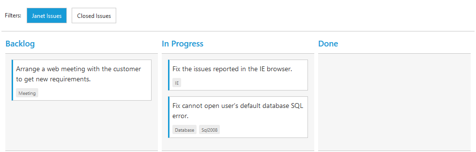

# Filtering

Filtering allows to filter the collection of cards from `dataSource` which meets the predefined `query` in the quick filters collection. To enable filtering, define `FilterSettings` collection with display `Text` and [`ej.Query`](https://help.syncfusion.com/js/datamanager/query). 

You can also define display tip to describe filter definition to user using property `Description`. If the `Description` property is not defined, given `Text` will act as display tip.

We can also customize filter option through external button or [`customToolbarItems`](https://help.syncfusion.com/js/api/ejkanban#members:customtoolbaritems) by using [`filterCards()`](https://help.syncfusion.com/js/api/ejkanban#methods:filtercards) method.

The following code example describes the above behavior.





    @(Html.EJ().Kanban("Kanban")
        .DataSource((IEnumerable<object>)ViewBag.datasource)
        .Columns(col =>
        {
            col.HeaderText("Backlog").Key("Open").Add();
            col.HeaderText("In Progress").Key("InProgress").Add();
            col.HeaderText("Done").Key("Close").Add();
        })
        .KeyField("Status")

        .Fields(field =>
        {
            field.Content("Summary")
                .Tag("Tags")
                .PrimaryKey("Id");
        })
        .FilterSettings(filter =>
        {
            filter.Text("Janet Issues").Query("new ej.Query().where('Assignee', 'equal', 'Janet Leverling')").Description("Displays issues which matches the assignee as 'Janet Leverling").Add();
            filter.Text("Closed  Issues").Query("new ej.Query().where('Status', 'equal', 'Close')").Description("Display the 'Closed' issues").Add();
        })     
    )




    namespace MVCSampleBrowser
    {
        public partial class KanbanController : Controller
        {
            //
            // GET: /Kanban/
            public ActionResult KanbanFeatures()
            {
                var DataSource = new NorthwindDataContext().Tasks.Take(30).ToList();
                ViewBag.datasource = DataSource;
                return View();
            }
        }
    }



  

The following output is displayed as a result of the above code example.

