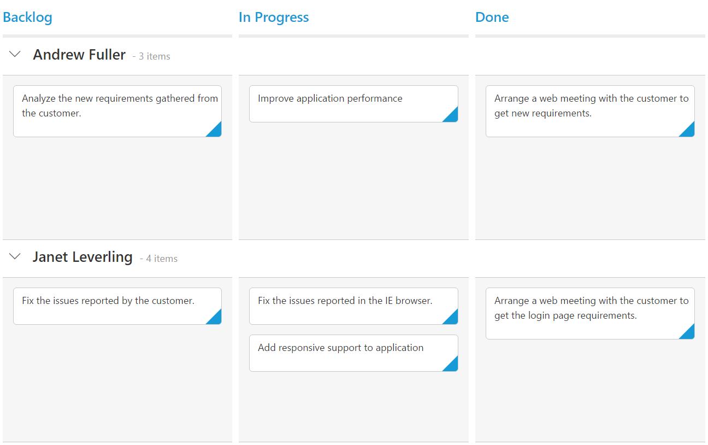

# Getting Started

This section explains briefly how to create a Kanban in your application with ASP.NET MVC and also explains about how to enable basic Kanban features like Swim lane, Filtering.

## Create your first Kanban in MVC

The following steps explain creating first Kanban with an empty columns.

1.	Create Syncfusion ASP.NET MVC application. You can refer  [MVC Getting Started documentation](http://help.syncfusion.com/aspnetmvc/getting-started) to create new project and add necessary dll’s and script files.
2.	Add a Kanban control in View file with an empty columns as like as follows. In Columns definition, the `HeaderText` property allows you to set text to column headers.



    @(Html.EJ().Kanban("Kanban")
                   .Columns(col =>
                   {
                       col.HeaderText("Backlog").Add();
                       col.HeaderText("In Progress").Add();
                       col.HeaderText("Done").Add();
                   })
    ) 



## Data Binding

You can bind the data to Kanban control by either locally or remotely. Assign the remote service URL to DataSource property of Kanban control to bind remote data using `ej.DataManager`.

For demonstration purpose, [`Northwind OData service`](http://mvc.syncfusion.com/Services/Northwnd.svc/) is used in this tutorial. Refer to the following code example.



    @(Html.EJ().Kanban("Kanban")
    .DataSource("http://mvc.syncfusion.com/Services/Northwnd.svc/Tasks")
                   .Columns(col =>
                   {
                       col.HeaderText("Backlog").Add();
                       col.HeaderText("In Progress").Add();
                       col.HeaderText("Done").Add();
                   })
    )



N>  ODataAdaptor is the default adaptor used within DataManager. While binding to other web services, proper [`data adaptor`](http://help.syncfusion.com/aspnetmvc/datamanager/data-adaptors) needs to be set for `adaptor` option of DataManager.

## Mapping Values

In order to display cards in Kanban control, you need to map the database fields to Kanban cards and `columns`. The required mapping field are listed as follows

*  `KeyField` - Map the column name to use as `Key` values to columns.
*  `Columns` -  Map the corresponding `Key` values of `KeyField` column to each columns
*  `Content` - Map the column name to use as content to cards in the Fields.
*  `PrimaryKey` - Map the column name to use as Primary Key in Fields.



    @(Html.EJ().Kanban("Kanban")
    .DataSource("http://mvc.syncfusion.com/Services/Northwnd.svc/Tasks")
    .Columns(col =>
    {
        col.HeaderText("Backlog").Key("Open").Add();
        col.HeaderText("In Progress").Key("InProgress").Add();
        col.HeaderText("Done").Key("Close").Add();
    })
    .KeyField("Status")
    .Fields(field =>
    {
        field.Color("Type")
            .Content("Summary")
            .PrimaryKey("Id");
    })
    )

 

N> _`PrimaryKey` field is mandatory for “Drag and Drop”,”Selection” and “Editing” Features.

## SwimlaneKey

`Swimlane` can be enabled by mapping the `SwimlaneKey` to appropriate column name in `DataSource`. This enables the grouping of the cards based on the mapped column values.



    @(Html.EJ().Kanban("Kanban")
    .DataSource("http://mvc.syncfusion.com/Services/Northwnd.svc/Tasks")
    .Columns(col =>
    {
        col.HeaderText("Backlog").Key("Open").Add();
        col.HeaderText("In Progress").Key("InProgress").Add();
        col.HeaderText("Done").Key("Close").Add();
    })
    .KeyField("Status")
    .Fields(field =>
    {
        field.Color("Type")
            .Content("Summary")
            .SwimlaneKey("Assignee")
            .PrimaryKey("Id");
    })
    )

 

## Adding Filters

Filters allows to filter the collection of cards from `DataSource` which meets the predefined `query` in the filters collection. To enable filtering, define `FilterSettings` collection with display `Text` and `ej.Query`.
 


    @(Html.EJ().Kanban("Kanban")
    .DataSource("http://mvc.syncfusion.com/Services/Northwnd.svc/Tasks")
    .Columns(col =>
    {
        col.HeaderText("Backlog").Key("Open").Add();
        col.HeaderText("In Progress").Key("InProgress").Add();
        col.HeaderText("Done").Key("Close").Add();
    })
    .KeyField("Status")
    .Fields(field =>
    {
        field.Color("Type")
            .Content("Summary")
            .SwimlaneKey("Assignee")
            .PrimaryKey("Id");
    })
    .FilterSettings(filter =>
    {
        filter.Text("Janet Issues").Query("new ej.Query().where('Assignee', 'equal', 'Janet Leverling')").Description("Displays issues which matches the assignee as 'Janet Leverling").Add();
        filter.Text("Testing Issues").Query("new ej.Query().where('Status', 'equal', 'Testing')").Description("Display the issues of 'Testing'").Add();
    })
    )

 

