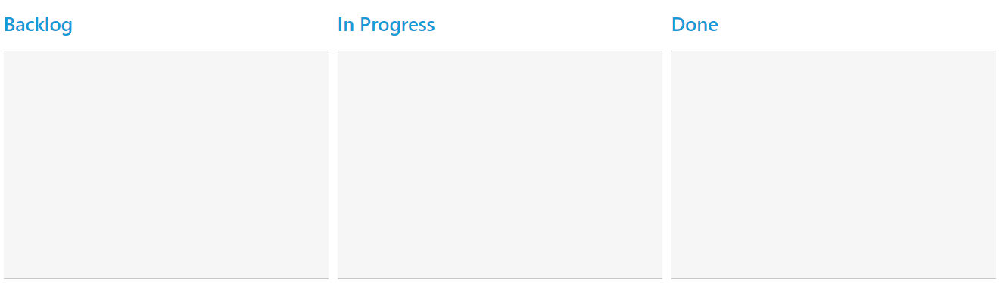
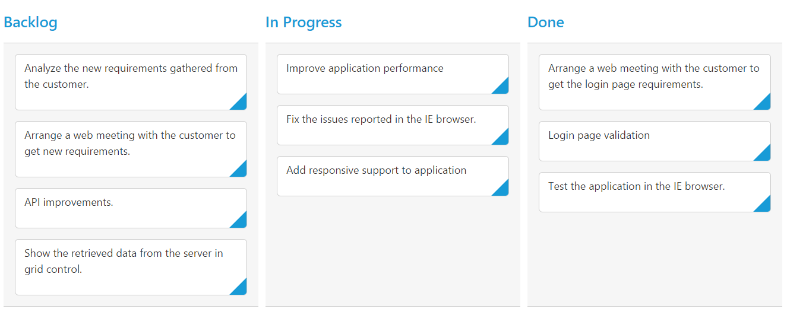
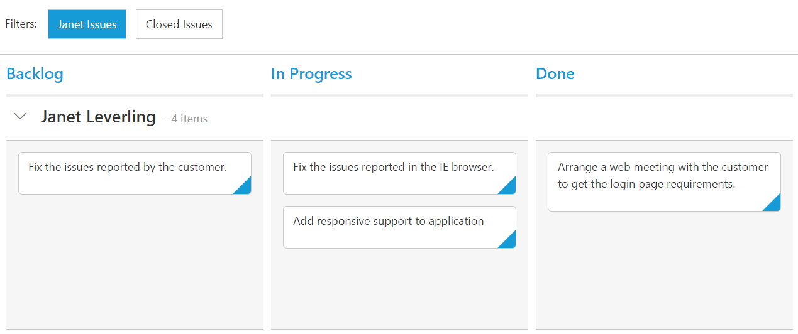

# Getting Started

This section explains briefly how to create a Kanban in your application with ASP.NET MVC and also explains about how to enable basic Kanban features like Swim lane, Filtering.

## Create your first Kanban in MVC

The following steps explain creating first Kanban with an empty columns.

1.	Create Syncfusion ASP.NET MVC application. You can refer  [MVC Getting Started documentation](http://help.syncfusion.com/aspnetmvc/getting-started) to create new project and add necessary dll’s and script files.
2.	Add a Kanban control in View file with an empty columns as like as follows. In Columns definition, the `HeaderText` property allows you to set text to column headers.



    @(Html.EJ().Kanban("Kanban")
                   .Columns(col =>
                   {
                       col.HeaderText("Backlog").Add();
                       col.HeaderText("In Progress").Add();
                       col.HeaderText("Done").Add();
                   })
    ) 



## Data Binding

You can bind the data to Kanban control by either locally or remotely. Assign the local data to DataSource property of Kanban control to bind local data.





  @(Html.EJ().Kanban("Kanban")
           .DataSource((IEnumerable<object>)ViewBag.datasource)
           .Columns(col =>
           {
               col.HeaderText("Backlog").Add();
               col.HeaderText("In Progress").Add();
               col.HeaderText("Done").Add();
           })
     )





    public partial class KanbanController : Controller
    {
        List<Tasks> Task = new List<Tasks>();

        // GET: /Kanban/
        public ActionResult KanbanFeatures()
        {
            Task.Add(new Tasks(1, "Open", "Analyze the new requirements gathered from the customer.", "Story", "Low", "Analyze,Customer", 3.5, "Andrew Fuller", "../content/images/kanban/1.png", 1));
            Task.Add(new Tasks(2, "InProgress", "Improve application performance", "Improvement", "Normal", "Improvement", 6, "Andrew Fuller", "../content/images/kanban/2.png", 1));
            Task.Add(new Tasks(3, "Open", "Arrange a web meeting with the customer to get new requirements.", "Others", "Critical", "Meeting", 5.5, "Janet", "../content/images/kanban/3.png", 2));
            Task.Add(new Tasks(4, "InProgress", "Fix the issues reported in the IE browser.", "Bug", "Release Breaker", "IE", 2.5, "Janet", "../content/images/kanban/3.png", 2));
            Task.Add(new Tasks(5, "Testing", "Fix the issues reported by the customer.", "Bug", "Low", "Customer", 3.5, "Andrew Fuller", "../content/images/kanban/5.png", 1));
            Task.Add(new Tasks(6, "Close", "Arrange a web meeting with the customer to get the login page requirements.", "Others", "Low", "Meeting", 2, "Janet", "../content/images/kanban/6.png", 1));
            Task.Add(new Tasks(7, "Validate", "Validate new requirements", "Improvement", "Low", "Validation", 1.5, "Janet", "../content/images/kanban/7.png", 4));
            Task.Add(new Tasks(8, "Close", "Login page validation", "Story", "Release Breaker", "Validation,Fix", 2.5, "Andrew Fuller", "../content/images/kanban/8.png", 2));
            Task.Add(new Tasks(9, "Testing", "Fix the issues reported in Safari browser.", "Bug", "Release Breaker", "Fix,Safari", 1.5, "Janet", "../content/images/kanban/1.png", 2));
            Task.Add(new Tasks(10, "Close", "Test the application in the IE browser.", "Story", "Low", "Testing,IE", 5.5, "Andrew Fuller", "../content/images/kanban/4.png", 3));
            ViewBag.datasource = Task;
            return View();
        }
    }
    public class Tasks
    {
        public Tasks()
        {
        }
        public Tasks(int Id, string Status, string Summary, string Type, string Priority, string Tags, double Estimate, string Assignee, string Image, int RankId)
        {
            this.Id = Id;
            this.Status = Status;
            this.Summary = Summary;
            this.Type = Type;
            this.Priority = Priority;
            this.Tags = Tags;
            this.Estimate = Estimate;
            this.Assignee = Assignee;
            this.Image = Image;
            this.RankId = RankId;
        }
        public int Id { get; set; }
        public string Status { get; set; }
        public string Summary { get; set; }
        public string Type { get; set; }
        public string Priority { get; set; }
        public string Tags { get; set; }
        public double Estimate { get; set; }
        public string Assignee { get; set; }
        public string Image { get; set; }
        public int RankId { get; set; }
    }





N>  ODataAdaptor is the default adaptor used within DataManager. While binding to other web services, proper [`data adaptor`](http://help.syncfusion.com/aspnetmvc/datamanager/data-adaptors) needs to be set for `adaptor` option of DataManager.

## Mapping Values

In order to display cards in Kanban control, you need to map the database fields to Kanban cards and `columns`. The required mapping field are listed as follows

*  `KeyField` - Map the column name to use as `Key` values to columns.
*  `Columns` -  Map the corresponding `Key` values of `KeyField` column to each columns
*  `Content` - Map the column name to use as content to cards in the Fields.
*  `PrimaryKey` - Map the column name to use as Primary Key in Fields.





  @(Html.EJ().Kanban("Kanban")
         .DataSource((IEnumerable<object>)ViewBag.datasource)
         .Columns(col =>
           {
              col.HeaderText("Backlog").Key("Open").Add();
              col.HeaderText("In Progress").Key("InProgress").Add();
              col.HeaderText("Done").Key("Close").Add();
            })
          .KeyField("Status")
          .Fields(field =>
           {
               field.Color("Type")
                    .Content("Summary")
                    .PrimaryKey("Id");
            })
     )





    public partial class KanbanController : Controller
    {
        List<Tasks> Task = new List<Tasks>();

        // GET: /Kanban/
        public ActionResult KanbanFeatures()
        {
            Task.Add(new Tasks(1, "Open", "Analyze the new requirements gathered from the customer.", "Story", "Low", "Analyze,Customer", 3.5, "Andrew Fuller", "../content/images/kanban/1.png", 1));
            Task.Add(new Tasks(2, "InProgress", "Improve application performance", "Improvement", "Normal", "Improvement", 6, "Andrew Fuller", "../content/images/kanban/2.png", 1));
            Task.Add(new Tasks(3, "Open", "Arrange a web meeting with the customer to get new requirements.", "Others", "Critical", "Meeting", 5.5, "Janet", "../content/images/kanban/3.png", 2));
            Task.Add(new Tasks(4, "InProgress", "Fix the issues reported in the IE browser.", "Bug", "Release Breaker", "IE", 2.5, "Janet", "../content/images/kanban/3.png", 2));
            Task.Add(new Tasks(5, "Testing", "Fix the issues reported by the customer.", "Bug", "Low", "Customer", 3.5, "Andrew Fuller", "../content/images/kanban/5.png", 1));
            Task.Add(new Tasks(6, "Close", "Arrange a web meeting with the customer to get the login page requirements.", "Others", "Low", "Meeting", 2, "Janet", "../content/images/kanban/6.png", 1));
            Task.Add(new Tasks(7, "Validate", "Validate new requirements", "Improvement", "Low", "Validation", 1.5, "Janet", "../content/images/kanban/7.png", 4));
            Task.Add(new Tasks(8, "Close", "Login page validation", "Story", "Release Breaker", "Validation,Fix", 2.5, "Andrew Fuller", "../content/images/kanban/8.png", 2));
            Task.Add(new Tasks(9, "Testing", "Fix the issues reported in Safari browser.", "Bug", "Release Breaker", "Fix,Safari", 1.5, "Janet", "../content/images/kanban/1.png", 2));
            Task.Add(new Tasks(10, "Close", "Test the application in the IE browser.", "Story", "Low", "Testing,IE", 5.5, "Andrew Fuller", "../content/images/kanban/4.png", 3));
            ViewBag.datasource = Task;
            return View();
        }
    }
    public class Tasks
    {
        public Tasks()
        {
        }
        public Tasks(int Id, string Status, string Summary, string Type, string Priority, string Tags, double Estimate, string Assignee, string Image, int RankId)
        {
            this.Id = Id;
            this.Status = Status;
            this.Summary = Summary;
            this.Type = Type;
            this.Priority = Priority;
            this.Tags = Tags;
            this.Estimate = Estimate;
            this.Assignee = Assignee;
            this.Image = Image;
            this.RankId = RankId;
        }
        public int Id { get; set; }
        public string Status { get; set; }
        public string Summary { get; set; }
        public string Type { get; set; }
        public string Priority { get; set; }
        public string Tags { get; set; }
        public double Estimate { get; set; }
        public string Assignee { get; set; }
        public string Image { get; set; }
        public int RankId { get; set; }
    }



  

N> `PrimaryKey` field is mandatory for "Drag and Drop","Selection" and "Editing" Features.

## Enable Swimlane

`Swimlane` can be enabled by mapping the `SwimlaneKey` to appropriate column name in `DataSource`. This enables the grouping of the cards based on the mapped column values.





@(Html.EJ().Kanban("Kanban")
           .DataSource((IEnumerable<object>)ViewBag.datasource)
           .Columns(col =>
                {
                 col.HeaderText("Backlog").Key("Open").Add();
                 col.HeaderText("In Progress").Key("InProgress").Add();
                 col.HeaderText("Done").Key("Close").Add();
               })
           .KeyField("Status")
           .Fields(field =>
              {
               field.Color("Type")
                    .Content("Summary")
                    .SwimlaneKey("Assignee")
                    .PrimaryKey("Id");
              })
     )





    public partial class KanbanController : Controller
    {
        List<Tasks> Task = new List<Tasks>();

        // GET: /Kanban/
        public ActionResult KanbanFeatures()
        {
            Task.Add(new Tasks(1, "Open", "Analyze the new requirements gathered from the customer.", "Story", "Low", "Analyze,Customer", 3.5, "Andrew Fuller", "../content/images/kanban/1.png", 1));
            Task.Add(new Tasks(2, "InProgress", "Improve application performance", "Improvement", "Normal", "Improvement", 6, "Andrew Fuller", "../content/images/kanban/2.png", 1));
            Task.Add(new Tasks(3, "Open", "Arrange a web meeting with the customer to get new requirements.", "Others", "Critical", "Meeting", 5.5, "Janet", "../content/images/kanban/3.png", 2));
            Task.Add(new Tasks(4, "InProgress", "Fix the issues reported in the IE browser.", "Bug", "Release Breaker", "IE", 2.5, "Janet", "../content/images/kanban/3.png", 2));
            Task.Add(new Tasks(5, "Testing", "Fix the issues reported by the customer.", "Bug", "Low", "Customer", 3.5, "Andrew Fuller", "../content/images/kanban/5.png", 1));
            Task.Add(new Tasks(6, "Close", "Arrange a web meeting with the customer to get the login page requirements.", "Others", "Low", "Meeting", 2, "Janet", "../content/images/kanban/6.png", 1));
            Task.Add(new Tasks(7, "Validate", "Validate new requirements", "Improvement", "Low", "Validation", 1.5, "Janet", "../content/images/kanban/7.png", 4));
            Task.Add(new Tasks(8, "Close", "Login page validation", "Story", "Release Breaker", "Validation,Fix", 2.5, "Andrew Fuller", "../content/images/kanban/8.png", 2));
            Task.Add(new Tasks(9, "Testing", "Fix the issues reported in Safari browser.", "Bug", "Release Breaker", "Fix,Safari", 1.5, "Janet", "../content/images/kanban/1.png", 2));
            Task.Add(new Tasks(10, "Close", "Test the application in the IE browser.", "Story", "Low", "Testing,IE", 5.5, "Andrew Fuller", "../content/images/kanban/4.png", 3));
            ViewBag.datasource = Task;
            return View();
        }
    }
    public class Tasks
    {
        public Tasks()
        {
        }
        public Tasks(int Id, string Status, string Summary, string Type, string Priority, string Tags, double Estimate, string Assignee, string Image, int RankId)
        {
            this.Id = Id;
            this.Status = Status;
            this.Summary = Summary;
            this.Type = Type;
            this.Priority = Priority;
            this.Tags = Tags;
            this.Estimate = Estimate;
            this.Assignee = Assignee;
            this.Image = Image;
            this.RankId = RankId;
        }
        public int Id { get; set; }
        public string Status { get; set; }
        public string Summary { get; set; }
        public string Type { get; set; }
        public string Priority { get; set; }
        public string Tags { get; set; }
        public double Estimate { get; set; }
        public string Assignee { get; set; }
        public string ImgUrl { get; set; }
        public int RankId { get; set; }
    }





## Adding Filters

Filters allows to filter the collection of cards from `DataSource` which meets the predefined `query` in the filters collection. To enable filtering, define `FilterSettings` collection with display `Text` and `ej.Query`.
 




    @(Html.EJ().Kanban("Kanban")
           .DataSource((IEnumerable<object>)ViewBag.datasource)
           .Columns(col =>
              {
                 col.HeaderText("Backlog").Key("Open").Add();
                 col.HeaderText("In Progress").Key("InProgress").Add();
                 col.HeaderText("Done").Key("Close").Add();
               })
          .KeyField("Status")
          .Fields(field =>
             {
               field.Color("Type")
                    .Content("Summary")
                    .SwimlaneKey("Assignee")
                    .PrimaryKey("Id");
             })
         .FilterSettings(filter =>
            {
              filter.Text("Janet Issues").Query("new ej.Query().where('Assignee', 'equal', 'Janet')").Description("Displays issues which matches the assignee as 'Janet").Add();
              filter.Text("Closed Issues").Query("new ej.Query().where('Status', 'equal', 'Close')").Description("Display the issues of 'Testing'").Add();
            })
      )





    public partial class KanbanController : Controller
    {
        List<Tasks> Task = new List<Tasks>();

        // GET: /Kanban/
        public ActionResult KanbanFeatures()
        {
            Task.Add(new Tasks(1, "Open", "Analyze the new requirements gathered from the customer.", "Story", "Low", "Analyze,Customer", 3.5, "Andrew Fuller", "../content/images/kanban/1.png", 1));
            Task.Add(new Tasks(2, "InProgress", "Improve application performance", "Improvement", "Normal", "Improvement", 6, "Andrew Fuller", "../content/images/kanban/2.png", 1));
            Task.Add(new Tasks(3, "Open", "Arrange a web meeting with the customer to get new requirements.", "Others", "Critical", "Meeting", 5.5, "Janet", "../content/images/kanban/3.png", 2));
            Task.Add(new Tasks(4, "InProgress", "Fix the issues reported in the IE browser.", "Bug", "Release Breaker", "IE", 2.5, "Janet", "../content/images/kanban/3.png", 2));
            Task.Add(new Tasks(5, "Testing", "Fix the issues reported by the customer.", "Bug", "Low", "Customer", 3.5, "Andrew Fuller", "../content/images/kanban/5.png", 1));
            Task.Add(new Tasks(6, "Close", "Arrange a web meeting with the customer to get the login page requirements.", "Others", "Low", "Meeting", 2, "Janet", "../content/images/kanban/6.png", 1));
            Task.Add(new Tasks(7, "Validate", "Validate new requirements", "Improvement", "Low", "Validation", 1.5, "Janet", "../content/images/kanban/7.png", 4));
            Task.Add(new Tasks(8, "Close", "Login page validation", "Story", "Release Breaker", "Validation,Fix", 2.5, "Andrew Fuller", "../content/images/kanban/8.png", 2));
            Task.Add(new Tasks(9, "Testing", "Fix the issues reported in Safari browser.", "Bug", "Release Breaker", "Fix,Safari", 1.5, "Janet", "../content/images/kanban/1.png", 2));
            Task.Add(new Tasks(10, "Close", "Test the application in the IE browser.", "Story", "Low", "Testing,IE", 5.5, "Andrew Fuller", "../content/images/kanban/4.png", 3));
            ViewBag.datasource = Task;
            return View();
        }
    }
    public class Tasks
    {
        public Tasks()
        {
        }
        public Tasks(int Id, string Status, string Summary, string Type, string Priority, string Tags, double Estimate, string Assignee, string Image, int RankId)
        {
            this.Id = Id;
            this.Status = Status;
            this.Summary = Summary;
            this.Type = Type;
            this.Priority = Priority;
            this.Tags = Tags;
            this.Estimate = Estimate;
            this.Assignee = Assignee;
            this.Image = Image;
            this.RankId = RankId;
        }
        public int Id { get; set; }
        public string Status { get; set; }
        public string Summary { get; set; }
        public string Type { get; set; }
        public string Priority { get; set; }
        public string Tags { get; set; }
        public double Estimate { get; set; }
        public string Assignee { get; set; }
        public string ImgUrl { get; set; }
        public int RankId { get; set; }
    }





