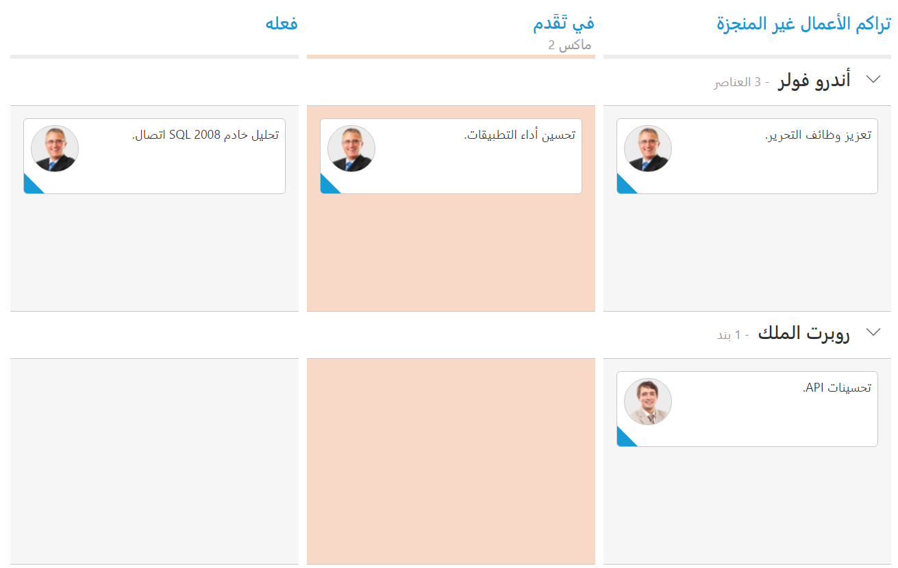

# Localization

All text in Kanban can be localized using `ej.Kanban.Locale` object. Please find the table with list of properties and its value in locale object.

<table>
<tr>
<th>
Locale key words </th><th>
Text</th></tr>
<tr>
<td>
EmptyCard
</td><td>
No cards to display
</td></tr>
<tr>
<td>
SaveButton
</td><td>
Save
</td></tr>
<tr>
<td>
CancelButton
</td><td>
Cancel
</td></tr>
<tr>
<td>
EditFormTitle
</td><td>
Details of
</td></tr>
<tr>
<td>
AddFormTitle
</td><td>
Add New Card
</td></tr>
<tr>
<td>
SwimlaneCaptionFormat
</td><td>
"- {{:count}}{{if count == 1 }} item {{else}} items {{/if}}"
</td></tr>
<tr>
<td>
Filters
</td><td>
Filters:
</td></tr>
<tr>
<td>
Min
</td><td>
Min
</td></tr>
<tr>
<td>
Max
</td><td>
Max
</td></tr>
<tr>
<td>
FilterOfText
</td><td>
Of
</td></tr>
<tr>
<td>
Cards
</td><td>
Cards
</td></tr>
</table>

The following code example describes the above behavior.



    ej.Kanban.Locale["de-DE"] = {
        EmptyCard: "Keine Karten angezeigt werden",
        SaveButton: "Speichern",
        CancelButton: "stornieren",
        EditFormTitle: "Details von ",
        AddFormTitle: "Neue Karte hinzufügen",
        SwimlaneCaptionFormat: "- {{:count}}{{if count == 1 }} Artikel {{else}} Artikel {{/if}}",
        Filters: "Filter:",
        FilterOfText: "Von",
        Max: "Max.",
        Min: "Min.",
        Cards: "Karten"
    };






    @(Html.EJ().Kanban("Kanban")
        .DataSource((IEnumerable<object>)ViewBag.datasource)
        .Locale("de-DE")
        .EnableTotalCount(true)
        .Columns(col =>
        {
            col.HeaderText("Backlog").Key("Open").Add();
            col.HeaderText("In Progress").Key("InProgress").Constraints(con => { con.Max(2); }).Add();
            col.HeaderText("Done").Key("Close").Add();
        })
        .KeyField("Status")
        .Fields(field =>
        {
            field.Content("Summary")
                .Tag("Tags")
                .SwimlaneKey("Assignee")
                .PrimaryKey("Id");
        })
    )

  



    namespace MVCSampleBrowser
    {
        public partial class KanbanController : Controller
        {
            //
            // GET: /Kanban/
            public ActionResult KanbanFeatures()
            {
                var DataSource = new NorthwindDataContext().Tasks.Take(30).ToList();
                ViewBag.datasource = DataSource;
                return View();
            }
        }
    }

 


  

The following output is displayed as a result of the above code example.

## Right to Left (RTL)

By default, Kanban render its text and layout from left to right. To customize Kanban’s direction, you can change direction from LTR to RTL by using `EnableRTL` as true.

The following code example describes the above behavior.



    ej.Kanban.Locale["ar-AE"] = {
        EmptyCard: "لا بطاقات لعرض",
        SaveButton: "حفظ",
        CancelButton: "إلغاء",
        EditFormTitle: "تفاصيل ",
        AddFormTitle: "إضافة بطاقة جديدة",
        SwimlaneCaptionFormat: "- {{:count}}{{if count == 1 }} بند {{else}} العناصر {{/if}}",
        FilterSettings: "مرشحات:",
        FilterOfText: "من",
        Max: "ماكس",
        Min: "دقيقة",
        Cards: "بطاقات"
    };







    @(Html.EJ().Kanban("Kanban")
        .DataSource((IEnumerable<object>)ViewBag.datasource)
                .Columns(col =>
                            {
                                col.HeaderText("تراكم الأعمال غير المنجزة").Key("Open").Add();
                                col.HeaderText("في تَقَدم").Key("InProgress").Constraints(con => { con.Max(2); }).Add();
                                col.HeaderText("فعله").Key("Close").Add();
                            })
                            .AllowTitle(true)
                            .EnableRTL(true)
                            .Locale("ar-AE")
                            .KeyField("Status")
                            .Fields(field =>
                            {
                                field.Color("Type")
                                    .Content("Summary")
                                    .PrimaryKey("Id")
                                    .SwimlaneKey("Assignee");
                            })
    )
     



    namespace MVCSampleBrowser
    {
        public partial class KanbanController : Controller
        {
            //
            // GET: /Kanban/
            public ActionResult KanbanFeatures()
            {
                var DataSource = new NorthwindDataContext().Tasks.Take(30).ToList();
                ViewBag.datasource = DataSource;
                return View();
            }
        }
    }



  

The following output is displayed as a result of the above code example.

