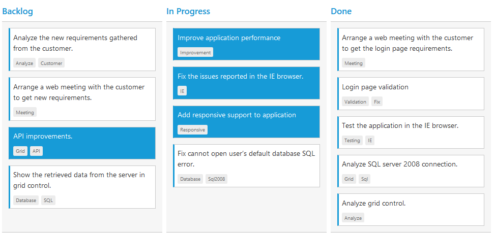

# Selection & Hovering

Selection provides an interactive support to highlight the card that you select. Selection can be done through simple Mouse down or Keyboard interaction. To enable selection, set AllowSelection as true.

You can see the mouse hovering effect on the corresponding cards using `AllowHover` property. By default selection and hovering is `true`.

## Types of Selection

Two types of selections available in Kanban are,

1.	Single
2.	Multiple

### Single Selection

To enable single selection by setting `SelectionType` property as single.

### Multiple Selection

Multiple selections are an interactive support to select a group of cards in Kanban by mouse or keyboard interactions. To enable multiple selections by set `SelectionType` property as `multiple`.

You can select multiple random cards below key press.

<table>
<tr>
<th>
Keys</th><th>
Description</th></tr>
<tr>
<td>
Ctrl + mouse left</td><td>
To select multiple random cards.</td></tr>
<tr>
<td>
Shift + mouse left </td><td>
To continuous cards select.</td></tr>
</table>

To unselect selected cards, by press “Shift + mouse left” click on selected row.

The following code example describes the above behavior.





    @(Html.EJ().Kanban("Kanban")
        .DataSource((IEnumerable<object>)ViewBag.datasource)
        .Columns(col =>
        {
            col.HeaderText("Backlog").Key("Open").Add();
            col.HeaderText("In Progress").Key("InProgress").Add();
            col.HeaderText("Done").Key("Close").Add();
        })
        .KeyField("Status")
        .Fields(field =>
        {
            field.Content("Summary")
                .Tag("Tags")
                .PrimaryKey("Id");
        })
        .SelectionType(SelectionType.Multiple)
    )
  
  



    namespace MVCSampleBrowser
    {
        public partial class KanbanController : Controller
        {
            //
            // GET: /Kanban/
            public ActionResult KanbanFeatures()
            {
                var DataSource = new NorthwindDataContext().Tasks.Take(30).ToList();
                ViewBag.datasource = DataSource;
                return View();
            }
        }
    }

 


  

The following output is displayed as a result of the above code example.

