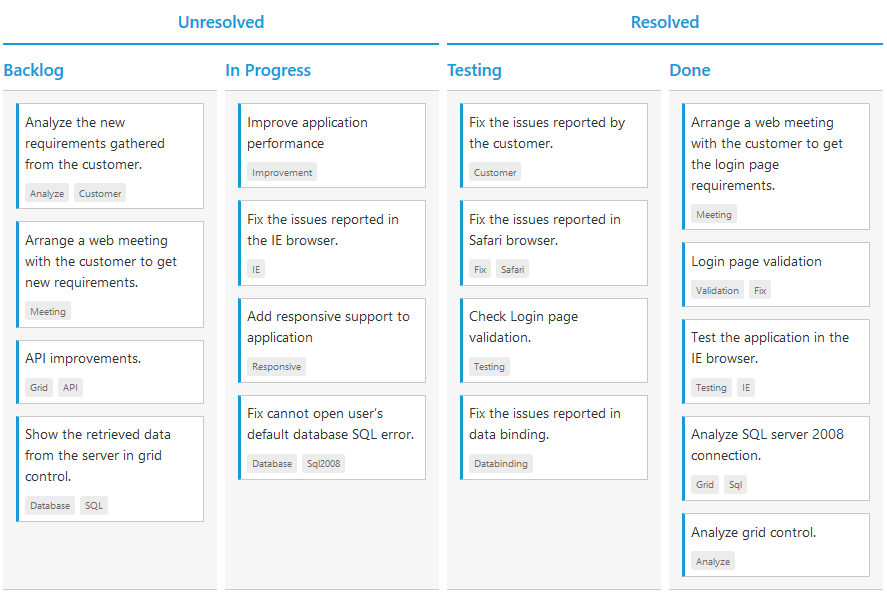

# Stacked Headers

The stacked headers help you to group the logical columns in Kanban. It can be shown by setting `ShowStackedHeader` as true and by defining `StackedHeaderRows`.

## Adding Stacked header columns

To stack columns in stacked header, you need to define `Column` property in `StackedHeaderColumns` with field names of visible columns.

The following code example describes the above behavior.





    @(Html.EJ().Kanban("Kanban")
        .DataSource((IEnumerable<object>)ViewBag.datasource)   
        .Columns(col =>
        {
            col.HeaderText("Backlog").Key("Open").Add();
            col.HeaderText("In Progress").Key("InProgress").Add();
            col.HeaderText("Testing").Key("Testing").Add();
            col.HeaderText("Done").Key("Close").Add();
        })
        .KeyField("Status")
        .Fields(field =>
        {
            field.Content("Summary")
                .Tag("Tags")
                .PrimaryKey("Id");
        })
        .StackedHeaderRows(rows =>
            {
            rows.StackedHeaderColumns(colums =>
            {
            colums.HeaderText("Unresolved").Column("Backlog,Validated,In Progress").Add();
            colums.HeaderText("Resolved").Column("Testing,Done").Add();
            }).Add();
            })
    )
 
  



    namespace MVCSampleBrowser
    {
        public partial class KanbanController : Controller
        {
            //
            // GET: /Kanban/
            public ActionResult KanbanFeatures()
            {
                var DataSource = new NorthwindDataContext().Tasks.Take(30).ToList();
                ViewBag.datasource = DataSource;
                return View();
            }
        }
    }



  

The following output is displayed as a result of the above code example.

