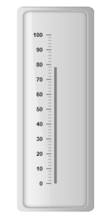

# Basic Settings

## Adding Dimension

* The basic customization for any control is setting the dimension. Here dimension refers the two major attributes, height and width. The height and width assigned in the control will render the canvas element in the given size. 
* The value attribute is used to set all pointer value in the Linear Gauge control. The attributes, minimum and maximum value are used to set the minimum value and maximum value for all the scales exist in the Linear Gauge control.

[CSHTML]

//To Render Linear gauge

@(Html.EJ().LinearGauge("LinearGauge1").Width(300).Height(500).Minimum(10).Maximum(110).Value(78)

//Adding scale collection

.Scales(sc => {

sc.Width(0).Border(bor => bor.Color("transparent").Width(0))

.ShowBarPointers(true).ShowMarkerPointers(false)

//Adding bar pointer collection

.BarPointers(bp => {

bp.Width(5).BarPointerDistanceFromScale(15)

.BarPointerBackgroundColor("Grey").Add();

})

//Adding tick collection

.Ticks(tic =>

{

tic.Type(TickType.MajorInterval).Width(2).Color("#8C8C8C")

.DistanceFromScale(ds => ds.X(7).Y(0)).Add();

tic.Type(TickType.MinorInterval).Width(1).Color("#8C8C8C")

.DistanceFromScale(ds => ds.X(7).Y(0)).Height(6).Add();

}).Add();

}))

Execute the above code to render the following output.

{:.image }

## Adding frame

* Frame is the element that decides the appearance of the Linear Gauge. You can customize it by using the object called frame. It contains frame inner width, frame outer width and frame background image URL properties. 
* The innerWidth of the frame defines the distance between the canvas element and the frame and the outerWidth refers to distance from the frame. backgroundUrl is used to set the background image for the frame.

[CSHTML]

@(Html.EJ().LinearGauge("LinearGauge1").EnableAnimation(false)

//Adding Frame object

.Frame(fr=>fr.InnerWidth(8).OuterWidth(10)

.BackgroundImageUrl("../Content/images/gauge/Gauge_linear_light.png")).Value(80)

//Adding scale collection

.Scales(sc => {

sc.Width(0).Border(bor => bor.Color("transparent").Width(0))

.ShowBarPointers(true).ShowMarkerPointers(false)

//Adding bar pointer collection

.BarPointers(bp => {

bp.Width(5).BarPointerDistanceFromScale(15)

.BarPointerBackgroundColor("Grey").Add();

})

//Adding tick collection

.Ticks(tic =>

{

tic.Type(TickType.MajorInterval).Width(2).Color("#8C8C8C")

.DistanceFromScale(ds => ds.X(7).Y(0)).Add();

tic.Type(TickType.MinorInterval).Width(1).Color("#8C8C8C")

.DistanceFromScale(ds => ds.X(7).Y(0)).Height(6).Add();

}).Add();

}))

Execute the above code to render the following output.

{:.image }

## Appearance

* The attribute orientation is used to render the Linear Gauges either in horizontal position or vertical position.You can set the background color for the Linear Gauge for better appearance using the backgroundColor property. borderColor specifies the border color of the Linear Gauge. You can also add gradient effects to Linear Gauge with the help of pointerGradient1 and pointerGradient2 attribute.
* Theme is the basic property of any control. It is used to set the theme for Linear Gauge. There are two types of themes used for Linear Gauge such as
* flatlight
* flatdark

[CSHTML]

@(Html.EJ().LinearGauge("LinearGauge1").EnableAnimation(false).Width(400).Height(100)

.Theme(Themes.FlatLight).Orientation(Orientation.Horizontal).LabelColor("Black")

//Adding frame object

.Frame(fr=>

fr.InnerWidth(8).OuterWidth(10)

.BackgroundImageUrl("../Content/images/gauge/Gauge_linear_light1.png"))

.Value(80)

//Adding scale collection

.Scales(sc => {

sc.Width(0).Border(bor => bor.Color("transparent").Width(0))

.ShowBarPointers(true).ShowMarkerPointers(false).Direction(Directions.Clockwise)

//Adding bar pointer collection

.BarPointers(bp => { bp.Width(5).BarPointerDistanceFromScale(25)

.BarPointerBackgroundColor("Grey").Add(); })

//Adding label collection

.Labels(lbl => { lbl.Angle(90).DistanceFromScale(ds => ds.X(5).Y(-5)).Add(); })

//Adding Tick collection

.Ticks(tic =>

{

tic.Type(TickType.MajorInterval).Width(2).Color("#8C8C8C")

.DistanceFromScale(ds => ds.X(7).Y(0)).Add();

tic.Type(TickType.MinorInterval).Width(1).Color("#8C8C8C")

.DistanceFromScale(ds => ds.X(7).Y(0)).Height(6).Add();

}).Add();

}))

Execute the above code to render the following output.

{:.image }

## Responsive

* For any display devices, the control is to be rendered based on the space in that device. The control must be responsive. For this purpose resizing property is present in Linear Gauge control. 
* The Linear Gauge renders with the specified value. When the browser changes its size, the canvas element checks the dimension with its parent element and if there are any changes in parent dimension, gauge control also changes the dimension based on its parent changes. You can enable this feature using enableResize property.

[CSHTML]

@(Html.EJ().LinearGauge("LinearGauge1").EnableAnimation(false).Width(400).Height(100)

.Theme(Themes.FlatLight).Orientation(Orientation.Horizontal).LabelColor("Black")

.EnableResize(true)

//Adding frame object

.Frame(fr=>

fr.InnerWidth(8).OuterWidth(10)

.BackgroundImageUrl("../Content/images/gauge/Gauge_linear_light1.png"))

.Value(80)

//Adding scale collection

.Scales(sc => {

sc.Width(0).Border(bor => bor.Color("transparent").Width(0))

.ShowBarPointers(true).ShowMarkerPointers(false).Direction(Directions.Clockwise)

//Adding bar pointer collection

.BarPointers(bp => { bp.Width(5).BarPointerDistanceFromScale(25)

.BarPointerBackgroundColor("Grey").Add(); })

//Adding label collection

.Labels(lbl => { lbl.Angle(90).DistanceFromScale(ds => ds.X(5).Y(-5)).Add(); })

//Adding tick collection

.Ticks(tic =>

{

tic.Type(TickType.MajorInterval).Width(2).Color("#8C8C8C")

.DistanceFromScale(ds => ds.X(7).Y(0)).Add();

tic.Type(TickType.MinorInterval).Width(1).Color("#8C8C8C")

.DistanceFromScale(ds => ds.X(7).Y(0)).Height(6).Add();

}).Add();

}))

Execute the above code to render the following output.

{:.image }

