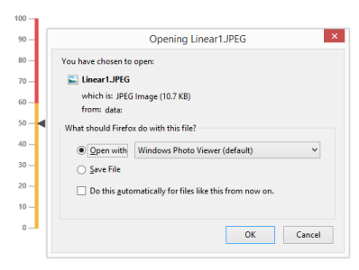

# Exporting

**Linear Gauge** has an exporting feature that converts **Gauge** control into image format and then export in client side. The method API `exportImage` is used to export the **LinearGauge**. It has two arguments such as **file name** and **file format** to specify the file name and file formats. For exporting refer the following code example.



@(Html.EJ().LinearGauge("LinearGauge1").LabelColor("#8c8c8c").Width(500)

//Adding scale collection

.Scales(s =>

    {

    s.Width(4)

    .BackgroundColor("transparent")

    .Border(border=>border.Color("transparent").Width(0))

    .ShowRanges(true)

    .Length(310)

    .Position(position => { position.X(51).Y(50); })

    //Adding marker pointer collection

    .MarkerPointers(mp =>

    { mp.Value(50).Length(10).MarkerDistanceFromScale(8)

    .Width(10).MarkerBackgroundColor("#4D4D4D")

    .Border(border=>border.Color("4D4D4D")).Add();

    })

    //Adding label collection

    .Labels(label => {

        label.Font(font => {

            font.Size("11px").FontFamily("SegoeUI").FontStyle("bold");

        }).DistanceFromScale(distance=>distance.X(-13)).Add();

    })

    //Adding bar pointer collection

    .BarPointers(bar => {

        bar.BarPointerValue(50)

        .Width(4).BarPointerDistanceFromScale(8)

        .BarPointerBackgroundColor("#6FAAB0").Add();

    })

    //Adding ticks collection

    .Ticks(tic => {

        tic.Type(TickType.MajorInterval)

        .Width(1).Color("#8c8c8c").Add();

    })

    //Adding ranges collection

    .Ranges(range =>

    {

        range.EndValue(60).StartValue(0).RangeBackgroundColor("#F6B53F")

        .Border(border=>border.Color("#F6B53F"))

        .StartWidth(4).EndWidth(4).Add();

        range.EndValue(100).StartValue(60).RangeBackgroundColor("#E94649")

        .Border(border=>border.Color("#E94649"))

        .StartWidth(4).EndWidth(4).Add();

    })

    .Add();

}))



Execute the above code to render the following output.

