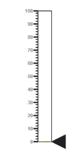
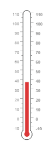
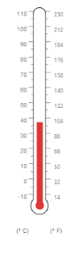

# Getting Started

This section briefly explains on how to create a **Linear Gauge** control for your application.

* The ASP.NET MVC **Linear Gauge** provides support to display the **Linear Gauge** within your web page and allows you to customize it. This section encompasses the details on how to configure Linear Gauge. 
* You will learn how to provide data for a **Linear Gauge** and display data in the required way. In addition, you will learn how to customize the default Linear Gauge appearance for your requirements.

### Create a Linear Gauge

ASP.NET MVC **Linear Gauge** widget basically renders with flexible APIs. You can easily create the Linear Gauge widget by the following steps.

1. First create an MVC Project and add necessary Dll's and scripts with the help of the given [MVC-Getting Started](http://help.syncfusion.com/ug/js/default.htm) Documentation.
2. Add the following code example to the corresponding view page to render **Linear Gauge**.

   ~~~ js

   @(Html.EJ().LinearGauge("thermoLinear"))

   ~~~

3. Add the following code example in the Controller page.

   ~~~ csharp

   public ActionResult Default()

   {

      return View( );

   }

   ~~~

Run the above code example to get a default **Linear Gauge** with default values as follows.

### Set Height and Width values

Basic attributes of each canvas elements are `height` and `width`. You can set the `height` and `width` of the gauge using the following code example. It sets the height and width of the canvas image where the thermometer is to be rendered.



@(Html.EJ().LinearGauge("thermoLinear")

.Height(550)

.Width(500))



Run the above code example and you will get the following gauge as similar to default. Here height and width of the canvas are set for given values.

### Set Animation option and Label Color

* You can draw the Thermometer with some Label color to display the measurement value. For example give the `labelColor` as “#8c8c8c”.
* Set the `EnableAnimation` property as false to avoid animation on the pointers.



@(Html.EJ().LinearGauge("thermoLinear")

.LabelColor("#8c8c8c")

.EnableAnimation(false)

.Height(550)

.Width(500))



Run the above code example and you will get the following gauge as the output.

### Provide Scale Values

* The scale must have the appearance of a thermometer. By giving `ScaleType` as Thermometer, you can render a thermometer design.
* Minimum temperature can go up to -10 and maximum temperature can rise up to 110, so you can give `minimum` scale value as -10 and `maximum` value as 110.
* Set the location values such as vertical and horizontal `position` of the thermometer and give the thermometer height as Length.
* You can give the Minor Interval value as 5 to get the exact temperature on the patient.



@(Html.EJ().LinearGauge("thermoLinear")

.LabelColor("#8c8c8c")

.EnableAnimation(false)

.Height(550)

.Width(500)

.Scales(s =>

{

    s.Width(20)

    .Type(ScaleType.Thermometer)

    .BackgroundColor("transparent")

    .Minimum(-10)

    .Maximum(110).MinorIntervalValue(5)

    .Length(335)

    . Border(border=>border.Width(1))

    .ShowCustomLabels(true)

    .Position(loc => { loc.X(50).Y(18); })

    //Add the pointers customization code here

    //Add the labels customization code here

    //Add the ticks customization code here

    //Add the Custom labels customization code here

    .Add();

}))



Run the above code example and you will get the following gauge as the output.

### Add Pointers

In **Linear Gauge** the two types of pointers available are: Marker pointer and Bar pointer.

* **Marker pointer** is displayed as a pointer device that shows the actual values. But for your thermometer there is no need for the marker pointer. So you can hide the marker pointer by giving `opacity` as 0. 
* **Bar pointer** acts as the mercury metal that shows the exact temperature of the patient. Set some of the basic properties of the Bar pointer such as `Width`, `BarPointerDistanceFromScale`, `BarPointerValue` and `BarPointerBackgroundColor`.



@(Html.EJ().LinearGauge("thermoLinear")

.LabelColor("#8c8c8c")

.EnableAnimation(false)

.Height(550)

.Width(500)

.Scales(s =>

{

    //Add the pointers customization code here

    .MarkerPointers(mp => { mp.MarkerOpacity(0).Add(); })

    .BarPointers(bar => {

    bar.Width(10)

    .BarPointerDistanceFromScale(0)

    .BarPointerValue(37)

    .BarPointerBackgroundColor("#DB3738").Add(); })

    //Add the labels customization code here

    //Add the ticks customization code here

    //Add the Custom labels customization code here

    .Add();

}))



Run the above code example to get the following gauge as your output.

### Add Label Customization

* For thermometer, you can display the label value on two sides, to get temperature in different scales. For that you can add two label values in an array.
* To display the value around the scales, `labels` are used. You can customize the `label placement`, `font` (including its style and family) and its `distance from scale`.



@(Html.EJ().LinearGauge("thermoLinear")

.LabelColor("#8c8c8c")

.EnableAnimation(false)

.Height(550)

.Width(500)

.Scales(s =>

{

    //Add the pointers customization code here

    //Add the labels customization code here

    .Labels(label =>

    {

        label.Placement(LabelPlacement.Near)

        .Font(font => {

            font.Size("10px")

            .FontFamily("Segoe UI")

            .FontStyle("normal");

        }).Add();

        label.Placement(LabelPlacement.Far)

        .DistanceFromScale(distance=>distance.X(13)).Add();

    })

    //Add the ticks customization code here

    //Add the Custom labels customization code here

    .Add();

}))



Run the above code example and you will get the following gauge as output.

### Add Tick Details

* Tick style has two values called major interval and minor interval. You can set major ticks `width`and `height` greater than Minor ticks. And you can give TickColor, for better visibility in light backgrounds.
* Here four `tick` details are used for both sides having minor and major ticks. To display the tick value add the following code example.



@(Html.EJ().LinearGauge("thermoLinear")

.LabelColor("#8c8c8c")

.EnableAnimation(false)

.Height(550)

.Width(500)

.Scales(s =>

{

    //Add the pointers customization code here

    //Add the labels customization code here

    //Add the ticks customization code here

    .Ticks(tic =>

    {

        tic.Type(TickType.MajorInterval)

        .Height(8)

        .Width(1)

        .Color("#8c8c8c")

        .DistanceFromScale(distance=>distance.Y(4)).Add();

        tic.Type(TickType.MinorInterval)

        .Height(4)

        .Width(1)

        .Color("#8c8c8c")

        .DistanceFromScale(distance=>distance.Y(4)).Add();

        tic.Type(TickType.MajorInterval)

        .Placement(TickPlacement.Far)

        .Height(8)

        .Width(1)

        .Color("#8c8c8c")

        .DistanceFromScale(distance=>distance.Y(4)).Add();

        tic.Type(TickType.MinorInterval)

        .Placement(TickPlacement.Far)

        .Height(4)

        .Width(1)

        .Color("#8c8c8c")

        .DistanceFromScale(distance=>distance.Y(4)).Add();

    })

    //Add the Custom labels customization code here

    .Add();

}))



Run the above code example and you will get the following gauge as output.

### Add Custom Label Details

* **Custom labels** are used to specify the texts in the gauge.
* It can be customized through various properties.
* In order to `show custom labels`, change the showIndicators property to **True**.
* Here you can use custom text to display three range descriptions.



@(Html.EJ().LinearGauge("thermoLinear")

.LabelColor("#8c8c8c")

.EnableAnimation(false)

.Height(550)

.Width(500)

.Scales(s =>

{

    //Add the pointers customization code here

    //Add the labels customization code here

    //Add the ticks customization code here

    //Add the Custom labels customization code here

    .CustomLabels(label => {

    label.Value("(° C)")

    .Position(loc => loc.X(44).Y(78))

    .Font(f => {

        f.FontStyle("bold")

        .FontFamily("Segoe UI")

        .Size("12px");

    })

    .Color("#666666").Add();

    label.Value("(° F)")

    .Position(loc => loc.X(56).Y(78))

    .Font(f => {

        f.FontStyle("bold")

        .FontFamily("Segoe UI")

        .Size("12px");

    })

    .Color("#666666").Add();

    label.Position(loc => loc.X(51).Y(90))

    .Font(f => {

        f.FontStyle("bold")

        .FontFamily("Segoe UI")

        .Size("13px");

    })

    .Color("#666666").Add();

    })

    .Add();

}))



Run the above code example to get the following gauge as output.

### Change Scale from Degree to Fahrenheit 

Add the function that converts the temperature in degree to Fahrenheit in the label, with an index value of 1.



@(Html.EJ().LinearGauge("thermoLinear")

.LabelColor("#8c8c8c")

.ClientSideEvents(event=>event.DrawLabels("DrawLabel"))

.EnableAnimation(false)

.Height(550)

.Width(500)

.Scales(s =>

{

    s.Width(20)

    .Type(ScaleTypes.Thermometer)

    .BackgroundColor("transparent")

    .Minimum(-10)

    .Maximum(110).MinorIntervalValue(5)

    .Length(335)

    . Border(border=>border.Width(1))

    .ShowCustomLabel(true)

    .Position(loc => { loc.X(50).Y(18); }).Add();

    //Add the pointers customization code here

    //Add the labels customization code here

    //Add the ticks customization code here

    //Add the Custom labels customization code here

}))



Run the above code example and you will get the following gauge as output.

### Add Custom Label for Current Value

Add the function that displays the current temperature value in the custom label.



@(Html.EJ().LinearGauge("thermoLinear")

.LabelColor("#8c8c8c")

.ClientSideEvents(event=>event. DrawCustomLabel("DrawCustomLabel"))

.EnableAnimation(false)

.Height(550)

.Width(500)

.Scales(s =>

{

    s.Width(20)

    .Type(ScaleType.Thermometer)

    .BackgroundColor("transparent")

    .Minimum(-10)

    .Maximum(110).MinorIntervalValue(5)

    .Length(335)

    .Border(border=>border.Width(1))

    .ShowCustomLabel(true)

    .Position(loc => { loc.X(50).Y(18); }).Add();

    //Add the pointers customization code here

    //Add the labels customization code here

    //Add the ticks customization code here

    //Add the Custom labels customization code here

}))



